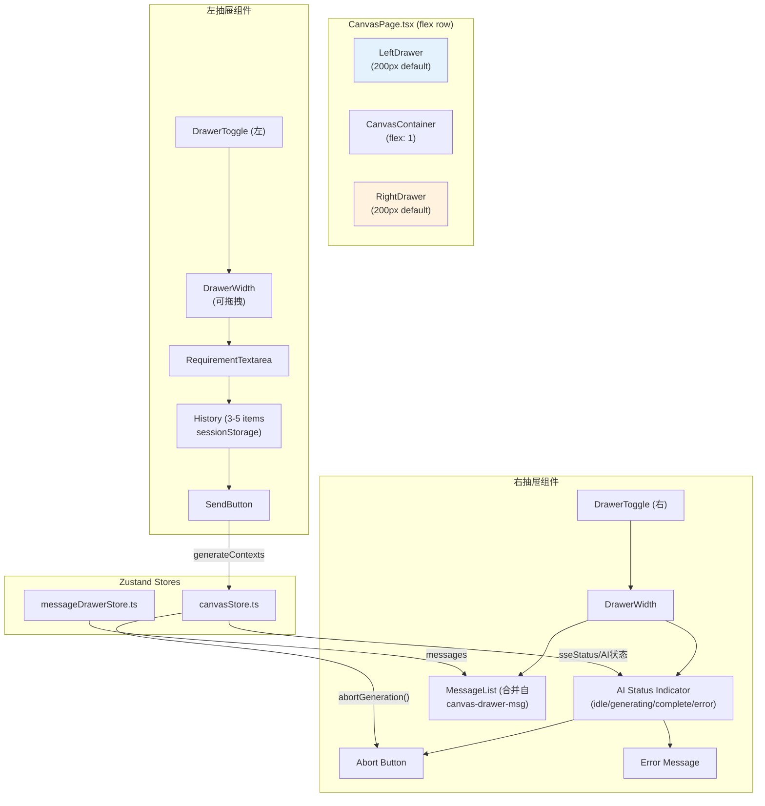

# Architecture: canvas-drawer-persistent

**Project**: Canvas 双侧常驻抽屉面板
**Agent**: architect
**Date**: 2026-03-31
**PRD**: docs/canvas-drawer-persistent/prd.md
**Related**: canvas-drawer-msg（消息命令抽屉，本项目右抽屉替代+合并）

---

## 1. 执行摘要

在 Canvas 页面左右两侧新增常驻抽屉面板：
- **左抽屉**：自然语言持续输入区（任意阶段可用）
- **右抽屉**：AI 进度/状态/中止 + 消息列表（替代 canvas-drawer-msg）

**布局改造**：居中三列 → flex row（左右抽屉 + 中间画布）。

---

## 2. 系统架构图



---

## 3. CanvasStore 扩展

**文件**: `src/stores/canvasStore.ts`

```typescript
interface DrawerState {
  // 左抽屉
  leftDrawerOpen: boolean;
  leftDrawerWidth: number;  // 默认 200

  // 右抽屉
  rightDrawerOpen: boolean;
  rightDrawerWidth: number;  // 默认 200

  // SSE/AI 状态
  sseStatus: 'idle' | 'connecting' | 'connected' | 'reconnecting' | 'error';
  aiErrorMessage: string | null;

  // Actions
  toggleLeftDrawer: () => void;
  toggleRightDrawer: () => void;
  setLeftDrawerWidth: (w: number) => void;
  setRightDrawerWidth: (w: number) => void;
  abortGeneration: (controller: AbortController) => void;
}
```

---

## 4. 布局改造

**修改前**: Canvas 三列居中
```tsx
// CanvasPage.tsx
<div className={styles.canvasPage}>
  <div className={styles.centeredLayout}>
    <BoundedContextTree />
    <BusinessFlowTree />
    <ComponentTree />
  </div>
</div>
```

**修改后**: flex row
```tsx
<div className={styles.canvasPage}>
  {leftDrawerOpen && <LeftDrawer width={leftDrawerWidth} />}
  <div className={styles.canvasContainer}>
    <BoundedContextTree />
    <BusinessFlowTree />
    <ComponentTree />
  </div>
  {rightDrawerOpen && <RightDrawer width={rightDrawerWidth} />}
</div>
```

```css
/* CanvasPage.module.css */
.canvasPage {
  display: flex;
  flex-direction: row;
  height: 100%;
  min-width: 400px; /* 画布最小宽度 */
}

.canvasContainer {
  flex: 1;
  min-width: 0;
  /* 保持原有 centeredLayout + 三列 grid */
}

.leftDrawer, .rightDrawer {
  flex-shrink: 0;
  --left-drawer-width: var(--left-drawer-width, 200px);
  width: var(--left-drawer-width);
  /* 或 width: 200px 直接设置 */
}
```

---

## 5. 左抽屉 — 自然语言持续输入

```tsx
// components/canvas/left-drawer/LeftDrawer.tsx
export function LeftDrawer({ width }: { width: number }) {
  const [input, setInput] = useState('');
  const history = useRef<string[]>([]);

  const handleSend = () => {
    if (!input.trim()) return;
    // 保存历史（最近 5 条）
    history.current = [...history.current, input].slice(-5);
    sessionStorage.setItem('requirement_history', JSON.stringify(history.current));
    // 触发 generateContexts
    useCanvasStore.getState().generateContexts({ requirement: input });
    setInput('');
  };

  return (
    <aside className={styles.leftDrawer} style={{ width }}>
      <DrawerToggle side="left" />
      <textarea
        value={input}
        onChange={e => setInput(e.target.value)}
        placeholder="输入自然语言需求..."
      />
      <button onClick={handleSend}>发送</button>
      <HistoryList items={history.current} />
    </aside>
  );
}
```

---

## 6. 右抽屉 — AI 进度/中止

```tsx
// components/canvas/right-drawer/RightDrawer.tsx
export function RightDrawer({ width }: { width: number }) {
  const sseStatus = useCanvasStore(s => s.sseStatus);
  const abortRef = useRef<AbortController | null>(null);

  const handleAbort = () => {
    abortRef.current?.abort();
  };

  return (
    <aside className={styles.rightDrawer} style={{ width }}>
      <DrawerToggle side="right" />
      <StatusIndicator status={sseStatus} />
      {sseStatus === 'error' && <ErrorMessage message={useCanvasStore.getState().aiErrorMessage} />}
      {sseStatus === 'generating' && (
        <button onClick={handleAbort} aria-label="中止 AI 生成">
          中止
        </button>
      )}
      {/* 消息列表（合并自 canvas-drawer-msg） */}
      <MessageList />
    </aside>
  );
}
```

---

## 7. 宽度拖拽

```tsx
// ResizeHandle.tsx
function ResizeHandle({ side, onResize }: { side: 'left' | 'right'; onResize: (delta: number) => void }) {
  const handleMouseDown = (e: React.MouseEvent) => {
    e.preventDefault();
    const startX = e.clientX;
    const handleMove = (e: MouseEvent) => {
      const delta = side === 'left' ? e.clientX - startX : startX - e.clientX;
      const newWidth = currentWidth + delta;
      if (newWidth >= 100 && newWidth <= 400) {
        onResize(delta);
      }
    };
    document.addEventListener('mousemove', handleMove);
    document.addEventListener('mouseup', () => document.removeEventListener('mousemove', handleMove));
  };
  return <div className={styles.resizeHandle} onMouseDown={handleMouseDown} />;
}
```

---

## 8. 与 canvas-drawer-msg 合并

canvas-drawer-msg 的右抽屉（消息列表 + /命令）**合并到**本项目的右抽屉底部：

```
右抽屉内容顺序（从上到下）：
1. AI 状态指示器
2. 中止按钮（generating 时显示）
3. 错误信息（error 时显示）
4. 消息列表（canvas-drawer-msg 整合）
5. 命令输入框 + 命令列表（canvas-drawer-msg 整合）
```

---

## 9. 文件变更清单

| 文件 | 操作 | Epic |
|------|------|------|
| `stores/canvasStore.ts` | 修改，新增 drawer 状态 + abort 方法 | Epic 1 |
| `components/canvas/left-drawer/` | 新增（LeftDrawer + RequirementTextarea + HistoryList） | Epic 2 |
| `components/canvas/right-drawer/` | 新增（RightDrawer + StatusIndicator + AbortButton） | Epic 3 |
| `stores/messageDrawerStore.ts` | 复用（canvas-drawer-msg 已定义） | Epic 3 |
| `components/canvas/message-drawer/` | 复用，移入 right-drawer | Epic 3 |
| `CanvasPage.tsx` | 修改，flex row 布局 | Epic 5 |
| `CanvasPage.module.css` | 修改，flex 布局样式 | Epic 5 |
| `components/canvas/resize-handle/` | 新增（宽度拖拽） | Epic 4 |

**无后端改动。**

---

## 10. 测试策略

| 测试类型 | 覆盖 |
|---------|------|
| 单元测试 | canvasStore drawer actions, ResizeHandle 边界 |
| 组件测试 | LeftDrawer / RightDrawer / StatusIndicator |
| E2E | 展开/折叠/输入/中止/拖拽 |

---

## 11. 性能影响

| 指标 | 影响 |
|------|------|
| Bundle size | +8 KB（新增组件） |
| Canvas 渲染 | +0ms（flex 布局天然高效） |
| 拖拽事件 | mousemove 节流 16ms（60fps） |

---

## 12. 实施顺序

| Epic | 工时 | Sprint |
|------|------|--------|
| Epic 1: Store 扩展 | 1.5h | Sprint 0 |
| Epic 5: 布局改造 | 1.5h | Sprint 0 |
| Epic 2: 左抽屉 | 3.75h | Sprint 0 |
| Epic 3: 右抽屉 | 3.5h | Sprint 0 |
| Epic 4: 拖拽 | 2.5h | Sprint 1 |
| Epic 6: E2E | 2h | Sprint 1 |

**总工时**: ~15h

---

*Architect 产出物 | 2026-03-31*
