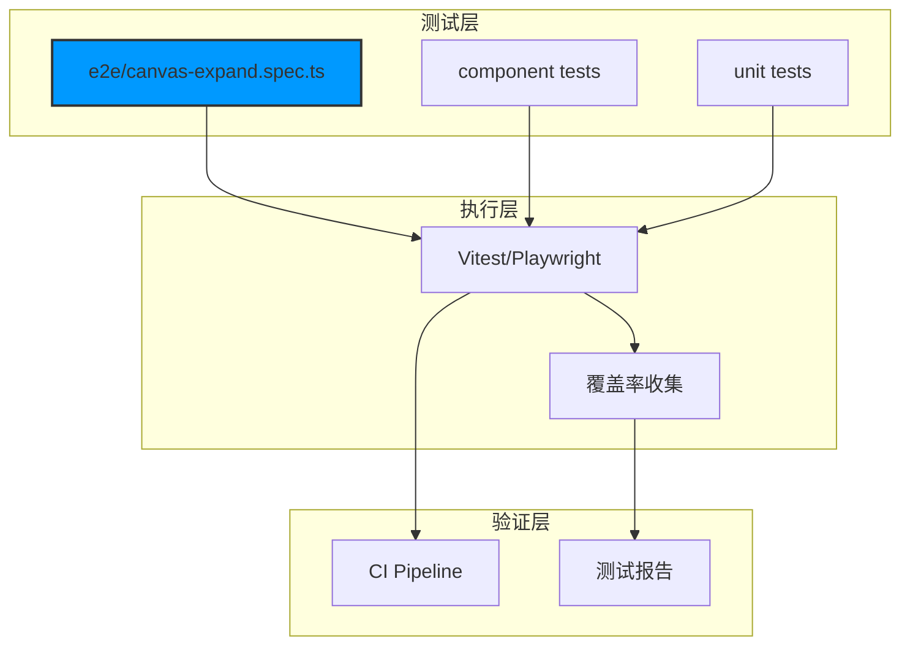
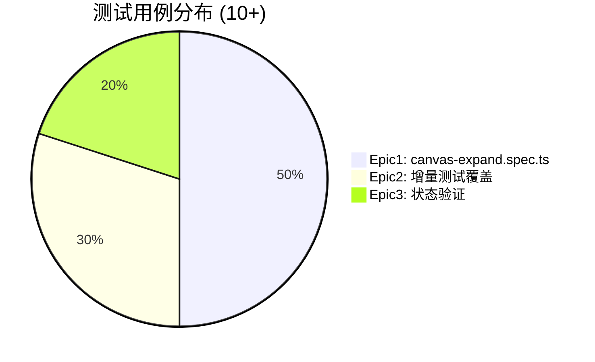

# Architecture: Canvas Epic3 测试补充

> **项目**: canvas-epic3-test-fill
> **阶段**: design-architecture
> **版本**: 1.0.0
> **日期**: 2026-03-31
> **Architect**: Architect Agent
> **工作目录**: /root/.openclaw/vibex/vibex-fronted

---

## 执行决策
- **决策**: 已采纳
- **执行项目**: canvas-epic3-test-fill
- **执行日期**: 2026-03-31

---

## 1. 概述

### 1.1 项目背景
Canvas Epic3 代码已完成但缺少 E2E 测试用例，需要补充测试确保质量。

### 1.2 目标
- 测试用例 ≥ 10 个
- 覆盖率 ≥ 80%
- npm test 通过

---

## 2. Tech Stack

| 层级 | 技术选型 | 理由 |
|------|----------|------|
| **测试框架** | Playwright（现有） | E2E 测试框架 |
| **断言库** | expect（Testing Library） | 现有 |
| **覆盖率** | Vitest coverage | 已有 |
| **运行器** | npm test | 现有 |

---

## 3. 测试架构

### 3.1 文件结构



### 3.2 测试用例分布



---

## 4. API 定义

### 4.1 Playwright 测试 API

```typescript
// e2e/canvas-expand.spec.ts

import { test, expect } from '@playwright/test';

test.describe('Canvas Epic3 全屏展开', () => {
  test.beforeEach(async ({ page }) => {
    await page.goto('/canvas');
  });

  // F1.1: 全屏展开测试
  test('F1.1 全屏展开 - 三栏同时展开', async ({ page }) => {
    await page.click('[data-testid="expand-both-btn"]');
    await expect(page.locator('[data-testid="left-panel"]')).toBeVisible();
    await expect(page.locator('[data-testid="center-panel"]')).toBeVisible();
    await expect(page.locator('[data-testid="right-panel"]')).toBeVisible();
  });

  // F1.2: 最大化模式测试
  test('F1.2 最大化模式 - 工具栏隐藏', async ({ page }) => {
    await page.click('[data-testid="maximize-btn"]');
    await expect(page.locator('[data-testid="toolbar"]')).toBeHidden();
  });

  // F1.3: F11 快捷键测试
  test('F1.3 F11 快捷键 - 进入全屏', async ({ page }) => {
    await page.keyboard.press('F11');
    await expect(page.locator('[data-testid="fullscreen-overlay"]')).toBeVisible();
  });

  // F1.4: ESC 退出测试
  test('F1.4 ESC 退出 - 退出全屏', async ({ page }) => {
    await page.keyboard.press('F11');
    await page.keyboard.press('Escape');
    await expect(page.locator('[data-testid="fullscreen-overlay"]')).toBeHidden();
  });

  // F1.5: 状态持久化测试
  test('F1.5 localStorage - 全屏状态恢复', async ({ page }) => {
    await page.click('[data-testid="expand-both-btn"]');
    await page.reload();
    await expect(page.locator('[data-testid="left-panel"]')).toBeVisible();
  });
});
```

### 4.2 组件测试 API

```typescript
// src/components/canvas/__tests__/ExpandPanel.test.tsx

import { render, screen } from '@testing-library/react';
import { ExpandPanel } from '../ExpandPanel';

test('F2.1 交集高亮 - 显示高亮效果', () => {
  render(<ExpandPanel showHighlight={true} />);
  expect(screen.getByTestId('highlight-overlay')).toBeVisible();
});

test('F2.2 起止节点 - 特殊标记可见', () => {
  render(<ExpandPanel nodeType="start" />);
  expect(screen.getByTestId('start-marker')).toBeVisible();
});

test('F2.3 卡片连线 - 连线正确渲染', () => {
  render(<Connector from="node-1" to="node-2" />);
  expect(screen.getByTestId('connector-line')).toBeInTheDocument();
});
```

---

## 5. 数据模型

### 5.1 测试数据结构

```typescript
// src/types/test.ts

interface E2ETestCase {
  id: string;
  feature: 'expand' | 'maximize' | 'connector';
  description: string;
  selectors: string[];
  assertions: Assertion[];
}

interface TestCoverage {
  lines: number;
  branches: number;
  functions: number;
  threshold: {
    lines: number;
    branches: number;
  };
}
```

---

## 6. 测试策略

### 6.1 覆盖率门禁

| 指标 | 阈值 |
|------|------|
| 行覆盖率 | ≥ 80% |
| 分支覆盖率 | ≥ 70% |
| 函数覆盖率 | ≥ 80% |

### 6.2 执行命令

```bash
# 运行所有测试
npm test

# 运行 E2E 测试
npm run test:e2e

# 运行覆盖率
npm test -- --coverage

# CI 模式
npm run test:ci
```

---

## 7. 验收标准

| ID | 测试用例 | 验收条件 |
|----|----------|----------|
| F1.1 | 全屏展开 | 三栏同时可见 |
| F1.2 | 最大化模式 | 工具栏隐藏 |
| F1.3 | F11 快捷键 | 进入全屏 |
| F1.4 | ESC 退出 | 退出全屏 |
| F1.5 | localStorage | 状态恢复 |
| F2.1 | 交集高亮 | 高亮显示 |
| F2.2 | 起止节点 | 标记可见 |
| F2.3 | 卡片连线 | 连线渲染 |
| F3.1 | npm test | 退出码 0 |
| F3.2 | 覆盖率 | ≥ 80% |

---

## 8. 风险评估

| 风险 | 概率 | 影响 | 缓解 |
|------|------|------|------|
| Playwright 定位器不稳定 | 中 | 中 | 使用 data-testid |
| CI 环境差异 | 低 | 中 | Docker 一致环境 |
| 覆盖率计算差异 | 低 | 低 | 统一配置 |

---

*本文档由 Architect Agent 生成*
