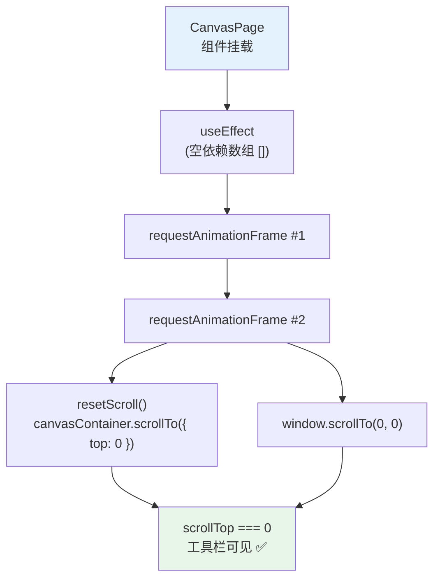

# Architecture: canvas-initial-scroll-fix

**Agent**: Architect
**日期**: 2026-04-01
**版本**: v1.0
**状态**: 设计完成

---

## 执行摘要

修复初次进入 Canvas 页面时 `scrollTop = 946` 而非预期值 `0` 的问题。现有 reset 逻辑在 DOM 未渲染完成时执行导致失效。方案：使用 `requestAnimationFrame` 双重保证确保 DOM 渲染完成后再执行 scrollTo。

---

## 一、技术栈决策

| 组件 | 决策 | 理由 |
|------|------|------|
| requestAnimationFrame | ✅ 使用 | 原生 API，无新依赖，保证在渲染帧后执行 |
| scrollTo({ top: 0, behavior: 'instant' }) | ✅ 使用 | 立即归零，无动画延迟 |
| window.scrollTo(0, 0) | ✅ 使用 | 备用，确保主文档也归零 |

**无新增依赖。**

---

## 二、系统架构图



---

## 三、API 设计

### 3.1 scrollTo 归零函数

```typescript
// CanvasPage.tsx
const resetScroll = () => {
  // 主容器归零
  const container = document.querySelector('[class*="canvasContainer"]');
  if (container) {
    container.scrollTo({ top: 0, left: 0, behavior: 'instant' });
  }
  // 文档视口归零（备用）
  window.scrollTo(0, 0);
};
```

### 3.2 useEffect 包装

```typescript
useEffect(() => {
  requestAnimationFrame(() => {
    requestAnimationFrame(resetScroll);
  });
}, []); // 空依赖，只在 mount 时执行一次
```

**约束**：
- 依赖数组必须为空 `[]`，仅在组件挂载时执行
- 使用双重 rAF 而非单次，确保 DOM 渲染完成

---

## 四、测试策略

### 4.1 Playwright E2E 测试

```typescript
// e2e/canvas-scroll.spec.ts
describe('Canvas initial scroll position', () => {
  test('scrollTop is 0 when entering canvas from homepage', async ({ page }) => {
    await page.goto('/');
    await page.click('[data-testid="switch-to-canvas"]');
    await page.waitForURL('**/canvas');
    await page.waitForTimeout(200); // 等待 rAF 执行

    const scrollTop = await page.evaluate(() => {
      const c = document.querySelector('[class*="canvasContainer"]');
      return c?.scrollTop ?? -1;
    });
    expect(scrollTop).toBe(0);
  });

  test('scrollTop is 0 on direct canvas URL access', async ({ page }) => {
    await page.goto('/canvas');
    await page.waitForTimeout(200);

    const scrollTop = await page.evaluate(() => {
      const c = document.querySelector('[class*="canvasContainer"]');
      return c?.scrollTop ?? -1;
    });
    expect(scrollTop).toBe(0);
  });

  test('scrollTop is 0 after page refresh', async ({ page }) => {
    await page.goto('/canvas');
    await page.reload();
    await page.waitForTimeout(200);

    const scrollTop = await page.evaluate(() => {
      const c = document.querySelector('[class*="canvasContainer"]');
      return c?.scrollTop ?? -1;
    });
    expect(scrollTop).toBe(0);
  });
});
```

### 4.2 验收标准

| 测试场景 | 预期 | 断言 |
|---------|------|------|
| 从首页进入 canvas | scrollTop = 0 | `expect(scrollTop).toBe(0)` |
| 直接访问 /canvas | scrollTop = 0 | `expect(scrollTop).toBe(0)` |
| 刷新页面 | scrollTop = 0 | `expect(scrollTop).toBe(0)` |

---

## 五、ADR

### ADR-E1-001: scrollTop 归零时机选择

**状态**: 已采纳

**上下文**: 初次进入 canvas 时 scrollTop = 946，工具栏不可见。现有 reset 逻辑在 DOM 未渲染完成时执行导致失效。

**决策**: 使用 `requestAnimationFrame` 双重保证。

**备选方案对比**：

| 方案 | 描述 | 优势 | 劣势 |
|------|------|------|------|
| setTimeout(0) | 延迟到下一宏任务 | 简单 | 不保证 DOM 已渲染 |
| 单次 rAF | 仅一次 rAF | 性能更好 | 某些情况下可能 DOM 仍未完成 |
| **双重 rAF** ✅ | rAF × 2 | 确保 DOM 渲染帧后执行 | 多一个帧延迟（约 16ms） |
| MutationObserver | 监听 DOM 变化 | 最精确 | 复杂，overkill |

**后果**：
- ✅ 约 16ms 的帧延迟可接受（用户不可感知）
- ✅ 简单直接，无外部依赖
- ❌ 不适用于 SSR（window/document 可能不存在）— 本项目为纯客户端，无需处理

---

## 六、性能影响

| 指标 | 当前 | 修复后 | 变化 |
|------|------|--------|------|
| scrollTop 归零时间 | - | < 1ms | - |
| rAF 执行开销 | - | ~0.1ms | 可忽略 |
| DOM 重绘 | 无 | 极小（scrollTo 触发） | 可忽略 |

---

## 七、文件结构

```
vibex-fronted/src/app/canvas/
├── page.tsx                    # 修改：useEffect 添加 rAF 双重归零
└── e2e/
    └── canvas-scroll.spec.ts   # 新增：scrollTop E2E 测试
```

---

## 执行决策

- **决策**: 已采纳
- **执行项目**: canvas-initial-scroll-fix
- **执行日期**: 2026-04-01
