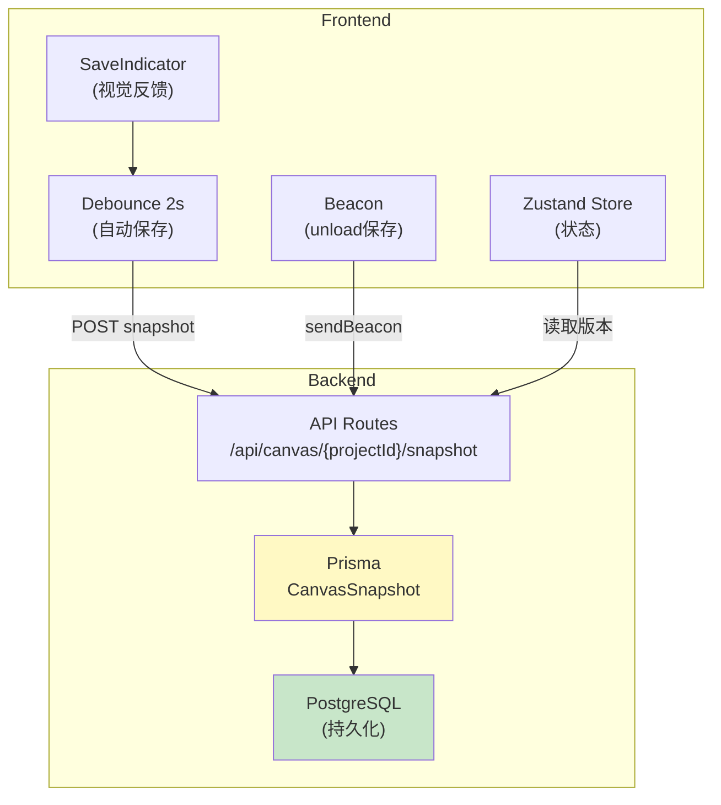

# Architecture: Canvas JSON 前后端统一 + 版本化 + 自动保存

**项目**: canvas-json-persistence
**版本**: v1.0
**日期**: 2026-04-02
**架构师**: architect
**状态**: ✅ 设计完成

---

## 执行摘要

统一三树节点数据结构，后端版本化存储，支持自动保存跨会话持久化。

**总工时**: 16-22h

---

## 1. Tech Stack

| 技术 | 选择 | 理由 |
|------|------|------|
| **前端** | React 18 + TypeScript + Zustand | 现有，无变更 |
| **后端** | Next.js API Routes + Prisma | 现有数据层 |
| **数据库** | PostgreSQL（已有）| CanvasSnapshot 表 |
| **存储** | navigator.sendBeacon | 页面关闭时可靠保存 |

---

## 2. Architecture Diagram



---

## 3. Data Model

### 3.1 NodeState 统一接口

```typescript
// 统一的三树节点状态接口
interface NodeState {
  nodeId: string;
  name: string;
  type: 'context' | 'flow' | 'component';
  status: 'idle' | 'selected' | 'confirmed' | 'error';
  selected: boolean;  // 勾选持久化
  version: number;     // 数据版本
  createdAt?: string;
  updatedAt?: string;
}
```

### 3.2 Prisma CanvasSnapshot Model

```prisma
model CanvasSnapshot {
  id        String   @id @default(uuid())
  projectId String
  version   Int
  data      Json     // 完整 canvas 状态
  createdAt DateTime @default(now())

  @@unique([projectId, version])
  @@index([projectId, createdAt])
}
```

---

## 4. API Design

### 4.1 保存快照

```
POST /api/canvas/{projectId}/snapshot
Body: { version: number, data: NodeState[] }
Response: { snapshotId: string, version: number }
```

### 4.2 获取版本列表

```
GET /api/canvas/{projectId}/snapshots
Response: { snapshots: Array<{ id, version, createdAt }> }
```

### 4.3 回滚

```
POST /api/canvas/{projectId}/rollback
Body: { version: number }
Response: { data: NodeState[], version: number }
```

---

## 5. 自动保存策略

### 5.1 Debounce 保存

```typescript
const debouncedSave = useDebouncedCallback(
  async (data: NodeState[]) => {
    const version = await api.saveSnapshot(projectId, data);
    set({ lastSavedVersion: version });
  },
  2000
);

// 状态变更时触发
onStoreChange((state) => debouncedSave(state.nodes));
```

### 5.2 Beacon 保存

```typescript
window.addEventListener('beforeunload', () => {
  const data = store.getState().nodes;
  navigator.sendBeacon(
    `/api/canvas/${projectId}/snapshot`,
    JSON.stringify({ data })
  );
});
```

### 5.3 冲突检测

```typescript
// 版本号比较
if (localVersion < serverVersion) {
  showConflictDialog({
    localVersion,
    serverVersion,
    onKeepLocal: () => forceSave(),
    onKeepServer: () => reload(),
  });
}
```

---

## 6. Performance Impact

| 维度 | 影响 | 缓解 |
|------|------|------|
| **网络** | 每次编辑 2s 后触发 API | debounce 减少请求频率 |
| **DB** | 每次保存一次 INSERT | 可选：差异更新而非全量 |
| **Bundle** | 无新增依赖 | - |

**结论**: 中等风险，debounce + beacon 是业界标准方案。

---

## 7. 架构决策记录

### ADR-001: Prisma CanvasSnapshot 而非新建表

**状态**: Accepted

**决策**: 使用 Prisma ORM 扩展 CanvasSnapshot Model，与现有数据层统一。

### ADR-002: sendBeacon 而非 beforeunload fetch

**状态**: Accepted

**决策**: `navigator.sendBeacon` 在页面关闭时更可靠，不受浏览器限制。

### ADR-003: 版本号乐观锁

**状态**: Accepted

**决策**: 使用整数版本号检测冲突，支持 last-write-wins 或手动解决。

---

## 执行决策

- **决策**: 已采纳
- **执行项目**: canvas-json-persistence
- **执行日期**: 2026-04-02
