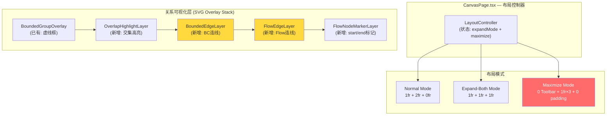

# ADR-052: VibeX Canvas Phase2 — 全屏展开 + 关系可视化

**状态**: Proposed  
**日期**: 2026-03-29  
**角色**: Architect  
**项目**: canvas-phase2

---

## Context

Phase1 完成了 Canvas 三栏布局的样式统一（统一配色、字体、间距）。Phase2 需要：
1. **全屏展开体验**：从"1.5fr 略微扩展"升级为真正的准全屏可编辑画布
2. **关系可视化基础**：在画布上直接呈现限界上下文之间的依赖关系和流程节点之间的连接路径

### 关键约束

- ★ **全屏展开 = 可编辑模式**（非只读展示）
- 连线层不得遮挡节点交互
- 旧 1.5fr 逻辑需先移除
- Phase2b 连线密度控制（>20条聚类）
- Phase3 ReactFlow 迁移时 SVG 连线层概念可复用

---

## Decision

### Tech Stack

| 技术 | 版本 | 决策理由 |
|------|------|---------|
| CSS Grid | (existing) | 三栏布局已用 Grid，expand-both 通过 grid-template-columns 切换 |
| SVG | (existing) | 虚线框 + 连线层已用 SVG，无引入 Canvas 必要 |
| Zustand | v4 (existing) | canvasStore 管理布局状态 |
| ReactFlow | (future, Phase3) | Phase3 迁移目标，SVG 连线层概念兼容 |
| Vitest + Playwright | (existing) | 单元测试 + E2E |

### 架构图



### 渲染层级（z-index 从底到高）

```
z-index 10:  BoundedGroupOverlay     (虚线框, pointer-events: none)
z-index 20:  OverlapHighlightLayer  (交集高亮, pointer-events: none)
z-index 30:  BoundedEdgeLayer       (BC连线, pointer-events: none)
z-index 40:  FlowEdgeLayer          (Flow连线, pointer-events: none)
z-index 50:  FlowNodeMarkerLayer    (start/end标记, pointer-events: none)
z-index 60:  CanvasNodeLayer        (卡片节点, pointer-events: auto)
```

**关键设计原则**: 所有 overlay 层的 `pointer-events: none` 确保不阻挡节点交互。

---

## 技术方案详述

### Epic 1 — 全屏展开体验

#### F1.1 & F1.2: expand-both + maximize 模式

**状态模型**:
```typescript
// canvasStore.ts
interface CanvasLayoutState {
  expandMode: 'normal' | 'expand-both';
  maximize: boolean;
  // 移除旧: leftExpand / centerExpand / rightExpand
}
```

**CSS Grid 切换**:
```css
/* CanvasPage.css */
.canvas-grid {
  /* Normal: 左侧栏收窄，主区域占主导 */
  --grid-template: var(--grid-normal, "1fr 2fr 0fr");

  /* expand-both: 三栏均分 */
  &.expand-both {
    grid-template-columns: 1fr 1fr 1fr;
  }

  /* maximize: 隐藏工具栏，padding 归零 */
  &.maximize {
    padding: 0;
    .toolbar { visibility: hidden; }
    .project-bar { visibility: hidden; }
  }
}
```

**状态切换逻辑**:
```typescript
const toggleMaximize = () => {
  const next = !maximize;
  set({ maximize: next, expandMode: next ? 'expand-both' : expandMode });
  localStorage.setItem('canvas-maximize', String(next));
};
```

#### F1.4: 移除旧 1.5fr 逻辑

**删除清单**:
- `CanvasPage.tsx` 中的 `leftExpand/centerExpand/rightExpand` 三态逻辑
- `grid.style.setProperty('--grid-left', ...)` 系列代码
- CSS 变量 `--grid-left`, `--grid-center`, `--grid-right`

**验证**:
```bash
grep -rn "1.5fr" src/canvas/        # 预期: 0
grep -rn "leftExpand\|centerExpand\|rightExpand" src/canvas/  # 预期: 0
```

---

### Epic 2 — 关系可视化基础

#### F2.1: 虚线框交集高亮

**算法: 矩形交集检测**（Cohen-Sutherland 简化版）

```typescript
// utils/rectIntersection.ts
interface Rect {
  x: number; y: number; width: number; height: number;
}

// 判断两个矩形是否相交
function rectsIntersect(a: Rect, b: Rect): boolean {
  return !(
    a.x + a.width < b.x ||
    b.x + b.width < a.x ||
    a.y + a.height < b.y ||
    b.y + b.height < a.y
  );
}

// 计算交集矩形
function getIntersectionRect(a: Rect, b: Rect): Rect | null {
  if (!rectsIntersect(a, b)) return null;
  const x = Math.max(a.x, b.x);
  const y = Math.max(a.y, b.y);
  const right = Math.min(a.x + a.width, b.x + b.width);
  const bottom = Math.min(a.y + a.height, b.y + b.height);
  return { x, y, width: right - x, height: bottom - y };
}
```

**性能优化**:
- `useMemo` 缓存交集计算结果
- 仅在节点位置变化时重算
- 仅渲染有交集的组合（O(n²) 但 n 通常 ≤ 20）

**SVG 渲染**:
```tsx
// OverlapHighlightLayer.tsx
const OverlapHighlightLayer = ({ groups }: { groups: BoundedGroup[] }) => {
  const overlaps = useMemo(() => {
    const result: Rect[] = [];
    for (let i = 0; i < groups.length; i++) {
      for (let j = i + 1; j < groups.length; j++) {
        const rect = getIntersectionRect(groups[i], groups[j]);
        if (rect) result.push(rect);
      }
    }
    return result;
  }, [groups]);

  if (overlaps.length === 0) return null;

  return (
    <svg className="overlap-highlight-layer" style={{ pointerEvents: 'none' }}>
      {overlaps.map((rect, i) => (
        <rect
          key={i}
          x={rect.x} y={rect.y}
          width={rect.width} height={rect.height}
          fill="#6366f1"
          fillOpacity={0.15}
          className="overlap-highlight"
        />
      ))}
    </svg>
  );
};
```

#### F2.2: start/end 节点标记

**数据模型扩展**:
```typescript
// lib/canvas/types.ts
export type FlowNodeType = 'start' | 'end' | 'process';

export interface FlowNode {
  id: string;
  label: string;
  type: FlowNodeType;
  // ... existing fields
}
```

**标记渲染**:
```tsx
// FlowNodeMarker.tsx
const NODE_MARKER_COLORS = {
  start: '#22c55e',  // 绿色
  end: '#ef4444',     // 红色
};

const FlowNodeMarker = ({ type }: { type: FlowNodeType }) => {
  if (type === 'process') return null;

  const isCircle = type === 'start';
  return (
    <div
      className={`node-type-marker marker-${type}`}
      style={{
        background: NODE_MARKER_COLORS[type],
        borderRadius: isCircle ? '50%' : '2px',
        width: 8,
        height: 8,
        position: 'absolute',
        top: 4,
        left: 4,
      }}
    />
  );
};
```

---

### Epic 3 — 完整关系可视化

#### F3.1: 连线数据模型

```typescript
// lib/canvas/types.ts

// 限界上下文连线
export type BoundedEdgeType = 'dependency' | 'composition' | 'association';

export interface BoundedEdge {
  id: string;
  from: { groupId: string; nodeId?: string };
  to: { groupId: string; nodeId?: string };
  type: BoundedEdgeType;
  label?: string;
}

// 流程节点连线
export type FlowEdgeType = 'sequence' | 'branch' | 'loop';

export interface FlowEdge {
  id: string;
  from: string; // nodeId
  to: string;   // nodeId
  type: FlowEdgeType;
  label?: string;
}

// canvasStore 扩展
export interface CanvasState {
  // ... existing
  boundedEdges: BoundedEdge[];   // 新增: 可选字段
  flowEdges: FlowEdge[];         // 新增: 可选字段
}
```

#### F3.2: 限界上下文卡片连线

**Bezier 曲线路径计算**:
```typescript
// utils/edgePath.ts

interface NodeRect {
  id: string; x: number; y: number; width: number; height: number;
}

const EDGE_COLORS: Record<BoundedEdgeType, string> = {
  dependency: '#6366f1',   // indigo
  composition: '#8b5cf6', // violet
  association: '#94a3b8',  // slate
};

// 计算从源节点中心到目标节点中心的贝塞尔路径
function computeBoundedEdgePath(
  from: NodeRect, to: NodeRect,
  fromAnchor: 'right' | 'bottom' = 'right',
  toAnchor: 'left' | 'top' = 'left'
): string {
  const sx = from.x + from.width / 2;
  const sy = from.y + from.height / 2;
  const tx = to.x + to.width / 2;
  const ty = to.y + to.height / 2;

  const dx = tx - sx;
  const cpOffset = Math.min(Math.abs(dx) * 0.5, 80);

  return `M ${sx} ${sy} C ${sx + cpOffset} ${sy}, ${tx - cpOffset} ${ty}, ${tx} ${ty}`;
}
```

**SVG 箭头标记**:
```tsx
// BoundedEdgeLayer.tsx
const ARROW_MARKER = (color: string) => (
  <marker
    id={`arrow-${color.replace('#', '')}`}
    markerWidth="8" markerHeight="8"
    refX="6" refY="3"
    orient="auto"
  >
    <path d="M0,0 L0,6 L8,3 z" fill={color} />
  </marker>
);

export const BoundedEdgeLayer = memo(({
  edges, nodes,
}: {
  edges: BoundedEdge[];
  nodes: NodeRect[];
}) => {
  if (!edges.length) return null;

  const nodeMap = useMemo(
    () => Object.fromEntries(nodes.map(n => [n.id, n])),
    [nodes]
  );

  return (
    <svg
      className="bounded-edge-layer"
      style={{ position: 'absolute', inset: 0, pointerEvents: 'none', zIndex: 30 }}
    >
      <defs>
        {Object.entries(EDGE_COLORS).map(([_, color]) => ARROW_MARKER(color))}
      </defs>
      {edges.map(edge => {
        const from = nodeMap[edge.from.groupId];
        const to = nodeMap[edge.to.groupId];
        if (!from || !to) return null;
        const d = computeBoundedEdgePath(from, to);
        const color = EDGE_COLORS[edge.type];
        return (
          <g key={edge.id} className={`bounded-edge ${edge.type}`}>
            <path d={d} stroke={color} strokeWidth={2} fill="none"
                  markerEnd={`url(#arrow-${color.replace('#', '')})`} />
            {edge.label && (
              <text x={(from.x + to.x) / 2} y={(from.y + to.y) / 2 - 8}
                    fill={color} fontSize={11} textAnchor="middle">
                {edge.label}
              </text>
            )}
          </g>
        );
      })}
    </svg>
  );
});
```

#### F3.3: 流程节点连线

**三种连线样式**:
```typescript
// FlowEdgeLayer.tsx

const FLOW_EDGE_STYLES: Record<FlowEdgeType, { strokeDasharray: string; marker: string }> = {
  sequence: { strokeDasharray: '0,0', marker: 'arrow-sequence' },
  branch:   { strokeDasharray: '5,3', marker: 'arrow-branch' },
  loop:     { strokeDasharray: '0,0', marker: 'arrow-loop' },
};

function computeFlowEdgePath(from: NodeRect, to: NodeRect, type: FlowEdgeType): string {
  const sx = from.x + from.width / 2;
  const sy = from.y + from.height / 2;
  const tx = to.x + to.width / 2;
  const ty = to.y + to.height / 2;

  if (type === 'loop') {
    // 回环曲线: 从节点底部绕回
    return `M ${sx} ${sy + from.height / 2}
            C ${sx + 40} ${sy + from.height / 2 + 30},
              ${tx - 40} ${ty - to.height / 2 - 30},
              ${tx} ${ty - to.height / 2}`;
  }
  // sequence / branch: 贝塞尔曲线
  const dx = Math.abs(tx - sx);
  const cp = Math.min(dx * 0.4, 60);
  return `M ${sx} ${sy} C ${sx + cp} ${sy}, ${tx - cp} ${ty}, ${tx} ${ty}`;
}
```

#### F3.4: 连线密度控制

```typescript
// utils/edgeCluster.ts
const MAX_EDGES_VISIBLE = 20;

interface ClusterResult {
  type: 'single' | 'cluster';
  edges: BoundedEdge[] | BoundedEdge[][];
  label?: string; // "+N more"
}

export function clusterEdges(edges: BoundedEdge[]): ClusterResult {
  if (edges.length <= MAX_EDGES_VISIBLE) {
    return { type: 'single', edges };
  }

  // 按源 groupId 分组
  const groups = edges.reduce((acc, edge) => {
    const key = edge.from.groupId;
    (acc[key] = acc[key] || []).push(edge);
    return acc;
  }, {} as Record<string, BoundedEdge[]>);

  // 合并超阈值组
  const result: BoundedEdge[] = [];
  const clustered: { group: BoundedEdge[]; label: string }[] = [];

  for (const [groupId, groupEdges] of Object.entries(groups)) {
    if (groupEdges.length > 3) {
      clustered.push({ group: groupEdges, label: `+${groupEdges.length - 1} more` });
    } else {
      result.push(...groupEdges);
    }
  }

  // 如果合并后仍超阈值，再聚一次
  if (result.length > MAX_EDGES_VISIBLE) {
    clustered.push({ group: result, label: `+${result.length - (MAX_EDGES_VISIBLE - clustered.length)} more` });
    return { type: 'cluster', edges: [...result.slice(0, MAX_EDGES_VISIBLE - clustered.length), ...clustered] };
  }

  return { type: 'cluster', edges: [...result, ...clustered] };
}
```

---

## Data Model

| 实体 | 字段 | 说明 |
|------|------|------|
| CanvasLayoutState | expandMode, maximize | 布局状态（旧 leftExpand/centerExpand/rightExpand 移除） |
| BoundedEdge | id, from, to, type, label | 限界上下文连线（可选字段，无数据时不渲染） |
| FlowEdge | id, from, to, type, label | 流程节点连线 |
| FlowNode | id, label, type (start/end/process) | 节点类型标记 |
| Rect | x, y, width, height | 矩形区域（用于交集计算） |
| NodeRect | id, x, y, width, height | 带 ID 的矩形（用于连线定位） |

---

## Testing Strategy

| 测试类型 | 框架 | 核心用例 |
|---------|------|---------|
| 单元测试 | Vitest | rectIntersection、edgePath、edgeCluster 算法正确性 |
| 组件测试 | Vitest + Testing Library | Overlay 层渲染、maximize 样式切换、marker 颜色 |
| E2E | Playwright | F11/ESC 快捷键、expand-both grid 验证 |
| 回归测试 | Vitest | Phase1 样式统一成果不破坏 |

**核心测试用例示例**:
```typescript
// rectIntersection.test.ts
describe('rectIntersection', () => {
  it('相交矩形返回交集区域', () => {
    const a = { x: 0, y: 0, width: 100, height: 100 };
    const b = { x: 50, y: 50, width: 100, height: 100 };
    expect(getIntersectionRect(a, b)).toEqual({ x: 50, y: 50, width: 50, height: 50 });
  });

  it('不相交矩形返回 null', () => {
    const a = { x: 0, y: 0, width: 100, height: 100 };
    const b = { x: 200, y: 200, width: 100, height: 100 };
    expect(getIntersectionRect(a, b)).toBeNull();
  });
});

// edgeCluster.test.ts
describe('clusterEdges', () => {
  it('≤20 条边不聚类', () => {
    const edges = Array.from({ length: 15 }, (_, i) => ({
      id: `e${i}`, from: { groupId: 'g1' }, to: { groupId: 'g2' }, type: 'dependency' as const,
    }));
    expect(clusterEdges(edges).type).toBe('single');
  });

  it('>20 条边聚类合并', () => {
    const edges = Array.from({ length: 25 }, (_, i) => ({
      id: `e${i}`, from: { groupId: `g${i % 5}` }, to: { groupId: `g${(i + 1) % 5}` },
      type: 'dependency' as const,
    }));
    const result = clusterEdges(edges);
    expect(result.type).toBe('cluster');
    expect(result.edges.length).toBeLessThan(25);
  });
});
```

---

## Consequences

### Positive
- 全屏展开从"1.5fr 扩展"升级为真正的准全屏可编辑画布
- 关系可视化层独立于 ReactFlow，Phase3 迁移时可复用概念
- 连线密度控制避免画布混乱

### Negative
- SVG overlay 层数量增加（5 层），需要合理 z-index 管理
- 旧 expand 逻辑移除有回归风险，需充分测试

### Trade-offs
- **选择 SVG 而非 Canvas**：已有 SVG 基础，Canvas 引入成本高，且 SVG 对静态连线足够
- **选择 overlay 堆叠而非单一 canvas**：解耦清晰，每层独立测试，但渲染性能略低
- **选择聚类而非折叠/隐藏**：用户可见边数减少但有提示，体验优于完全隐藏

---

*Architect Agent | 2026-03-29 18:30 GMT+8*
