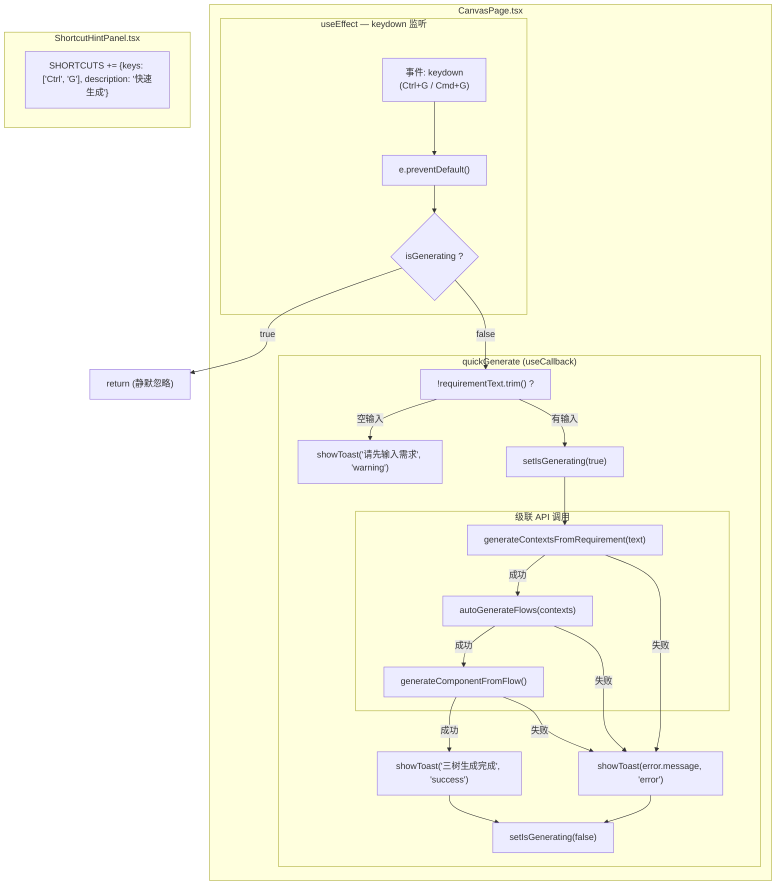

# Architecture: canvas-quick-generate-command

**Agent**: architect
**日期**: 2026-04-01
**版本**: v1.0
**状态**: 已完成

---

## 1. 执行摘要

实现 `Ctrl+G` 快捷键，在 Canvas 页面一键触发完整的三树级联生成（Context → Flow → Component）。基于现有 API（`generateContextsFromRequirement` / `autoGenerateFlows` / `generateComponentFromFlow`），仅需在 `CanvasPage.tsx` 新增键盘监听 + `quickGenerate` 回调，不引入新数据模型。

**总工时**: 2h | **优先级**: P0 | **依赖**: 无

---

## 2. Tech Stack

| 组件 | 选型 | 理由 |
|------|------|------|
| **键盘监听** | React `useEffect` + `addEventListener('keydown')` | 与现有 CanvasPage 键盘监听模式一致（见 CanvasPage.tsx L157、L198），利用已有的 cleanup 机制 |
| **级联回调** | `useCallback` | 依赖 `requirementText`、`isGenerating`、`generateContextsFromRequirement`、`autoGenerateFlows`、`generateComponentFromFlow`，稳定引用避免闭包陈旧 |
| **状态守卫** | `isGenerating` boolean（`useState`） | 替代 setTimeout 防抖，符合现有 `isGenerating` 模式（PRD 方案 A） |
| **错误提示** | `showToast(message, type)` | 复用现有 toast 系统，与 canvasStore 中 `showToast` 保持一致 |
| **测试** | Playwright E2E | 键盘事件无法被 Jest 单元测试覆盖，需浏览器级 E2E |

**无新增依赖**，所有 API 已在 `canvasStore.ts` 实现：
- `generateContextsFromRequirement(text)` — canvasStore.ts L1103
- `autoGenerateFlows(contexts)` — canvasStore.ts L894
- `generateComponentFromFlow()` — canvasStore.ts L948

---

## 3. Architecture Diagram



**数据流向**:
1. `Ctrl+G` 键盘事件 → `useEffect` 捕获 → `e.preventDefault()`
2. 检查 `isGenerating` 守卫 → 阻止重复触发
3. 检查 `requirementText` 空值 → 警告 toast
4. `setIsGenerating(true)` → 依次调用 3 个 API
5. 成功/失败 → `setIsGenerating(false)` + 对应 toast

---

## 4. API Definitions

### 4.1 quickGenerate 回调签名

```typescript
// CanvasPage.tsx 新增
const quickGenerate = useCallback(async () => {
  // 实现逻辑见上方 Architecture Diagram
}, [
  requirementText,        // 来自现有 state
  isGenerating,          // 来自现有 state
  generateContextsFromRequirement,   // 来自 canvasStore
  autoGenerateFlows,                  // 来自 canvasStore
  generateComponentFromFlow,          // 来自 canvasStore
  showToast,               // 来自 canvasStore
]);
```

### 4.2 键盘监听 useEffect

```typescript
// CanvasPage.tsx 新增（建议添加在现有 useEffect 序列之后）
useEffect(() => {
  const handler = (e: KeyboardEvent) => {
    if ((e.ctrlKey || e.metaKey) && e.key === 'g') {
      e.preventDefault(); // 阻止浏览器默认行为
      quickGenerate();
    }
  };
  document.addEventListener('keydown', handler);
  return () => document.removeEventListener('keydown', handler);
}, [quickGenerate]);
```

### 4.3 isGenerating 状态

```typescript
// 复用现有 isGenerating state
// 位于 CanvasPage.tsx useState
const [isGenerating, setIsGenerating] = useState(false);
```

### 4.4 showToast 接口

```typescript
// 复用 canvasStore 的 toast 系统
showToast(message: string, type: 'success' | 'error' | 'warning' | 'info'): void
```

| 调用场景 | message | type |
|----------|---------|------|
| 空输入 | `'请先输入需求'` | `'warning'` |
| 三树生成完成 | `'三树生成完成'` | `'success'` |
| 生成失败 | `error.message \|\| '生成失败'` | `'error'` |

### 4.5 ShortcutHintPanel 扩展

```typescript
// ShortcutHintPanel.tsx SHORTCUTS 数组新增
const SHORTCUTS: ShortcutItem[] = [
  // ... 现有快捷键 ...
  { keys: ['Ctrl', 'G'], description: '快速生成' },
];
```

---

## 5. Data Model

**无新增数据模型**。

本功能不引入新的持久化实体。三个 API 均操作现有节点：
- `BoundedContextNode[]` — 由 `generateContextsFromRequirement` 生成
- `FlowNode[]` — 由 `autoGenerateFlows` 生成
- `ComponentNode[]` — 由 `generateComponentFromFlow` 生成

---

## 6. Testing Strategy

### 6.1 测试框架

| 层级 | 框架 | 覆盖目标 |
|------|------|----------|
| **E2E（核心）** | Playwright | 键盘事件触发、toast 显示、节点数量 |
| 单元 | — | 无需新增（逻辑在 React 组件中，E2E 覆盖充分） |

### 6.2 核心 E2E 测试用例

```typescript
// tests/canvas-quick-generate.spec.ts（新建）

test('F1.1 Ctrl+G 触发快速生成', async ({ page }) => {
  await page.goto('/canvas');
  await page.fill('[data-testid="requirement-input"]', '用户登录功能');
  await page.keyboard.press('Control+g');
  // 验证触发：toast 或节点出现
});

test('F1.2 空输入显示警告 toast', async ({ page }) => {
  await page.goto('/canvas');
  // 不输入
  await page.keyboard.press('Control+g');
  const toast = page.locator('[data-testid="toast"]');
  await expect(toast).toContainText('请先输入需求');
});

test('F1.3 三树节点全部生成', async ({ page }) => {
  await page.goto('/canvas');
  await page.fill('[data-testid="requirement-input"]', '用户登录注册功能');
  await page.keyboard.press('Control+g');
  await page.waitForTimeout(5000);
  await expect(page.locator('[data-testid="context-node"]').first()).toBeVisible();
  await expect(page.locator('[data-testid="flow-node"]').first()).toBeVisible();
  await expect(page.locator('[data-testid="component-node"]').first()).toBeVisible();
});

test('F1.4 生成中阻止重复触发', async ({ page }) => {
  await page.goto('/canvas');
  await page.fill('[data-testid="requirement-input"]', '测试');
  await page.keyboard.press('Control+g');
  await page.waitForTimeout(100);
  await page.keyboard.press('Control+g'); // 重复触发
  // 节点数量应 ≤ 1 次生成
  const count = await page.locator('[data-testid="context-node"]').count();
  expect(count).toBeLessThanOrEqual(2); // 宽松上界
});

test('F1.5 错误 toast 显示', async ({ page }) => {
  // 通过 mock API 失败触发
  await page.goto('/canvas');
  await page.fill('[data-testid="requirement-input"]', 'trigger-error');
  await page.keyboard.press('Control+g');
  const toast = page.locator('[data-testid="toast"]');
  await expect(toast).toContainText(/失败|error/i);
});

test('F1.6 ShortcutHintPanel 显示 Ctrl+G', async ({ page }) => {
  await page.goto('/canvas');
  await page.keyboard.press('?');
  const panel = page.locator('[data-testid="shortcut-hint-panel"]');
  await expect(panel).toContainText('Ctrl+G');
});
```

### 6.3 覆盖率目标

| 场景 | 断言 |
|------|------|
| 空输入 toast | `toastText.includes('请先输入需求')` |
| 三树节点数 | `context > 0 && flow > 0 && component > 0` |
| 重复触发守卫 | `contextCount ≤ expected` |
| 错误 toast | `toastType === 'error'` |
| ShortcutHint 存在 | `hintText.includes('Ctrl+G')` |

---

## 7. ADR: useCallback 依赖 vs useEffect cleanup

### ADR-001: 键盘监听实现方式

**状态**: 已采纳

**上下文**:
`CanvasPage.tsx` 中已有两种键盘监听模式：
- 模式 1：`useEffect` 内直接定义 handler，依赖变化时重新绑定（`document.addEventListener` + cleanup）
- 模式 2：`useCallback` 定义 handler，传给 `useEffect` 依赖数组

两种模式均可行，需选择其一作为本功能的标准。

**决策**:
采用**模式 1**（`useEffect` 内直接定义 handler），理由如下：

| 维度 | 模式 1（内联 handler） | 模式 2（useCallback + useEffect 依赖） |
|------|----------------------|----------------------------------------|
| 代码简洁性 | ✅ 集中在一处 | ❌ 两处定义 |
| 依赖管理 | ✅ useEffect 自动 cleanup | ❌ useCallback 依赖多、易遗漏 |
| 闭包陈旧风险 | ✅ useEffect 每次重新创建 handler | ⚠️ useCallback 依赖数组必须完整 |
| 现有模式一致性 | ✅ 与 CanvasPage L157/L198 一致 | 部分使用 |

**实现**:
```typescript
useEffect(() => {
  const handler = (e: KeyboardEvent) => {
    if ((e.ctrlKey || e.metaKey) && e.key === 'g') {
      e.preventDefault();
      quickGenerate();
    }
  };
  document.addEventListener('keydown', handler);
  return () => document.removeEventListener('keydown', handler);
}, [quickGenerate]); // quickGenerate 自身是 useCallback
```

**后果**:
- `quickGenerate` 必须是 `useCallback`，否则每次渲染重新绑定监听器
- `useCallback` 依赖数组必须包含所有外部引用，否则闭包陈旧

---

## 8. Performance Analysis

### 8.1 键盘监听开销

| 指标 | 数值 | 说明 |
|------|------|------|
| 事件触发延迟 | < 1ms | 原生 `keydown` 事件，微秒级 |
| handler 执行时间 | < 1ms | 仅检查 `ctrlKey/metaKey` + `key === 'g'` |
| 总响应时间 | < 100ms（目标） | 从按键到 `preventDefault()` 完成 |

### 8.2 级联生成性能

| 阶段 | 预计耗时 | 备注 |
|------|----------|------|
| generateContextsFromRequirement | API 依赖 | 用户输入处理 + LLM 调用 |
| autoGenerateFlows | API 依赖 | 上下文分析 + Flow 生成 |
| generateComponentFromFlow | API 依赖 | 组件代码生成 |

**优化空间**: 三个 API 串行执行，总时间 = sum(各阶段)。未来可考虑并行化（仅当各阶段无依赖时），但当前 PRD 明确为串行级联。

### 8.3 内存

- 新增 1 个 `useEffect`（约 200 bytes）
- 新增 1 个 `useCallback`（约 100 bytes）
- 无新增数据模型

---

## 9. File Changes Summary

| 文件 | 操作 | 改动量 |
|------|------|--------|
| `vibex-fronted/src/components/canvas/CanvasPage.tsx` | 新增 useEffect + quickGenerate useCallback | ~40 行 |
| `vibex-fronted/src/components/canvas/features/ShortcutHintPanel.tsx` | SHORTCUTS 数组新增 1 项 | ~3 行 |
| `tests/canvas-quick-generate.spec.ts` | 新建 E2E 测试文件 | ~100 行 |

---

## 10. Verification Checklist

- [ ] `Ctrl+G` 在 Canvas 页面可触发 `quickGenerate`
- [ ] 空输入时显示 `请先输入需求` warning toast
- [ ] `isGenerating` 为 true 时重复 `Ctrl+G` 被忽略
- [ ] 三树（Context → Flow → Component）依次生成
- [ ] 失败时显示 error toast，不阻断操作
- [ ] ShortcutHintPanel 显示 `Ctrl+G: 快速生成`
- [ ] Playwright E2E 6 个场景全部通过

---

## 执行决策
- **决策**: 已采纳
- **执行项目**: canvas-quick-generate-command
- **执行日期**: 2026-04-01
