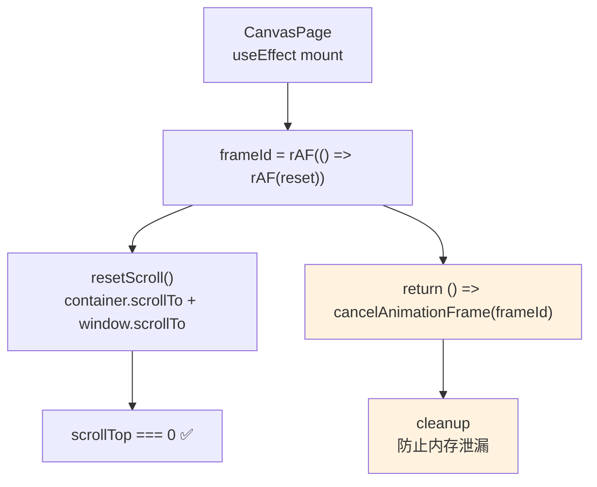

# Architecture: canvas-scroll-reset-fix-v2

**Agent**: Architect
**日期**: 2026-04-01
**版本**: v1.0
**状态**: 设计完成

---

## 执行摘要

当前部署版本 scrollTop = 0 正常，但现有 `useEffect` 中的 resetScroll() 存在时序风险：DOM 可能未渲染完成时即执行，导致在特定场景下 scrollTop = 946。方案：添加 `requestAnimationFrame` 双重保证 + `cancelAnimationFrame` cleanup，确保 DOM 完全渲染后再执行。

---

## 一、技术栈决策

| 组件 | 决策 | 理由 |
|------|------|------|
| requestAnimationFrame × 2 | ✅ 使用 | 保证 DOM 渲染帧后执行 |
| cancelAnimationFrame | ✅ 使用 | 防止组件卸载后继续执行 |
| scrollTo({ top: 0, behavior: 'instant' }) | ✅ 使用 | 立即归零 |
| window.scrollTo(0, 0) | ✅ 使用 | 备用主文档归零 |

**无新增依赖。**

---

## 二、系统架构图



---

## 三、API 设计

### 3.1 最终实现代码

```typescript
// CanvasPage.tsx
useEffect(() => {
  const resetScroll = () => {
    const container = document.querySelector('[class*="canvasContainer"]');
    if (container) {
      container.scrollTo({ top: 0, left: 0, behavior: 'instant' });
    }
    window.scrollTo(0, 0);
  };

  const frameId = requestAnimationFrame(() => {
    requestAnimationFrame(resetScroll);
  });

  return () => cancelAnimationFrame(frameId);
}, []);
```

### 3.2 关键设计要点

| 要点 | 说明 |
|------|------|
| 双重 rAF | 确保在下一渲染帧时 DOM 已完成 |
| cancelAnimationFrame | 组件卸载时取消待执行 rAF，防止内存泄漏 |
| 空依赖数组 | 仅 mount 时执行，不在后续渲染中重复触发 |
| 内部函数定义 | resetScroll 在 useEffect 内部闭包定义 |

---

## 四、测试策略

### 4.1 Playwright E2E 测试

```typescript
// e2e/canvas-scroll-reset.spec.ts
describe('Canvas scrollTop defensive fix', () => {
  test('direct access to /canvas', async ({ page }) => {
    await page.goto('/canvas');
    await page.waitForTimeout(200);
    const scrollTop = await page.evaluate(() => {
      const c = document.querySelector('[class*="canvasContainer"]');
      return c?.scrollTop ?? -1;
    });
    expect(scrollTop).toBe(0);
  });

  test('enter canvas from homepage', async ({ page }) => {
    await page.goto('/');
    await page.click('[data-testid="switch-to-canvas"]');
    await page.waitForTimeout(200);
    const scrollTop = await page.evaluate(() => {
      const c = document.querySelector('[class*="canvasContainer"]');
      return c?.scrollTop ?? -1;
    });
    expect(scrollTop).toBe(0);
  });

  test('page refresh on canvas', async ({ page }) => {
    await page.goto('/canvas');
    await page.reload();
    await page.waitForTimeout(200);
    const scrollTop = await page.evaluate(() => {
      const c = document.querySelector('[class*="canvasContainer"]');
      return c?.scrollTop ?? -1;
    });
    expect(scrollTop).toBe(0);
  });

  test('cancelAnimationFrame cleanup is present', async () => {
    const content = await readFile('vibex-fronted/src/app/canvas/page.tsx', 'utf-8');
    expect(content).toMatch(/return.*cancelAnimationFrame/);
  });
});
```

### 4.2 验收标准

| 场景 | 断言 |
|------|------|
| 直接访问 /canvas | `scrollTop === 0` |
| 首页跳转进入 | `scrollTop === 0` |
| 页面刷新 | `scrollTop === 0` |
| cancelAnimationFrame cleanup | 存在且可执行 |

---

## 五、ADR

### ADR-E1-001: 双重 rAF vs 其他方案

**状态**: 已采纳

**决策**: 双重 rAF + cancelAnimationFrame cleanup。

**备选对比**：

| 方案 | 时序保证 | 内存安全 | 复杂度 |
|------|---------|---------|--------|
| setTimeout(0) | ❌ 宏任务，DOM 未完成 | ✅ | 低 |
| 单次 rAF | ⚠️ 大多数情况 OK，少量失效 | ✅ | 低 |
| 双重 rAF ✅ | ✅ 强保证 | ✅ | 低 |
| MutationObserver | ✅ 最精确 | ✅ | 高 |
| setTimeout(100) | ⚠️ 固定延迟 | ✅ | 低 |

---

## 六、性能影响

| 指标 | 评估 |
|------|------|
| rAF 执行开销 | ~0.1ms（可忽略） |
| scrollTo 触发重绘 | 无（相同位置） |
| cancelAnimationFrame | 无开销（仅清除引用） |
| 帧延迟 | ~16ms（双重 rAF），用户不可感知 |

---

## 七、文件结构

```
vibex-fronted/src/app/canvas/
├── page.tsx                     # 修改：添加 rAF 双重归零 + cleanup
└── e2e/
    └── canvas-scroll-reset.spec.ts  # 新增：E2E 测试
```

---

## 执行决策

- **决策**: 已采纳
- **执行项目**: canvas-scroll-reset-fix-v2
- **执行日期**: 2026-04-01
