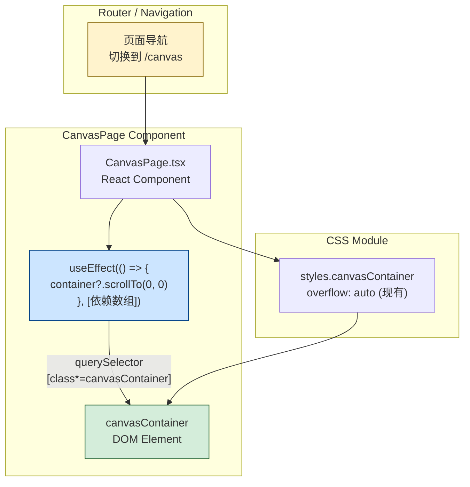

# Architecture: canvas-scroll-top-bug

**项目**: canvas-scroll-top-bug
**Agent**: Architect
**日期**: 2026-04-01
**版本**: v1.0
**状态**: 已完成

---

## 1. Tech Stack

**技术选型理由**:

| 组件 | 选择 | 理由 |
|------|------|------|
| 修复方式 | `scrollTo(0, 0)` + `useEffect` | 原生 DOM API，无需任何新依赖 |
| 状态管理 | 无变更 | 仅操作 DOM scroll 属性，不涉及状态 |
| CSS 方案 | `overflow: hidden` (备用) | 仅在 JS 方案失效时降级使用 |
| 新增依赖 | **0 个** | 零新增依赖原则 |

---

## 2. Architecture Diagram



**数据流**:

1. 用户点击「切换到画布」按钮，React Router 导航至 `/canvas`
2. `CanvasPage` 组件 **mount** → `useEffect` 触发
3. `useEffect` 内调用 `container.scrollTo(0, 0)`
4. DOM scrollTop 归零，工具栏/进度条/Tab 栏重新可见

---

## 3. API Definitions

### 3.1 DOM Scroll Reset API

```typescript
// 在 CanvasPage.tsx 的 useEffect 中调用
// 无新增接口，纯副作用操作

function resetCanvasScroll(): void {
  const container = document.querySelector('[class*="canvasContainer"]');
  if (container) {
    container.scrollTo({ top: 0, behavior: 'instant' });
  }
}
```

**接口签名**:

| 方法 | 参数 | 返回值 | 说明 |
|------|------|--------|------|
| `Element.scrollTo({ top: 0, behavior: 'instant' })` | `{ top: 0, behavior: 'instant' }` | `void` | 同步重置滚动位置 |
| `Element.scrollTop = 0` | 赋值 | `void` | 直接赋值（备选） |

**约束**:

- 仅在 canvas mount 时执行一次（`useEffect` 空依赖数组或依赖特定状态）
- 使用 `behavior: 'instant'` 避免动画延迟
- 查询选择器：`[class*="canvasContainer"]`（CSS Modules 生成的类名包含该字符串）

---

## 4. Data Model

**无数据模型变更**。此修复仅操作现有 DOM 的 scroll 属性，不引入新状态、新实体或新接口。

```
CanvasPage (React Component)
  └── useEffect (scroll reset side-effect)
        └── DOM: canvasContainer.scrollTop → 0
```

---

## 5. Testing Strategy

### 5.1 测试框架

- **框架**: Playwright（已有 e2e 测试基础设施）
- **测试文件**: `vibex-fronted/e2e/canvas-scroll.spec.ts`

### 5.2 核心测试用例

```typescript
// 场景 1: E1-S1 scrollTop 归零
test('scrollTop is 0 after switching to canvas', async ({ page }) => {
  await page.goto('/');
  await page.evaluate(() => window.scrollTo(0, 500)); // 模拟滚动
  await page.click('[data-testid="switch-to-canvas"]');
  await page.waitForURL('**/canvas');

  const scrollTop = await page.evaluate(() => {
    const c = document.querySelector('[class*="canvasContainer"]');
    return c?.scrollTop ?? -1;
  });
  expect(scrollTop).toBe(0);
});

// 场景 2: E1-S2 工具栏可见
test('all toolbar elements visible after switching to canvas', async ({ page }) => {
  await page.goto('/canvas');
  const elements = [
    page.locator('[data-testid="progress-bar"]'),
    page.locator('[data-testid="tab-bar"]'),
    page.locator('[data-testid="canvas-toolbar"]'),
  ];

  for (const el of elements) {
    const box = await el.boundingBox();
    expect(box?.top ?? -1).toBeGreaterThanOrEqual(0);
  }
});

// 场景 3: E1-S3 10次切换回归
test('scrollTop stays 0 after 10 repeated switches', async ({ page }) => {
  await page.goto('/');
  for (let i = 0; i < 10; i++) {
    await page.click('[data-testid="switch-to-canvas"]');
    await page.waitForURL('**/canvas');
    await page.waitForTimeout(100);

    const scrollTop = await page.evaluate(() => {
      const c = document.querySelector('[class*="canvasContainer"]');
      return c?.scrollTop ?? -1;
    });
    expect(scrollTop).toBe(0);
    await page.click('[data-testid="switch-to-requirements"]');
    await page.waitForURL('**/');
  }
});
```

### 5.3 覆盖率要求

| 场景 | 覆盖 |
|------|------|
| 首次进入画布 scrollTop === 0 | ✅ 必测 |
| 工具栏/进度条/Tab 栏可见 | ✅ 必测 |
| 10 次反复切换无累积 | ✅ 必测 |

---

## 6. ADR: useEffect vs CSS overflow:hidden

### ADR-001: scrollTop 归零方案选择

**状态**: 已采纳

**上下文**:
页面切换时 `canvasContainer.scrollTop = 946`，工具栏被推出视口。需要选择最轻量、最可靠的方式修复。

**选项 A: useEffect + scrollTo (✅ 已采纳)**

```typescript
useEffect(() => {
  const container = document.querySelector('[class*="canvasContainer"]');
  container?.scrollTo({ top: 0, behavior: 'instant' });
}, []); // 仅 canvas mount 时执行一次
```

**优点**:
- 零依赖，原生 DOM API
- 精确控制时机（mount 时）
- 可添加 cleanup（防止 unmount 时残留）
- 行为可测试

**缺点**:
- 依赖 CSS 类名选择器（CSS Modules 兼容性需验证）

**选项 B: CSS overflow: hidden (❌ 拒绝)**

```css
.canvasContainer {
  overflow: hidden;
}
```

**优点**:
- 无 JS 变更

**缺点**:
- 全局禁用滚动，可能影响画布内内容滚动
- 不符合渐进增强原则
- 工具栏问题可能是 scrollTop 泄漏，而非 overflow 问题
- 风险过高，作为备用方案

**决策**: 采用选项 A。理由：精确控制、零依赖、可测试、风险可控。

**后果**:
- 新增一个 `useEffect` hook 到 CanvasPage.tsx
- 无需新增任何 npm 依赖
- 如果未来需要保留用户滚动位置，可改为条件触发

---

## 7. Performance Impact

| 指标 | 影响 | 说明 |
|------|------|------|
| 包体积 | **无变化** | 零新增依赖 |
| JS 执行时间 | **< 1ms** | 一次 DOM 查询 + 一次 scrollTo 调用 |
| 重排/重绘 | **无** | scrollTop 是 layout 属性，设置即生效 |
| React 渲染 | **无影响** | 纯副作用，不触发 re-render |
| 内存 | **无变化** | 无新增状态或闭包 |

**结论**: 性能影响可忽略不计。

---

## 执行决策
- **决策**: 已采纳
- **执行项目**: canvas-scroll-top-bug
- **执行日期**: 2026-04-01
