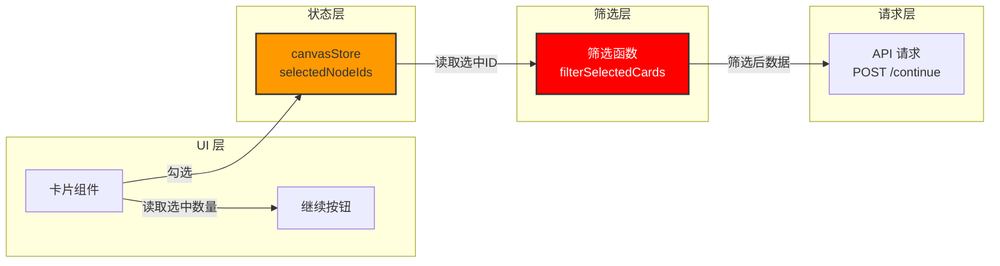
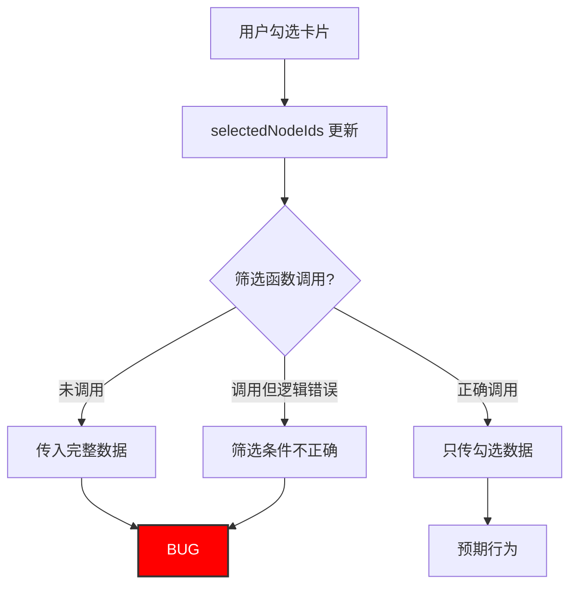

# Architecture: Canvas 选择卡片筛选 Bug 修复

> **项目**: canvas-selection-filter-bug
> **阶段**: design-architecture
> **版本**: 1.0.0
> **日期**: 2026-03-31
> **Architect**: Architect Agent
> **工作目录**: /root/.openclaw/vibex/vibex-fronted

---

## 执行决策
- **决策**: 已采纳
- **执行项目**: canvas-selection-filter-bug
- **执行日期**: 2026-03-31

---

## 1. 概述

### 1.1 Bug 描述
用户选择卡片后点击继续，请求体未只传勾选数据，而是传入未筛选的完整数据。

### 1.2 预期行为
用户勾选特定卡片后点击「继续」，系统应只发送用户勾选的卡片 ID 到后端。

---

## 2. Tech Stack

| 层级 | 技术选型 | 理由 |
|------|----------|------|
| **状态管理** | Zustand canvasStore（现有） | 统一状态入口 |
| **组件** | React + TypeScript（现有） | 现有 |
| **测试** | Vitest + Playwright（现有） | 现有 |

---

## 3. 架构设计

### 3.1 数据流



### 3.2 问题定位



---

## 4. API 定义

### 4.1 筛选函数

```typescript
// src/lib/canvas/selectionFilter.ts

export interface SelectedCard {
  id: string;
  type: string;
  name: string;
}

/**
 * 从选中 ID 列表筛选卡片数据
 * @param allCards - 所有卡片数据
 * @param selectedIds - 选中的卡片 ID 集合
 * @returns 只包含选中卡片的数组
 */
export function filterSelectedCards(
  allCards: SelectedCard[],
  selectedIds: Set<string>
): SelectedCard[] {
  return allCards.filter(card => selectedIds.has(card.id));
}

/**
 * 从 canvasStore 获取筛选后的卡片数据
 */
export function getFilteredCards(store: CanvasStore): SelectedCard[] {
  const { cards, selectedNodeIds } = store;
  return filterSelectedCards(cards, selectedNodeIds);
}
```

### 4.2 请求构造

```typescript
// src/components/canvas/ContinueButton.tsx

interface ContinueButtonProps {
  onContinue: (selectedCards: SelectedCard[]) => void;
}

export const ContinueButton: React.FC<ContinueButtonProps> = ({ onContinue }) => {
  const selectedIds = useCanvasStore(s => s.selectedNodeIds);
  const cards = useCanvasStore(s => s.cards);
  
  const filteredCards = useMemo(
    () => filterSelectedCards(cards, selectedIds),
    [cards, selectedIds]
  );
  
  const handleClick = () => {
    // 确保只传筛选后的数据
    onContinue(filteredCards);
  };
  
  return (
    <button 
      disabled={selectedIds.size === 0}
      onClick={handleClick}
    >
      继续 ({selectedIds.size} 已选)
    </button>
  );
};
```

---

## 5. 数据模型

### 5.1 状态结构

```typescript
// canvasStore.ts

interface CanvasState {
  // 选中状态
  selectedNodeIds: Set<string>;
  
  // 卡片数据
  cards: Card[];
  
  // Actions
  toggleNodeSelect: (nodeId: string) => void;
  setSelectedCards: (ids: string[]) => void;
  clearSelection: () => void;
}
```

---

## 6. 测试策略

### 6.1 单元测试

```typescript
// src/lib/canvas/__tests__/selectionFilter.test.ts

import { filterSelectedCards } from '../selectionFilter';

describe('filterSelectedCards', () => {
  const mockCards = [
    { id: 'card-1', type: 'context', name: 'Card 1' },
    { id: 'card-2', type: 'context', name: 'Card 2' },
    { id: 'card-3', type: 'context', name: 'Card 3' },
  ];

  it('F1.1 只返回选中的卡片', () => {
    const selectedIds = new Set(['card-1', 'card-3']);
    const result = filterSelectedCards(mockCards, selectedIds);
    
    expect(result).toHaveLength(2);
    expect(result.map(c => c.id)).toEqual(['card-1', 'card-3']);
  });

  it('F1.2 全选时返回所有卡片', () => {
    const selectedIds = new Set(['card-1', 'card-2', 'card-3']);
    const result = filterSelectedCards(mockCards, selectedIds);
    
    expect(result).toHaveLength(3);
  });

  it('F1.3 未选中时返回空数组', () => {
    const selectedIds = new Set<string>();
    const result = filterSelectedCards(mockCards, selectedIds);
    
    expect(result).toHaveLength(0);
  });
});
```

### 6.2 E2E 测试

```typescript
// e2e/canvas-selection.spec.ts

test('F1.3 选择卡片后点击继续，请求体只包含选中数据', async ({ page }) => {
  // 勾选卡片
  await page.click('[data-testid="card-1"]');
  await page.click('[data-testid="card-3"]');
  
  // 点击继续
  await page.click('[data-testid="continue-btn"]');
  
  // 验证请求体
  await expect(apiRequestBody).toEqual({
    selectedCards: [
      { id: 'card-1' },
      { id: 'card-3' }
    ]
  });
});
```

---

## 7. 验收标准

| Story | 验收条件 |
|--------|----------|
| F1.1 | `filterSelectedCards` 正确筛选 |
| F1.2 | 请求体只包含选中卡片 |
| F1.3 | 选中数量正确显示 |
| F2.1 | 继续按钮显示选中数量 |
| F2.2 | 无选中时按钮禁用 |

---

## 8. 风险评估

| 风险 | 概率 | 影响 | 缓解 |
|------|------|------|------|
| 筛选时机不对 | 中 | 高 | 在点击继续时重新计算 |
| selectedIds 未更新 | 低 | 高 | 确保 toggle 时正确更新 |

---

*本文档由 Architect Agent 生成*
