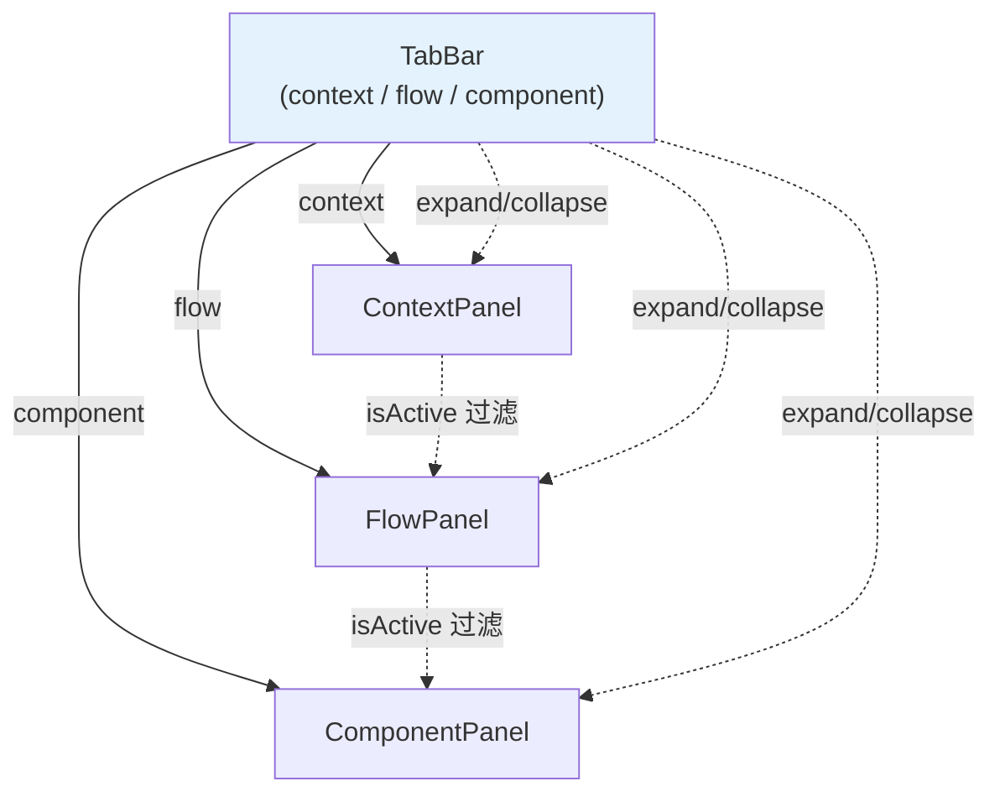

# Architecture: canvas-three-tree-unification

**Project**: Canvas 三树统一 — 废除 phase 约束 / isActive 替代 confirmed / cascade 手动触发
**Agent**: architect
**Date**: 2026-03-31
**PRD**: docs/canvas-three-tree-unification/prd.md
**Related**: canvas-data-model-unification（数据层，Phase 2 沿用）

---

## 1. 执行摘要

废除 phase 状态机约束，三树（context/flow/component）同级展示、任意时刻可编辑。下游联动手动触发（删除 context 不重置下游），`confirmed` 替换为 `isActive`。

**7 项设计原则（约束）**：PRIN-1~7（见 PRD）。

---

## 2. 核心架构变更

### 2.1 Tab 切换架构



```tsx
// CanvasPage.tsx
<div className={styles.canvasLayout}>
  <ProjectBar />
  <TabBar />
  <div className={styles.panelContainer}>
    <ContextPanel />
    <FlowPanel />
    <ComponentPanel />
  </div>
</div>
```

### 2.2 confirmed → isActive 替换

```typescript
// 旧：node.confirmed
interface TreeNode {
  id: string;
  confirmed: boolean;  // ❌ 语义不清
}

// 新：node.isActive
interface TreeNode {
  id: string;
  isActive: boolean;   // ✅ 明确：参与生成=true，不参与=false
  isDeleted?: boolean;  // ✅ 软删除
}
```

### 2.3 Cascade 手动触发

```typescript
// 旧：cascadeContextChange 自动重置
// ❌ 删除 context → flow 和 component 全部清空

// 新：手动触发
const generateFlowFromContext = (contextNodes: ContextNode[]) => {
  const activeContexts = contextNodes.filter(n => n.isActive);
  if (activeContexts.length === 0) return;
  return generateFlows(activeContexts);
};
// 删除 context 节点不会自动清空 flow/component
// 用户主动点击"生成 Flow"才覆盖下游
```

---

## 3. Tab 切换器实现

```tsx
// components/canvas/TabBar.tsx
const TABS = [
  { id: 'context', label: '限界上下文' },
  { id: 'flow', label: '业务流程' },
  { id: 'component', label: '组件' },
];

export function TabBar() {
  const [activeTab, setActiveTab] = useState('context');

  return (
    <div role="tablist" className={styles.tabBar}>
      {TABS.map(tab => (
        <button
          key={tab.id}
          role="tab"
          aria-selected={activeTab === tab.id}
          onClick={() => setActiveTab(tab.id)}
          className={activeTab === tab.id ? styles.activeTab : ''}
        >
          {tab.label}
        </button>
      ))}
    </div>
  );
}
```

**关键**：Tab 切换时三个 Panel 全部保留在 DOM 中，通过 CSS `display` 控制显隐，无卸载/重挂。

---

## 4. 面板折叠与 phase 解耦

```typescript
// canvasStore.ts — 独立存储面板折叠状态
interface PanelExpandState {
  context: 'expanded' | 'collapsed';
  flow: 'expanded' | 'collapsed';
  component: 'expanded' | 'collapsed';
}

// 不再依赖 phase
const [panelExpand, setPanelExpand] = useState<PanelExpandState>({
  context: 'expanded',
  flow: 'expanded',
  component: 'expanded',
});
```

---

## 5. localStorage Migration

```typescript
// stores/migration.ts — confirmed → isActive
function migrateConfirmedToIsActive(old: Record<string, unknown>) {
  const nodes = (old.contextNodes || []) as Array<Record<string, unknown>>;
  return {
    ...old,
    contextNodes: nodes.map(n => ({
      ...n,
      isActive: n.confirmed ?? true,  // 默认 true（兼容旧数据）
      confirmed: undefined,             // 删除旧字段
    })),
    _version: 3,
  };
}
```

---

## 6. 文件变更清单

| 文件 | 操作 | Epic |
|------|------|------|
| `components/canvas/TabBar.tsx` | 新增 | Epic 1 |
| `components/canvas/TabBar.module.css` | 新增 | Epic 1 |
| `stores/canvasStore.ts` | 修改，移除 phase gate，新增 panelExpand 状态 | Epic 1, 2 |
| `lib/canvas/types.ts` | 修改，confirmed → isActive | Epic 3 |
| `CanvasPage.tsx` | 修改，引入 TabBar，移除 phase gate | Epic 1, 5 |
| `ContextPanel.tsx` | 修改，isActive 过滤 | Epic 3 |
| `FlowPanel.tsx` | 修改，手动触发 generateFlowFromContext | Epic 4 |
| `ComponentPanel.tsx` | 修改，手动触发 generateComponentFromFlow | Epic 4 |
| `stores/migration.ts` | 修改，confirmed migration | Epic 3 |
| `__tests__/` | 新增 | Epic 6 |

**无后端改动。**

---

## 7. 测试策略

| 测试类型 | 覆盖 |
|---------|------|
| 单元测试 | isActive 过滤逻辑，generateFromContext |
| 组件测试 | TabBar 切换，Panel 显隐 |
| E2E | 任意 phase 操作任意树，cascade 手动触发 |
| gstack screenshot | Tab 切换三树数据保留 |

---

## 8. 性能影响

| 指标 | 影响 |
|------|------|
| Tab 切换 | < 50ms（三树全保留 DOM） |
| isActive 过滤 | < 1ms（纯内存操作） |
| Bundle size | +3 KB（TabBar） |

---

## 9. 风险与缓解

| 风险 | 缓解 |
|------|------|
| 旧数据 confirmed → isActive migration | migration 测试 + gstack 截图验证 |
| isActive 默认值（未确认节点） | 默认 true，兼容旧数据 |
| Tab 全保留 DOM 内存占用 | 节点数 ≤ 100 时可接受 |

---

## 10. 实施顺序

| Epic | 工时 |
|------|------|
| Epic 1: Tab + 废除 phase | 3.25h |
| Epic 2: 面板折叠解耦 | 1.25h |
| Epic 3: confirmed → isActive | 2.5h |
| Epic 4: Cascade 手动触发 | 3.5h |
| Epic 5: Tab + 面板 UI | 1h |
| Epic 6: 回归测试 | 2.5h |

**Phase 1 总工时**: ~14h

---

*Architect 产出物 | 2026-03-31*
