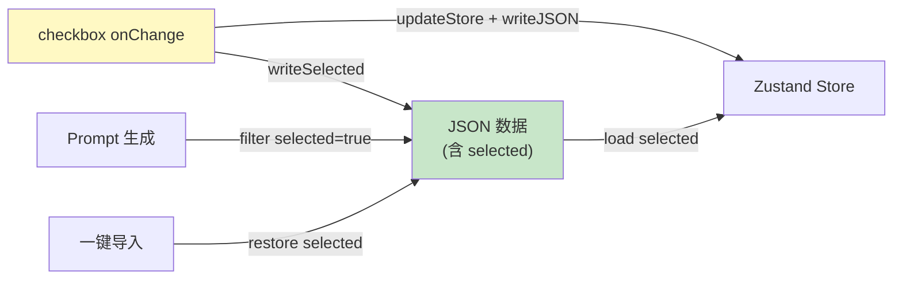

# Architecture: Checkbox 勾选状态持久化修复

**项目**: checkbox-persist-bug
**版本**: v1.0
**日期**: 2026-04-02
**架构师**: architect
**状态**: ✅ 设计完成

---

## 执行摘要

三树 checkbox 勾选状态持久化到 JSON，刷新/导入后状态保留，请求 body 只含 selected 节点。

**总工时**: 3.5h

---

## 1. Tech Stack

React + TypeScript + Zustand（无新依赖）

---

## 2. 数据模型变更

```typescript
// 新增 selected 字段到节点
interface ContextNode {
  nodeId: string;
  type: string;
  status: 'pending' | 'confirmed' | 'error';
  selected: boolean;  // 新增：勾选持久化
  // ...
}
```

---

## 3. 架构图



---

## 4. 核心变更

### E1: 数据结构扩展

JSON schema 新增 `selected: boolean` 字段，默认 `false`。

### E2: 三树勾选持久化

```typescript
// 每个 tree 的 toggle 函数
const toggleNode = (nodeId: string) => {
  // 1. 更新 store
  set(state => ({
    nodes: state.nodes.map(n =>
      n.nodeId === nodeId ? { ...n, selected: !n.selected } : n
    )
  }));
  
  // 2. 写回 JSON 数据
  const updatedNodes = getNodes().map(n =>
    n.nodeId === nodeId ? { ...n, selected: !n.selected } : n
  );
  updateJSONFile(updatedNodes);
};
```

### E3: Prompt 读取 selected

```typescript
// prompt 生成时过滤
const selectedNodes = nodes.filter(n => n.selected);
```

### E4: 一键导入恢复

```typescript
// 导入时保持 selected 字段
const imported = parseJSON(jsonString);
// selected 字段随 JSON 一起恢复
set({ nodes: imported });
```

---

## 5. 性能影响

| 维度 | 影响 |
|------|------|
| **写入频率** | toggle 时多一次 JSON 序列化 |
| **优化** | 批量防抖（300ms）或仅写 dirty 节点 |

**结论**: 低风险，建议加防抖避免频繁 IO。

---

## 6. 架构决策记录

### ADR-001: JSON 内 selected 字段

**状态**: Accepted

**决策**: 在节点 JSON 数据中增加 `selected` 字段，toggle 时同时更新 store 和 JSON。

### ADR-002: 防抖写入

**状态**: Accepted

**决策**: toggle 时防抖 300ms 后批量写入 JSON，避免频繁 IO。

---

## 执行决策

- **决策**: 已采纳
- **执行项目**: checkbox-persist-bug
- **执行日期**: 2026-04-02
