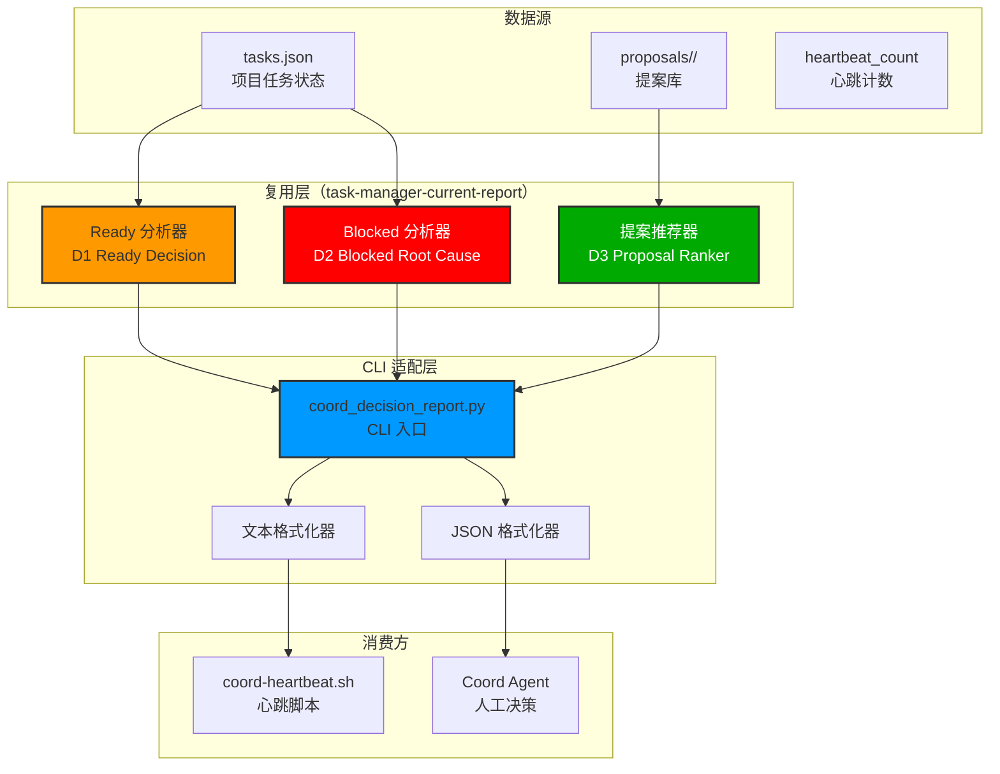
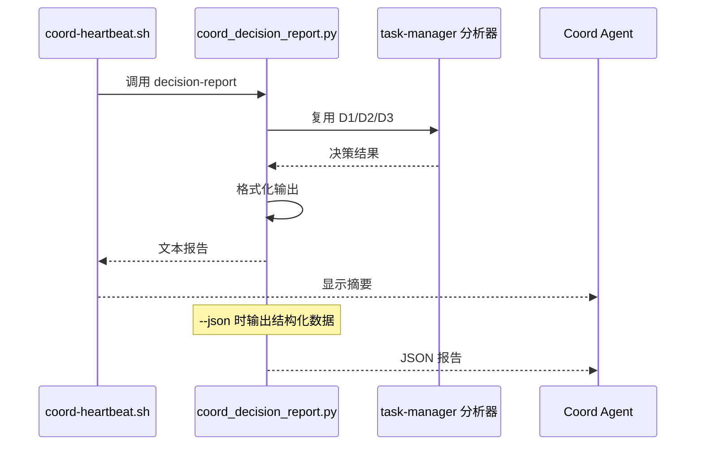

# Architecture: coord-decision-report 命令

> **项目**: coord-decision-report
> **阶段**: design-architecture
> **版本**: 1.0.0
> **日期**: 2026-03-30
> **Architect**: Architect Agent
> **工作目录**: /root/.openclaw/vibex

---

## 执行决策
- **决策**: 已采纳
- **执行项目**: coord-decision-report
- **执行日期**: 2026-03-30
- **复用策略**: 重用 `task-manager-current-report` 的 D1/D2/D3 分析器，新增 CLI 适配层

---

## 1. 概述

### 1.1 背景
Coord 每 5 分钟运行心跳，需要快速获取三个决策答案：
1. **下一步做什么？** — Ready 任务优先级
2. **有没有卡住？** — Blocked 根因
3. **该不该创建新项目？** — 空转时提案推荐

现有 `coord-heartbeat-latest.sh` 提供大量无关数据，真正决策信息缺失。

### 1.2 与 task-manager-current-report 的关系
- **复用**: D1/D2/D3 分析器逻辑完全复用
- **差异**: `coord-decision-report` 是独立脚本，可被 coord 心跳脚本调用
- **位置**: `task-manager-current-report` 是 `task_manager.py` 的子命令；`coord-decision-report` 是独立脚本

---

## 2. Tech Stack

| 层级 | 技术选型 | 理由 |
|------|----------|------|
| **脚本语言** | Python 3（现有） | 无额外依赖 |
| **分析器** | 复用 task-manager-current-report | DRY 原则 |
| **数据存储** | tasks.json + proposals/ | 现有数据结构 |
| **CLI** | argparse | 标准库 |
| **测试框架** | pytest | 现有 |

---

## 3. 架构图

### 3.1 系统架构



### 3.2 调用流程



---

## 4. API 定义

### 4.1 CLI 入口

```python
#!/usr/bin/env python3
# coord_decision_report.py

"""
Coord Decision Report - 决策导向报告

用法:
    python coord_decision_report.py              # 文本输出
    python coord_decision_report.py --json      # JSON 输出
    python coord_decision_report.py --idle 3    # 设置连续空转次数
"""

import argparse
import json
import sys
from pathlib import Path
from typing import Dict, Any, List, Optional

# 复用 task-manager-current-report 的分析器
sys.path.insert(0, str(Path(__file__).parent / "src" / "task_manager"))
from current_report import (
    analyze_ready_tasks,
    analyze_blocked_tasks,
    scan_proposals,
    rank_proposals,
    generate_report,
    format_as_text,
    format_as_json
)


def load_tasks_json(workspace: str = "/root/.openclaw/vibex") -> Dict[str, Any]:
    """加载 tasks.json"""
    tasks_file = Path(workspace) / "tasks.json"
    if not tasks_file.exists():
        return {"projects": {}}
    with open(tasks_file) as f:
        return json.load(f)


def get_idle_count(workspace: str = "/root/.openclaw/vibex") -> int:
    """获取连续空转次数"""
    count_file = Path(workspace) / ".heartbeat_count"
    if count_file.exists():
        try:
            return int(count_file.read_text().strip())
        except (ValueError, IOError):
            pass
    return 0


def main():
    parser = argparse.ArgumentParser(
        description="Coord 决策报告 - 快速获取三个决策答案"
    )
    parser.add_argument(
        "--json",
        action="store_true",
        help="输出 JSON 格式"
    )
    parser.add_argument(
        "--idle",
        type=int,
        default=None,
        help="连续空转次数（默认: 从 .heartbeat_count 读取）"
    )
    parser.add_argument(
        "--workspace",
        default="/root/.openclaw/vibex",
        help="工作目录（默认: /root/.openclaw/vibex）"
    )
    parser.add_argument(
        "--proposals-dir",
        default="proposals",
        help="提案库目录（默认: proposals）"
    )
    
    args = parser.parse_args()
    
    # 加载数据
    tasks_json = load_tasks_json(args.workspace)
    idle_count = args.idle if args.idle is not None else get_idle_count(args.workspace)
    
    # 生成报告
    proposals_path = Path(args.workspace) / args.proposals_dir
    report = generate_report(
        tasks_json,
        consecutive_idle=idle_count,
        proposals_dir=str(proposals_path)
    )
    
    # 输出
    if args.json:
        print(format_as_json(report))
    else:
        print(format_as_text(report))
    
    # 返回退出码
    if report.blocked_tasks or idle_count >= 3:
        sys.exit(1)  # 有问题需要关注
    sys.exit(0)


if __name__ == "__main__":
    main()
```

### 4.2 决策报告结构

```python
# 复用 task-manager-current-report 的数据结构

@dataclass
class DecisionReport:
    generated_at: str
    ready_tasks: List[Dict]      # D1 结果
    blocked_tasks: List[Dict]    # D2 结果
    idle: {
        "active": int,
        "ready": int,
        "consecutive_idle": int,
        "top_proposals": List[Dict]  # D3 结果
    }
```

### 4.3 文本输出格式

```
=== Coord Decision Report ===
Generated: 2026-03-30 15:06:00

--- Ready to Execute ---
📋 coord-decision-report/design-architecture [architect]
   依赖: create-prd ✅
   等待: 23min
   决策: ✅ do it now — 下游 coord-decision 阻塞中

📋 vibex-canvas-redesign/dev-epic1 [dev]
   依赖: coord-decision ✅ done
   等待: 5min
   决策: ✅ do it now — 唯一活跃项目

--- Blocked Tasks ---
🔴 None

--- Idle Status ---
⏳ 0 active | 📋 0 ready | 连续空转: 3/3
   → 提案库 Top 推荐:
   → Top1: canvas-phase2-expand [dev]
   → Top2: step-context-ui-fix [tester]
   → 输入 y 确认拉起 Top1，n 跳过
```

---

## 5. 文件结构

```
/root/.openclaw/vibex/
├── coord_decision_report.py          # CLI 入口（新建）
├── src/
│   └── task_manager/
│       └── current_report/           # 复用（已存在）
│           ├── __init__.py
│           ├── d1_ready_analyzer.py
│           ├── d2_blocked_analyzer.py
│           ├── d3_proposal_recommender.py
│           └── report_generator.py
└── tests/
    └── coord_decision_report/
        └── test_cli.py              # 新建
```

### 5.1 CLI 入口文件

```python
#!/usr/bin/env python3
# coord_decision_report.py

"""
Coord Decision Report CLI

快速获取三个决策答案：
1. 下一步做什么？（Ready 任务建议）
2. 有没有卡住？（Blocked 根因）
3. 该不该创建新项目？（空转提案推荐）

依赖:
- task-manager-current-report 的分析器模块
- tasks.json（项目任务状态）
- proposals/（提案库）
"""

import argparse
import json
import sys
from pathlib import Path
from datetime import datetime


def main():
    # CLI 参数解析
    parser = argparse.ArgumentParser(
        description="Coord 决策报告",
        formatter_class=argparse.RawDescriptionHelpFormatter,
        epilog="""
示例:
  python coord_decision_report.py
  python coord_decision_report.py --json
  python coord_decision_report.py --idle 3
  python coord_decision_report.py --workspace /root/.openclaw/vibex
        """
    )
    parser.add_argument("--json", action="store_true", help="JSON 输出")
    parser.add_argument("--idle", type=int, help="连续空转次数")
    parser.add_argument("--workspace", default="/root/.openclaw/vibex")
    parser.add_argument("--proposals-dir", default="proposals")
    
    args = parser.parse_args()
    
    # 复用分析器
    try:
        from src.task_manager.current_report import (
            generate_report,
            format_as_text,
            format_as_json
        )
    except ImportError:
        # 降级：内联简单实现
        print("⚠️ 分析器未找到，使用简化实现", file=sys.stderr)
        print("=== Coord Decision Report ===")
        print("Generated:", datetime.now().isoformat())
        print("--- Ready to Execute ---")
        print("📋 None (分析器未加载)")
        sys.exit(0)
    
    # 加载数据
    tasks_file = Path(args.workspace) / "tasks.json"
    tasks_json = json.load(open(tasks_file)) if tasks_file.exists() else {"projects": {}}
    
    idle_count = args.idle or 0
    proposals_path = Path(args.workspace) / args.proposals_dir
    
    # 生成报告
    report = generate_report(tasks_json, idle_count, str(proposals_path))
    
    # 输出
    if args.json:
        print(format_as_json(report))
    else:
        print(format_as_text(report))
    
    # 退出码
    sys.exit(1 if (report.blocked_tasks or idle_count >= 3) else 0)


if __name__ == "__main__":
    main()
```

---

## 6. 测试策略

### 6.1 单元测试

```python
# tests/coord_decision_report/test_cli.py

import pytest
import json
import sys
from pathlib import Path
from io import StringIO

# 添加 src 到 path
sys.path.insert(0, str(Path(__file__).parent.parent.parent / "src"))

from coord_decision_report import main, load_tasks_json, get_idle_count


def test_load_tasks_json(tmp_path):
    """测试加载 tasks.json"""
    tasks = {"projects": {"test": {"status": "active"}}}
    tasks_file = tmp_path / "tasks.json"
    tasks_file.write_text(json.dumps(tasks))
    
    result = load_tasks_json(str(tmp_path))
    assert result == tasks


def test_load_tasks_json_not_exists(tmp_path):
    """测试 tasks.json 不存在时返回空结构"""
    result = load_tasks_json(str(tmp_path))
    assert result == {"projects": {}}


def test_get_idle_count(tmp_path):
    """测试获取空转计数"""
    count_file = tmp_path / ".heartbeat_count"
    count_file.write_text("5")
    
    result = get_idle_count(str(tmp_path))
    assert result == 5


def test_get_idle_count_not_exists(tmp_path):
    """测试计数文件不存在时返回 0"""
    result = get_idle_count(str(tmp_path))
    assert result == 0
```

### 6.2 集成测试

```bash
# 测试 CLI
python coord_decision_report.py
python coord_decision_report.py --json
python coord_decision_report.py --idle 3

# 验证 JSON 格式
python coord_decision_report.py --json | python -m json.tool

# 测试执行时间
time python coord_decision_report.py
```

---

## 7. 性能要求

| 指标 | 要求 |
|------|------|
| 执行时间 | < 2 秒 |
| 内存占用 | < 50MB |
| 依赖 | 仅标准库 |

---

## 8. 与 coord-heartbeat 集成

```bash
# coord-heartbeat.sh 中的调用示例

# 每 5 分钟执行
*/5 * * * * cd /root/.openclaw/vibex && python coord_decision_report.py >> /var/log/coord-heartbeat.log 2>&1

# 检查退出码
if python coord_decision_report.py --json | jq -e '.blocked_tasks | length > 0' > /dev/null; then
    echo "⚠️ 有阻塞任务需要处理"
fi
```

---

## 9. 验收标准

| ID | 标准 | 测试方法 |
|----|------|----------|
| V1 | 命令返回 0 | `python coord_decision_report.py; echo $?` |
| V2 | Ready 任务含决策建议 | `grep -E "do it now|skip|lower priority"` |
| V3 | Blocked 任务含根因 | `grep -E "agent_down|dependency_not_done"` |
| V4 | 空转时显示提案 Top3 | idle >= 3 时检查 |
| V5 | 执行时间 < 2 秒 | `time python coord_decision_report.py` |
| V6 | --json 输出 valid JSON | `python --json \| jq .` |

---

## 10. 复用说明

本架构**完全复用** `task-manager-current-report` 的分析器模块：

| 模块 | 复用来源 | 说明 |
|------|----------|------|
| `d1_ready_analyzer` | task-manager-current-report | Ready 任务分析 |
| `d2_blocked_analyzer` | task-manager-current-report | 阻塞根因分析 |
| `d3_proposal_recommender` | task-manager-current-report | 提案推荐 |
| `report_generator` | task-manager-current-report | 报告生成 |

只需新增：
- `coord_decision_report.py` - CLI 入口和格式化

---

*本文档由 Architect Agent 生成*
