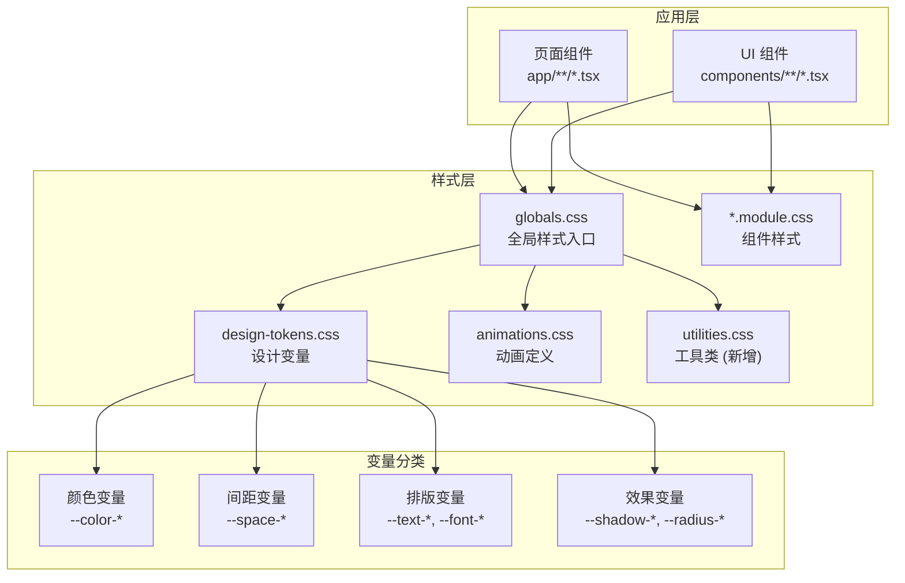
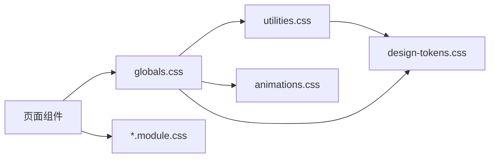

# CSS 架构设计

**项目**: vibex-inline-styles-extract  
**版本**: 1.0  
**日期**: 2026-03-05  
**作者**: Architect Agent

---

## 1. 概述

本文档定义了 VibeX 前端 CSS 架构，包括变量体系、工具类结构、主题兼容方案和内联样式迁移策略。

---

## 2. 技术选型

| 技术 | 版本 | 选择理由 |
|------|------|---------|
| CSS Variables | 原生 | 运行时可修改，支持主题切换 |
| CSS Modules | Next.js 内置 | 组件级样式隔离 |
| PostCSS | Next.js 内置 | 自动前缀、嵌套支持 |
| 设计系统 | 现有 | 已有 `design-tokens.css` |

---

## 3. 架构图



---

## 4. 目录结构

```
vibex-fronted/src/
├── app/
│   ├── globals.css              # 全局样式入口 (已存在)
│   └── *.module.css             # 页面级 CSS Modules
├── styles/
│   ├── design-tokens.css        # 设计变量 (已存在)
│   ├── animations.css           # 动画定义 (已存在)
│   ├── utilities.css            # 工具类 (新增)
│   └── themes/
│       ├── light.css            # 亮色主题变量覆盖
│       └── dark.css             # 暗色主题变量覆盖
└── components/
    └── ui/
        └── *.module.css         # 组件级 CSS Modules
```

---

## 5. 变量体系设计

### 5.1 颜色变量扩展

在现有 `design-tokens.css` 基础上，补充内联样式高频使用的颜色：

```css
/* design-tokens.css - 颜色扩展 */

:root {
  /* === 现有变量 (保持不变) === */
  --color-primary: #00d4ff;
  --color-primary-glow: rgba(0, 212, 255, 0.5);
  --color-bg-primary: #0a0a0f;
  --color-bg-secondary: #111118;
  --color-text-primary: #ffffff;
  --color-text-secondary: #94a3b8;
  --color-text-muted: #64748b;
  --color-border: rgba(255, 255, 255, 0.1);
  
  /* === 新增：内联样式高频颜色 === */
  --color-text-description: #94a3b8;  /* 描述文本 */
  --color-text-label: #64748b;        /* 标签文本 */
  --color-border-light: #e2e8f0;      /* 浅边框 */
  --color-border-input: #e5e5e5;      /* 输入框边框 */
  --color-accent-blue: #0070f3;       /* 强调蓝 (链接/按钮) */
  --color-accent-success: #10b981;    /* 成功状态 */
  --color-bg-dark-card: #1e1e2e;      /* 深色卡片背景 */
  --color-bg-white: #ffffff;          /* 白色背景 */
}
```

### 5.2 间距变量对齐

现有间距变量与内联样式使用对齐：

```css
/* design-tokens.css - 间距对齐 */

:root {
  /* === 现有间距 === */
  --space-1: 4px;
  --space-2: 8px;
  --space-3: 12px;
  --space-4: 16px;
  --space-5: 20px;
  --space-6: 24px;
  --space-8: 32px;
  --space-10: 40px;
  --space-12: 48px;
  
  /* === 语义化间距别名 (新增) === */
  --spacing-xs: var(--space-1);   /* 4px */
  --spacing-sm: var(--space-2);   /* 8px */
  --spacing-md: var(--space-3);   /* 12px */
  --spacing-lg: var(--space-4);   /* 16px */
  --spacing-xl: var(--space-6);   /* 24px */
  --spacing-2xl: var(--space-8);  /* 32px */
}
```

### 5.3 圆角变量扩展

```css
/* design-tokens.css - 圆角扩展 */

:root {
  /* === 现有圆角 === */
  --radius-sm: 4px;
  --radius-md: 8px;
  --radius-lg: 12px;
  --radius-xl: 16px;
  --radius-full: 9999px;
  
  /* === 语义化别名 === */
  --radius-input: var(--radius-md);    /* 输入框圆角 */
  --radius-card: var(--radius-lg);     /* 卡片圆角 */
  --radius-button: var(--radius-md);   /* 按钮圆角 */
}
```

---

## 6. 工具类设计

### 6.1 utilities.css 结构

创建 `src/styles/utilities.css`：

```css
/**
 * VibeX 工具类
 * 用于替换高频内联样式
 */

/* ============================================
   文本颜色工具类
   ============================================ */

.text-secondary {
  color: var(--color-text-secondary);
}

.text-muted {
  color: var(--color-text-muted);
}

.text-description {
  color: var(--color-text-description);
}

.text-label {
  color: var(--color-text-label);
}

.text-accent {
  color: var(--color-accent-blue);
}

.text-success {
  color: var(--color-accent-success);
}

/* ============================================
   间距工具类 (补充现有)
   ============================================ */

/* 下边距 */
.mb-xs { margin-bottom: var(--spacing-xs); }   /* 4px */
.mb-sm { margin-bottom: var(--spacing-sm); }   /* 8px */
.mb-md { margin-bottom: var(--spacing-md); }   /* 12px */
.mb-lg { margin-bottom: var(--spacing-lg); }   /* 16px */
.mb-xl { margin-bottom: var(--spacing-xl); }   /* 24px */
.mb-2xl { margin-bottom: var(--spacing-2xl); } /* 32px */

/* 上边距 */
.mt-xs { margin-top: var(--spacing-xs); }
.mt-sm { margin-top: var(--spacing-sm); }
.mt-md { margin-top: var(--spacing-md); }
.mt-lg { margin-top: var(--spacing-lg); }
.mt-xl { margin-top: var(--spacing-xl); }

/* 内边距 */
.p-xs { padding: var(--spacing-xs); }
.p-sm { padding: var(--spacing-sm); }
.p-md { padding: var(--spacing-md); }
.p-lg { padding: var(--spacing-lg); }
.p-xl { padding: var(--spacing-xl); }

/* ============================================
   布局工具类
   ============================================ */

/* Flex 居中 */
.flex-center {
  display: flex;
  align-items: center;
  justify-content: center;
}

/* Flex 行 + 居中 */
.flex-row-center {
  display: flex;
  align-items: center;
  gap: var(--spacing-sm);
}

/* Flex 列 */
.flex-column {
  display: flex;
  flex-direction: column;
}

.flex-column-sm {
  display: flex;
  flex-direction: column;
  gap: var(--spacing-sm);
}

.flex-column-md {
  display: flex;
  flex-direction: column;
  gap: var(--spacing-md);
}

.flex-column-lg {
  display: flex;
  flex-direction: column;
  gap: var(--spacing-lg);
}

/* ============================================
   卡片样式
   ============================================ */

/* 白色卡片 */
.white-card {
  padding: var(--spacing-lg);
  background-color: var(--color-bg-white);
  border-radius: var(--radius-card);
  border: 1px solid var(--color-border-light);
}

/* 深色卡片 */
.dark-card {
  background: var(--color-bg-dark-card);
  border-radius: var(--radius-card);
}

/* 玻璃卡片 */
.glass-card {
  background: var(--color-bg-glass);
  backdrop-filter: blur(20px);
  -webkit-backdrop-filter: blur(20px);
  border-radius: var(--radius-card);
  border: 1px solid var(--color-border);
}

/* ============================================
   表单样式
   ============================================ */

/* 标签文本 */
.label-text {
  display: block;
  margin-bottom: var(--spacing-sm);
  font-weight: 500;
  color: var(--color-text-primary);
}

/* 表单标签 */
.form-label {
  font-size: 13px;
  color: var(--color-text-description);
  display: block;
  margin-bottom: var(--spacing-xs);
}

/* 输入框 */
.input-field {
  width: 100%;
  padding: var(--spacing-md);
  border: 1px solid var(--color-border-input);
  border-radius: var(--radius-input);
  font-size: var(--text-base);
  transition: border-color 0.2s ease;
}

.input-field:focus {
  outline: none;
  border-color: var(--color-accent-blue);
  box-shadow: 0 0 0 3px rgba(0, 112, 243, 0.1);
}

/* ============================================
   表格样式
   ============================================ */

.table-header {
  padding: 14px 20px;
  text-align: left;
  font-weight: 500;
  color: var(--color-text-label);
  font-size: 13px;
  border-bottom: 1px solid var(--color-border);
}

.table-cell {
  padding: var(--spacing-lg) 20px;
  border-bottom: 1px solid var(--color-border);
}

/* ============================================
   文本对齐
   ============================================ */

.text-left { text-align: left; }
.text-right { text-align: right; }
.text-center { text-align: center; }

/* ============================================
   字重
   ============================================ */

.font-normal { font-weight: 400; }
.font-medium { font-weight: 500; }
.font-semibold { font-weight: 600; }
.font-bold { font-weight: 700; }

/* ============================================
   字号
   ============================================ */

.text-xs { font-size: 12px; }
.text-sm { font-size: 14px; }
.text-base { font-size: 16px; }
.text-lg { font-size: 18px; }
.text-xl { font-size: 20px; }
.text-2xl { font-size: 24px; }

/* ============================================
   边框
   ============================================ */

.border-default {
  border: 1px solid var(--color-border-light);
}

.border-accent {
  border: 1px solid var(--color-accent-blue);
}

/* ============================================
   显示/隐藏
   ============================================ */

.hidden { display: none; }
.block { display: block; }
.inline-block { display: inline-block; }

/* ============================================
   宽度
   ============================================ */

.w-full { width: 100%; }
.w-auto { width: auto; }
```

### 6.2 工具类命名规范

| 前缀 | 用途 | 示例 |
|------|------|------|
| `.text-*` | 文本颜色 | `.text-secondary` |
| `.mb-*`, `.mt-*` | 间距 | `.mb-lg` |
| `.flex-*` | Flex 布局 | `.flex-center` |
| `.p-*` | 内边距 | `.p-md` |
| `.*-card` | 卡片样式 | `.white-card` |
| `.label-*` | 标签样式 | `.label-text` |
| `.input-*` | 输入框样式 | `.input-field` |
| `.table-*` | 表格样式 | `.table-header` |

---

## 7. 迁移映射表

### 7.1 内联样式 → CSS 类映射

| 内联样式 | CSS 类 | 优先级 |
|---------|--------|-------|
| `style={{ color: '#64748b' }}` | `.text-muted` 或 `.text-label` | P0 |
| `style={{ color: '#94a3b8' }}` | `.text-secondary` 或 `.text-description` | P0 |
| `style={{ marginBottom: '16px' }}` | `.mb-lg` | P0 |
| `style={{ marginBottom: '24px' }}` | `.mb-xl` | P0 |
| `style={{ display: 'flex', alignItems: 'center' }}` | `.flex-center` | P1 |
| `style={{ display: 'flex', flexDirection: 'column' }}` | `.flex-column` | P1 |
| 卡片内联样式组合 | `.white-card` / `.dark-card` | P1 |
| 表单标签内联样式 | `.label-text` / `.form-label` | P1 |
| 输入框内联样式 | `.input-field` | P2 |
| 表格单元格内联样式 | `.table-cell` | P2 |

### 7.2 迁移示例

**迁移前**:
```tsx
<div style={{
  padding: '16px',
  backgroundColor: 'white',
  borderRadius: '8px',
  border: '1px solid #e2e8f0'
}}>
  <span style={{ color: '#64748b', marginBottom: '8px', fontWeight: '500' }}>
    标签
  </span>
</div>
```

**迁移后**:
```tsx
<div className="white-card">
  <span className="text-muted mb-sm font-medium">
    标签
  </span>
</div>
```

---

## 8. 主题兼容方案

### 8.1 现有主题系统

项目已使用 CSS 变量实现主题，只需在 `:root` 中修改变量值即可切换主题。

### 8.2 主题切换机制

```css
/* themes/dark.css */
:root {
  --color-bg-primary: #0a0a0f;
  --color-bg-secondary: #111118;
  --color-text-primary: #ffffff;
  --color-text-secondary: #94a3b8;
  --color-border: rgba(255, 255, 255, 0.1);
}

/* themes/light.css (未来扩展) */
:root.light-theme {
  --color-bg-primary: #ffffff;
  --color-bg-secondary: #f8fafc;
  --color-text-primary: #1e293b;
  --color-text-secondary: #64748b;
  --color-border: rgba(0, 0, 0, 0.1);
}
```

### 8.3 主题变量覆盖策略

```tsx
// 主题切换逻辑
const toggleTheme = (theme: 'light' | 'dark') => {
  document.documentElement.classList.remove('light-theme', 'dark-theme');
  if (theme === 'light') {
    document.documentElement.classList.add('light-theme');
  }
};
```

---

## 9. 构建影响分析

### 9.1 构建流程

```
源码 (CSS + TSX)
      ↓
PostCSS (自动前缀、嵌套)
      ↓
CSS Modules (类名哈希)
      ↓
Next.js 构建优化
      ↓
生产 CSS Bundle
```

### 9.2 最小化影响策略

| 策略 | 说明 |
|------|------|
| **渐进式迁移** | 逐文件迁移，避免大改动 |
| **保留动态样式** | 不迁移依赖 state/props 的内联样式 |
| **CSS 变量复用** | 使用现有变量，不重复定义 |
| **工具类复用** | 工具类与 Tailwind 语义一致 |

### 9.3 Bundle 大小预估

| 指标 | 当前 | 迁移后 | 变化 |
|------|------|-------|------|
| 内联样式 | 402 处 | ~250 处 | -38% |
| CSS 文件大小 | ~15KB | ~18KB | +3KB |
| JS Bundle | - | - | 减少 (样式对象减少) |

---

## 10. 依赖关系

### 10.1 模块依赖



### 10.2 无循环依赖

- `utilities.css` 仅依赖 `design-tokens.css`
- `globals.css` 作为入口聚合所有样式
- 组件样式独立，不互相依赖

---

## 11. 测试策略

### 11.1 视觉回归测试

| 测试类型 | 工具 | 范围 |
|---------|------|------|
| 快照测试 | Playwright | 关键页面 |
| 截图对比 | Percy / Chromatic | UI 组件 |
| 手动验证 | 浏览器 | 交互功能 |

### 11.2 测试用例

```typescript
// e2e/style-regression.spec.ts
import { test, expect } from '@playwright/test';

test.describe('Style Regression', () => {
  test('homepage cards should have correct styling', async ({ page }) => {
    await page.goto('/');
    const card = page.locator('.white-card').first();
    await expect(card).toHaveCSS('padding', '16px');
    await expect(card).toHaveCSS('border-radius', '12px');
  });
  
  test('form labels should have correct color', async ({ page }) => {
    await page.goto('/project-settings');
    const label = page.locator('.label-text').first();
    await expect(label).toHaveCSS('font-weight', '500');
  });
});
```

---

## 12. 验证清单

### 12.1 架构验证

- [ ] `utilities.css` 文件创建
- [ ] CSS 变量扩展完成
- [ ] 工具类定义完整
- [ ] 导入 `globals.css`

### 12.2 功能验证

- [ ] 视觉效果无变化
- [ ] 主题切换正常
- [ ] 响应式布局正常
- [ ] 动态样式保留

### 12.3 质量验证

- [ ] 内联样式减少 38%+
- [ ] 无 CSS 编译错误
- [ ] 无样式冲突
- [ ] 构建成功

---

## 13. 风险缓解

| 风险 | 等级 | 缓解措施 |
|-----|------|---------|
| 样式冲突 | 🟡 中 | 使用语义化类名，避免与 Tailwind 冲突 |
| 动态样式丢失 | 🟡 中 | 明确标记保留的内联样式 |
| 主题不一致 | 🟢 低 | 所有颜色使用 CSS 变量 |
| 构建失败 | 🟢 低 | 渐进式迁移，每步验证 |

---

## 14. 产出物清单

| 文件 | 路径 | 说明 |
|------|------|------|
| 架构设计 | `docs/css-architecture.md` | 本文档 |
| 工具类 | `src/styles/utilities.css` | 新增工具类文件 |
| 变量扩展 | `src/styles/design-tokens.css` | 补充颜色/间距变量 |

---

*架构设计完成于 2026-03-05 09:35 (Asia/Shanghai)*
*Architect Agent*