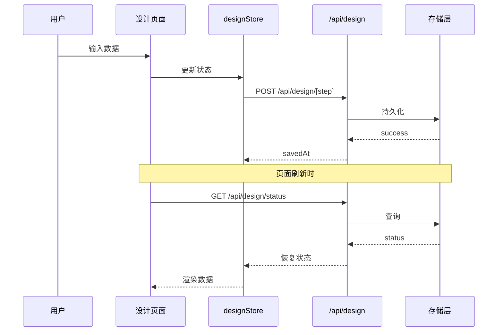

# 补充分析: vibex-step2-incomplete (Epic 2-4)

> 补充 vibex-step2-issues Epic 2-4：ThinkingPanel、API持久化、步骤回退
> 分析时间: 2026-03-20 22:33

---

## 1. Epic 2: ThinkingPanel 思考过程面板

### 1.1 现状分析

| 组件 | 位置 | 状态 | 用途 |
|------|------|------|------|
| ThinkingPanel.tsx | `@/components/ui/ThinkingPanel` | ✅ 存在 | 首页 DDD 分析 |
| ThinkingPanel.tsx | `@/components/homepage/ThinkingPanel` | ✅ 存在 | 首页步骤流 |
| useDDDStream.ts | `@/hooks/useDDDStream` | ✅ 存在 | SSE 流式状态管理 |
| stream-service.ts | `@/services/ddd/stream-service` | ✅ 存在 | SSE 客户端封装 |

**问题**: 设计流程页面 (`/design/*`) 未集成 ThinkingPanel，用户看不到 AI 分析过程。

### 1.2 集成方案

```typescript
// app/design/bounded-context/page.tsx

import { useDDDStream } from '@/hooks/useDDDStream';
import { ThinkingPanel } from '@/components/ui/ThinkingPanel';

export default function BoundedContextPage() {
  const { thinkingMessages, status, generateContexts, abort } = useDDDStream();

  return (
    <div>
      <StepNavigator ... />
      
      {/* Epic 2: 集成 ThinkingPanel */}
      {status === 'thinking' && (
        <ThinkingPanel
          thinkingMessages={thinkingMessages}
          contexts={[]}
          mermaidCode=""
          status={status}
          errorMessage={null}
          onAbort={abort}
        />
      )}
      
      <BoundedContextEditor ... />
    </div>
  );
}
```

### 1.3 JTBD

| ID | JTBD | 描述 | 优先级 |
|----|------|------|--------|
| JTBD-2.1 | 实时感知 | 分析过程中实时看到 AI 思考步骤 | P1 |
| JTBD-2.2 | 可中断 | 不想等待时可随时中断生成 | P1 |
| JTBD-2.3 | 可重试 | 分析失败时可一键重试 | P2 |

### 1.4 技术风险

| 风险 | 等级 | 描述 | 缓解措施 |
|------|------|------|----------|
| SSE 连接管理 | 🟡 中 | 页面切换时需正确清理 SSE 连接 | useDDDStream cleanup |
| 状态同步 | 🟡 中 | 多页面共享同一 store 需注意隔离 | 使用独立 sessionId |

---

## 2. Epic 3: API 持久化

### 2.1 现状分析

| 模块 | 状态 | 说明 |
|------|------|------|
| designStore.ts | ✅ 存在 | 定义了完整的数据结构 |
| DDD API | ✅ 存在 | 仅服务首页 `/api/ddd/*` |
| Design API | ❌ 不存在 | 设计流程需要独立 API |

### 2.2 API 设计

```
端点设计:
POST /api/design/[step]  - 保存步骤数据
GET  /api/design/[step]  - 加载步骤数据
GET  /api/design/status   - 获取所有步骤状态
```

**请求/响应格式**:

```typescript
// POST /api/design/bounded-context
interface SaveStepRequest {
  step: DesignStep;
  data: {
    contexts?: BoundedContext[];
    mermaidCode?: string;
    thinkingMessages?: ThinkingStep[];
  };
  sessionId: string;
}

interface SaveStepResponse {
  success: boolean;
  savedAt: string;  // ISO timestamp
  step: DesignStep;
}

// GET /api/design/status?sessionId=xxx
interface DesignStatusResponse {
  sessionId: string;
  completedSteps: DesignStep[];
  lastModified: Record<DesignStep, string>;
}
```

### 2.3 数据流



### 2.4 JTBD

| ID | JTBD | 描述 | 优先级 |
|----|------|------|--------|
| JTBD-3.1 | 刷新不丢 | 刷新页面后数据完整恢复 | P0 |
| JTBD-3.2 | 跨设备同步 | 不同设备可访问同一设计进度 | P2 |
| JTBD-3.3 | 自动保存 | 无需手动保存，编辑自动同步 | P1 |

### 2.5 技术风险

| 风险 | 等级 | 描述 | 缓解措施 |
|------|------|------|----------|
| 数据一致性 | 🔴 高 | 并发编辑可能导致覆盖 | 乐观锁/版本号 |
| 存储容量 | 🟡 中 | 无限制存储可能爆满 | TTL + 容量限制 |
| API 兼容性 | 🟡 中 | 字段变更需版本控制 | Schema 校验 |

---

## 3. Epic 4: 步骤回退

### 3.1 现状分析

| 功能 | 状态 | 说明 |
|------|------|------|
| currentStep | ✅ 存在 | 记录当前步骤 |
| previousStep | ❌ 不存在 | 无法记录上一步 |
| 回退逻辑 | ❌ 不存在 | 无法回退 |

### 3.2 回退状态机

```typescript
// 步骤状态机
type StepState = 'pending' | 'in-progress' | 'completed' | 'skipped';

interface StepNavigation {
  // 当前状态
  currentStep: DesignStep;
  stepStates: Record<DesignStep, StepState>;
  
  // 历史记录
  history: DesignStep[];  // e.g., [clarification, bounded-context]
  
  // 可回退的步骤
  canGoBack: boolean;
  canGoForward: boolean;
}
```

### 3.3 回退规则

| 场景 | 行为 | 数据处理 |
|------|------|----------|
| 回退 1 步 | 恢复上一步快照 | 当前步入栈，已恢复步出栈 |
| 回退到 Step 1 | 清除后续所有数据 | 清空所有快照 |
| 前进到已完成步 | 恢复快照 | 从快照恢复 |
| 前进到未完成步 | 清空目标步数据 | 进入编辑模式 |

### 3.4 JTBD

| ID | JTBD | 描述 | 优先级 |
|----|------|------|--------|
| JTBD-4.1 | 任意回退 | 可回退到任意已完成步骤 | P1 |
| JTBD-4.2 | 数据保留 | 回退后数据保留，可恢复 | P1 |
| JTBD-4.3 | 重新开始 | 回退 Step 1 可清除所有，重新开始 | P2 |

### 3.5 技术风险

| 风险 | 等级 | 描述 | 缓解措施 |
|------|------|------|----------|
| 循环引用 | 🟡 中 | 回退-前进可能形成循环 | 限制历史深度 (max 20) |
| 内存泄漏 | 🟡 中 | 大量快照占用内存 | LRU 缓存，定期清理 |
| 状态不一致 | 🟡 中 | 快照与实际状态可能不同步 | 变更时同步更新快照 |

---

## 4. 验收标准

### Epic 2: ThinkingPanel

| ID | 验收标准 | 测试方法 |
|----|----------|----------|
| AC-2.1 | 输入触发分析后 1 秒内显示思考面板 | 手动计时 |
| AC-2.2 | 思考面板显示流式输出的思考步骤 | 输入测试数据 |
| AC-2.3 | 点击"中断"按钮可停止流式输出 | 点击测试 |
| AC-2.4 | 分析完成后思考面板显示结果摘要 | 观察 UI |
| AC-2.5 | 分析失败时显示错误消息 | 模拟失败场景 |

### Epic 3: API 持久化

| ID | 验收标准 | 测试方法 |
|----|----------|----------|
| AC-3.1 | 填写表单后刷新页面，数据完整恢复 | F5 刷新 |
| AC-3.2 | 同时打开两个标签页，数据实时同步 | 双标签测试 |
| AC-3.3 | 保存后返回，数据从 API 正确加载 | 跳转返回 |
| AC-3.4 | API 响应时间 < 500ms | 性能测试 |
| AC-3.5 | 网络错误时显示友好提示 | 断网测试 |

### Epic 4: 步骤回退

| ID | 验收标准 | 测试方法 |
|----|----------|----------|
| AC-4.1 | 点击步骤导航可回退到已完成的上一步 | 点击测试 |
| AC-4.2 | 回退后数据完整保留 | 观察 UI 状态 |
| AC-4.3 | 前进到回退步时数据正确恢复 | 前进-后退 |
| AC-4.4 | 回退到 Step 1 时后续数据清除 | 清空确认 |
| AC-4.5 | 未完成的下一步不可点击 | 观察 UI |

---

## 5. 工时估算

| Epic | 任务 | 工时 | 依赖 |
|------|------|------|------|
| Epic 2 | ThinkingPanel 集成 | 3h | designStore |
| Epic 3 | API 持久化 | 4h | Epic 2 |
| Epic 4 | 步骤回退 | 3h | Epic 2 |
| 测试 | 单元 + E2E | 2h | - |
| **总计** | | **12h** | |

---

## 6. 实施优先级

```
Phase 2 (优先级): ThinkingPanel 集成
  ↓
Phase 3: API 持久化  
  ↓
Phase 4: 步骤回退
```

---

**分析完成**
