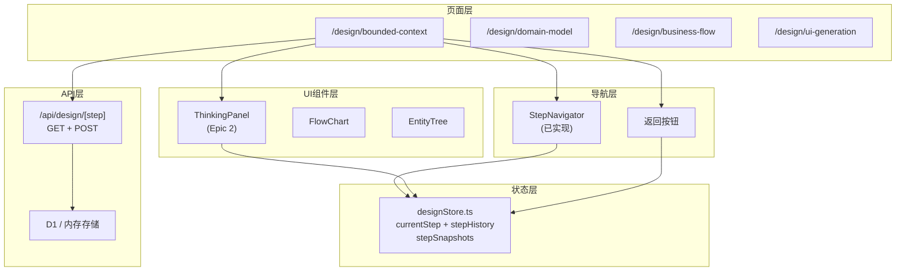

# 架构设计: Step2 页面功能完善

**项目**: vibex-step2-incomplete  
**架构师**: Architect Agent  
**日期**: 2026-03-20

---

## 1. 问题概述

| 现状 | `/design/*` 5个页面均为占位桩，缺少步骤导航、思考面板、API持久化、步骤回退 |
|------|------|
| 目标 | 为 `/design/*` 页面接入完整功能，与首页流程体验一致 |
| 依赖 | `vibex-step2-issues` Epic 1 (已完成 StepNavigator 集成) |

---

## 2. 整体架构



---

## 3. Epic 2: ThinkingPanel 集成

### 3.1 组件复用

```typescript
// 复用已有的两个 ThinkingPanel 版本之一
// 优先使用 @/components/ui/ThinkingPanel (通用版本)

import { ThinkingPanel } from '@/components/ui/ThinkingPanel';
import { useDDDStream } from '@/hooks/useDDDStream';

export function BoundedContextPage() {
  const {
    thinkingMessages,
    status,
    generateContexts,
    abort,
    errorMessage,
  } = useDDDStream();

  return (
    <div className={styles.page}>
      <StepNavigator ... />

      {/* Epic 2: ThinkingPanel */}
      <ThinkingPanel
        thinkingMessages={thinkingMessages}
        contexts={boundedContexts}
        mermaidCode={mermaidCode}
        status={status}
        errorMessage={errorMessage}
        onAbort={abort}
        onRetry={() => generateContexts(input)}
      />

      <BoundedContextEditor
        contexts={boundedContexts}
        onUpdate={setContexts}
      />
    </div>
  );
}
```

### 3.2 SSE 连接生命周期

```typescript
// useDDDStream hook 已有 cleanup，无需额外处理
// 但需要确保页面卸载时 SSE 连接正确关闭

useEffect(() => {
  return () => {
    // cleanup: abort SSE, close connection
    abort();
  };
}, []);
```

---

## 4. Epic 3: API 持久化

### 4.1 端点设计

```
POST /api/design/[step]    保存步骤数据
GET  /api/design/[step]    加载步骤数据
GET  /api/design/status     获取所有步骤完成状态
```

### 4.2 实现

```typescript
// app/api/design/[step]/route.ts

const storage = new Map<string, unknown>();

export async function GET(req: Request, { params }: { params: { step: string } }) {
  const { step } = params;
  const data = storage.get(step) ?? {};
  return Response.json(data);
}

export async function POST(req: Request, { params }: { params: { step: string } }) {
  const { step } = params;
  const body = await req.json();
  storage.set(step, body);
  return Response.json({ success: true, savedAt: new Date().toISOString() });
}
```

### 4.3 designStore 集成

```typescript
// designStore.ts
interface DesignState {
  // 新增字段
  isDirty: boolean;
  isSaving: boolean;
  lastSavedAt: string | null;

  // Actions
  save: (step: DesignStep) => Promise<void>;
  load: (step: DesignStep) => Promise<void>;
}

// 自动保存: 页面卸载时
useEffect(() => {
  const handleUnload = () => {
    if (isDirty) save(currentStep);
  };
  window.addEventListener('beforeunload', handleUnload);
  return () => window.removeEventListener('beforeunload', handleUnload);
}, [isDirty, currentStep]);
```

---

## 5. Epic 4: 步骤回退

### 5.1 状态扩展

```typescript
interface DesignState {
  // 新增
  stepHistory: number[];          // [0, 1, 2] 访问历史
  stepSnapshots: Record<string, unknown>;  // 每步骤数据快照

  // Actions
  goBack: () => void;
  goForward: (step: number) => void;
  clearForward: () => void;
}
```

### 5.2 回退规则

| 操作 | 行为 | 数据处理 |
|------|------|----------|
| 回退 (currentStep - 1) | 保存当前快照，恢复目标快照 | history.push(currentStep) |
| 前进到已访问步骤 | 从快照恢复 | history.push(target) |
| 前进到未访问步骤 | 清空目标步数据 | - |
| 回退到 Step 0 | 清除所有后续快照 | clearForward() |

---

## 6. 技术决策

| 决策 | 选项 | 选择 | 理由 |
|------|------|------|------|
| API 存储 | 内存 Map | ✅ | 开发阶段最快，后续迁 D1 |
| ThinkingPanel 版本 | @/components/ui | ✅ | 通用版本，更易复用 |
| 回退数据保留 | 快照 | ✅ | 前进时可恢复 |
| 自动保存 | beforeunload | ✅ | 覆盖刷新/关闭场景 |

---

## 7. 测试策略

```typescript
// __tests__/step2-incomplete.test.ts

describe('Epic 2: ThinkingPanel', () => {
  it('分析触发后 1s 内显示思考面板', async () => {
    render(<BoundedContextPage />);
    fireEvent.click(screen.getByRole('button', { name: /分析/i }));
    await waitFor(() => {
      expect(screen.getByTestId('thinking-panel')).toBeVisible();
    }, { timeout: 2000 });
  });
});

describe('Epic 3: API 持久化', () => {
  it('GET /api/design/bounded-context 返回 {}', async () => {
    const res = await fetch('/api/design/bounded-context');
    expect(res.status).toBe(200);
  });

  it('POST 后 GET 返回最新数据', async () => {
    await fetch('/api/design/bounded-context', {
      method: 'POST',
      body: JSON.stringify({ contexts: [{ name: 'Test' }] }),
      headers: { 'Content-Type': 'application/json' },
    });
    const res = await fetch('/api/design/bounded-context');
    expect(await res.json()).toMatchObject({ contexts: [{ name: 'Test' }] });
  });
});

describe('Epic 4: 步骤回退', () => {
  it('回退到 Step 0 时 stepSnapshots 只有 Step 0', () => {
    useDesignStore.setState({
      currentStep: 2,
      stepSnapshots: { '0': {}, '1': {}, '2': {} },
    });
    useDesignStore.getState().goBack();
    expect(useDesignStore.getState().currentStep).toBe(1);
  });
});
```

---

*Generated by: Architect Agent*
