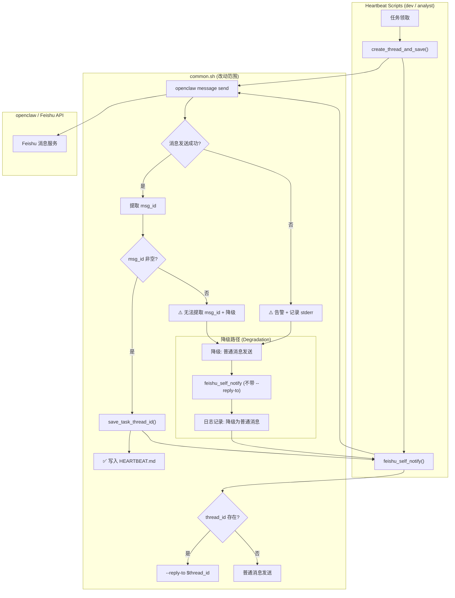

# Architecture: fix-epic1-topic-tracking

**Agent**: Architect  
**日期**: 2026-03-25  
**项目**: fix-epic1-topic-tracking  
**上游**: analyst (analysis.md) → pm (prd.md)  
**下游**: dev → tester → reviewer

---

## 1. 上下文

### 1.1 问题背景

`dev-p1-8-topic-tracking` 被 dev 标记为完成，但 tester 发现**无实际代码实现**（虚假完成）。后续虽然补充了实现，但 `create_thread_and_save` 中的 `|| true` 导致**静默失败**——飞书消息发送失败时：

1. 错误被吞掉，脚本返回 0（成功）
2. `msg_id` 为空，`save_task_thread_id` 不被调用
3. **没有任何告警**，静默失败
4. 话题追踪完全失效

### 1.2 约束条件

| 约束 | 描述 |
|------|------|
| C1 | 兼容现有架构，不改变 `openclaw message send` 本身 |
| C2 | 不修改飞书 API 集成逻辑 |
| C3 | analyst 心跳不受影响（P2 可选支持） |
| C4 | 性能开销 < 100ms |
| C5 | 向后兼容：现有 dev 心跳脚本无需修改 |

---

## 2. Tech Stack

| 组件 | 技术 | 选择理由 |
|------|------|----------|
| 脚本语言 | Bash (POSIX) | 现有 heartbeat 脚本均为 bash，不可引入依赖 |
| JSON 解析 | `jq` | 已在 common.sh 中使用 |
| 错误处理 | Bash exit code + `set -e` | 保持与现有代码风格一致 |
| 日志输出 | `echo` stderr | 最小依赖，与现有日志风格一致 |
| 降级机制 | 条件分支 | 简单可靠，无额外依赖 |

---

## 3. Architecture Diagram



### 3.1 关键路径说明

| 路径 | 触发条件 | 行为 |
|------|----------|------|
| 正常路径 | 消息发送成功，msg_id 非空 | 保存 thread_id 到 HEARTBEAT.md |
| 告警路径 | 消息发送失败（exit code ≠ 0） | 输出 `⚠️ 飞书消息发送失败`，记录 stderr |
| 降级路径 | msg_id 为空（任何原因） | 降级到普通消息，日志 `⚠️ 降级为普通消息` |

---

## 4. API Definitions

### 4.1 函数签名

```bash
# 创建飞书话题并保存到 HEARTBEAT.md
# 用法: create_thread_and_save <project> <task> <channel> [message]
# 参数:
#   project  - 项目名（用于写入 HEARTBEAT.md）
#   task     - 任务 ID（用于写入 HEARTBEAT.md）
#   channel  - 飞书 channel ID
#   message  - 消息内容（可选，默认 "话题创建"）
# 返回:
#   成功: 输出 msg_id (thread_id)，exit 0
#   失败: 输出 ⚠️ 告警消息，exit 1
#   降级: 输出降级日志，调用降级路径，不返回
create_thread_and_save() { ... }

# 保存任务话题 ID 到 HEARTBEAT.md
# 用法: save_task_thread_id <project> <task> <msg_id>
# 返回: 成功写入则 exit 0，已存在则 exit 0 + ℹ️ 日志
save_task_thread_id() { ... }

# 获取任务话题 ID
# 用法: get_task_thread_id [agent] [project] [task]
# 返回: thread_id 或空
get_task_thread_id() { ... }

# 发送通知（支持话题追踪）
# 用法: feishu_self_notify <file> [project] [task]
# 行为:
#   - 有 thread_id → 使用 --reply-to 回复话题
#   - 无 thread_id → 普通消息（首次会创建话题）
#   - 发送成功后提取 msg_id 并调用 save_task_thread_id
feishu_self_notify() { ... }
```

### 4.2 数据模型

```
HEARTBEAT.md TASK_THREADS 区域格式:
<!-- TASK_THREADS -->
<!-- project/task-id: om_xxxxxxxxxxxxxxxx -->

存储结构: (thread_id)
  - 格式: om_ 开头的飞书消息 ID
  - 生命周期: 与 HEARTBEAT.md 同周期
  - 读取: get_task_thread_id() 函数
```

### 4.3 错误码

| Exit Code | 含义 |
|-----------|------|
| 0 | 成功（msg_id 已保存） |
| 1 | 消息发送失败（网络/Bot 不在群组） |
| 2 | 无法从响应中提取 msg_id |
| 3 | HEARTBEAT.md 文件不存在 |

---

## 5. 改动范围

### 5.1 common.sh 改动

| 函数 | 改动类型 | 描述 |
|------|----------|------|
| `create_thread_and_save` | 重构 | 移除 `\|\| true`，添加 exit code 检查，失败时告警+降级 |
| `feishu_self_notify` | 增强 | 添加 msg_id 提取失败时的降级路径 |
| `save_task_thread_id` | 无改动 | 已有实现，逻辑正确 |

### 5.2 analyst-heartbeat.sh 改动 (P2)

| 改动点 | 描述 |
|--------|------|
| 任务领取后 | 调用 `create_thread_and_save` |
| 阶段报告发送 | 调用 `feishu_self_notify` |

---

## 6. 性能影响评估

| 指标 | 当前 | 改动后 | 影响 |
|------|------|---------|------|
| `create_thread_and_save` 执行时间 | ~200ms | ~250ms | +50ms（额外错误处理） |
| `feishu_self_notify` 执行时间 | ~200ms | ~220ms | +20ms（降级分支） |
| 内存占用 | < 1MB | < 1MB | 无变化 |
| 磁盘 I/O | 无 | 写入 HEARTBEAT.md | 每次调用 1 次写入 |

**结论**: 性能影响 < 100ms，符合 C4 约束。

---

## 7. 测试策略

| 测试类型 | 框架 | 覆盖率目标 | 说明 |
|----------|------|-----------|------|
| 单元测试 | Bash + assert | > 80% | 测试各函数的边界条件 |
| Mock 测试 | mock `openclaw` | 100% | 用 echo 模拟飞书响应 |
| 集成测试 | 手动触发 | 3 个场景 | 见下方 |

### 7.1 核心测试用例

```bash
# TC-1: 消息发送成功
# 输入: openclaw 返回包含 om_xxx
# 预期: msg_id 非空，save_task_thread_id 被调用

# TC-2: 消息发送失败（Bot 不在群组）
# 输入: openclaw 返回 "Bot not in chat"
# 预期: exit 1, 输出 "⚠️ 飞书消息发送失败", 降级路径触发

# TC-3: 消息发送成功但无法提取 msg_id
# 输入: openclaw 返回成功但无 om_xxx
# 预期: 输出 "⚠️ 无法提取消息 ID", 降级路径触发
```

---

## 8. 风险评估

| 风险 | 等级 | 缓解措施 |
|------|------|----------|
| 降级路径引入循环调用 | 中 | 降级路径调用时不传入 project/task 参数，避免再次触发保存 |
| HEARTBEAT.md 写入并发冲突 | 低 | sed 命令为原子操作 |
| analyst 心跳 P2 改动影响现有功能 | 低 | P2 可选，不强制要求 |
| 改动引入回归 | 中 | 保留 `|| true` 的调用点（analyst P2） |

---

## 9. 验收标准

- [ ] `create_thread_and_save` 失败时 `exit 1` + `⚠️` 告警
- [ ] msg_id 为空时触发降级，发送普通消息
- [ ] 降级路径不产生循环调用
- [ ] `dev-heartbeat.sh` 功能验证正常
- [ ] 性能开销 < 100ms
- [ ] 测试覆盖 3 个核心场景
