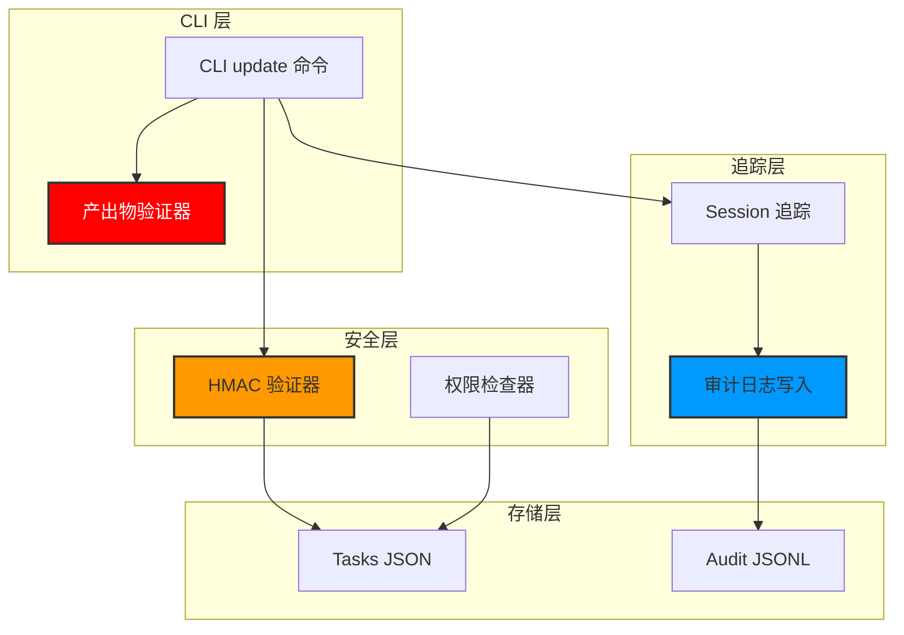
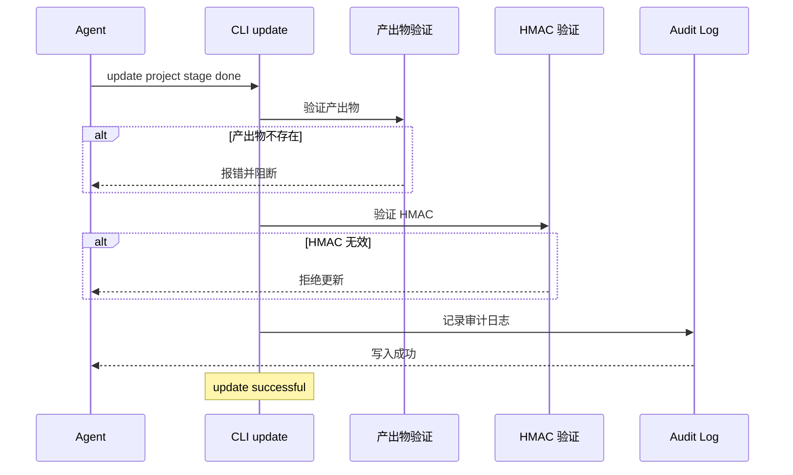

# Architecture: JSON 文件越权编辑防护

> **项目**: json-file-bypass-prevention
> **阶段**: design-architecture
> **版本**: 1.0.0
> **日期**: 2026-03-31
> **Architect**: Architect Agent
> **工作目录**: /root/.openclaw

---

## 执行决策
- **决策**: 已采纳
- **执行项目**: json-file-bypass-prevention
- **执行日期**: 2026-03-31

---

## 1. 概述

### 1.1 问题背景
当前 task_manager.py 存在多层绕过路径：
- agents 可绕过 CLI 直接修改任务 JSON 标记完成
- CLI update 时不验证产出物是否存在
- audit log 不追踪具体 agent/session
- HMAC 自动补签漏洞

### 1.2 目标
- 产出物强制验证
- session 追踪
- 完整审计日志
- HMAC 绕过修复

---

## 2. Tech Stack

| 层级 | 技术选型 | 理由 |
|------|----------|------|
| **验证** | Python 标准库 | 无额外依赖 |
| **加密** | hmac + hashlib | 标准 HMAC 验证 |
| **日志** | JSONL 文件 | 追加写入，性能好 |
| **权限** | os.chmod | 标准权限控制 |

---

## 3. 架构设计

### 3.1 系统架构



### 3.2 防护流程



---

## 4. API 定义

### 4.1 产出物验证器

```python
# src/task_manager/output_verifier.py

import os
from pathlib import Path
from typing import Optional

class OutputVerifier:
    """产出物验证器"""
    
    def __init__(self, workspace: str):
        self.workspace = Path(workspace)
    
    def verify(self, project: str, stage: str) -> tuple[bool, Optional[str]]:
        """
        验证产出物是否存在
        
        Returns:
            (is_valid, error_message)
        """
        project_dir = self.workspace / "docs" / project
        
        # 从 tasks.json 读取 expected outputs
        tasks_file = self.workspace / "tasks.json"
        if not tasks_file.exists():
            return True, None  # 无 tasks.json，跳过验证
        
        # 解析 expected_outputs
        expected = self._get_expected_outputs(tasks_file, project, stage)
        
        for output_path in expected:
            full_path = self.workspace / output_path
            if not full_path.exists():
                return False, f"产出物不存在: {output_path}"
        
        return True, None
    
    def _get_expected_outputs(self, tasks_file: Path, project: str, stage: str) -> list[str]:
        """从 tasks.json 读取预期产出物"""
        import json
        with open(tasks_file) as f:
            data = json.load(f)
        
        for p in data.get("projects", {}).values():
            for task in p.get("tasks", []):
                if task.get("id") == stage:
                    return task.get("expected_outputs", [])
        
        return []
```

### 4.2 HMAC 验证器

```python
# src/task_manager/hmac_verifier.py

import hmac
import hashlib
import json
from pathlib import Path

class HMACVerifier:
    """HMAC 签名验证器"""
    
    def __init__(self, secret_key: str):
        self.secret_key = secret_key.encode()
    
    def compute(self, data: str) -> str:
        """计算 HMAC"""
        return hmac.new(
            self.secret_key,
            data.encode(),
            hashlib.sha256
        ).hexdigest()
    
    def verify(self, data: str, signature: str) -> bool:
        """验证 HMAC"""
        expected = self.compute(data)
        return hmac.compare_digest(expected, signature)
    
    def verify_file(self, file_path: Path) -> bool:
        """验证 JSON 文件 HMAC"""
        with open(file_path) as f:
            data = json.load(f)
        
        content = json.dumps(data, sort_keys=True)
        
        # 检查 _mac 字段
        if "_mac" not in data:
            raise ValueError("文件缺少 _mac 字段，拒绝加载")
        
        if not self.verify(content, data["_mac"]):
            raise ValueError("HMAC 验证失败，文件可能被篡改")
        
        return True
```

### 4.3 Session 追踪器

```python
# src/task_manager/session_tracker.py

import os
from datetime import datetime
from typing import Optional

class SessionTracker:
    """Session 追踪器"""
    
    def __init__(self):
        self.session_key = os.environ.get("OPENCLAW_SESSION_KEY", "unknown")
        self.agent_id = os.environ.get("AGENT_ID", "unknown")
    
    def get_identity(self) -> dict:
        """获取当前身份信息"""
        return {
            "session_key": self.session_key,
            "agent_id": self.agent_id,
            "timestamp": datetime.now().isoformat(),
            "hostname": os.environ.get("HOSTNAME", "unknown")
        }
```

### 4.4 审计日志写入器

```python
# src/task_manager/audit_logger.py

import json
import os
from datetime import datetime
from pathlib import Path
from typing import Optional

class AuditLogger:
    """审计日志写入器"""
    
    def __init__(self, audit_dir: str = "/root/.openclaw/audit"):
        self.audit_dir = Path(audit_dir)
        self.audit_dir.mkdir(parents=True, exist_ok=True)
    
    def log(self, action: str, project: str, stage: str, 
            identity: dict, status: str, 
            details: Optional[dict] = None) -> None:
        """写入审计日志"""
        
        log_file = self.audit_dir / f"{datetime.now().strftime('%Y%m%d')}.jsonl"
        
        entry = {
            "time": datetime.now().isoformat(),
            "action": action,
            "project": project,
            "stage": stage,
            "status": status,
            "session_key": identity.get("session_key"),
            "agent_id": identity.get("agent_id"),
            "hostname": identity.get("hostname"),
            "details": details or {}
        }
        
        with open(log_file, "a") as f:
            f.write(json.dumps(entry, ensure_ascii=False) + "\n")
```

### 4.5 CLI update 命令

```python
# src/task_manager/cli.py

def cmd_update(args):
    """update 命令实现"""
    workspace = args.workspace or "/root/.openclaw"
    
    # 1. Session 追踪
    tracker = SessionTracker()
    identity = tracker.get_identity()
    
    # 2. 产出物验证（仅 done 时）
    if args.action == "done":
        verifier = OutputVerifier(workspace)
        is_valid, error = verifier.verify(args.project, args.stage)
        if not is_valid:
            print(f"❌ 产出物验证失败: {error}")
            print("请先完成产出物再标记 done")
            # 3. 审计日志
            logger = AuditLogger()
            logger.log("update_failed", args.project, args.stage, identity, "rejected", {"reason": error})
            return 1
    
    # 4. HMAC 验证（如果文件有 _mac）
    tasks_file = Path(workspace) / "tasks.json"
    if tasks_file.exists():
        hmac_verifier = HMACVerifier(os.environ.get("HMAC_SECRET", ""))
        try:
            hmac_verifier.verify_file(tasks_file)
        except ValueError as e:
            print(f"❌ HMAC 验证失败: {e}")
            logger = AuditLogger()
            logger.log("hmac_failed", args.project, args.stage, identity, "rejected", {"reason": str(e)})
            return 1
    
    # 5. 执行更新
    # ... (原有逻辑)
    
    # 6. 审计日志
    logger = AuditLogger()
    logger.log("update", args.project, args.stage, identity, args.action)
    
    print(f"✅ {args.project}/{args.stage} -> {args.action}")
    return 0
```

---

## 5. 权限控制

### 5.1 文件权限检查

```python
# src/task_manager/permission.py

import os
import stat
from pathlib import Path

def check_permissions(file_path: Path) -> bool:
    """检查并修复文件权限"""
    current_mode = file_path.stat().st_mode & 0o777
    
    # 期望权限：600（仅所有者读写）
    expected_mode = stat.S_IRUSR | stat.S_IWUSR  # 0o600
    
    if current_mode != expected_mode:
        # 修复权限
        os.chmod(file_path, expected_mode)
        return False, f"权限已修复: {oct(current_mode)} -> {oct(expected_mode)}"
    
    return True, None
```

---

## 6. 数据模型

### 6.1 审计日志格式

```json
// /audit/YYYYMMDD.jsonl
{"time":"2026-03-31T03:12:00","action":"update","project":"json-file-bypass","stage":"design-architecture","status":"done","session_key":"agent:architect:main","agent_id":"architect","hostname":"iZuf65icsqaf0z2br172ooZ","details":{}}
```

### 6.2 HMAC 保护字段

```json
{
  "_mac": "hmac_sha256_signature",
  "projects": {
    "project-1": {
      "tasks": [...]
    }
  }
}
```

---

## 7. 测试策略

### 7.1 单元测试

```python
# tests/test_output_verifier.py

import pytest
from pathlib import Path
from task_manager.output_verifier import OutputVerifier

def test_verify_output_exists(tmp_path):
    """产出物存在时验证通过"""
    verifier = OutputVerifier(str(tmp_path))
    
    # 创建产出物
    output_dir = tmp_path / "docs" / "test-project"
    output_dir.mkdir(parents=True)
    (output_dir / "architecture.md").touch()
    
    # 验证通过
    is_valid, error = verifier.verify("test-project", "design-architecture")
    assert is_valid
    assert error is None

def test_verify_output_missing(tmp_path):
    """产出物不存在时验证失败"""
    verifier = OutputVerifier(str(tmp_path))
    
    # 不创建产出物
    is_valid, error = verifier.verify("test-project", "design-architecture")
    assert not is_valid
    assert "不存在" in error
```

### 7.2 安全测试

```python
# tests/test_hmac_verifier.py

import pytest
from task_manager.hmac_verifier import HMACVerifier

def test_verify_valid_mac():
    """有效 HMAC 通过验证"""
    verifier = HMACVerifier("secret-key")
    data = '{"projects": {}}'
    signature = verifier.compute(data)
    
    assert verifier.verify(data, signature)

def test_verify_invalid_mac():
    """无效 HMAC 拒绝"""
    verifier = HMACVerifier("secret-key")
    data = '{"projects": {}}'
    
    with pytest.raises(ValueError, match="HMAC 验证失败"):
        verifier.verify(data, "invalid-signature")

def test_missing_mac_rejected():
    """缺少 _mac 字段拒绝"""
    verifier = HMACVerifier("secret-key")
    file_data = {"projects": {}}
    
    with pytest.raises(ValueError, match="缺少 _mac 字段"):
        verifier.verify_file(file_data)
```

---

## 8. 验收标准

| Epic | 验收条件 |
|------|----------|
| Epic 1 | 无产出物的任务无法标记 done |
| Epic 2 | 日志包含 session_key 和 agent_id |
| Epic 3 | 审计日志为有效 JSONL 格式 |
| Epic 4 | 无签名文件被拒绝加载 |

---

*本文档由 Architect Agent 生成*
