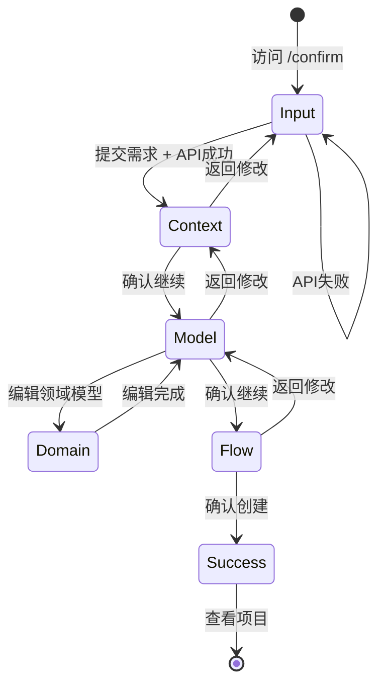
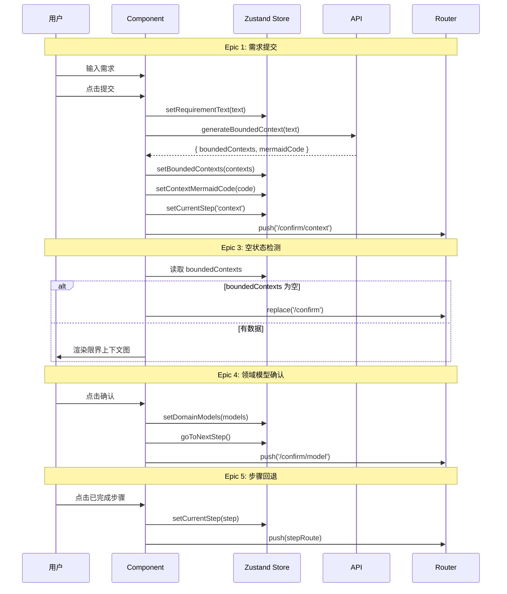

# 实现设计方案: 交互式确认流程修复

**项目**: vibex-confirmation-flow-v2  
**版本**: 1.0  
**日期**: 2026-03-03  
**架构师**: Architect Agent  
**上游文档**: [Epic 拆分方案](./epic-breakdown.md)

---

## 1. 实现方案总览

### 1.1 当前问题分析

| 问题 | 根因 | 解决方案 |
|------|------|----------|
| `/requirements/new` 未调用 API | `handleSubmit` 直接跳转，未调用 `generateBoundedContext` | 修改为调用 DDD API |
| 两套独立入口页面 | `/requirements/new` 和 `/confirm` 功能重叠 | 重定向旧入口，统一到 `/confirm` |
| `/confirm/context` 空状态 | 未检测 store 中 `boundedContexts` 是否为空 | 添加空状态检测和自动跳转 |
| `/domain` 未集成确认流程 | 独立页面，未使用 `ConfirmationSteps` | 添加步骤指示器和确认按钮 |
| 步骤指示器仅用于 `/confirm/*` | `ConfirmationSteps` 组件未在其他页面使用 | 扩展到 `/domain` 页面 |

### 1.2 技术方案选型

| 决策 | 选择 | 理由 |
|------|------|------|
| 状态管理 | Zustand (已有) | 复用现有 `confirmationStore` |
| 路由重定向 | Next.js middleware | 统一处理旧入口重定向 |
| 空状态检测 | React useEffect + router | 简单直接，无需额外依赖 |
| 步骤指示器 | 复用 `ConfirmationSteps` | 已有组件，扩展即可 |

---

## 2. Epic 实现方案

### Epic 1: 修复 `/requirements/new` API 调用

**问题**: 点击"开始生成原型"按钮后未调用 `POST /api/ddd/bounded-context`，直接跳转。

**当前代码** (`/app/requirements/new/page.tsx`):
```typescript
// 问题代码
const handleSubmit = async (e: React.FormEvent) => {
  // ...
  // 调用 API 创建需求
  // 注意：后端 API 尚未实现，这里模拟创建
  const newRequirement: Requirement = {
    id: `req-${Date.now()}`,
    // ...
  }
  console.log('Created requirement:', newRequirement)
  
  // 跳转到领域模型页
  router.push('/domain')  // 直接跳转，未调用 API
}
```

**修复方案**:

**文件**: `vibex-fronted/src/app/requirements/new/page.tsx`

```typescript
import { generateBoundedContext } from '@/services/api'
import { useConfirmationStore } from '@/stores/confirmationStore'

export default function NewRequirement() {
  const router = useRouter()
  const { 
    setRequirementText, 
    setBoundedContexts, 
    setContextMermaidCode,
    setCurrentStep 
  } = useConfirmationStore()
  const [isLoading, setIsLoading] = useState(false)
  const [error, setError] = useState('')

  const handleSubmit = async (e: React.FormEvent) => {
    e.preventDefault()
    
    if (!content.trim()) {
      setError('请输入需求描述')
      return
    }

    setIsLoading(true)
    setError('')

    try {
      // 1. 保存需求文本到 store
      setRequirementText(content.trim())
      
      // 2. 调用 DDD API 生成限界上下文
      const response = await generateBoundedContext(content.trim())
      
      if (response.success && response.boundedContexts) {
        // 3. 保存生成的限界上下文
        setBoundedContexts(response.boundedContexts)
        
        if (response.mermaidCode) {
          setContextMermaidCode(response.mermaidCode)
        }
        
        // 4. 更新步骤状态
        setCurrentStep('context')
        
        // 5. 跳转到确认页面
        router.push('/confirm/context')
      } else {
        throw new Error(response.error || '生成失败，请重试')
      }
    } catch (err: unknown) {
      console.error('Failed to generate bounded contexts:', err)
      setError(err instanceof Error ? err.message : '生成失败，请重试')
    } finally {
      setIsLoading(false)
    }
  }
  
  // ... rest of the component
}
```

**文件清单**:
| 文件 | 操作 | 说明 |
|------|------|------|
| `vibex-fronted/src/app/requirements/new/page.tsx` | 修改 | 修改 `handleSubmit` 调用 API |

**测试用例**:
```typescript
// __tests__/requirements-new.test.tsx
describe('Requirements New Page - Epic 1', () => {
  it('E1-S1: should call generateBoundedContext API on submit', async () => {
    render(<NewRequirement />)
    
    // 填写需求
    await userEvent.type(screen.getByPlaceholderText(/请详细描述/), '在线教育平台')
    
    // 点击提交
    await userEvent.click(screen.getByText('开始生成原型'))
    
    // 验证 API 调用
    expect(mockGenerateBoundedContext).toHaveBeenCalledWith('在线教育平台')
  })
  
  it('E1-S2: should show loading state during API call', async () => {
    render(<NewRequirement />)
    
    await userEvent.type(screen.getByPlaceholderText(/请详细描述/), '测试需求')
    await userEvent.click(screen.getByText('开始生成原型'))
    
    // 验证加载状态
    expect(screen.getByText('生成中...')).toBeInTheDocument()
  })
  
  it('E1-S3: should show error message on API failure', async () => {
    mockGenerateBoundedContext.mockRejectedValueOnce(new Error('API Error'))
    
    render(<NewRequirement />)
    
    await userEvent.type(screen.getByPlaceholderText(/请详细描述/), '测试需求')
    await userEvent.click(screen.getByText('开始生成原型'))
    
    await waitFor(() => {
      expect(screen.getByText(/生成失败/)).toBeInTheDocument()
    })
  })
  
  it('E1-S4: should navigate to /confirm/context on success', async () => {
    mockGenerateBoundedContext.mockResolvedValueOnce({
      success: true,
      boundedContexts: [{ id: '1', name: 'Test', type: 'core' }],
    })
    
    render(<NewRequirement />)
    
    await userEvent.type(screen.getByPlaceholderText(/请详细描述/), '测试需求')
    await userEvent.click(screen.getByText('开始生成原型'))
    
    await waitFor(() => {
      expect(mockRouter.push).toHaveBeenCalledWith('/confirm/context')
    })
  })
})
```

---

### Epic 2: 统一入口页面

**问题**: 存在两套入口 `/requirements/new` 和 `/confirm`，用户体验混乱。

**方案选择**: 使用 Next.js middleware 重定向

**文件**: `vibex-fronted/src/middleware.ts` (新建)

```typescript
import { NextResponse } from 'next/server'
import type { NextRequest } from 'next/server'

export function middleware(request: NextRequest) {
  const { pathname } = request.nextUrl
  
  // 重定向旧入口到新入口
  if (pathname === '/requirements/new') {
    return NextResponse.redirect(new URL('/confirm', request.url))
  }
  
  return NextResponse.next()
}

export const config = {
  matcher: '/requirements/new',
}
```

**文件**: `vibex-fronted/src/app/dashboard/page.tsx` (修改导航链接)

```typescript
// 修改前
<Link href="/requirements/new">新需求</Link>

// 修改后
<Link href="/confirm">新需求</Link>
```

**文件清单**:
| 文件 | 操作 | 说明 |
|------|------|------|
| `vibex-fronted/src/middleware.ts` | 新建 | 重定向 `/requirements/new` → `/confirm` |
| `vibex-fronted/src/app/dashboard/page.tsx` | 修改 | 更新导航链接 |
| `vibex-fronted/src/app/requirements/new/page.tsx` | 删除 | 移除冗余页面（可选保留重定向） |

**测试用例**:
```typescript
// __tests__/middleware.test.ts
describe('Middleware - Epic 2', () => {
  it('E2-S1: should redirect /requirements/new to /confirm', async () => {
    const response = middleware(new NextRequest('http://localhost/requirements/new'))
    
    expect(response.status).toBe(307) // Redirect
    expect(response.headers.get('location')).toContain('/confirm')
  })
})
```

---

### Epic 3: `/confirm/context` 空状态处理

**问题**: 直接访问 `/confirm/context` 时数据为空，页面显示空白。

**当前代码分析**: 
- `context/page.tsx` 已从 store 读取 `boundedContexts`
- 但缺少空状态检测和自动跳转逻辑

**修复方案**:

**文件**: `vibex-fronted/src/app/confirm/context/page.tsx`

```typescript
'use client'

import { useEffect } from 'react'
import { useRouter } from 'next/navigation'
import { useConfirmationStore } from '@/stores/confirmationStore'

export default function ContextPage() {
  const router = useRouter()
  const { boundedContexts, setCurrentStep } = useConfirmationStore()

  // E3-S1 & E3-S2: 空状态检测和自动跳转
  useEffect(() => {
    if (boundedContexts.length === 0) {
      // E3-S3: 显示提示（可选使用 toast）
      console.warn('No bounded contexts found, redirecting to /confirm')
      
      // 重置步骤状态
      setCurrentStep('input')
      
      // 跳转到需求输入页
      router.replace('/confirm')
    }
  }, [boundedContexts, router, setCurrentStep])

  // 如果数据为空，显示加载状态
  if (boundedContexts.length === 0) {
    return (
      <div className={styles.container}>
        <div className={styles.loading}>
          <p>加载数据中...</p>
        </div>
      </div>
    )
  }

  // 正常渲染...
}
```

**可选: 添加 Toast 提示**

**文件**: `vibex-fronted/src/app/confirm/context/page.tsx`

```typescript
import { toast } from 'react-hot-toast' // 或其他 toast 库

useEffect(() => {
  if (boundedContexts.length === 0) {
    toast.error('请先输入需求描述')
    router.replace('/confirm')
  }
}, [boundedContexts, router])
```

**文件清单**:
| 文件 | 操作 | 说明 |
|------|------|------|
| `vibex-fronted/src/app/confirm/context/page.tsx` | 修改 | 添加空状态检测和跳转 |

**测试用例**:
```typescript
// __tests__/confirm-context.test.tsx
describe('Confirm Context Page - Epic 3', () => {
  it('E3-S1: should detect empty boundedContexts', async () => {
    // 设置空 store
    useConfirmationStore.setState({ boundedContexts: [] })
    
    render(<ContextPage />)
    
    // 应显示加载状态
    expect(screen.getByText(/加载/)).toBeInTheDocument()
  })
  
  it('E3-S2: should redirect to /confirm when empty', async () => {
    useConfirmationStore.setState({ boundedContexts: [] })
    
    render(<ContextPage />)
    
    await waitFor(() => {
      expect(mockRouter.replace).toHaveBeenCalledWith('/confirm')
    })
  })
  
  it('E3-S3: should show warning message', async () => {
    const consoleSpy = jest.spyOn(console, 'warn')
    useConfirmationStore.setState({ boundedContexts: [] })
    
    render(<ContextPage />)
    
    await waitFor(() => {
      expect(consoleSpy).toHaveBeenCalledWith(expect.stringContaining('No bounded contexts'))
    })
  })
})
```

---

### Epic 4: `/domain` 页面集成确认流程

**问题**: `/domain` 是独立编辑器，未集成确认流程和步骤指示器。

**当前代码分析**:
- `/domain/page.tsx` 是领域模型编辑页面
- 已有 React Flow 集成
- 缺少步骤指示器和确认按钮

**修复方案**:

**文件**: `vibex-fronted/src/app/domain/DomainPageContent.tsx`

```typescript
import { ConfirmationSteps } from '@/components/ui/ConfirmationSteps'
import { useConfirmationStore } from '@/stores/confirmationStore'

export default function DomainPageContent() {
  const router = useRouter()
  const { 
    currentStep, 
    domainModels, 
    setDomainModels,
    setCurrentStep,
    goToNextStep 
  } = useConfirmationStore()

  // E4-S4: 确认并传递数据
  const handleConfirm = useCallback(() => {
    // 保存当前领域模型数据
    setDomainModels(/* 当前领域模型数据 */)
    
    // 更新步骤
    goToNextStep()
    
    // E4-S2: 跳转到下一页
    router.push('/confirm/model')
  }, [setDomainModels, goToNextStep, router])

  return (
    <div className={styles.container}>
      {/* 现有 header... */}
      
      <header className={styles.header}>
        {/* E4-S3: 添加步骤指示器 */}
        <ConfirmationSteps currentStep="model" className={styles.steps} />
        
        {/* E4-S1: 添加确认按钮 */}
        <div className={styles.headerActions}>
          <button 
            className={styles.confirmButton}
            onClick={handleConfirm}
          >
            确认，继续 →
          </button>
        </div>
      </header>
      
      {/* 现有内容... */}
    </div>
  )
}
```

**文件清单**:
| 文件 | 操作 | 说明 |
|------|------|------|
| `vibex-fronted/src/app/domain/DomainPageContent.tsx` | 修改 | 添加步骤指示器和确认按钮 |
| `vibex-fronted/src/app/domain/domain.module.css` | 修改 | 添加步骤指示器样式 |

**测试用例**:
```typescript
// __tests__/domain-page.test.tsx
describe('Domain Page - Epic 4', () => {
  it('E4-S1: should show confirm button', async () => {
    render(<DomainPageContent />)
    
    expect(screen.getByText('确认，继续')).toBeInTheDocument()
  })
  
  it('E4-S2: should navigate to /confirm/model on confirm', async () => {
    render(<DomainPageContent />)
    
    await userEvent.click(screen.getByText('确认，继续'))
    
    expect(mockRouter.push).toHaveBeenCalledWith('/confirm/model')
  })
  
  it('E4-S3: should show step indicator with current step', async () => {
    render(<DomainPageContent />)
    
    // 步骤指示器应显示 Step 2/3 或 Step 3: 领域模型
    expect(screen.getByText(/领域模型/)).toBeInTheDocument()
  })
  
  it('E4-S4: should save domain models to store on confirm', async () => {
    const mockSetDomainModels = jest.fn()
    useConfirmationStore.setState({ setDomainModels: mockSetDomainModels })
    
    render(<DomainPageContent />)
    
    await userEvent.click(screen.getByText('确认，继续'))
    
    expect(mockSetDomainModels).toHaveBeenCalled()
  })
})
```

---

### Epic 5: 步骤指示器全局集成

**问题**: 步骤指示器仅用于 `/confirm/*`，未在其他页面统一使用。

**当前组件分析**:
- `ConfirmationSteps` 组件已存在
- 支持 `currentStep` prop
- 已有 `STEP_INDEX_MAP` 映射

**扩展方案**:

**文件**: `vibex-fronted/src/components/ui/ConfirmationSteps.tsx` (优化)

```typescript
'use client'

import React from 'react'
import { Steps, Step } from '@/components/ui/Steps'
import { ConfirmationStep } from '@/stores/confirmationStore'

interface ConfirmationStepsProps {
  currentStep: ConfirmationStep
  className?: string
  // E5-S3: 支持点击回退
  onStepClick?: (step: ConfirmationStep) => void
  // 新增：控制是否允许点击回退
  allowNavigation?: boolean
}

const CONFIRMATION_STEPS: Step[] = [
  { title: '需求输入', description: '输入产品需求' },
  { title: '限界上下文', description: '定义领域边界' },
  { title: '领域模型', description: '设计类图结构' },
  { title: '业务流程', description: '设计流程图' },
]

const STEP_INDEX_MAP: Record<ConfirmationStep, number> = {
  'input': 0,
  'context': 1,
  'model': 2,
  'flow': 3,
  'success': 3,
}

// 反向映射
const INDEX_STEP_MAP: Record<number, ConfirmationStep> = {
  0: 'input',
  1: 'context',
  2: 'model',
  3: 'flow',
}

export function ConfirmationSteps({ 
  currentStep, 
  className = '',
  onStepClick,
  allowNavigation = false,
}: ConfirmationStepsProps) {
  const currentIndex = STEP_INDEX_MAP[currentStep]
  
  const handleStepClick = (index: number) => {
    if (allowNavigation && index < currentIndex && onStepClick) {
      // E5-S3: 只允许点击已完成的步骤（index < currentIndex）
      onStepClick(INDEX_STEP_MAP[index])
    }
  }
  
  return (
    <Steps
      steps={CONFIRMATION_STEPS}
      current={currentIndex}
      className={className}
      onStepClick={allowNavigation ? handleStepClick : undefined}
    />
  )
}
```

**文件**: `vibex-fronted/src/components/ui/Steps.tsx` (扩展)

```typescript
interface StepsProps {
  steps: Step[]
  current: number
  className?: string
  // 新增：点击回调
  onStepClick?: (index: number) => void
}

export function Steps({ steps, current, className, onStepClick }: StepsProps) {
  return (
    <div className={styles.stepsContainer}>
      {steps.map((step, index) => {
        const isActive = index === current
        const isCompleted = index < current
        const isClickable = isCompleted && onStepClick
        
        return (
          <div
            key={index}
            className={`${styles.step} ${
              isActive ? styles.active : ''
            } ${isCompleted ? styles.completed : ''} ${
              isClickable ? styles.clickable : ''
            }`}
            onClick={() => isClickable && onStepClick?.(index)}
          >
            {/* E5-S2: 已完成步骤显示勾选 */}
            <div className={styles.stepNumber}>
              {isCompleted ? (
                <span className={styles.checkmark}>✓</span>
              ) : (
                index + 1
              )}
            </div>
            <div className={styles.stepContent}>
              <span className={styles.stepTitle}>{step.title}</span>
              <span className={styles.stepDesc}>{step.description}</span>
            </div>
          </div>
        )
      })}
    </div>
  )
}
```

**使用示例** (`/confirm/context/page.tsx`):

```typescript
import { ConfirmationSteps } from '@/components/ui/ConfirmationSteps'
import { useConfirmationStore } from '@/stores/confirmationStore'

export default function ContextPage() {
  const router = useRouter()
  const { currentStep, setCurrentStep } = useConfirmationStore()

  // E5-S3: 处理步骤点击回退
  const handleStepClick = (step: ConfirmationStep) => {
    setCurrentStep(step)
    
    // 根据步骤跳转到对应页面
    const stepRoutes: Record<ConfirmationStep, string> = {
      'input': '/confirm',
      'context': '/confirm/context',
      'model': '/confirm/model',
      'flow': '/confirm/flow',
      'success': '/confirm/success',
    }
    
    router.push(stepRoutes[step])
  }

  return (
    <div className={styles.container}>
      <ConfirmationSteps 
        currentStep={currentStep}
        onStepClick={handleStepClick}
        allowNavigation={true}
      />
      {/* ... */}
    </div>
  )
}
```

**文件清单**:
| 文件 | 操作 | 说明 |
|------|------|------|
| `vibex-fronted/src/components/ui/ConfirmationSteps.tsx` | 修改 | 添加点击回退支持 |
| `vibex-fronted/src/components/ui/Steps.tsx` | 修改 | 添加点击事件和完成标记 |
| `vibex-fronted/src/components/ui/steps.module.css` | 修改 | 添加点击样式 |

**测试用例**:
```typescript
// __tests__/ConfirmationSteps.test.tsx
describe('ConfirmationSteps - Epic 5', () => {
  it('E5-S1: should highlight current step', async () => {
    render(<ConfirmationSteps currentStep="context" />)
    
    // Step 2 应高亮
    const steps = screen.getAllByRole('listitem')
    expect(steps[1]).toHaveClass('active')
  })
  
  it('E5-S2: should show checkmark for completed steps', async () => {
    render(<ConfirmationSteps currentStep="model" />)
    
    // Steps 1-2 应显示勾选
    const checkmarks = screen.getAllByText('✓')
    expect(checkmarks).toHaveLength(2)
  })
  
  it('E5-S3: should navigate on completed step click', async () => {
    const mockOnStepClick = jest.fn()
    
    render(
      <ConfirmationSteps 
        currentStep="model" 
        allowNavigation={true}
        onStepClick={mockOnStepClick}
      />
    )
    
    // 点击已完成的 Step 1
    await userEvent.click(screen.getByText('需求输入'))
    
    expect(mockOnStepClick).toHaveBeenCalledWith('input')
  })
  
  it('E5-S3: should NOT navigate on future step click', async () => {
    const mockOnStepClick = jest.fn()
    
    render(
      <ConfirmationSteps 
        currentStep="context" 
        allowNavigation={true}
        onStepClick={mockOnStepClick}
      />
    )
    
    // 点击未完成的 Step 4
    await userEvent.click(screen.getByText('业务流程'))
    
    expect(mockOnStepClick).not.toHaveBeenCalled()
  })
})
```

---

## 3. 数据流设计

### 3.1 状态流转图



### 3.2 Store 数据流



---

## 4. 文件修改清单

### 4.1 新建文件

| 文件路径 | 用途 |
|----------|------|
| `vibex-fronted/src/middleware.ts` | 重定向旧入口 |

### 4.2 修改文件

| 文件路径 | Epic | 修改内容 |
|----------|------|----------|
| `vibex-fronted/src/app/requirements/new/page.tsx` | E1 | 修改 handleSubmit 调用 API |
| `vibex-fronted/src/app/confirm/context/page.tsx` | E3 | 添加空状态检测和跳转 |
| `vibex-fronted/src/app/domain/DomainPageContent.tsx` | E4 | 添加步骤指示器和确认按钮 |
| `vibex-fronted/src/app/domain/domain.module.css` | E4 | 添加步骤指示器样式 |
| `vibex-fronted/src/app/dashboard/page.tsx` | E2 | 更新导航链接 |
| `vibex-fronted/src/components/ui/ConfirmationSteps.tsx` | E5 | 添加点击回退支持 |
| `vibex-fronted/src/components/ui/Steps.tsx` | E5 | 添加点击事件和完成标记 |
| `vibex-fronted/src/components/ui/steps.module.css` | E5 | 添加点击样式 |

### 4.3 可选删除

| 文件路径 | 原因 |
|----------|------|
| `vibex-fronted/src/app/requirements/new/page.tsx` | 重定向到 `/confirm`，可删除或保留重定向 |

---

## 5. 技术决策记录

### TDR-001: 入口统一方案

**决策**: 使用 Next.js middleware 重定向 `/requirements/new` → `/confirm`

**理由**:
- 用户可能收藏了旧 URL
- 中间件处理重定向对用户透明
- 保留旧代码不影响新功能

**备选方案**:
- 直接删除旧页面：可能导致 404
- 页面内重定向：多一次渲染

### TDR-002: 空状态处理方案

**决策**: 使用 useEffect + router.replace 处理空状态

**理由**:
- 简单直接，无需额外状态
- 用户体验：自动跳转 + 提示
- 保留数据：replace 不添加历史记录

**备选方案**:
- 服务端渲染检测：需要更多服务端代码
- 显示空状态页面：用户需要手动返回

### TDR-003: 步骤指示器交互

**决策**: 只允许点击已完成步骤回退

**理由**:
- 防止用户跳过必要步骤
- 符合线性流程逻辑
- 数据依赖关系清晰

**备选方案**:
- 允许任意跳转：可能导致数据不一致
- 禁用所有点击：用户体验不佳

---

## 6. 实施计划

### 6.1 开发顺序

```
Epic 1 (API 调用) ──┬──> Epic 2 (统一入口)
                    │
                    ├───> Epic 4 (/domain 集成) ──> Epic 5 (步骤指示器)
                    │
                    └───> Epic 3 (空状态处理) ──> (完成)
```

### 6.2 时间估算

| Epic | 预估时间 | 依赖 |
|------|----------|------|
| Epic 1 | 2h | 无 |
| Epic 2 | 1h | Epic 1 |
| Epic 3 | 1h | 无（可并行） |
| Epic 4 | 2h | Epic 1 |
| Epic 5 | 1h | Epic 4 |

**总计**: 约 7 小时

---

## 7. 验收标准

### 7.1 功能验收

| 验收项 | Epic | 验证方法 |
|--------|------|----------|
| 点击"开始生成原型"调用 API | E1 | Network 面板检查 |
| API 调用期间显示 Loading | E1 | UI 检查 |
| API 失败显示错误提示 | E1 | 模拟失败测试 |
| 成功后跳转 `/confirm/context` | E1 | URL 检查 |
| 访问 `/requirements/new` 重定向 | E2 | URL 检查 |
| Dashboard 链接指向 `/confirm` | E2 | 点击检查 |
| 空 `boundedContexts` 自动跳转 | E3 | 直接访问测试 |
| `/domain` 显示确认按钮 | E4 | UI 检查 |
| 点击确认跳转 `/confirm/model` | E4 | URL 检查 |
| 步骤指示器显示正确步骤 | E4/E5 | UI 检查 |
| 点击已完成步骤可回退 | E5 | 交互测试 |

### 7.2 测试验收

- [ ] 所有单元测试通过
- [ ] 测试覆盖率 > 60%
- [ ] E2E 测试完整流程通过
- [ ] 无 TypeScript 编译错误

---

*文档版本: 1.0*  
*创建时间: 2026-03-03*  
*作者: Architect Agent*