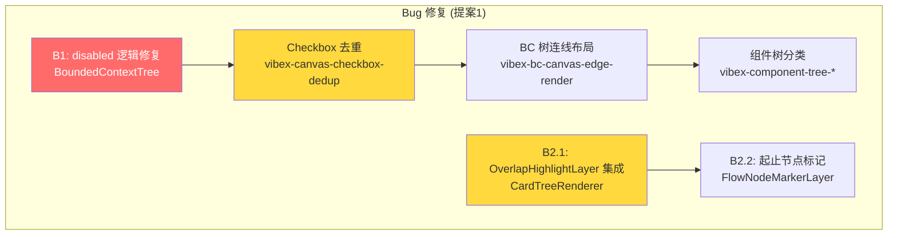
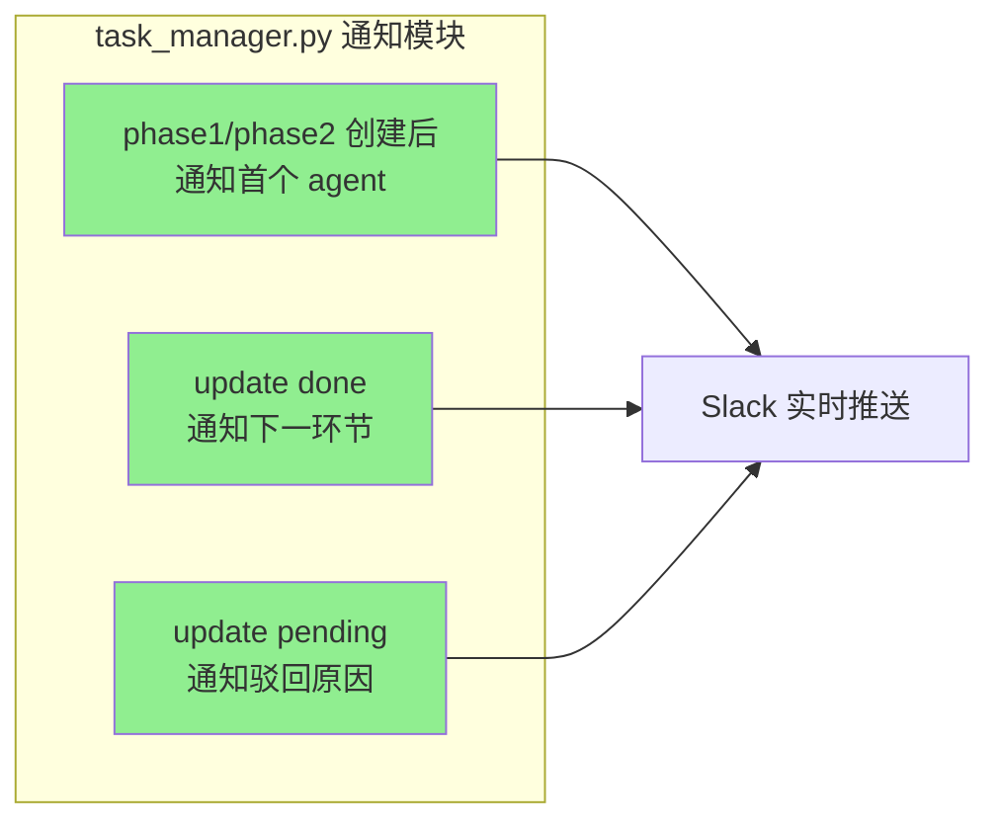
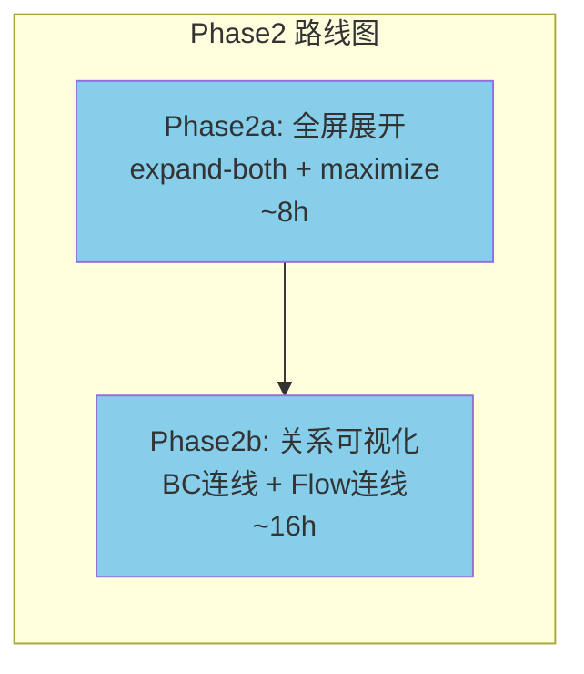

# ADR-XXX: 提案收集 20260330 — 下一轮开发规划

**状态**: Accepted
**日期**: 2026-03-30
**角色**: Architect
**项目**: proposal-collection-20260330

---

## Context

汇总今日（2026-03-30）分析任务中发现的问题和改进机会，形成下一轮开发的优先提案。

---

## Decision

### 提案汇总

| 提案 | 优先级 | 工时 | 状态 |
|------|--------|------|------|
| **提案1: Canvas Bug Sprint** | P0 | ~15-20h | 建议优先 |
| **提案2: Task Manager 通知基础设施** | P1 | 7h | 并行 |
| **提案3: Canvas Phase2 全屏展开** | P1 | 8h | 依赖Phase1 |

### 提案1: Canvas Bug Sprint — 详细结构

### 提案2: Task Manager 通知 — 详细结构

### 提案3: Canvas Phase2 — 详细结构

---

## 技术债务清单

### 已识别技术债务

| ID | 项目 | 问题 | 工时 | 优先级 |
|----|------|------|------|--------|
| TD-001 | vibex-canvas-checkbox-dedup | 双重 checkbox 混乱 | 2h | P1 |
| TD-002 | vibex-component-tree-* | AI flowId 不匹配 | 4h | P1 |
| TD-003 | vibex-bc-canvas-edge-render | 连线堆叠垂直线 | 8h | P1 |
| TD-004 | task-manager-curl-integration | 无实时通知 | 7h | P2 |

### 遗留 Bug

| ID | 描述 | 状态 |
|----|------|------|
| B1 | `disabled={allConfirmed}` 阻塞确认 | Dev 待领取 |
| B2.1 | `OverlapHighlightLayer` 未导入 | Dev 待领取 |
| B2.2 | 起止节点标记不存在 | Dev 待领取 |

---

## 执行决策

- **决策**: 已采纳
- **执行项目**: proposal-collection-20260330
- **执行日期**: 2026-03-30
