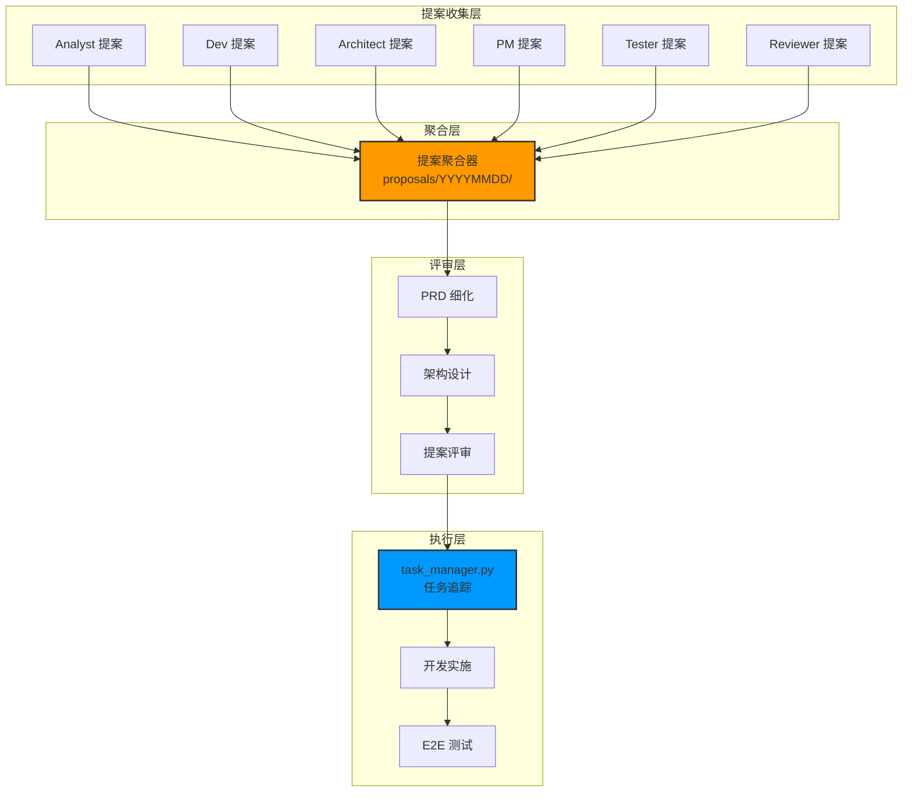
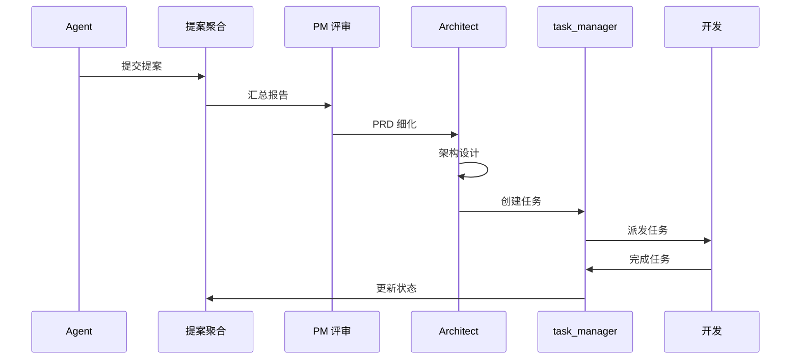

# Architecture: Proposals Review — 2026-03-30

> **项目**: proposals-20260330
> **阶段**: design-architecture
> **版本**: 1.0.0
> **日期**: 2026-03-30
> **Architect**: Architect Agent
> **工作目录**: /root/.openclaw/vibex

---

## 执行决策
- **决策**: 已采纳
- **执行项目**: proposals-20260330
- **执行日期**: 2026-03-30

---

## 1. 概述

### 1.1 项目背景
汇总 6 个 Agent 的改进提案，识别跨团队协作优化机会，建立提案执行追踪体系。

### 1.2 提案统计
| 来源 | 提案数 | P0 | P1 | P2 |
|------|--------|-----|-----|-----|
| Analyst | 3 | 1 | 2 | 0 |
| Dev | 4 | 2 | 2 | 0 |
| Architect | 5 | 0 | 2 | 3 |
| PM | 2 | 0 | 2 | 0 |
| Tester | 1 | 1 | 0 | 0 |
| Reviewer | 1 | 0 | 1 | 0 |
| **总计** | **16** | **4** | **9** | **3** |

### 1.3 关键指标
| 指标 | 目标 |
|------|------|
| P0 提案解决率 | 100% |
| P1 提案解决率 | ≥ 80% |
| 提案执行追踪率 | 100% |

---

## 2. Tech Stack

| 层级 | 技术选型 | 理由 |
|------|----------|------|
| **提案存储** | Markdown（现有） | 无需新系统 |
| **追踪系统** | task_manager.py（现有） | 已有基础设施 |
| **评审流程** | PR/Git（现有） | 标准化流程 |
| **测试框架** | Vitest/Playwright（现有） | 现有项目已用 |

---

## 3. 架构设计

### 3.1 系统架构



### 3.2 提案追踪流程



---

## 4. Epic 执行计划

### 4.1 Epic 执行顺序

```mermaid
gantt
    title 提案执行计划 - 2026-03-30
    dateFormat X
    axisFormat %Hh

    section P0
    Epic3 测试补充 (tester)    :done, 0, 4h
    Epic1 Canvas checkbox (dev)    :done, 2, 6h
    Epic2 竞品矩阵 (analyst)    :done, 4, 4h

    section P1
    Epic4 用户旅程图 (pm)    :active, 8, 3h
    Epic5 PRD模板 (pm/arch)    :active, 10, 2h

    section P2
    Epic6 定价策略 (business)    :todo, 12, 8h
```



### 4.2 依赖关系

```
Epic3 测试补充
    ↓
Epic1 Canvas checkbox 修复
    ↓
Epic5 PRD模板标准化
    ↓
Epic4 用户旅程图
    ↓
Epic6 定价策略
```

---

## 5. 文件结构

```
/root/.openclaw/vibex/
├── proposals/
│   └── 20260330/
│       ├── architect.md      # Architect 提案
│       ├── analyst.md       # Analyst 提案
│       ├── dev.md           # Dev 提案
│       ├── pm.md           # PM 提案
│       ├── tester.md       # Tester 提案
│       └── reviewer.md     # Reviewer 提案
├── docs/
│   └── proposals-20260330/
│       ├── prd.md          # PRD
│       ├── analysis.md      # 分析报告
│       ├── architecture.md  # 本文档
│       ├── specs/          # 详细规格
│       └── tracking/       # 执行追踪
│           ├── epic1-canvas-checkbox/
│           ├── epic2-competitor-matrix/
│           ├── epic3-canvas-e2e/
│           ├── epic4-user-journey/
│           ├── epic5-prd-template/
│           └── epic6-pricing/
└── task_manager.py         # 任务追踪
```

---

## 6. 提案优先级定义

### 6.1 P0 提案（立即执行）

| 提案 | 负责人 | 工时 | 验收标准 |
|------|--------|------|----------|
| Epic3 测试补充 | tester | 4h | 测试 ≥ 10，覆盖率 ≥ 80% |
| Epic1 Canvas checkbox | dev | 6h | checkbox 可切换 |
| Epic2 竞品矩阵 | analyst | 4h | 竞品 ≥ 5 |

### 6.2 P1 提案（本周执行）

| 提案 | 负责人 | 工时 | 验收标准 |
|------|--------|------|----------|
| Epic4 用户旅程图 | pm | 3h | 场景 ≥ 5 |
| Epic5 PRD模板 | pm/arch | 2h | 模板已定义 |

### 6.3 P2 提案（本月执行）

| 提案 | 负责人 | 工时 | 验收标准 |
|------|--------|------|----------|
| Epic6 定价策略 | business | 8h | 方案已定义 |

---

## 7. 追踪机制

### 7.1 task_manager 任务

```bash
# P0 任务
task_manager.py add proposals-20260330 epic3-canvas-e2e tester "E2E 测试补充"
task_manager.py add proposals-20260330 epic1-canvas-checkbox dev "Canvas checkbox 修复"
task_manager.py add proposals-20260330 epic2-competitor-matrix analyst "竞品矩阵规范化"

# P1 任务
task_manager.py add proposals-20260330 epic4-user-journey pm "用户旅程图"
task_manager.py add proposals-20260330 epic5-prd-template pm/architect "PRD 模板标准化"

# P2 任务
task_manager.py add proposals-20260330 epic6-pricing business "定价策略"
```

### 7.2 周会检查清单

```
□ P0 提案全部完成
□ P1 提案进度 ≥ 80%
□ P2 提案有明确计划
□ 无新增阻塞项
□ 执行率达标
```

---

## 8. 性能影响评估

| 提案 | 性能影响 | 说明 |
|------|----------|------|
| Epic1 Canvas checkbox | 低 | 纯 UI 修复 |
| Epic3 测试补充 | 正向 | 增加测试覆盖 |
| Epic5 PRD模板 | 无 | 文档标准化 |

---

## 9. 验收标准

| Epic | 验收条件 |
|------|----------|
| Epic1 | checkbox 可切换状态，可取消勾选 |
| Epic2 | 竞品 ≥ 5，功能矩阵完整 |
| Epic3 | 测试 ≥ 10，覆盖率 ≥ 80% |
| Epic4 | 场景 ≥ 5，旅程图存在 |
| Epic5 | 模板已定义，路径规范 |
| Epic6 | 方案已定义 |

---

## 10. 相关文档

| 文档 | 路径 |
|------|------|
| PRD | `docs/proposals-20260330/prd.md` |
| 分析 | `docs/proposals-20260330/analysis.md` |
| 提案汇总 | `proposals/20260330/` |

---

*本文档由 Architect Agent 生成*
