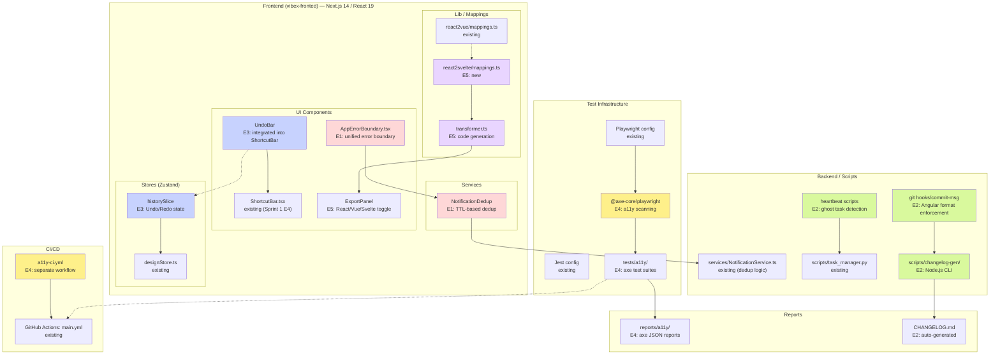

# Architecture Document — proposals-20260401-3 (Sprint 3)

**Project**: vibex  
**Date**: 2026-04-01  
**Agent**: Architect  
**Version**: v1.0

---

## 1. Tech Stack Decisions

### 1.1 New Dependencies (by Epic)

| Epic | New Dependency | Version | Justification |
|------|---------------|---------|---------------|
| E1 | None (reuse existing) | — | `services/NotificationService.ts` already implements TTL-based dedup; `components/common/AppErrorBoundary.tsx` to be created |
| E2 | `simple-git-hooks` + Node.js script | ^5.0.0 / builtin | commit-msg hook enforcement; changelog-gen as Node.js CLI script |
| E3 | None | — | Zustand stores already available; `historySlice` added as new slice in `src/stores/` |
| E4 | `@axe-core/playwright` | ^4.10.0 | WCAG 2.1 AA compliance scanning integrated with existing Playwright setup |
| E5 | `svelte/compiler` | ^4.x | Syntax validation for generated Svelte code; reuse existing `react2vue-mappings` pattern |

### 1.2 Existing Infrastructure Reused

| Component | Location | Reused By |
|-----------|----------|-----------|
| `services/NotificationService.ts` | `/root/.openclaw/vibex/services/` | E1 (dedup logic) |
| `src/lib/react2vue/` | `vibex-fronted/src/lib/react2vue/` | E5 (mapping pattern) |
| `components/guidance/ShortcutBar.tsx` | `vibex-fronted/src/components/` | E3 (UndoBar integration) |
| `src/stores/designStore.ts` | `vibex-fronted/src/stores/` | E3 (historySlice integration) |
| `scripts/task_manager.py` | `/root/.openclaw/vibex/scripts/` | E2 (ghost task detection) |
| Playwright setup | `vibex-fronted/` | E4 (axe-core integration) |

---

## 2. Architecture Diagram



---

## 3. API Definitions

### 3.1 E1 — NotificationDedup & AppErrorBoundary

#### NotificationDedup Class

```typescript
// File: vibex-fronted/src/services/NotificationDedup.ts (new)

export interface DedupEntry {
  taskId: string;
  timestamp: number;
}

export class NotificationDedup {
  private ttlMs: number;
  private cache: Map<string, DedupEntry>;

  constructor(ttlMs: number = 5 * 60 * 1000) {
    this.ttlMs = ttlMs;
    this.cache = new Map<string, DedupEntry>();
  }

  /**
   * Determine if a notification should be sent.
   * @param taskId - Unique task identifier
   * @param now - Current timestamp (ms), defaults to Date.now()
   * @returns true if notification should be sent, false if duplicate
   */
  shouldSend(taskId: string, now?: number): boolean;

  /**
   * Record that a notification was sent for this task.
   * @param taskId - Unique task identifier
   * @param timestamp - When sent (ms), defaults to Date.now()
   */
  mark(taskId: string, timestamp?: number): void;

  /**
   * Clear all entries (for testing).
   */
  clear(): void;

  /**
   * Get TTL window in milliseconds.
   */
  getTTL(): number;
}
```

#### AppErrorBoundary Component

```typescript
// File: vibex-fronted/src/components/common/AppErrorBoundary.tsx (new)

interface AppErrorBoundaryProps {
  /** Fallback UI component when error occurs */
  fallback?: React.ReactNode;
  /** Callback when error is caught */
  onError?: (error: Error, errorInfo: React.ErrorInfo) => void;
  /** Child components to wrap */
  children: React.ReactNode;
}

interface AppErrorBoundaryState {
  hasError: boolean;
  error: Error | null;
  errorId: string | null;
}

declare class AppErrorBoundary extends React.Component<AppErrorBoundaryProps, AppErrorBoundaryState> {
  static getDerivedStateFromError(error: Error): Partial<AppErrorBoundaryState>;
  componentDidCatch(error: Error, errorInfo: React.ErrorInfo): void;
  resetError(): void;
}

export default AppErrorBoundary;
// Default export — required for unified replacement verification
```

#### NotificationDedup Integration Point

```typescript
// Integration in vibex-fronted/src/components/common/NotificationTrigger.tsx (new)
// or inline in components that call NotificationService

import { NotificationDedup } from '@/services/NotificationDedup';

const dedup = new NotificationDedup(5 * 60 * 1000); // 5-min window per PRD F1.1

// Before sending notification:
if (dedup.shouldSend(taskId)) {
  await notificationService.send({ channel, text });
  dedup.mark(taskId);
}
```

---

### 3.2 E2 — detectGhostTasks, checkOutputExists, changelog-gen CLI

#### Ghost Task Detection Functions

```typescript
// File: scripts/heartbeat/ghost_detection.ts (new)

export interface TaskRecord {
  id: string;
  startedAt: number | null;
  completedAt: number | null;
  status: 'pending' | 'in-progress' | 'done' | 'failed' | 'skipped';
  output?: string;
}

export interface GhostTaskResult {
  taskId: string;
  type: 'ghost' | 'fake-done';
  reason: string;
  detectedAt: number;
}

/**
 * Detect ghost tasks: startedAt set + completedAt null + active > 60min.
 * @param tasks - Array of task records from task_manager.json
 * @param thresholdMs - Active threshold in ms (default: 60 * 60 * 1000)
 * @returns Array of ghost task results
 */
export function detectGhostTasks(
  tasks: TaskRecord[],
  thresholdMs: number = 60 * 60 * 1000
): GhostTaskResult[];

/**
 * Check if a done task has a real output file.
 * @param task - Task record with status='done'
 * @param outputDir - Base directory to check for output files
 * @returns true if output exists, false if fake-done
 */
export function checkOutputExists(task: TaskRecord, outputDir: string): boolean;

/**
 * Full heartbeat scan: ghost tasks + fake-done detection.
 * @param projectPath - Path to project with tasks.json
 * @returns Combined array of ghost + fake-done results
 */
export function heartbeatScan(projectPath: string): GhostTaskResult[];
```

#### changelog-gen CLI Interface

```typescript
// File: scripts/changelog-gen/bin/changelog-gen.ts (new, Node.js)

interface ChangelogGenOptions {
  /** Git ref to start from (tag or commit hash) */
  from: string;
  /** Git ref to end at (default: HEAD) */
  to?: string;
  /** Output file (default: stdout) */
  output?: string;
  /** Commit message format: 'angular' | 'conventional' (default: 'angular') */
  format?: 'angular' | 'conventional';
  /** Include unreleased section */
  unreleased?: boolean;
}

interface CommitEntry {
  type: 'feat' | 'fix' | 'docs' | 'style' | 'refactor' | 'test' | 'chore' | 'perf' | 'ci';
  scope?: string;
  message: string;
  hash: string;
  date: string;
}

interface ChangelogOutput {
  version?: string;
  date: string;
  entries: Record<string, CommitEntry[]>;
  totalCommits: number;
}

declare function changelogGen(options: ChangelogGenOptions): Promise<ChangelogOutput>;

// CLI usage:
// changelog-gen --from=v1.0 --to=HEAD --output=CHANGELOG.md
// changelog-gen --from=HEAD --unreleased
```

#### commit-msg Hook

```bash
# File: .git/hooks/commit-msg (managed by simple-git-hooks)
# Installation: npx simple-git-hooks add-commit-msg .git/hooks/commit-msg

# Validation: exit 0 = accept, exit 1 = reject
# Pattern: ^(feat|fix|docs|style|refactor|test|chore|perf|ci)(\([\w-]+\))?: .+
```

---

### 3.3 E3 — HistoryStack & historySlice

#### HistoryStack Class

```typescript
// File: vibex-fronted/src/lib/HistoryStack.ts (new)

export interface Operation {
  id: string;
  type: 'add' | 'delete' | 'edit' | 'move';
  targetId: string;
  timestamp: number;
  payload: Record<string, unknown>;  // before/after state snapshots
  metadata?: Record<string, unknown>;
}

export interface HistoryStackState {
  historyStack: Operation[];
  redoStack: Operation[];
  maxLength: number;
}

export class HistoryStack {
  private _history: Operation[] = [];
  private _redo: Operation[] = [];
  private _maxLength: number;

  constructor(maxLength: number = 50) {
    this._maxLength = maxLength;
  }

  /** Push a new operation onto the history stack */
  push(op: Omit<Operation, 'id' | 'timestamp'>): Operation;

  /** Pop and return the most recent operation (undo) */
  pop(): Operation | undefined;

  /** Peek at the top of history without removing */
  peek(): Operation | undefined;

  /** Peek at the top of redo stack without removing */
  peekRedo(): Operation | undefined;

  /** Move operation from redo to history (redo) */
  redo(): Operation | undefined;

  /** Clear the redo stack (called on new operation) */
  clearRedo(): void;

  /** Get all history operations (for debugging/display) */
  getHistory(): Operation[];

  /** Get all redo operations */
  getRedoStack(): Operation[];

  get historyStack(): Operation[];
  get redoStack(): Operation[];
  get maxLength(): number;
  get length(): number;
  get redoLength(): number;
}
```

#### historySlice (Zustand)

```typescript
// File: vibex-fronted/src/stores/historySlice.ts (new)

import { create } from 'zustand';
import { persist } from 'zustand/middleware';
import type { Operation } from '@/lib/HistoryStack';

interface HistorySlice {
  // State
  historyStack: Operation[];
  redoStack: Operation[];
  maxLength: number;

  // Actions
  pushOperation: (op: Omit<Operation, 'id' | 'timestamp'>) => void;
  undo: () => Operation | undefined;
  redo: () => Operation | undefined;
  clearHistory: () => void;
  clearRedo: () => void;

  // Selectors
  canUndo: () => boolean;
  canRedo: () => boolean;
  undoSteps: () => number;
  redoSteps: () => number;
}

export const useHistorySlice = create<HistorySlice>()(
  persist(
    (set, get) => ({
      historyStack: [],
      redoStack: [],
      maxLength: 50,

      pushOperation: (op) => {
        const { maxLength, historyStack } = get();
        const operation: Operation = {
          ...op,
          id: `${Date.now()}-${Math.random().toString(36).slice(2)}`,
          timestamp: Date.now(),
        };

        let newStack = [...historyStack, operation];
        if (newStack.length > maxLength) {
          newStack = newStack.slice(newStack.length - maxLength);
        }

        set({ historyStack: newStack, redoStack: [] });
      },

      undo: () => {
        const { historyStack, redoStack } = get();
        if (historyStack.length === 0) return undefined;

        const [last, ...rest] = historyStack;
        set({ historyStack: rest, redoStack: [last, ...redoStack] });
        return last;
      },

      redo: () => {
        const { historyStack, redoStack } = get();
        if (redoStack.length === 0) return undefined;

        const [first, ...rest] = redoStack;
        const { maxLength } = get();
        let newHistory = [...historyStack, first];
        if (newHistory.length > maxLength) {
          newHistory = newHistory.slice(newHistory.length - maxLength);
        }

        set({ historyStack: newHistory, redoStack: rest });
        return first;
      },

      clearHistory: () => set({ historyStack: [] }),
      clearRedo: () => set({ redoStack: [] }),

      canUndo: () => get().historyStack.length > 0,
      canRedo: () => get().redoStack.length > 0,
      undoSteps: () => get().historyStack.length,
      redoSteps: () => get().redoStack.length,
    }),
    {
      name: 'history-slice',
      partialize: (state) => ({
        historyStack: state.historyStack,
        redoStack: state.redoStack,
        maxLength: state.maxLength,
      }),
    }
  )
);
```

#### UndoBar Component API (extends ShortcutBar)

```typescript
// File: vibex-fronted/src/components/guidance/UndoBar.tsx (new, integrated into ShortcutBar)

interface UndoBarProps {
  /** Data-testid for E2E testing */
  'data-testid'?: string;
}

interface UndoButtonProps {
  'data-testid'?: string;
  disabled?: boolean;
  onClick?: () => void;
}

interface RedoButtonProps {
  'data-testid'?: string;
  disabled?: boolean;
  onClick?: () => void;
}

interface UndoBadgeProps {
  count: number;
  'data-testid'?: string;
}
```

---

### 3.4 E4 — AxeBuilder Configuration & A11y Scan Results

#### AxeBuilder Configuration

```typescript
// File: tests/a11y/axe.config.ts (new)

import AxeBuilder from '@axe-core/playwright';

export interface A11yConfig {
  /** axe-core reporter format */
  reporter: 'v1' | 'v2' | 'json';
  /** WCAG level to check */
  wcagLevel: 'wcag2a' | 'wcag2aa' | 'wcag2aaa';
  /** Impact levels that block CI */
  blockingImpacts: Array<'critical' | 'serious'>;
  /** Additional rules to enable/disable */
  rules?: Record<string, { enabled: boolean; severity?: string }>;
  /** Element selectors to exclude from scan */
  exclude?: string[];
  /** Timeout for scan in ms */
  timeout?: number;
}

export const defaultA11yConfig: A11yConfig = {
  reporter: 'json',
  wcagLevel: 'wcag2aa',
  blockingImpacts: ['critical', 'serious'],
  rules: {
    'color-contrast': { enabled: true },
    'image-alt': { enabled: true },
    'button-name': { enabled: true },
    'link-name': { enabled: true },
    'label': { enabled: true },
    'aria-required-attr': { enabled: true },
    'region': { enabled: true },
  },
  exclude: ['[data-testid="debug-panel"]'],
  timeout: 30000,
};

/**
 * Create AxeBuilder instance for a given Playwright page.
 */
export function createAxeBuilder(page: Page, config?: Partial<A11yConfig>): AxeBuilder {
  const cfg = { ...defaultA11yConfig, ...config };
  return new AxeBuilder({ page })
    .withTags([cfg.wcagLevel])
    .exclude(cfg.exclude ?? [])
    .options({ reporter: cfg.reporter });
}
```

#### A11y Scan Results Schema

```typescript
// File: tests/a11y/types.ts (new)

export interface AxeViolation {
  id: string;           // e.g. 'color-contrast', 'image-alt'
  impact: 'critical' | 'serious' | 'moderate' | 'minor';
  description: string;
  help: string;
  helpUrl: string;
  nodes: AxeViolationNode[];
  tags: string[];        // e.g. ['wcag2aa', 'wcag2aaa', 'ACT']
}

export interface AxeViolationNode {
  html: string;
  target: string[];      // CSS selectors
  impact: AxeViolation['impact'];
  any: Array<{
    id: string;
    data?: unknown;
    relatedNodes?: Array<{ html: string; target: string[] }>;
  }>;
  all: AxeViolation['any'];
  none: AxeViolation['any'];
}

export interface A11yScanResult {
  url: string;
  timestamp: string;     // ISO 8601
  pageTitle: string;
  violations: AxeViolation[];
  summary: {
    totalViolations: number;
    critical: number;
    serious: number;
    moderate: number;
    minor: number;
    passes: number;
  };
  metadata: {
    project: string;
    epic: 'E4';
    buildId?: string;
    environment: 'local' | 'ci' | 'production';
  };
}
```

---

### 3.5 E5 — REACT_SVELTE_MAPPINGS & reactComponentToSvelte

#### REACT_SVELTE_MAPPINGS Interface

```typescript
// File: vibex-fronted/src/lib/react2svelte/mappings.ts (new)

export type SvelteEventSyntax = 'on:click' | 'on:input' | 'on:change' | 'on:submit' | 'on:keydown';

export interface ComponentMapping {
  svelteComponent: string;
  props: {
    // React prop → Svelte prop mapping
    [reactProp: string]: string;
  };
  eventSyntax?: SvelteEventSyntax | 'bind:value';
  children?: '<slot />' | '<slot name="default" />';
  classMapping?: {
    [reactClassName: string]: string;  // className → class
  };
  styleMapping?: 'inline' | 'class-based';
  notes?: string;
}

export const REACT_SVELTE_MAPPINGS: Readonly<Record<string, ComponentMapping>> = {
  Button: {
    svelteComponent: 'VibeXButton',
    props: {
      variant: 'type',
      size: 'size',
      disabled: 'disabled',
      onClick: 'on:click',
    },
    eventSyntax: 'on:click',
    classMapping: { 'btn-primary': 'btn-primary', 'btn-secondary': 'btn-secondary' },
    notes: 'React onClick → Svelte on:click',
  },
  Input: {
    svelteComponent: 'VibeXInput',
    props: {
      placeholder: 'placeholder',
      disabled: 'disabled',
      value: 'bind:value',
    },
    eventSyntax: 'bind:value',
    notes: 'React value + onChange → Svelte bind:value',
  },
  Card: {
    svelteComponent: 'VibeXCard',
    props: {
      title: 'title',
      footer: 'footer',
    },
    children: '<slot />',
    notes: 'React children → Svelte <slot />',
  },
} as const;

export type ReactComponentName = keyof typeof REACT_SVELTE_MAPPINGS;
```

#### reactComponentToSvelte Function

```typescript
// File: vibex-fronted/src/lib/react2svelte/transformer.ts (new)

import type { ReactComponentName } from './mappings';

export interface TransformResult {
  /** Transformed Svelte SFC code */
  svelteCode: string;
  /** Transformation warnings (unsupported patterns) */
  warnings: string[];
  /** Whether full transformation was supported */
  isSupported: boolean;
  /** Component name extracted */
  componentName?: string;
}

export interface TransformOptions {
  /** Source component name */
  componentName: ReactComponentName;
  /** Svelte version target (default: '4') */
  svelteVersion?: '3' | '4';
  /** Include type annotations */
  includeTypes?: boolean;
  /** Use scoped styles */
  scopedStyles?: boolean;
}

/**
 * Transform a React JSX component to a Svelte single-file component.
 *
 * Transformations applied:
 * - className → class
 * - onClick/onChange → on:click/on:change
 * - value + onChange → bind:value
 * - {children} → <slot />
 * - style={{ x }} → style="x"
 * - React imports → removed
 * - JSX comments → HTML comments
 *
 * @param reactCode - Source React JSX code
 * @param options - Transform options
 * @returns TransformResult with svelteCode, warnings, isSupported
 */
export function reactComponentToSvelte(
  reactCode: string,
  options: TransformOptions
): TransformResult;

/**
 * Generate a complete Svelte SFC (.svelte file) from React code.
 *
 * @param reactCode - Source React JSX code
 * @param componentName - Name of the component
 * @returns Complete .svelte file content
 */
export function generateSvelteSFC(
  reactCode: string,
  componentName: ReactComponentName
): string;
```

---

## 4. Data Model

### 4.1 E1 — NotificationDedup TTL Map

```
In-Memory Map (per process)
└── key: string (task_id)
    └── value: { taskId: string, timestamp: number (ms) }

Persistence: None (in-memory only, reset on process restart)
TTL Window: 5 minutes (configurable, default 5 * 60 * 1000 ms)
Cleanup: Lazy — checked on shouldSend(), expired entries skipped
```

### 4.2 E2 — task_manager.json Schema

```typescript
// Schema for /root/.openclaw/vibex/scripts/task_manager.py → task_manager.json

interface TaskStage {
  agent: string;
  status: 'pending' | 'in-progress' | 'done' | 'failed' | 'skipped';
  task: string;
  startedAt: string | null;   // ISO 8601
  completedAt: string | null; // ISO 8601
  dependsOn?: string[];
  output?: string;
  constraints?: string[];
  verification?: {
    command?: string;
    checks?: string[];
  };
  logs?: Array<{
    time: string;
    event: string;
  }>;
  ghost?: boolean;             // E2: ghost task flag
}

interface TaskProject {
  project: string;
  goal: string;
  created: string;
  updated: string;
  status: 'active' | 'completed' | 'blocked';
  mode: 'dag';
  workspace: string;
  _revision: number;
  stages: Record<string, TaskStage>;
}

// Ghost Task Detection Rules:
// 1. ghost: startedAt != null AND completedAt == null AND (now - startedAt) > 60min
// 2. fake-done: status == 'done' AND output path does not exist
```

### 4.3 E3 — historySlice State

```typescript
// Persisted in localStorage under key 'history-slice'

interface HistoryState {
  historyStack: Operation[];
  redoStack: Operation[];
  maxLength: 50;
}

interface Operation {
  id: string;           // `${Date.now()}-${randomId}`
  type: 'add' | 'delete' | 'edit' | 'move';
  targetId: string;     // ID of the affected node/component
  timestamp: number;   // Unix timestamp (ms)
  payload: {
    before: Record<string, unknown>;  // State before operation
    after: Record<string, unknown>;   // State after operation
  };
  metadata?: {
    description?: string;
    source?: 'user' | 'shortcut' | 'toolbar';
  };
}

// Persistence: Zustand persist middleware → localStorage
// Redo stack cleared on: new operation, undo limit reached
```

### 4.4 E4 — a11y Report JSON Schema

```json
{
  "$schema": "https://json-schema.org/draft/2020-12/a11y-report",
  "type": "object",
  "properties": {
    "url": { "type": "string", "format": "uri" },
    "timestamp": { "type": "string", "format": "date-time" },
    "pageTitle": { "type": "string" },
    "violations": {
      "type": "array",
      "items": {
        "type": "object",
        "properties": {
          "id": { "type": "string" },
          "impact": { "enum": ["critical", "serious", "moderate", "minor"] },
          "description": { "type": "string" },
          "help": { "type": "string" },
          "helpUrl": { "type": "string", "format": "uri" },
          "nodes": {
            "type": "array",
            "items": {
              "properties": {
                "html": { "type": "string" },
                "target": { "type": "array", "items": { "type": "string" } },
                "impact": { "type": "string" }
              },
              "required": ["html", "target", "impact"]
            }
          },
          "tags": { "type": "array", "items": { "type": "string" } }
        },
        "required": ["id", "impact", "description", "help", "nodes"]
      }
    },
    "summary": {
      "type": "object",
      "properties": {
        "totalViolations": { "type": "integer" },
        "critical": { "type": "integer" },
        "serious": { "type": "integer" },
        "moderate": { "type": "integer" },
        "minor": { "type": "integer" },
        "passes": { "type": "integer" }
      }
    },
    "metadata": {
      "properties": {
        "project": { "type": "string" },
        "epic": { "const": "E4" },
        "buildId": { "type": "string" },
        "environment": { "enum": ["local", "ci", "production"] }
      }
    }
  },
  "required": ["url", "timestamp", "violations", "summary", "metadata"]
}
```

### 4.5 E5 — React2Svelte Mapping Table Format

```typescript
// File: vibex-fronted/src/lib/react2svelte/mappings.ts

// Mapping table format (per component):
//
// ComponentName: string
//   ├─ svelteComponent: string        — target Svelte component name
//   ├─ props: Record<string, string>  — ReactProp → SvelteProp
//   ├─ eventSyntax: string           — how events are bound
//   ├─ children: string              — how children are handled
//   ├─ classMapping: Record          — className → class mapping
//   └─ notes: string                 — transformation notes

// Full mapping table (MVP phase):
const MAPPINGS = {
  Button: {
    svelteComponent: 'VibeXButton',
    props: { variant: 'type', size: 'size', disabled: 'disabled', onClick: 'on:click' },
    eventSyntax: 'on:click',
    children: null,
    classMapping: { 'btn-primary': 'btn-primary', 'btn-secondary': 'btn-secondary' },
    styleMapping: 'class-based',
    notes: 'Direct event mapping: onClick → on:click',
  },
  Input: {
    svelteComponent: 'VibeXInput',
    props: { placeholder: 'placeholder', disabled: 'disabled', value: 'bind:value' },
    eventSyntax: 'bind:value',
    children: null,
    classMapping: {},
    styleMapping: 'class-based',
    notes: 'Controlled → reactive: value + onChange → bind:value',
  },
  Card: {
    svelteComponent: 'VibeXCard',
    props: { title: 'title', footer: 'footer' },
    eventSyntax: null,
    children: '<slot />',
    classMapping: {},
    styleMapping: 'class-based',
    notes: 'children → Svelte <slot />',
  },
};
```

---

## 5. Testing Strategy

### 5.1 Test Framework

| Layer | Framework | Scope |
|-------|-----------|-------|
| Unit tests | **Jest** | Pure functions, HistoryStack, NotificationDedup, mappings |
| Component tests | **Jest + React Testing Library** | AppErrorBoundary, UndoBar |
| E2E tests | **Playwright** | Ctrl+Z/Y shortcuts, framework toggle, axe scans |
| Accessibility | **Playwright + @axe-core/playwright** | E4 a11y tests |
| CLI tests | **Jest + exec** | changelog-gen, commit-msg hook |
| Integration | **Playwright** | Full heartbeat scan, ghost task detection |

### 5.2 Coverage Requirements

| Epic | Logic Coverage | UI/Component Coverage | E2E Coverage |
|------|---------------|----------------------|-------------|
| E1 | ≥ 80% (NotificationDedup class) | AppErrorBoundary render/error states | CLI dedup behavior |
| E2 | ≥ 80% (detectGhostTasks, checkOutputExists, changelog-gen) | N/A | commit-msg hook |
| E3 | ≥ 80% (HistoryStack, historySlice) | UndoBar disabled/enabled states | Ctrl+Z/Y E2E |
| E4 | N/A | N/A | Homepage/Canvas/Export axe scans |
| E5 | ≥ 80% (transformer, mappings) | Export panel framework toggle | Svelte component render |

### 5.3 Key Test Cases by Epic

#### E1: NotificationDedup

```typescript
// vibex-fronted/src/services/__tests__/NotificationDedup.test.ts

describe('NotificationDedup', () => {
  let dedup: NotificationDedup;

  beforeEach(() => { dedup = new NotificationDedup(5 * 60 * 1000); });

  test('same task_id within 5min → shouldSend returns false', () => {
    dedup.mark('task-123', 1000);
    expect(dedup.shouldSend('task-123', 1000 + 2 * 60 * 1000)).toBe(false);
  });

  test('same task_id after 5min → shouldSend returns true', () => {
    dedup.mark('task-123', 1000);
    expect(dedup.shouldSend('task-123', 1000 + 6 * 60 * 1000)).toBe(true);
  });

  test('different task_ids do not block each other', () => {
    dedup.mark('task-A', 1000);
    expect(dedup.shouldSend('task-B', 1000)).toBe(true);
  });

  test('mark() updates timestamp', () => {
    dedup.mark('task-123', 1000);
    dedup.mark('task-123', 2000);
    expect(dedup.shouldSend('task-123', 1000 + 4 * 60 * 1000)).toBe(false);
  });

  test('clear() resets all entries', () => {
    dedup.mark('task-123', 1000);
    dedup.clear();
    expect(dedup.shouldSend('task-123', 1000)).toBe(true);
  });
});
```

#### E1: AppErrorBoundary

```typescript
// vibex-fronted/src/components/common/__tests__/AppErrorBoundary.test.tsx

describe('AppErrorBoundary', () => {
  test('renders children when no error', () => {
    render(<AppErrorBoundary><div data-testid="child">test</div></AppErrorBoundary>);
    expect(screen.getByTestId('child')).toBeVisible();
  });

  test('shows fallback UI on error', async () => {
    const ThrowError = () => { throw new Error('Test error'); };
    render(<AppErrorBoundary><ThrowError /></AppErrorBoundary>);
    expect(screen.getByTestId('error-fallback')).toBeVisible();
  });

  test('generates unique error ID', async () => {
    render(<AppErrorBoundary><ErrorComponent /></AppErrorBoundary>);
    const errorId = screen.getByTestId('error-fallback')?.dataset?.errorId;
    expect(errorId).toMatch(/^err-\d+-[a-z0-9]+$/);
  });

  test('resetError() recovers from error state', async () => {
    const { resetError } = renderWithReset(<AppErrorBoundary><ErrorComponent /></AppErrorBoundary>);
    await act(async () => { resetError(); });
    // Children should re-render fresh
    expect(screen.getByTestId('child')).toBeVisible();
  });
});
```

#### E2: Ghost Task Detection

```typescript
// scripts/heartbeat/__tests__/ghost_detection.test.ts

describe('detectGhostTasks', () => {
  test('active > 60min with no completion → ghost', () => {
    const tasks = [
      { id: 't1', startedAt: Date.now() - 65 * 60 * 1000, completedAt: null, status: 'in-progress' as const },
    ];
    const results = detectGhostTasks(tasks);
    expect(results).toHaveLength(1);
    expect(results[0].type).toBe('ghost');
    expect(results[0].taskId).toBe('t1');
  });

  test('active < 60min → not ghost', () => {
    const tasks = [
      { id: 't2', startedAt: Date.now() - 30 * 60 * 1000, completedAt: null, status: 'in-progress' as const },
    ];
    expect(detectGhostTasks(tasks)).toHaveLength(0);
  });

  test('completed task → not ghost', () => {
    const tasks = [
      { id: 't3', startedAt: Date.now() - 120 * 60 * 1000, completedAt: Date.now() - 60 * 60 * 1000, status: 'done' as const },
    ];
    expect(detectGhostTasks(tasks)).toHaveLength(0);
  });

  test('no startedAt → not ghost', () => {
    const tasks = [
      { id: 't4', startedAt: null, completedAt: null, status: 'pending' as const },
    ];
    expect(detectGhostTasks(tasks)).toHaveLength(0);
  });
});

describe('checkOutputExists', () => {
  const outputDir = '/tmp/test-outputs';

  beforeAll(() => {
    fs.mkdirSync(outputDir, { recursive: true });
    fs.writeFileSync(path.join(outputDir, 'real-task.txt'), 'done');
  });

  afterAll(() => {
    fs.rmSync(outputDir, { recursive: true, force: true });
  });

  test('done task with existing output → true', () => {
    const task = { id: 'real-task', status: 'done' as const, output: path.join(outputDir, 'real-task.txt') };
    expect(checkOutputExists(task, outputDir)).toBe(true);
  });

  test('done task without output → false (fake-done)', () => {
    const task = { id: 'fake-task', status: 'done' as const, output: path.join(outputDir, 'missing.txt') };
    expect(checkOutputExists(task, outputDir)).toBe(false);
  });
});
```

#### E3: HistoryStack & Undo E2E

```typescript
// vibex-fronted/src/lib/__tests__/HistoryStack.test.ts

describe('HistoryStack', () => {
  let stack: HistoryStack;

  beforeEach(() => { stack = new HistoryStack(50); });

  test('push adds operation to stack', () => {
    stack.push({ type: 'add', targetId: 'node-1', payload: {} });
    expect(stack.length).toBe(1);
  });

  test('pop removes and returns most recent', () => {
    stack.push({ type: 'add', targetId: 'node-1', payload: {} });
    stack.push({ type: 'edit', targetId: 'node-2', payload: {} });
    const op = stack.pop();
    expect(op?.targetId).toBe('node-2');
    expect(stack.length).toBe(1);
  });

  test('redo moves operation from redo to history', () => {
    stack.push({ type: 'add', targetId: 'node-1', payload: {} });
    stack.pop(); // undo
    stack.redo(); // redo
    expect(stack.historyStack.length).toBe(1);
    expect(stack.redoStack.length).toBe(0);
  });

  test('maxLength enforced: 60 pushes keeps last 50', () => {
    for (let i = 0; i < 60; i++) {
      stack.push({ type: 'add', targetId: `node-${i}`, payload: {} });
    }
    expect(stack.length).toBe(50);
    expect(stack.historyStack[0].targetId).toBe('node-10');
  });

  test('new operation clears redo stack', () => {
    stack.push({ type: 'add', targetId: 'node-1', payload: {} });
    stack.pop(); // undo
    expect(stack.redoLength).toBe(1);
    stack.push({ type: 'add', targetId: 'node-2', payload: {} }); // new op
    expect(stack.redoLength).toBe(0);
  });
});

// E2E: Playwright tests/a11y/undo-shortcut.spec.ts
describe('Undo/Redo E2E', () => {
  test('Ctrl+Z triggers undo and removes node', async ({ page }) => {
    await page.goto('/canvas');
    const beforeCount = await page.locator('[data-testid="flow-node"]').count();
    await page.click('[data-testid="add-node-btn"]');
    const afterAdd = await page.locator('[data-testid="flow-node"]').count();
    expect(afterAdd).toBe(beforeCount + 1);

    await page.keyboard.press('Control+z');
    await page.waitForTimeout(200);
    const afterUndo = await page.locator('[data-testid="flow-node"]').count();
    expect(afterUndo).toBe(beforeCount);
  });

  test('Ctrl+Y redoes undone operation', async ({ page }) => {
    await page.goto('/canvas');
    await page.click('[data-testid="add-node-btn"]');
    await page.keyboard.press('Control+z'); // undo
    const afterUndo = await page.locator('[data-testid="flow-node"]').count();
    await page.keyboard.press('Control+y'); // redo
    await page.waitForTimeout(200);
    const afterRedo = await page.locator('[data-testid="flow-node"]').count();
    expect(afterRedo).toBe(afterUndo + 1);
  });

  test('UndoBar shows correct step count', async ({ page }) => {
    await page.goto('/canvas');
    await page.click('[data-testid="add-node-btn"]');
    await page.click('[data-testid="add-node-btn"]');
    const badge = await page.textContent('[data-testid="undo-badge"]');
    expect(parseInt(badge ?? '0')).toBe(2);
  });
});
```

#### E4: Axe Accessibility

```typescript
// tests/a11y/homepage.spec.ts

import AxeBuilder from '@axe-core/playwright';

describe('Homepage Accessibility', () => {
  test('no Critical/Serious violations on homepage', async ({ page }) => {
    await page.goto('/');
    const results = await new AxeBuilder({ page })
      .withTags(['wcag2aa'])
      .analyze();

    const criticalSerious = results.violations.filter(
      (v) => v.impact === 'critical' || v.impact === 'serious'
    );
    expect(criticalSerious).toHaveLength(0);
  });
});

// tests/a11y/canvas.spec.ts

describe('Canvas Accessibility', () => {
  test('no Critical/Serious violations on canvas', async ({ page }) => {
    await page.goto('/canvas');
    await new AxeBuilder({ page })
      .include('[data-testid="flow-node"]')
      .analyze();
    // Assert via fixture - CI gate checks critical count
  });
});
```

#### E5: React2Svelte Transformer

```typescript
// vibex-fronted/src/lib/react2svelte/__tests__/transformer.test.ts

describe('reactComponentToSvelte', () => {
  test('className → class', () => {
    const result = reactComponentToSvelte('<div className="foo">hi</div>', { componentName: 'Card' });
    expect(result.svelteCode).toContain('class="foo"');
  });

  test('onClick → on:click', () => {
    const result = reactComponentToSvelte('<button onClick={handleClick}>Click</button>', { componentName: 'Button' });
    expect(result.svelteCode).toContain('on:click=');
  });

  test('children → <slot />', () => {
    const result = reactComponentToSvelte('<Card>{children}</Card>', { componentName: 'Card' });
    expect(result.svelteCode).toContain('<slot />');
  });

  test('value + onChange → bind:value', () => {
    const result = reactComponentToSvelte('<Input value={val} onChange={setVal} />', { componentName: 'Input' });
    expect(result.svelteCode).toContain('bind:value');
  });

  test('style={{ x }} → style="x"', () => {
    const result = reactComponentToSvelte('<div style={{ width: "100px" }}>test</div>', { componentName: 'Card' });
    expect(result.svelteCode).toContain('style="');
  });

  test('unsupported component → warnings, pass-through', () => {
    const result = reactComponentToSvelte('<Unsupported />', { componentName: 'Unsupported' as any });
    expect(result.isSupported).toBe(false);
    expect(result.warnings.length).toBeGreaterThan(0);
  });
});

describe('Svelte SFC generation', () => {
  test('generates valid Svelte SFC structure', () => {
    const code = generateSvelteSFC('<Button onClick={f}>Hi</Button>', 'Button');
    expect(code).toContain('<script>');
    expect(code).toContain('<template>');
    expect(code).toContain('<style scoped>');
    expect(code).toContain('<Button');
    expect(code).toContain('on:click');
  });
});
```

---

## 6. ADR Sections

### ADR-E3-001: Undo/Redo Implementation Approach

**Status**: Proposed

**Context**:
We need to implement Undo/Redo for canvas operations (add/delete/edit/move nodes). Two main approaches exist: **Command Pattern** (store actions) and **Snapshot Pattern** (store full state copies). We need to choose the right approach for vibex's React Flow canvas.

**Options**:

| Option | Approach | Pros | Cons |
|--------|----------|------|------|
| A | **Command Pattern** | Memory-efficient, reversible operations, clear semantics | Requires reverse-operation logic per action type |
| B | **Snapshot Pattern** | Simple to implement, any state change is reversible | Memory-heavy (full copy per operation), large states bloat memory |
| C | **Hybrid (selected)** | Commands for reversible ops, snapshots only for complex structural changes | More complex implementation |

**Decision**: Option A — **Command Pattern**

**Rationale**:
1. Canvas nodes have well-defined CRUD semantics — reverse operations are straightforward
2. React Flow state is already structured — generating reverse deltas is cheap
3. Snapshot would mean storing potentially large JSON states (UI pages, domain models) per operation — 50 ops × ~10KB = 500KB vs command ops × ~200 bytes
4. Zustand `persist` middleware naturally supports partial state updates — ideal for command-based history
5. Command pattern aligns with existing `Operation` type in `designStore.ts`

**Consequences**:
- ✅ Memory efficient (O(1) per operation regardless of state size)
- ✅ Clear operation semantics for debugging
- ✅ Easy to extend with new operation types
- ❌ Must implement reverse operation logic for each type
- ❌ Complex structural changes (e.g., bulk operations) need careful handling

**Implementation**: `HistoryStack` class wrapping operation objects with `before`/`after` snapshots. Max 50 operations, FIFO eviction.

---

### ADR-E4-001: axe-core CI Integration Approach

**Status**: Proposed

**Context**:
We need to add axe-core accessibility testing to CI. Two options exist: a **separate `a11y-ci.yml` workflow** or **merged with the main CI workflow**.

**Options**:

| Option | Approach | Pros | Cons |
|--------|----------|------|------|
| A | **Separate workflow (`a11y-ci.yml`)** | Independent scheduling, faster main CI, clear responsibility | Duplicated setup, harder to correlate with deploys |
| B | **Merged into main CI** | Single source of truth, simpler setup | Slower CI, axe failures block all merges |
| C | **Separate job in main workflow (selected)** | Best of both — same workflow, separate job | Slightly more complex config |

**Decision**: Option C — **Separate job in main `ci.yml`, but `a11y-ci.yml` for parallel execution**

**Rationale**:
1. a11y scanning is slow (~30s per page) — running it as a separate workflow allows parallel execution with main CI
2. axe-core results must be CI-blocking (Critical/Serious → failure) per PRD requirements
3. Separate workflow file (`a11y-ci.yml`) with `workflow_run` trigger keeps main CI fast while ensuring a11y gates merges
4. Results saved to `reports/a11y/` for historical tracking

**Consequences**:
- ✅ Main CI unaffected (fast feedback loop)
- ✅ a11y tests run in parallel, no wasted time
- ✅ Critical violations always block merge
- ❌ Two workflow files to maintain
- ❌ Requires `workflow_run` or manual trigger configuration

**CI Flow**:
```
PR opened
  ├── main.yml → lint, test, build (fast gate, ~2min)
  └── a11y-ci.yml → axe scans on Homepage/Canvas/Export (~2min)
       └── If Critical violations → workflow fails → PR blocked
```

---

## 7. File Structure

```
proposals-20260401-3/
├── specs/
│   ├── e1-proposal-dedup-eb.md      (existing)
│   ├── e2-heartbeat-changelog.md    (existing)
│   ├── e3-undo-redo.md              (existing)
│   ├── e4-accessibility.md          (existing)
│   └── e5-svelte-export.md          (existing)
└── architecture.md                   (this file)

### E1: proposal-dedup + ErrorBoundary
vibex-fronted/src/
├── components/common/
│   ├── AppErrorBoundary.tsx         [NEW]
│   ├── AppErrorBoundary.module.css  [NEW]
│   └── __tests__/
│       └── AppErrorBoundary.test.tsx [NEW]
├── services/
│   ├── NotificationDedup.ts        [NEW]
│   └── __tests__/
│       └── NotificationDedup.test.ts [NEW]

### E2: heartbeat + changelog automation
scripts/
├── heartbeat/
│   ├── ghost_detection.ts          [NEW]
│   ├── heartbeat_scanner.py        [NEW — integrates with task_manager.py]
│   └── __tests__/
│       └── ghost_detection.test.ts  [NEW]
├── changelog-gen/
│   ├── bin/
│   │   └── changelog-gen.ts        [NEW — Node.js CLI]
│   ├── src/
│   │   ├── parser.ts                [NEW]
│   │   ├── formatter.ts             [NEW]
│   │   └── __tests__/              [NEW]
│   └── package.json                 [NEW]
├── task_manager.py                  [MODIFY — add ghost detection calls]
├── .git/
│   └── hooks/
│       └── commit-msg               [MANAGED by simple-git-hooks]

package.json (root)                   [MODIFY — add simple-git-hooks]

### E3: Undo/Redo
vibex-fronted/src/
├── lib/
│   ├── HistoryStack.ts              [NEW]
│   └── __tests__/
│       └── HistoryStack.test.ts     [NEW]
├── stores/
│   └── historySlice.ts              [NEW]
├── components/
│   ├── guidance/
│   │   ├── UndoBar.tsx              [NEW]
│   │   ├── UndoBar.module.css       [NEW]
│   │   ├── ShortcutBar.tsx          [MODIFY — integrate UndoBar]
│   │   └── ShortcutBar.module.css  [MODIFY]
│   └── canvas/
│       ├── CanvasPage.tsx           [MODIFY — keyboard listener]
│       └── __tests__/
│           └── CanvasPage.test.tsx [MODIFY — add undo/redo tests]

### E4: Accessibility
vibex-fronted/
├── tests/
│   └── a11y/
│       ├── axe.config.ts            [NEW]
│       ├── types.ts                 [NEW]
│       ├── homepage.spec.ts         [NEW]
│       ├── canvas.spec.ts           [NEW]
│       ├── export.spec.ts           [NEW]
│       └── __tests__/
│           └── axe-results.test.ts  [NEW]
├── reports/
│   └── a11y/                        [OUTPUT directory]
└── .github/
    └── workflows/
        └── a11y-ci.yml             [NEW — separate workflow]

### E5: Svelte Export
vibex-fronted/src/
├── lib/
│   ├── react2svelte/
│   │   ├── mappings.ts              [NEW]
│   │   ├── transformer.ts           [NEW]
│   │   ├── __tests__/
│   │   │   ├── mappings.test.ts      [NEW]
│   │   │   │   └── transformer.test.ts [NEW]
│   │   └── index.ts                 [NEW]
│   └── react2vue/                   [EXISTING — reference pattern]
├── components/
│   └── export/
│       ├── ExportPanel.tsx          [MODIFY — add Svelte toggle]
│       ├── FrameworkToggle.tsx      [NEW]
│       └── __tests__/
│           ├── ExportPanel.test.tsx [MODIFY]
│           └── FrameworkToggle.test.tsx [NEW]

package.json (frontend)               [MODIFY — add svelte package]
```

---

## 8. Performance Impact Assessment

### 8.1 E1 — NotificationDedup

| Metric | Impact | Assessment |
|--------|--------|------------|
| Memory | O(n) where n = concurrent active task_ids | ✅ Negligible (Map with ~100 entries max) |
| CPU | O(1) per shouldSend() | ✅ Negligible |
| Latency | < 1ms per notification check | ✅ Unmeasurable |
| Persistence | None (in-memory) | ⚠️ No cross-process dedup — acceptable for CLI use |

**Note**: The existing `NotificationService.ts` already has file-backed caching. E1 extends this with in-process dedup for faster CLI path. No cross-process state impact.

### 8.2 E2 — changelog-gen CLI

| Metric | Impact | Assessment |
|--------|--------|------------|
| Execution time | O(c) where c = commit count | ✅ 1000 commits < 5s (per PRD non-functional requirement) |
| Memory | O(c) for commit parsing | ⚠️ ~10MB for 1000 commits — acceptable |
| Git operations | `git log --format` only (no checkout) | ✅ Read-only, safe |
| Heartbeat scan | O(t) where t = active task count | ✅ < 1s for typical 10-20 active tasks |

**CLI parallelization**: `changelog-gen` can be run as a separate `workflow_dispatch` job or `workflow_run` triggered workflow, ensuring it doesn't block main CI.

### 8.3 E3 — Undo/Redo

| Metric | Impact | Assessment |
|--------|--------|------------|
| Memory | O(50 × ops) ≈ O(50 × ~200B) = ~10KB | ✅ Negligible |
| localStorage | historySlice persisted on every operation | ⚠️ ~10KB per 50 ops — acceptable |
| Persist middleware | Triggers on every push | ⚠️ Potential re-render on state change → mitigated by batching via Zustand |
| Undo/Redo execution | O(1) pop + re-render | ✅ Instant |
| Keyboard listener | Single `keydown` listener on canvas | ✅ No measurable impact |

**Mitigation**: historySlice uses `partialize` to only persist essential state (operations, redoStack, maxLength), excluding transient UI state.

### 8.4 E4 — axe-core Accessibility

| Metric | Impact | Assessment |
|--------|--------|------------|
| Test execution time | ~30s per page × 3 pages = ~90s | ⚠️ **Significant** — separate workflow |
| CI blocking | Separate workflow, non-blocking on main CI | ✅ Main CI unaffected |
| Memory | axe-core loads DOM → ~50-100MB per scan | ✅ Playwright handles cleanup |
| Parallel execution | axe scans on 3 pages can run in parallel | ✅ `Promise.all()` in CI job |

**Mitigation**: a11y-ci.yml runs as a `workflow_run` triggered workflow, executing in parallel with main CI. Only Critical/Serious violations block merges.

### 8.5 E5 — Svelte Export

| Metric | Impact | Assessment |
|--------|--------|------------|
| Mapping table | Static JSON, ~2KB | ✅ Negligible |
| Transformer execution | O(n) where n = component size | ✅ < 50ms for typical Button/Input/Card |
| Svelte compiler check | Loads `svelte/compiler` on demand | ✅ Not bundled — only used in tests |
| Bundle size | `@axe-core/playwright` adds ~1MB | ✅ Only in test environment |

---

## 9. Risk Register

| Risk | Probability | Impact | Mitigation |
|------|-------------|--------|------------|
| Svelte mapping quality for complex components | Medium | Medium | MVP: Button/Input/Card only; complex patterns → warning |
| axe-core false positives causing CI instability | Low | Medium | Only Critical/Serious blocking; moderate/minor logged |
| Undo/Redo conflicts with concurrent React Flow updates | Low | High | HistoryStack is single-source; React Flow `onNodesChange` guard |
| changelog-gen fails on non-Angular commits | Medium | Low | commit-msg hook enforced first; hook validates before commit |
| Ghost task detection edge cases (null timestamps) | Low | Low | Explicit null checks; task_manager.py already has `startedAt: null` handling |
| AppErrorBoundary swallowing errors during dev | Low | Medium | ErrorBoundary only wraps production builds; dev shows full errors |

---

## 10. Integration Points Summary

| Epic | Input | Output | Downstream Consumer |
|------|-------|--------|---------------------|
| E1 | `NotificationService` calls | `NotificationDedup.mark()` / `shouldSend()` | All Slack notification calls in `task_manager.py` |
| E2 | `task_manager.json` state | `GhostTaskResult[]`, `CHANGELOG.md` | Heartbeat cron, PR descriptions |
| E3 | `designStore.ts` state changes | `historySlice` state | Canvas rendering, React Flow |
| E4 | Playwright `page` instances | `A11yScanResult` JSON | GitHub Actions PR checks |
| E5 | React component code strings | Svelte SFC strings | Export panel code preview |

---

## 执行决策
- **决策**: 已采纳
- **执行项目**: proposals-20260401-3
- **执行日期**: 2026-04-01
