# Architecture Document: proposals-20260401-4

**项目**: VibeX Sprint 4 扫尾 + 稳定性加固
**作者**: Architect Agent
**日期**: 2026-04-01
**版本**: v1.0
**状态**: 已完成

---

## 1. Tech Stack 决策

### 总体策略

三个 Epic 均为**零依赖**增量修复，利用已有技术栈（Next.js 14、React 19、Playwright、axe-core、Zustand）完成所有目标。

### Epic 维度决策

| Epic | 技术选型 | 理由 |
|------|---------|------|
| **E1** | 可选链 (`?.`) + 空值守卫 | 根因明确为 `undefined.length` 错误，无需引入新库；TypeScript 编译器天然提供类型安全 |
| **E2** | CSS 变量 + WCAG 2.1 AA 对比度算法 | 已有 `design-tokens.css` 完整变量系统；`axe-core` 已在 proposals-20260401-3 E4 引入；无需新增依赖 |
| **E3** | Playwright `afterEach` + `waitForResponse` | Playwright API 原生支持；无 `waitForTimeout` 替代成本低；符合 Playwright 最佳实践 |

### 版本基线

```
Next.js:        14.x (已有)
React:          19.x (已有)
TypeScript:     5.x (已有)
Playwright:     1.x (已有)
axe-core:       4.x (已有, proposals-20260401-3 E4 引入)
Zustand:        4.x-5.x (已有)
```

---

## 2. Architecture Diagram

```mermaid
flowchart TB
    subgraph "Frontend (Next.js 14 + React 19)"
        subgraph "App Shell"
            EB["AppErrorBoundary\n(已存在 · proposals-20260401-3 E1)"]
            ROOT["App Root\n_layout.tsx"]
        end

        subgraph "Canvas Page (/canvas)"
            CANVAS["Canvas Component\nReact Flow / Zustand Store"]
            E1FIX["E1: optional chain / null guard\nCrash Fix Patch"]
            E2FIX["E2: CSS var contrast fix\nWCAG AA Compliance"]
        end

        subgraph "Homepage (/ )"
            NAV["Navbar\nGlass morphism"]
            E2HOME["E2: Homepage contrast fix\n≥ 4.5:1"]
        end

        subgraph "Export Page (/canvas/export)"
            EXP["Export Submit Button\nE2: Export contrast fix"]
        end

        subgraph "CSS System"
            DT["design-tokens.css\n(primary/accent/surface tokens)"]
            CV["canvas.variables.css\n(domain/panel tokens)"]
            E2TOKEN["E2: New WCAG AA tokens\n--color-* -accessible variants"]
        end
    end

    subgraph "E2E Test Suite (Playwright)"
        subgraph "tests/a11y/"
            A11Y_CANVAS["tests/a11y/canvas.spec.ts\naxe-core WCAG check"]
            A11Y_HOME["tests/a11y/homepage.spec.ts\ncontrast validation"]
            A11Y_EXP["tests/a11y/export.spec.ts\n(primary button check)"]
        end

        subgraph "e2e/ (functional)"
            E2E_CANVAS["e2e/canvas*.spec.ts\nF3.1: afterEach cleanup\nF3.2: waitForResponse"]
            E2E_OTHERS["e2e/*.spec.ts\nF3.3: CI blocking"]
        end

        E3FIX["E3: Test Isolation\nStability Hardening"]
    end

    subgraph "CI/CD"
        A11Y_CI[".github/workflows/a11y-ci.yml\nF2.1: playwright install"]
        E2E_CI[".github/workflows/e2e-tests.yml\nF3.3: exit on failure"]
        MONITOR["ErrorBoundary Monitoring\n(staging metrics)"]
    end

    %% E1 flow
    EB --> CANVAS
    E1FIX --> CANVAS
    CANVAS --> MONITOR

    %% E2 flows
    DT --> E2FIX
    CV --> E2FIX
    E2FIX --> NAV
    E2FIX --> CANVAS
    E2FIX --> EXP
    A11Y_CANVAS -->|axe-core validate| E2FIX
    A11Y_HOME -->|axe-core validate| E2FIX
    A11Y_EXP -->|axe-core validate| E2FIX

    %% E3 flows
    E2E_CANVAS --> E3FIX
    E2E_OTHERS --> E3FIX
    E2E_CANVAS --> E2E_CI
    E3FIX -->|stability verified| E2E_CI

    %% CI
    A11Y_CI -->|chromium install| A11Y_CANVAS
    A11Y_CI -->|chromium install| A11Y_EXP
    E2E_CI -->|chromium install| E2E_CANVAS

    style E1FIX fill:#ffcccc,stroke:#cc0000,color:#000
    style E2FIX fill:#fff3cd,stroke:#cc8800,color:#000
    style E3FIX fill:#d4edda,stroke:#00aa44,color:#000
```



---

## 3. API Definitions

### 3.1 E1: Crash Fix Pattern

#### Pattern A — Optional Chain（首选）

```typescript
// 适用于简单属性访问
const nodeCount = nodes?.length ?? 0;
const edgeList = edges?.map(e => e.id) ?? [];
```

#### Pattern B — Guard Clause（适用于复杂逻辑）

```typescript
// 适用于条件分支场景
function getCanvasData(store: CanvasStore | null) {
  if (!store) return { nodes: [], edges: [] };
  if (!store.nodes) return { nodes: [], edges: [] };
  return { nodes: store.nodes, edges: store.edges ?? [] };
}
```

#### ErrorBoundary Monitoring API

```typescript
// 扩展现有 AppErrorBoundary (proposals-20260401-3 E1)
interface ErrorMetrics {
  errorId: string;       // e.g. "ERR-MNFL1ABY"
  message: string;
  timestamp: number;
  componentStack?: string;
  url: string;
}

// 新增监控接口 (E1-F1.3)
interface ErrorBoundaryMonitor {
  // 记录错误到 staging 指标系统
  recordError(metrics: ErrorMetrics): void;

  // 获取崩溃率 (staging 期间)
  getCrashRate(sampleSize: number): Promise<number>; // < 0.001 ✅

  // 获取最近错误列表
  getRecentErrors(limit: number): ErrorMetrics[];
}
```

### 3.2 E2: CSS Variable Color Scheme

#### Token Schema — WCAG AA Accessible Variants

```css
/* design-tokens.css — 新增 AA 对比度合规 token */

/* === 按钮/交互元素（最严格：背景 vs 文字）=== */

/* Primary Button: 深色背景 + 亮色文字（易达标）
   当前 --color-primary (#00ffff) + 深色背景 → 需核实 */
:root {
  /* 候选方案 A: 深色按钮（推荐，易通过 AA）
   * text-on-bg 对比度公式: max((L1+0.05)/(L2+0.05), (L2+0.05)/(L1+0.05))
   */
  --color-btn-primary-bg:       #006060;   /* 深青色背景 */
  --color-btn-primary-text:     #ffffff;   /* 白色文字 → 9.1:1 ✅ */
  --color-btn-primary-hover-bg: #008080;

  /* 候选方案 B: 保留赛博风格不变色
   * 使用纯 CSS filter / box-shadow 增强可见性 */
  --color-btn-primary-bg-alt:   #00aaaa;
  --color-btn-primary-text-alt: #0d0d16;   /* 深色文字 → 10.8:1 ✅ */
}

/* === 三栏面板（Canvas Panel）=== */
:root {
  /* Panel header — 中性灰背景 */
  --canvas-panel-header-bg:      #2a2a3a;  /* L=0.13 */
  --canvas-panel-header-text:    #e0e0ea;  /* L=0.87 → 8.5:1 ✅ */

  /* Panel body — 深色背景 */
  --canvas-panel-body-bg:        #1e1e2e;
  --canvas-panel-body-text:      #c0c0d0;  /* L=0.73 → 5.2:1 ✅ */

  /* Panel 按钮 */
  --canvas-panel-btn-bg:         #3a3a4a;
  --canvas-panel-btn-text:      #f0f0f8;   /* L=0.94 → 8.9:1 ✅ */
  --canvas-panel-btn-hover-bg:   #4a4a5a;
}

/* === 导出按钮（Export Submit）=== */
:root {
  --export-btn-bg:    #008080;   /* 深青色 */
  --export-btn-text:  #ffffff;   /* 白色 → ~8.2:1 ✅ */
  --export-btn-hover: #00aaaa;
}
```

#### Contrast Ratio Calculation (WCAG 2.1)

```typescript
// utils/color-contrast.ts — 对比度计算工具
// 不引入新依赖，使用标准 WCAG 算法

/**
 * WCAG 2.1 相对亮度公式
 * L = 0.2126 * R + 0.7152 * G + 0.0722 * B
 * 其中 R/G/B 需要从 sRGB 转换:
 *   sRGB[i] = Color[i] / 255
 *   if sRGB[i] <= 0.03928: linear = sRGB[i] / 12.92
 *   else: linear = ((sRGB[i] + 0.055) / 1.055) ^ 2.4
 */
function getRelativeLuminance(hex: string): number;
function getContrastRatio(hex1: string, hex2: string): number;

// WCAG AA: normal text ≥ 4.5:1, large text ≥ 3:1
// WCAG AAA: normal text ≥ 7:1

// 验证辅助函数
function isWCAG_AA(foreground: string, background: string): boolean {
  return getContrastRatio(foreground, background) >= 4.5;
}
```

### 3.3 E3: Test Isolation Pattern

#### Pattern A — afterEach Cleanup

```typescript
// e2e/canvas*.spec.ts — 每个测试文件顶部
import { test, Page } from '@playwright/test';

test.describe('Canvas E2E', () => {
  let page: Page;

  test.beforeEach(async ({ browserPage }) => {
    page = browserPage;
    await page.goto('/canvas');
    await page.waitForLoadState('networkidle');
  });

  // F3.1: 强制清理全局状态
  test.afterEach(async () => {
    await page.evaluate(() => {
      localStorage.clear();
      sessionStorage.clear();
    });
    // 清理 mock handlers
    await page.context().clearCookies();
  });

  test('canvas renders nodes', async () => {
    // test implementation
  });
});
```

#### Pattern B — waitForResponse (F3.2)

```typescript
// F3.2: 替换 waitForTimeout 为 waitForResponse

// ❌ 旧代码（不稳定）
test('canvas loads nodes', async ({ page }) => {
  await page.goto('/canvas');
  await page.waitForTimeout(3000); // 不稳定，网络慢时失败
});

// ✅ 新代码（可靠）
test('canvas loads nodes', async ({ page }) => {
  await page.goto('/canvas');

  // 等待节点数据 API 响应
  const [response] = await Promise.all([
    page.waitForResponse(
      resp => resp.url().includes('/api/nodes') && resp.status() === 200,
      { timeout: 10000 }
    ),
  ]);
  const data = await response.json();
  expect(data.nodes.length).toBeGreaterThan(0);
});
```

---

## 4. Data Model

### 4.1 E1: Crash Monitoring Data

```typescript
// models/ErrorMetrics.ts

interface ErrorEvent {
  id: string;               // UUID
  errorId: string;          // "ERR-MNFL1ABY" 等错误码
  errorType: string;       // "TypeError"
  message: string;
  stack?: string;
  componentStack?: string;
  timestamp: number;       // Unix ms
  url: string;
  userAgent?: string;
}

interface CrashMetrics {
  totalLoads: number;
  crashCount: number;
  crashRate: number;        // crashCount / totalLoads
  errorCodeDistribution: Record<string, number>;
  topErrors: ErrorEvent[];  // 最近 10 条
}

// 验证
type CrashRateValidation = {
  threshold: 0.001;         // 0.1%
  current: CrashMetrics;
} & (
  | { status: 'PASS'; rate: number }
  | { status: 'FAIL'; rate: number; exceedsBy: number }
);
```

### 4.2 E2: CSS Variable Token Schema

```typescript
// models/ColorTokens.ts

interface ColorToken {
  name: string;             // "--color-btn-primary-bg"
  value: string;            // "#008080"
  luminance: number;        // 0.0 - 1.0
  contrastRatio: number;    // vs paired token
  wcagAA: boolean;
  wcagAAA: boolean;
}

interface ContrastPair {
  foreground: ColorToken;
  background: ColorToken;
  ratio: number;
  wcagLevel: 'AA' | 'AAA' | 'FAIL';
}

interface ColorScheme {
  tokens: ColorToken[];
  pairs: ContrastPair[];
  violations: ContrastPair[];   // wcagLevel === 'FAIL'
}

// 页面级方案
interface PageColorScheme {
  homepage: ContrastPair[];     // nav, buttons, links
  canvas: ContrastPair[];        // panels, headers, actions
  export: ContrastPair[];       // submit button
}
```

### 4.3 E3: E2E Stability Metrics

```typescript
// models/E2EMetrics.ts

interface E2ERunResult {
  runId: string;
  timestamp: number;
  passed: number;
  failed: number;
  skipped: number;
  flaky: number;
  durationMs: number;
}

interface E2EStabilityReport {
  runs: E2ERunResult[];         // 最近 3 次
  isConsistent: boolean;        // 3 次 passed/failed 数一致
  flakyTests: string[];         // 在多次运行中不一致的测试
  flakinessRate: number;        // flaky / totalTests
  failureRate: number;           // failed / totalTests
}

// 验证
type StabilityValidation = {
  consecutiveRuns: number;       // 需要 3 次
  isStable: boolean;            // runs[0] == runs[1] == runs[2]
  flakyCount: number;            // 需为 0
} & (
  | { status: 'PASS' }
  | { status: 'FAIL'; flakyTests: string[] }
);
```

---

## 5. Testing Strategy

### 5.1 测试分层

```
CI Pipeline (GitHub Actions)
│
├── [1] e2e-tests.yml — 功能 E2E (4 shards parallel)
│   ├── e2e/canvas*.spec.ts          (Canvas 功能)
│   ├── e2e/feat-*.spec.ts           (Feature E2E)
│   └── e2e/vibex-e2e.spec.ts        (整体流程)
│
├── [2] a11y-ci.yml — Accessibility E2E
│   ├── tests/a11y/homepage.spec.ts  (E2-S2)
│   ├── tests/a11y/canvas.spec.ts    (E2-S3)
│   └── tests/a11y/export.spec.ts    (E2-S4)
│
└── [3] unit tests — 组件级测试
    ├── AppErrorBoundary.test.tsx    (E1-S3)
    └── color-contrast.test.ts       (E2, 纯函数测试)
```

### 5.2 覆盖率要求

| 层级 | 要求 |
|------|------|
| Crash fix 代码 | 100% — `undefined.length` 路径必须被测试覆盖 |
| CSS 变量覆盖 | 100% — 所有修改的 token 必须有 axe-core 验证 |
| E2E 隔离 | 100% — 所有 canvas E2E 文件必须有 `afterEach` |
| waitForResponse | 100% — 0 个 `waitForTimeout` 在 canvas E2E |

### 5.3 关键测试用例

#### E1: Canvas Crash Fix

```typescript
// e2e/canvas-crash.spec.ts (新增)
test('canvas loads without undefined.length error', async ({ page }) => {
  const errors: string[] = [];
  page.on('console', msg => {
    if (msg.type() === 'error') errors.push(msg.text());
  });

  await page.goto('/canvas');
  await page.waitForLoadState('networkidle');

  const crashErrors = errors.filter(
    e => e.includes('undefined') && e.includes('length')
  );
  expect(crashErrors).toHaveLength(0);
});

// AppErrorBoundary unit test
test('error boundary records crash metrics', () => {
  const monitor = new ErrorBoundaryMonitor();
  monitor.recordError({ errorId: 'ERR-TEST', message: 'test', timestamp: Date.now() });
  expect(monitor.getRecentErrors(1)).toHaveLength(1);
  expect(monitor.getCrashRate(1000)).toBeLessThan(0.001);
});
```

#### E2: WCAG AA Color Contrast

```typescript
// tests/a11y/homepage-contrast.spec.ts (扩展已有)
test.describe('Homepage WCAG AA Contrast', () => {
  test('navbar text contrast >= 4.5:1', async ({ page }) => {
    await page.goto('/');
    const results = await new AxeBuilder({ page })
      .include('nav')
      .withTags(['wcag2aa'])
      .analyze();
    expect(results.violations.filter(v => v.id === 'color-contrast')).toHaveLength(0);
  });

  test('primary button contrast >= 4.5:1', async ({ page }) => {
    await page.goto('/');
    const results = await new AxeBuilder({ page })
      .include('[data-testid="primary-btn"]')
      .analyze();
    expect(results.violations).toHaveLength(0);
  });
});

// Unit test for contrast calculation
test('WCAG contrast ratio calculation', () => {
  // white (#ffffff) on black (#000000) = 21:1
  expect(getContrastRatio('#ffffff', '#000000')).toBeCloseTo(21, 0);
  // --color-btn-primary-text (#ffffff) on --color-btn-primary-bg (#008080) = ~8.2:1
  expect(getContrastRatio('#ffffff', '#008080')).toBeGreaterThanOrEqual(4.5);
});
```

#### E3: E2E Stability

```typescript
// tests/e2e-stability.spec.ts (新增)
test.describe('E2E Stability', () => {
  test('all canvas E2E files have afterEach cleanup', () => {
    const canvasTests = glob.sync('e2e/**/canvas*.spec.ts');
    for (const f of canvasTests) {
      const content = readFileSync(f, 'utf-8');
      expect(content).toMatch(/afterEach\s*\(/);
    }
  });

  test('no waitForTimeout in canvas E2E', () => {
    const canvasTests = glob.sync('e2e/**/canvas*.spec.ts');
    for (const f of canvasTests) {
      const content = readFileSync(f, 'utf-8');
      expect(content).not.toMatch(/waitForTimeout\s*\(/);
    }
  });

  test('E2E CI does not continue on error', () => {
    const ciFile = readFileSync('.github/workflows/e2e-tests.yml', 'utf-8');
    expect(ciFile).not.toMatch(/continue-on-error:\s*true/);
  });
});
```

---

## 6. ADR (Architecture Decision Records)

### ADR-E1-001: Canvas 崩溃修复方案

**Title**: 使用 Optional Chain 还是 Guard Clause 修复 `undefined.length` 崩溃

**Status**: Proposed → **Accepted**

**Context**:
ErrorBoundary 捕获 `Cannot read properties of undefined (reading 'length')` 错误，发生在 Canvas 页面加载时。根因可能位于 panel collapse 或 store migration 代码中的 `.length` 调用。

**Options Considered**:

| 方案 | 描述 | Pros | Cons |
|------|------|------|------|
| **A: Optional Chain** | `nodes?.length ?? 0` | 最小改动；TypeScript 友好；一处一处修 | 需要逐个文件扫描 |
| **B: Guard Clause** | `if (!store.nodes) return []` | 显式意图；可添加日志 | 改动较大；需侵入业务逻辑 |
| **C: Zod Schema** | `z.object({ nodes: z.array(...) })` | 运行时类型安全；可复用 | 新增依赖；过度工程 |

**Decision**: 方案 A（Primary）+ 方案 B（Fallback）

- **首选**: 可选链 `?.` + 空值合并 `??` — 最小改动，零风险
- **复杂场景**: Guard Clause — 适用于多层嵌套对象（`store.data.nodes.length`）
- **拒绝方案 C**: 不引入新依赖，且已有 TypeScript 编译时检查

**Consequences**:
- ✅ 零新依赖
- ✅ 最小代码变更
- ✅ 崩溃率 < 0.1% 可通过 ErrorBoundary 监控验证
- ⚠️ 需要人工扫描 `.length` 调用点（E1-S1 工作量）

---

### ADR-E2-001: 颜色对比度修复方案

**Title**: 使用 CSS 变量还是 Inline Colors 实现 WCAG AA 合规

**Status**: Proposed → **Accepted**

**Context**:
axe-core Sprint 3 E4 揭示颜色对比度违规（Serious），当前 `--color-primary` (#00ffff 青色) 在部分浅色背景上对比度不足。部分 Canvas 面板按钮文字对比度 < 4.5:1。

**Options Considered**:

| 方案 | 描述 | Pros | Cons |
|------|------|------|------|
| **A: CSS 变量覆盖** | 修改 `design-tokens.css` 中的 token 值 | 主题一致性；一处改全局生效；设计系统可维护 | 需要选择对比度达标的颜色 |
| **B: Inline Colors** | 在组件内直接写死颜色 | 快速修复；不影响其他组件 | 破坏设计系统一致性；不可维护 |
| **C: CSS filter/shadow** | 用 `filter: brightness()` 增强 | 保留原始颜色；视觉冲击小 | 对比度计算复杂；部分浏览器兼容问题 |

**Decision**: 方案 A（Primary）— CSS 变量集中管理

- **Primary Button**: `#00ffff` → `#008080`（深青色背景）+ `#ffffff` 文字 → 8.2:1 ✅
- **Panel Header**: `#2a2a3a` 背景 + `#e0e0ea` 文字 → 8.5:1 ✅
- **Panel Body**: `#1e1e2e` 背景 + `#c0c0d0` 文字 → 5.2:1 ✅
- 拒绝方案 B：内联颜色破坏设计系统一致性
- 拒绝方案 C：filter 方法增加复杂度，不保证所有场景合规

**Consequences**:
- ✅ 设计系统完整性：所有 token 集中在 `design-tokens.css` + `canvas.variables.css`
- ✅ 主题可切换：CSS 变量天然支持暗/亮主题
- ✅ axe-core 自动验证：无需手动对比度计算
- ⚠️ 视觉风格微调：深青色按钮可能需要设计确认

---

## 7. File Structure

```
vibex-fronted/
├── src/
│   ├── components/
│   │   └── common/
│   │       └── AppErrorBoundary.tsx       [修改] E1: 添加 monitor API
│   │
│   ├── styles/
│   │   ├── design-tokens.css             [修改] E2: 新增 --color-btn-* tokens
│   │   └── canvas.variables.css         [修改] E2: 新增 --canvas-panel-* tokens
│   │
│   ├── stores/
│   │   └── canvasStore.ts                [修改] E1: 添加 null guard
│   │
│   ├── hooks/
│   │   └── useCanvasNodes.ts             [修改] E1: optional chain 防御
│   │   └── useCanvasEdges.ts             [修改] E1: optional chain 防御
│   │
│   ├── utils/
│   │   └── color-contrast.ts             [新增] E2: WCAG 对比度计算工具
│   │   └── error-monitor.ts              [新增] E1: ErrorBoundary 监控
│   │
│   └── pages/
│       ├── canvas/
│       │   └── index.tsx                  [修改] E1: 验证无崩溃
│       └── _app.tsx                      [可能修改] E1: ErrorBoundary 包裹
│
├── tests/
│   └── a11y/
│       ├── canvas.spec.ts                [修改] E2: 验证面板对比度
│       ├── homepage.spec.ts              [修改] E2: 验证按钮对比度
│       ├── export.spec.ts                [修改] E2: 验证导出按钮
│       └── helpers.ts                    [修改] E2: 增强 axe 配置
│
├── e2e/
│   ├── canvas.spec.ts                     [修改] E3: afterEach + waitForResponse
│   ├── canvas-crash.spec.ts              [新增] E1: crash 回归测试
│   └── (其他 canvas*.spec.ts)            [修改] E3: cleanup 模式统一
│
├── .github/
│   └── workflows/
│       ├── a11y-ci.yml                   [修改] E2: playwright install chromium
│       └── e2e-tests.yml                 [修改] E3: 移除 continue-on-error
│
└── (root config)
    ├── playwright.config.ts               [修改] E2: 配置 chromium project
    └── axe.config.ts                      [已存在] E2: axe-core 配置
```

### 变更摘要

| Epic | 新增文件 | 修改文件 | 删除文件 |
|------|---------|---------|---------|
| E1 | `utils/error-monitor.ts`<br>`e2e/canvas-crash.spec.ts` | `components/common/AppErrorBoundary.tsx`<br>`stores/canvasStore.ts`<br>`hooks/useCanvasNodes.ts` | 无 |
| E2 | `utils/color-contrast.ts` | `styles/design-tokens.css`<br>`styles/canvas.variables.css`<br>`tests/a11y/*.spec.ts`<br>`.github/workflows/a11y-ci.yml` | 无 |
| E3 | `tests/e2e-stability.spec.ts` | `e2e/canvas*.spec.ts`（所有文件）<br>`.github/workflows/e2e-tests.yml` | 无 |

---

## 8. Performance Impact

### E1: Canvas Crash Fix

- **包体积影响**: 无（仅 TypeScript 改动，编译产物相同）
- **运行时开销**: `?.` 和 `??` 操作符开销 < 0.01ms，可忽略
- **渲染性能**: 无影响（数据路径不变）
- **ErrorBoundary 监控**: `console.error` 额外调用，约 0.05ms/次，非频繁路径可忽略

### E2: Color Contrast Fix

- **包体积影响**: CSS 变量值替换，体积变化 0 byte
- **渲染性能**: 无影响（CSS 变量解析在 paint 阶段完成）
- **浏览器兼容性**: 所有目标浏览器均支持 CSS 变量（覆盖率 > 97%）
- **重排/重绘**: 无（仅颜色值变更，布局不变）

### E3: E2E Stability

- **测试执行时间**: `waitForResponse` 比 `waitForTimeout` 更精确，预期**减少**总执行时间（避免不必要等待）
- **CI 负载**: 4 分片并行结构不变，无额外开销
- **内存占用**: `afterEach` cleanup 释放 localStorage/cookies，**减少**内存泄漏风险

### 总结

| Epic | 性能影响 | 评级 |
|------|---------|------|
| E1 | 无 | ✅ 极低 |
| E2 | 无 | ✅ 极低 |
| E3 | 测试时间可能减少 | ✅ 正面 |
| **整体** | **最小化** | ✅ Sprint 4 可立即上线 |

---

## 9. Risk Assessment

| Risk | Probability | Impact | Mitigation |
|------|------------|--------|-----------|
| E1: 根因扫描遗漏 `.length` 调用点 | 低 | 高 | E1-S1 专门做 grep 全扫描；E2E 回归测试兜底 |
| E2: 深色按钮改变品牌视觉风格 | 低 | 中 | 先与设计确认 token 候选方案；提供 A/B 方案 |
| E3: CI 失败 blocking 影响交付节奏 | 中 | 中 | 先在 PR 内验证；设置 `if: failure()` 后 CI 恢复策略 |
| E2: playwright chromium 在 CI 环境安装失败 | 低 | 中 | 已在 proposals-20260401-3 E4 验证 CI 安装流程 |

---

## 10. Acceptance Criteria Summary

| Epic | 核心指标 | 验证方式 |
|------|---------|---------|
| E1 | Canvas 崩溃率 < 0.1%；ERR-* 错误码 0 | ErrorBoundary 日志 + E2E 回归 |
| E2 | axe-core Critical/Serious = 0；WCAG 2.1 AA (4.5:1) | `npx playwright test tests/a11y` |
| E3 | E2E 连续 3 次运行一致；flaky = 0 | CI 重复运行 + 稳定性测试 |

---

## 11. Dependencies

```
无外部依赖（所有 Epic 零新依赖）

内部依赖图:
  E1 → AppErrorBoundary (已存在, proposals-20260401-3 E1)
  E2 → axe-core (已存在, proposals-20260401-3 E4)
  E2 → design-tokens.css (已存在)
  E2 → canvas.variables.css (已存在)
  E3 → Playwright (已存在)
  E3 → e2e/*.spec.ts (已存在)
```

---

## 12. Implementation Order

```
Sprint 4 (并行执行，总计 9h)

Day 1 AM
├── Dev: E1-S1 根因扫描 (grep .length 调用点) — 1.5h
└── Dev: E2-S1 Playwright browser 安装 (CI fix) — 0.5h

Day 1 PM
├── Dev: E1-S2 崩溃修复 (apply optional chain) — 1h
├── Dev: E1-S3 ErrorBoundary 验证 + monitor API — 0.5h
├── Dev: E2-S2 Homepage 对比度修复 — 1.5h
├── Dev: E2-S3 Canvas 对比度修复 — 1h
└── Dev: E2-S4 Export 对比度修复 — 1h

Day 2
├── Dev: E3-S1 测试隔离 (afterEach cleanup) — 1h
├── Dev: E3-S2 waitForResponse 替换 — 0.5h
├── Dev: E3-S3/4 CI 验证 + 稳定性测试 — 0.5h
└── Review: 全量回归测试 — (由 Reviewer 执行)
```

---

## 执行决策

- **决策**: 已采纳
- **执行项目**: proposals-20260401-4
- **执行日期**: 2026-04-01
