# Architecture: proposals-20260401-5

**Agent**: architect
**日期**: 2026-04-01
**版本**: v1.0
**状态**: 提案

---

## 1. Tech Stack

**约束**: 不引入新依赖，复用现有技术能力。

| Epic | 依赖 | 现有技术 |
|------|------|----------|
| E1 DDD 文档 | 无代码依赖 | 纯 Markdown 文档 |
| E1 Tab 快捷键 | 键盘事件监听 | 现有 `keydown` 监听（ShortcutHint 系统） |
| E2 v0 监控 | 无代码依赖 | 周会议程模板 |
| E2 Domain CI | GitHub Actions | 现有 CI 基础设施 |
| E3 PNG/SVG 导出 | canvas API / SVG 序列化 | 现有导出 API（React/Vue/Svelte） |
| E3 批量 zip | JSZip 或现有打包 | 已有批量导出基础设施 |

**无新增依赖** ✅

---

## 2. Architecture Diagram

```mermaid
graph TB
    subgraph "E1: DDD Naming + Tab Shortcuts"
        E1A["📄 docs/ddd-naming-convention.md"]
        E1B["⌨️ CanvasPage keyboard listener"]
        E1C["🗂️ TabBar / activeTree state"]
        
        E1B -->|"Alt+1/2/3 → preventDefault → setActiveTree"| E1C
        E1A -->|"命名规范参考"| E1B
    end

    subgraph "E2: v0 Monitor + Domain CI"
        E2A["📅 周会议程模板 (v0 项)"]
        E2B["📄 docs/competitive/v0-updates.md"]
        E2C["⚙️ GitHub Actions: domain-check.yml"]
        E2D["📄 docs/architecture/domain.md"]
        
        E2A -->|"手动触发 @ 每周"| E2B
        E2C -->|"cron: 每周日 00:00"| E2D
        E2D -->|"检查 @updated 时间戳"| E2C
        E2C -->|"::warning:: >30天未更新"| E2D
    end

    subgraph "E3: PNG/SVG Multi-Format Export"
        E3A["🎛️ ExportPanel (format-select)"]
        E3B["🖼️ Canvas → PNG via canvas.toDataURL()"]
        E3C["📐 Canvas → SVG via XMLSerializer"]
        E3D["📦 Batch zip via JSZip/现有打包"]
        
        E3A -->|"select PNG"| E3B
        E3A -->|"select SVG"| E3C
        E3B -->|"all nodes → zip"| E3D
        E3C -->|"all nodes → zip"| E3D
    end

    style E1A fill:#e3f2fd
    style E1B fill:#e8f5e9
    style E2A fill:#fff3e0
    style E2C fill:#fce4ec
    style E3A fill:#f3e5f5
```



---

## 3. API Definitions

### 3.1 Keyboard Listener (E1)

**位置**: `src/pages/CanvasPage.tsx` — `useEffect` keydown 监听

```typescript
// 类型定义
type ActiveTree = 'context' | 'flow' | 'component';

interface ShortcutConfig {
  alt1: ActiveTree;  // default: 'context'
  alt2: ActiveTree;  // default: 'flow'
  alt3: ActiveTree;  // default: 'component'
}

// 集成点
const SHORTCUT_CONFIG: ShortcutConfig = {
  alt1: 'context',
  alt2: 'flow',
  alt3: 'component',
};

useEffect(() => {
  const handler = (e: KeyboardEvent) => {
    if (!e.altKey) return;
    e.preventDefault(); // ⚠️ 必须 preventDefault 防止浏览器 Alt+数字焦点跳转

    if (e.key === '1') dispatch(setActiveTree('context'));
    if (e.key === '2') dispatch(setActiveTree('flow'));
    if (e.key === '3') dispatch(setActiveTree('component'));
  };

  window.addEventListener('keydown', handler);
  return () => window.removeEventListener('keydown', handler);
}, [dispatch]);
```

**验收契约**:
- `e.altKey === true` 时 `e.key === '1/2/3'` 才触发
- `e.preventDefault()` 必须在最外层 if 之后调用
- dispatch 触发后 `activeTree` store 状态立即更新

---

### 3.2 Export API Extensions (E3)

**扩展点**: `src/components/ExportPanel/` — format-select 选项

```typescript
// 导出格式枚举（扩展）
type ExportFormat = 'react' | 'vue' | 'svelte' | 'png' | 'svg' | 'zip';

// 单文件导出
async function exportAsPNG(nodeId: string): Promise<Blob> {
  const canvas = document.querySelector(`[data-node-id="${nodeId}"] canvas`);
  if (!canvas) throw new Error(`Canvas not found for node ${nodeId}`);
  const dataUrl = (canvas as HTMLCanvasElement).toDataURL('image/png');
  return dataURLtoBlob(dataUrl);
}

async function exportAsSVG(nodeId: string): Promise<Blob> {
  const svgEl = document.querySelector(`[data-node-id="${nodeId}"] svg`);
  if (!svgEl) throw new Error(`SVG element not found for node ${nodeId}`);
  const serializer = new XMLSerializer();
  const svgStr = serializer.serializeToString(svgEl);
  return new Blob([svgStr], { type: 'image/svg+xml' });
}

// 批量导出
async function exportAllAsZip(format: 'png' | 'svg'): Promise<Blob> {
  const nodes = store.getState().canvas.nodes; // 全部节点
  const zip = new JSZip();
  
  for (const node of nodes) {
    const blob = format === 'png' 
      ? await exportAsPNG(node.id)
      : await exportAsSVG(node.id);
    zip.file(`${node.name}.${format}`, blob);
  }
  
  return zip.generateAsync({ type: 'blob' });
}
```

**验收契约**:
- PNG 导出保留节点完整质量（`canvas.toDataURL('image/png', 1.0)`）
- SVG 导出保留原始 XML 结构和样式
- zip 包含所有节点文件，无遗漏
- 导出进度反馈（非阻塞 UI）

---

### 3.3 CI Workflow Schema (E2)

**文件**: `.github/workflows/domain-check.yml`

```yaml
name: Domain Docs Check
on:
  schedule:
    # 每周日 00:00 UTC (08:00 北京时间)
    - cron: '0 0 * * 0'
  workflow_dispatch:
    # 支持手动触发

jobs:
  domain-staleness:
    runs-on: ubuntu-latest
    steps:
      - uses: actions/checkout@v4

      - name: Check domain.md update age
        id: check
        run: |
          # 提取 @updated 时间戳 (格式: @updated: YYYY-MM-DD)
          UPDATED=$(grep -oP '@updated:\s*\K\d{4}-\d{2}-\d{2}' docs/architecture/domain.md | tail -1)
          
          if [ -z "$UPDATED" ]; then
            echo "❌ domain.md 缺少 @updated 时间戳"
            echo "has_updated=false" >> $GITHUB_OUTPUT
            exit 1
          fi
          
          # 计算天数差
          UPDATED_EPOCH=$(date -d "$UPDATED" +%s)
          NOW_EPOCH=$(date +%s)
          DAYS=$(( (NOW_EPOCH - UPDATED_EPOCH) / 86400 ))
          
          echo "📅 domain.md 最后更新: $UPDATED ($DAYS 天前)"
          echo "days_since_update=$DAYS" >> $GITHUB_OUTPUT
          
          if [ $DAYS -gt 30 ]; then
            echo "::warning::⚠️ domain.md 已超过 30 天未更新，请及时审阅"
            echo "status=stale" >> $GITHUB_OUTPUT
          else
            echo "status=ok" >> $GITHUB_OUTPUT
          fi

      - name: Report
        if: steps.check.outputs.status == 'stale'
        run: |
          echo "::notice::Domain 文档陈旧，请执行 domain review"
```

---

## 4. Data Model

### 4.1 DDD Naming Convention Doc Format

**文件**: `docs/ddd-naming-convention.md`

```markdown
# DDD Bounded Context 命名规范

@updated: 2026-04-01
@owner: architect

## 目的
...

## 允许模式 (Allowed Patterns)

| 模式 | 示例 | 领域说明 |
|------|------|----------|
| 业务动词短语 | 患者档案、订单处理、库存管理 | 领域核心概念 |
| 流程节点 | 审批流程、支付流程、退款流程 | 业务流程 |
| 实体名称 | 用户、角色、权限 | 通用实体 |
| 聚合根 | 订单聚合、采购聚合 | DDD 聚合 |
| 领域事件 | 已下单、已支付、已发货 | 事件命名 |

## 禁止模式 (Forbidden Patterns)

| 模式 | 示例 | 原因 |
|------|------|------|
| 泛化后缀 | xxx管理、xxx系统、xxx平台 | 无领域含义 |
| 编号命名 | Entity1、Object2、Module3 | 无业务含义 |
| 英文直译 | DataList、InfoManager、Manager | 非 DDD 术语 |
| 模糊动词 | 业务处理、数据处理、功能处理 | 过于抽象 |
| 技术术语 | Database、Cache、API、Service | 应为领域概念 |

## 判断流程

1. 是否描述了**业务意图**而非技术实现？
2. 是否属于**领域专家**的词汇？
3. 是否避免了**泛化后缀**（管理/系统/平台）？
```

---

### 4.2 v0 Updates Tracking Format

**文件**: `docs/competitive/v0-updates.md`

```markdown
# v0.dev 竞品更新记录

@updated: 2026-04-01
@owner: pm

## 更新日志

### 2026-04-01
- **功能**: [功能名称]
- **链接**: v0.dev/changelog
- **对 VibeX 的影响**: [机会/威胁/无影响]
- **跟进状态**: 🟡 待评估

### 2026-03-25
- **功能**: [功能名称]
- **链接**: v0.dev/changelog
- **对 VibeX 的影响**: ✅ 已跟进
- **跟进状态**: 已在 Roadmap 中规划

## 周会回顾记录

| 日期 | 议程包含 v0 项 | 负责人 |
|------|---------------|--------|
| 2026-04-07 | ✅ | @pm |
```

---

## 5. Testing Strategy

### 5.1 测试框架与覆盖目标

| Epic | 测试类型 | 框架 | 覆盖率目标 |
|------|----------|------|-----------|
| E1 Tab 快捷键 | E2E | Playwright | 100%（3 个快捷键路径） |
| E1 DDD 文档 | 手动验证 | — | 文档存在性 + 内容完整性 |
| E2 CI workflow | CI 验证 | GitHub Actions | workflow 语法 + 逻辑正确性 |
| E3 导出功能 | E2E | Playwright | PNG/SVG 各路径 + zip 完整性 |
| E3 zip 导出 | E2E | Playwright | 文件数量等于节点数量 |

### 5.2 Playwright E2E 测试用例

```typescript
// e2e/shortcuts.spec.ts
import { test, expect } from '@playwright/test';

test.describe('E1: Tab Shortcuts', () => {
  test.beforeEach(async ({ page }) => {
    await page.goto('/canvas');
    // 确保页面加载完成
    await page.waitForSelector('[data-testid="tab-context"]');
  });

  test('Alt+1 switches to Context panel', async ({ page }) => {
    // 先切换到其他 tab
    await page.keyboard.press('Alt+2');
    await page.waitForTimeout(100);
    
    // Alt+1 切换回 Context
    await page.keyboard.press('Alt+1');
    await page.waitForTimeout(100);
    
    const activeTree = await page.evaluate(() => 
      window.__store__.getState().canvas.activeTree
    );
    expect(activeTree).toBe('context');
  });

  test('Alt+2 switches to Flow panel', async ({ page }) => {
    await page.keyboard.press('Alt+2');
    await page.waitForTimeout(100);
    
    const activeTree = await page.evaluate(() => 
      window.__store__.getState().canvas.activeTree
    );
    expect(activeTree).toBe('flow');
  });

  test('Alt+3 switches to Component panel', async ({ page }) => {
    await page.keyboard.press('Alt+3');
    await page.waitForTimeout(100);
    
    const activeTree = await page.evaluate(() => 
      window.__store__.getState().canvas.activeTree
    );
    expect(activeTree).toBe('component');
  });

  test('ShortcutHintPanel shows Alt+1/2/3', async ({ page }) => {
    await page.click('[data-testid="shortcut-hint-btn"]');
    const panel = await page.textContent('[data-testid="shortcut-panel"]');
    expect(panel).toContain('Alt+1');
    expect(panel).toContain('Alt+2');
    expect(panel).toContain('Alt+3');
  });

  test('Alt+number without Alt key does not trigger', async ({ page }) => {
    // 只按数字键不应触发
    await page.keyboard.press('1');
    await page.waitForTimeout(100);
    
    const activeTree = await page.evaluate(() => 
      window.__store__.getState().canvas.activeTree
    );
    expect(activeTree).not.toBe('context'); // 不应切换
  });
});

// e2e/export.spec.ts
import { test, expect } from '@playwright/test';

test.describe('E3: Multi-Format Export', () => {
  test.beforeEach(async ({ page }) => {
    await page.goto('/canvas');
    // 创建至少 2 个节点
    await page.click('[data-testid="add-node"]');
    await page.click('[data-testid="add-node"]');
    await page.goto('/canvas/export');
  });

  test('Export panel shows PNG option', async ({ page }) => {
    const options = await page.locator('[data-testid="format-select"] option').allTextContents();
    expect(options).toContain('PNG');
  });

  test('Export panel shows SVG option', async ({ page }) => {
    const options = await page.locator('[data-testid="format-select"] option').allTextContents();
    expect(options).toContain('SVG');
  });

  test('Export all as PNG generates zip', async ({ page }) => {
    const nodeCount = await page.locator('[data-testid="node"]').count();
    
    await page.selectOption('[data-testid="format-select"]', 'PNG');
    const [download] = await Promise.all([
      page.waitForEvent('download'),
      page.click('[data-testid="export-all-btn"]'),
    ]);
    
    expect(download.suggestedFilename()).toMatch(/\.zip$/);
  });

  test('Zip contains all nodes (nodeCount matches)', async ({ page }) => {
    await page.selectOption('[data-testid="format-select"]', 'PNG');
    
    const [download] = await Promise.all([
      page.waitForEvent('download'),
      page.click('[data-testid="export-all-btn"]'),
    ]);
    
    const path = await download.path();
    // 验证 zip 内容
    const zip = await JSZip.loadAsync(fs.readFileSync(path!));
    const fileCount = Object.keys(zip.files).filter(f => !zip.files[f].dir).length;
    const nodeCount = await page.locator('[data-testid="node"]').count();
    expect(fileCount).toBe(nodeCount);
  });

  test('PNG export preserves node quality (high resolution)', async ({ page }) => {
    // 导出后检查图片尺寸
    await page.selectOption('[data-testid="format-select"]', 'PNG');
    const [download] = await Promise.all([
      page.waitForEvent('download'),
      page.click('[data-testid="export-all-btn"]'),
    ]);
    
    const path = await download.path();
    const img = await page.evaluate(async (filePath) => {
      const size = fs.statSync(filePath).size;
      return size; // PNG 应有合理文件大小
    }, path);
    expect(img).toBeGreaterThan(1024); // 至少 1KB
  });
});
```

### 5.3 手动验证清单

| 检查项 | 操作 | 预期结果 |
|--------|------|----------|
| DDD 文档存在 | `ls docs/ddd-naming-convention.md` | 文件存在 |
| DDD 允许模式 ≥ 5 | 读取文档，搜索 `## 允许模式` 下条目 | ≥ 5 个 |
| DDD 禁止模式 ≥ 5 | 读取文档，搜索 `## 禁止模式` 下条目 | ≥ 5 个 |
| v0-updates.md 存在 | `ls docs/competitive/v0-updates.md` | 文件存在 |
| 周会议程含 v0 | 读取 agenda 模板 | 包含 v0 关键词 |
| Domain CI workflow 存在 | `ls .github/workflows/domain-check.yml` | 文件存在 |

---

## 6. ADR (Architecture Decision Records)

### ADR-001: DDD 命名规范格式 — Markdown 文档 vs 代码 Linter

**状态**: 已采纳

**背景**:
团队对 DDD bounded context 命名规范存在分歧（Epic5 认为 "管理" 是 valid DDD term，Epic4 认为应过滤）。需要统一规范格式。

**选项**:

| 选项 | 描述 | 优点 | 缺点 |
|------|------|------|------|
| A: Markdown 文档 | `docs/ddd-naming-convention.md` | 快速产出、易读、CI 友好 | 无强制执行 |
| B: ESLint 插件 | `packages/eslint-plugin-ddd` | 强制执行、自动检查 | 4h 工时、规则可能过严 |
| C: CLI 工具 | `vibex validate-context-names` | 可集成 CI | 需维护、3h 工时 |

**决策**: 选项 A（Markdown 文档）

**理由**:
1. 2h 工时 vs 4h/3h，快速产出
2. 文档可作为团队共识记录，后续可升级为 Linter
3. 当前阶段以共识建立为主，不宜过早引入强制约束

**后果**:
- ✅ 快速建立规范，减少分歧
- ⚠️ 无自动执行，需人工遵守
- 📋 后续可扩展为 ESLint 规则

---

### ADR-002: 导出格式 — PNG vs SVG

**状态**: 已采纳

**背景**:
E3 需要支持多格式导出。需决定是否同时支持 PNG 和 SVG，还是只选其一。

**选项**:

| 选项 | 描述 | 优点 | 缺点 |
|------|------|------|------|
| A: PNG only | 导出为 PNG 位图 | 实现简单、兼容性好 | 无缩放能力、文件大 |
| B: SVG only | 导出为 SVG 矢量图 | 可缩放、文件小 | 样式复杂时渲染问题 |
| C: PNG + SVG | 同时支持两种格式 | 最灵活 | 实现复杂度 2x |

**决策**: 选项 C（PNG + SVG）

**理由**:
1. PNG 适合演示和截图分享
2. SVG 适合二次编辑和设计稿导出
3. 两者实现成本相近（canvas API + XMLSerializer）
4. 用户场景不同，都需要

**后果**:
- ✅ 覆盖演示和设计稿两种场景
- ⚠️ UI 增加格式选择（与 React/Vue/Svelte 并列）
- 📦 批量导出时 zip 包含所有节点，格式统一

---

## 7. Performance

所有 Epic 性能影响均为 **minimal**。

| Epic | 性能影响 | 原因 |
|------|----------|------|
| E1 DDD 文档 | 无运行时影响 | 纯文档，无代码 |
| E1 Tab 快捷键 | < 1ms | 键盘事件监听，O(1) 状态更新 |
| E2 v0 监控 | 无运行时影响 | CI 后台运行，周粒度 |
| E2 Domain CI | < 5s/周 | CI workflow 执行时间 |
| E3 PNG 导出 | 节点数量线性 | canvas.toDataURL() 同步，n 个节点 = O(n) |
| E3 SVG 导出 | 节点数量线性 | XMLSerializer 同步，O(n) |
| E3 zip 打包 | 节点数量线性 | JSZip 并行压缩，O(n) |

**优化建议**（如后续需要）:
- 导出时使用 Web Worker 避免阻塞 UI
- 大型画布（>100 节点）分批打包

---

## 8. Risk Assessment

| 风险 | 概率 | 影响 | 缓解 |
|------|------|------|------|
| Alt+数字被浏览器占用（聚焦地址栏） | 中 | 高 | `e.preventDefault()` 必须调用 |
| SVG 导出样式丢失 | 低 | 中 | 使用内联样式 + XMLSerializer |
| CI workflow 时间戳格式错误 | 中 | 中 | 正则提取加 fallback 逻辑 |
| zip 导出节点遗漏 | 低 | 高 | E2E 测试覆盖 fileCount === nodeCount |

---

## 执行决策
- **决策**: 已采纳
- **执行项目**: proposals-20260401-5
- **执行日期**: 2026-04-01
