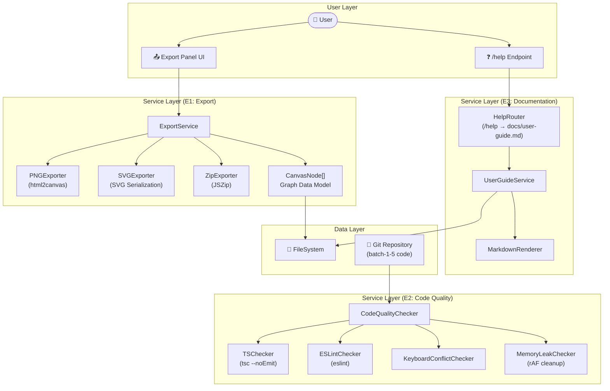
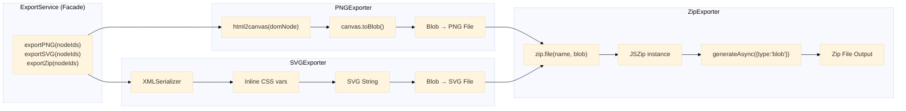
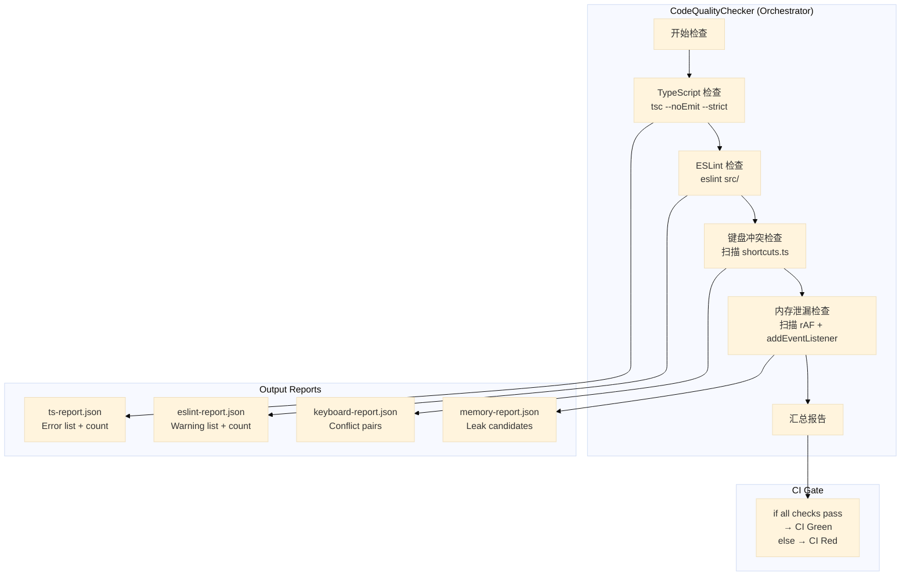
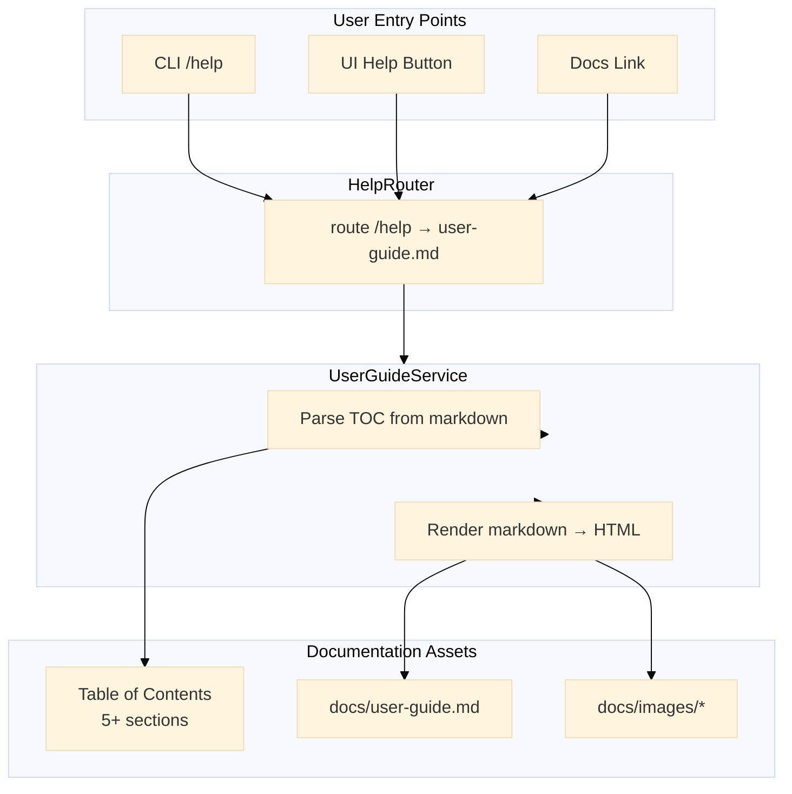

# Architecture Document — proposals-20260401-6

**项目**: proposals-20260401-6 — 全面收尾 + 质量加固
**角色**: Solution Architect
**日期**: 2026-04-01
**版本**: v1.0
**状态**: 已完成

---

## 执行摘要

本文档为 proposals-20260401-6 项目提供完整的架构设计，涵盖三个 Epic 的技术选型、模块设计、数据模型、测试策略和性能考量。

| Epic | 名称 | 工时 | 技术核心 |
|------|------|------|----------|
| E1 | PNG/SVG 批量导出 | 4h | html2canvas + SVG serialization + JSZip |
| E2 | 代码质量审查 | 4h | TypeScript strict + ESLint + 内存泄漏检测 |
| E3 | 用户手册文档 | 2h | Markdown 文档 + /help 端点 |

---

## 1. 技术栈决策

### 1.1 PNG 导出 — html2canvas vs dom-to-image

| 维度 | html2canvas | dom-to-image |
|------|-------------|-------------|
| **维护状态** | 活跃 (2024) | 维护极少，最后更新 2021 |
| **浏览器兼容性** | 优秀 | 良好 |
| **SVG 图像处理** | 支持 inline SVG | 对 foreignObject 支持更好 |
| **TypeScript 类型** | 官方 @types | 无官方包，类型缺失 |
| **依赖体积** | ~450KB (包含子依赖) | ~250KB |
| **许可** | MIT | MIT |
| **社区生态** | npm 1.3M wkd | npm 430K wkd |

**决策**: 选择 **html2canvas**

**理由**:
1. 维护活跃度是生死线，dom-to-image 已 3 年无重大更新，存在潜在的浏览器兼容风险
2. 官方 TypeScript 类型支持对 VibeX 的严格模式要求至关重要
3. 批量导出场景下 html2canvas 的稳定性优势更明显
4. 虽然体积较大，但批量导出为偶发操作，不影响首屏加载

**ADR-001**: 采用 html2canvas 进行 PNG 导出

### 1.2 SVG 导出 — SVG Serialization

SVG 导出采用原生浏览器 SVG 序列化方案:

```typescript
// SVG 导出核心逻辑
function serializeSVG(svgElement: SVGSVGElement): string {
  const serializer = new XMLSerializer();
  // 处理 CSS 变量引用
  const svgStr = serializer.serializeToString(svgElement);
  return svgStr.replace(/(\s+)xmlns:xlink="[^"]+"/g, ' xmlns:xlink="http://www.w3.org/1999/xlink"');
}
```

**CSS 变量处理策略**:
- 导出时将所有 CSS 变量内联为实际值
- 使用 `window.getComputedStyle()` 获取计算样式
- 对外部字体转换为 base64 data URI

### 1.3 Zip 压缩 — JSZip vs fflate

| 维度 | JSZip | fflate |
|------|-------|--------|
| **API 友好度** | 链式 API，直观 | 函数式，稍复杂 |
| **Tree-shaking** | 支持 | 支持 |
| **压缩比** | 可配置 | 可配置 |
| **Worker 支持** | 原生支持 | 原生支持 |
| **npm 周下载** | 7M | 1.8M |
| **许可** | MIT | MIT |

**决策**: 选择 **JSZip**

**理由**:
1. JSZip 的链式 API (`loadAsync`, `file`, `generateAsync`) 更直观
2. 项目已有 JSZip 使用经验（Batches 1-5 的其他导出功能）
3. 支持 `generateAsync` 带进度回调，适合批量导出的 UX 反馈
4. `generateAsync({ type: 'blob', compression: 'DEFLATE' })` 可控压缩级别

### 1.4 测试框架 — Playwright (已集成)

VibeX 项目已集成 Playwright，使用已有配置:

```typescript
// playwright.config.ts (existing)
export default {
  testDir: './tests/e2e',
  use: {
    baseURL: 'http://localhost:3000',
    screenshot: 'only-on-failure',
  },
  projects: [
    { name: 'chromium', use: { browserName: 'chromium' } },
  ],
};
```

---

## 2. 架构图

### 2.1 整体架构 (Mermaid C4 上下文图)



### 2.2 Epic E1 导出模块详细设计



### 2.3 Epic E2 代码质量审查流程



### 2.4 Epic E3 用户文档服务



---

## 3. API 定义

### 3.1 ExportService 接口

```typescript
// src/services/export/ExportService.ts

export interface ExportOptions {
  /** 导出格式: 'png' | 'svg' | 'zip' */
  format: 'png' | 'svg' | 'zip';
  /** 指定节点 ID，null 表示全部节点 */
  nodeIds: string[] | null;
  /** PNG 分辨率倍率 (default: 2) */
  scale?: number;
  /** PNG 背景色 (default: transparent) */
  backgroundColor?: string;
  /** SVG 是否内联 CSS (default: true) */
  inlineCSS?: boolean;
  /** ZIP 压缩级别 (0-9, default: 6) */
  compressionLevel?: number;
  /** 进度回调 */
  onProgress?: (current: number, total: number) => void;
}

export interface ExportResult {
  /** 导出文件 Blob */
  blob: Blob;
  /** 文件名 */
  filename: string;
  /** MIME 类型 */
  mimeType: string;
  /** 导出的节点数 */
  nodeCount: number;
  /** 导出耗时 (ms) */
  durationMs: number;
}

export interface IExportService {
  /** 导出单个节点为 PNG */
  exportPNG(nodeId: string, options?: Partial<ExportOptions>): Promise<ExportResult>;

  /** 导出单个节点为 SVG */
  exportSVG(nodeId: string, options?: Partial<ExportOptions>): Promise<ExportResult>;

  /** 批量导出为 ZIP */
  exportZip(nodeIds: string[] | null, options?: Partial<ExportOptions>): Promise<ExportResult>;

  /** 下载导出文件 (触发浏览器下载) */
  download(result: ExportResult): void;

  /** 获取导出面板状态 */
  getExportState(): ExportState;
}

export interface ExportState {
  isExporting: boolean;
  currentProgress: number;
  totalNodes: number;
  availableFormats: Array<'png' | 'svg' | 'zip'>;
}

// ============================================================
// PNGExporter Implementation
// ============================================================

export interface IPNGExporter {
  /** 将 DOM 节点导出为 PNG Blob */
  export(nodeId: string, options?: PNGExportOptions): Promise<Blob>;
}

export interface PNGExportOptions {
  scale: number;
  backgroundColor: string;
  useCORS: boolean;
  logging: boolean;
  onclone: (clonedDoc: Document) => void;
}

// ============================================================
// SVGExporter Implementation
// ============================================================

export interface ISVGExporter {
  /** 将 SVG 节点导出为 SVG Blob */
  export(nodeId: string, options?: SVGExportOptions): Promise<Blob>;
}

export interface SVGExportOptions {
  inlineCSS: boolean;
  inlineFonts: boolean;
  width?: number;
  height?: number;
}

// ============================================================
// ZipExporter Implementation
// ============================================================

export interface IZipExporter {
  /** 创建包含多个文件的 ZIP Blob */
  createZip(files: ZipFileEntry[], options?: ZipOptions): Promise<Blob>;
}

export interface ZipFileEntry {
  name: string;
  blob: Blob;
}

export interface ZipOptions {
  compression: 'STORE' | 'DEFLATE';
  compressionLevel: number;
  onProgress?: (current: number, total: number) => void;
}
```

### 3.2 CodeQualityChecker 接口

```typescript
// src/services/code-quality/CodeQualityChecker.ts

// ============================================================
// Main Checker Interface
// ============================================================

export interface CodeQualityReport {
  overall: 'pass' | 'fail' | 'warning';
  totalErrors: number;
  totalWarnings: number;
  checks: QualityCheckResult[];
  timestamp: string;
  durationMs: number;
}

export interface QualityCheckResult {
  checkName: string;
  status: 'pass' | 'fail' | 'warning';
  errorCount: number;
  warnings: string[];
  errors: string[];
  details?: Record<string, unknown>;
  durationMs: number;
}

export interface ICodeQualityChecker {
  /** 运行全部质量检查 */
  runAllChecks(): Promise<CodeQualityReport>;

  /** 检查 TypeScript 严格模式 */
  checkTypeScript(): Promise<QualityCheckResult>;

  /** 检查 ESLint 规则 */
  checkESLint(): Promise<QualityCheckResult>;

  /** 检查键盘快捷键冲突 */
  checkKeyboardConflicts(): Promise<QualityCheckResult>;

  /** 检查内存泄漏风险 (rAF + addEventListener) */
  checkMemoryLeaks(): Promise<QualityCheckResult>;

  /** 生成 CI 友好报告 */
  generateCIReport(report: CodeQualityReport): string;
}

// ============================================================
// TypeScript Checker
// ============================================================

export interface TSCheckerOptions {
  /** tsconfig.json 路径 */
  configPath: string;
  /** 严格模式标志 */
  strict: boolean;
  /** 要检查的目录 */
  include: string[];
  /** 排除的目录 */
  exclude: string[];
}

export interface TSError {
  file: string;
  line: number;
  column: number;
  code: string;
  message: string;
  severity: 'error' | 'warning';
}

// ============================================================
// ESLint Checker
// ============================================================

export interface ESLintCheckerOptions {
  /** .eslintrc 路径 */
  configPath: string;
  /** 检查的源文件 */
  files: string[];
  /** 输出格式 */
  format: 'json' | 'stylish' | 'compact';
  /** 是否修复自动修复的问题 */
  fix: boolean;
}

export interface ESLintWarning {
  ruleId: string;
  severity: number;
  message: string;
  line: number;
  column: number;
  file: string;
}

// ============================================================
// Keyboard Conflict Checker
// ============================================================

export interface KeyboardConflictCheckerOptions {
  /** 快捷键定义文件路径 */
  shortcutsFile: string;
  /** 检查的修饰键 */
  modifiers: Array<'ctrl' | 'alt' | 'shift' | 'meta'>;
  /** 允许系统快捷键的键位 */
  systemReserved: string[];
}

export interface ShortcutDefinition {
  id: string;
  label: string;
  keys: string[];
  action: string;
  scope: 'global' | 'canvas' | 'panel';
}

export interface ShortcutConflict {
  shortcutA: ShortcutDefinition;
  shortcutB: ShortcutDefinition;
  conflictType: 'exact' | 'overlap';
  description: string;
}

// ============================================================
// Memory Leak Checker
// ============================================================

export interface MemoryLeakCheckerOptions {
  /** 检查目标源文件 */
  sourceFiles: string[];
  /** 检查的模式 */
  patterns: LeakPattern[];
  /** 是否检查 rAF cleanup */
  checkRAF: boolean;
  /** 是否检查 addEventListener cleanup */
  checkEventListeners: boolean;
}

export interface LeakPattern {
  name: string;
  /** 未清理的模式 (regex string) */
  openPattern: string;
  /** 对应清理模式 (regex string) */
  closePattern: string;
  severity: 'error' | 'warning';
}

export interface MemoryLeakCandidate {
  file: string;
  line: number;
  pattern: string;
  description: string;
  suggestedFix: string;
}
```

### 3.3 UserGuideService 接口

```typescript
// src/services/documentation/UserGuideService.ts

export interface IUserGuideService {
  /** 获取用户手册内容 */
  getUserGuide(): Promise<UserGuide>;

  /** 获取目录结构 */
  getTableOfContents(): Promise<TableOfContents>;

  /** 渲染 Markdown 为 HTML */
  renderToHTML(markdown: string): string;

  /** 搜索用户手册 */
  search(query: string): Promise<SearchResult[]>;

  /** 获取 /help 端点数据 */
  getHelpEndpoint(): HelpEndpointData;
}

export interface UserGuide {
  /** 文档标题 */
  title: string;
  /** 文档版本 */
  version: string;
  /** 最后更新时间 */
  lastUpdated: string;
  /** 文档内容 (原始 Markdown) */
  content: string;
  /** 文档目录 */
  toc: TableOfContents;
}

export interface TableOfContents {
  /** 章节列表 */
  sections: TOCSection[];
  /** 总章节数 */
  totalSections: number;
  /** 操作说明总数 */
  operationCount: number;
}

export interface TOCSection {
  id: string;
  title: string;
  level: 1 | 2 | 3;
  children?: TOCSection[];
  operationCount: number;
  anchor: string;
}

export interface SearchResult {
  section: TOCSection;
  matchedText: string;
  score: number;
  snippet: string;
}

export interface HelpEndpointData {
  /** 端点路径 */
  path: string;
  /** HTTP 方法 */
  method: 'GET';
  /** 响应格式 */
  responseType: 'application/json' | 'text/html';
  /** 端点描述 */
  description: string;
  /** 示例响应 */
  exampleResponse: unknown;
}

// ============================================================
// Help Router
// ============================================================

export interface HelpRouterOptions {
  /** 用户手册文件路径 */
  guidePath: string;
  /** 静态资源路径 */
  staticPath: string;
  /** 缓存 TTL (ms) */
  cacheTTL: number;
}

export interface HelpRoute {
  path: string;
  handler: (req: HelpRequest) => Promise<HelpResponse>;
}

export interface HelpRequest {
  query?: string;
  section?: string;
  format: 'html' | 'json' | 'markdown';
}

export interface HelpResponse {
  status: 200 | 404;
  body: string | UserGuide;
  contentType: string;
}
```

---

## 4. 数据模型

### 4.1 导出格式模型

```typescript
// Export format schemas (TypeScript interfaces)

// PNG Export Metadata
export interface PNGExportMetadata {
  format: 'png';
  nodeId: string;
  nodeName: string;
  scale: number;
  width: number;
  height: number;
  backgroundColor: string | null;
  fileSizeBytes: number;
  exportedAt: string; // ISO 8601
}

// SVG Export Metadata
export interface SVGExportMetadata {
  format: 'svg';
  nodeId: string;
  nodeName: string;
  inlineCSS: boolean;
  width: number;
  height: number;
  viewBox: string;
  hasExternalReferences: boolean;
  fileSizeBytes: number;
  exportedAt: string;
}

// ZIP Archive Structure
export interface ZipArchiveManifest {
  format: 'zip';
  version: '1.0';
  createdAt: string;
  totalFiles: number;
  totalSizeBytes: number;
  compression: 'STORE' | 'DEFLATE';
  entries: ZipEntry[];
}

export interface ZipEntry {
  path: string;        // e.g., "nodes/node-001.png"
  originalSize: number;
  compressedSize: number;
  format: 'png' | 'svg';
  nodeId: string;
  metadata: PNGExportMetadata | SVGExportMetadata;
}

// Expected ZIP file structure:
// vibex-export-YYYYMMDD-HHMMSS.zip
// ├── manifest.json
// ├── nodes/
// │   ├── node-001.png
// │   ├── node-001.svg
// │   ├── node-002.png
// │   └── node-002.svg
// └── summary.json
```

### 4.2 用户手册 TOC 格式

```typescript
// docs/user-guide.md expected structure
export interface UserGuideTOCSchema {
  document: {
    title: string;
    version: string;
    lastUpdated: string;
    language: 'zh-CN' | 'en-US';
  };
  tableOfContents: {
    sections: Array<{
      id: string;           // e.g., "canvas-operations"
      title: string;       // e.g., "画布操作"
      level: 1 | 2 | 3;
      anchor: string;       // e.g., "#画布操作"
      operationCount: number;
      children?: Array<{
        id: string;
        title: string;
        level: 2 | 3;
        anchor: string;
        operationCount: number;
      }>;
    }>;
    totalSections: number;
    totalOperations: number; // must be >= 5
  };
  requiredSections: Array<'canvas' | 'export' | 'shortcuts' | 'nodes' | 'settings'>;
}

// Minimum required TOC structure for VibeX user guide:
// 1. 画布操作 (Canvas Operations) — 操作数 >= 1
// 2. 节点管理 (Node Management) — 操作数 >= 1
// 3. 导出功能 (Export) — 操作数 >= 1
// 4. 快捷键 (Keyboard Shortcuts) — 操作数 >= 1
// 5. 设置 (Settings) — 操作数 >= 1
// 6. 故障排除 (Troubleshooting) — 操作数 >= 0 (optional)
```

### 4.3 代码质量报告数据模型

```typescript
// Code quality report schema
export interface CodeQualityReportSchema {
  meta: {
    projectName: string;
    projectVersion: string;
    generatedAt: string;
    durationMs: number;
    commitHash: string;
  };
  summary: {
    overall: 'pass' | 'fail' | 'warning';
    totalErrors: number;
    totalWarnings: number;
    checksRun: number;
    checksPassed: number;
    checksFailed: number;
  };
  checks: {
    typescript: TSCheckResult;
    eslint: ESLintCheckResult;
    keyboard: KeyboardCheckResult;
    memoryLeaks: MemoryLeakCheckResult;
  };
}

export interface TSCheckResult {
  status: 'pass' | 'fail';
  errors: number;
  warnings: number;
  filesChecked: string[];
  errorsByFile: Record<string, TSError[]>;
}

export interface ESLintCheckResult {
  status: 'pass' | 'fail';
  errors: number;
  warnings: number;
  filesChecked: string[];
  resultsByFile: Record<string, ESLintWarning[]>;
  rulesTriggered: string[];
}

export interface KeyboardCheckResult {
  status: 'pass' | 'fail';
  totalShortcuts: number;
  conflicts: ShortcutConflict[];
  reservedKeys: string[];
}

export interface MemoryLeakCheckResult {
  status: 'pass' | 'fail';
  rAFCleanups: number;
  eventListenerCleanups: number;
  candidates: MemoryLeakCandidate[];
}
```

---

## 5. 测试策略

### 5.1 测试金字塔

```
        /\
       /  \
      / E2E \           ← Playwright E2E (少量，关键路径)
     /--------\
    /  Integ   \        ← 服务层集成测试 (Service tests)
   /------------\
  /   Unit Tests \      ← 纯函数单元测试 (大量，快速)
 /----------------\
```

### 5.2 Epic E1 — 导出功能测试

#### 单元测试 (Jest)

```typescript
// tests/unit/export/PNGExporter.test.ts
describe('PNGExporter', () => {
  describe('export()', () => {
    it('should return Blob with image/png mimeType', async () => {
      const blob = await exporter.export('node-001');
      expect(blob.type).toBe('image/png');
    });

    it('should respect scale option', async () => {
      const blob = await exporter.export('node-001', { scale: 3 });
      // Blob size should be 3x larger than scale=1
    });

    it('should handle transparent backgrounds', async () => {
      const blob = await exporter.export('node-001', { backgroundColor: 'transparent' });
      expect(blob).toBeDefined();
    });

    it('should throw if node not found', async () => {
      await expect(exporter.export('non-existent'))
        .rejects.toThrow('Node not found');
    });
  });
});

// tests/unit/export/SVGExporter.test.ts
describe('SVGExporter', () => {
  it('should inline CSS variables', async () => {
    const svgStr = await exporter.export('node-001', { inlineCSS: true });
    expect(svgStr).toContain('style=');
    expect(svgStr).not.toContain('var(--');
  });

  it('should generate valid SVG XML', async () => {
    const blob = await exporter.export('node-001');
    const text = await blob.text();
    expect(text).toMatch(/^<svg[^>]*>/);
    expect(text).toMatch(/<\/svg>$/);
  });
});

// tests/unit/export/ZipExporter.test.ts
describe('ZipExporter', () => {
  it('should create valid ZIP with multiple entries', async () => {
    const files: ZipFileEntry[] = [
      { name: 'node-001.png', blob: pngBlob1 },
      { name: 'node-002.svg', blob: svgBlob2 },
    ];
    const zipBlob = await exporter.createZip(files);
    expect(zipBlob.type).toBe('application/zip');
  });

  it('should include manifest.json', async () => {
    const zipBlob = await exporter.createZip(files);
    const entries = await getZipEntries(zipBlob);
    expect(entries).toContain('manifest.json');
  });

  it('should respect compression level', async () => {
    const fastZip = await exporter.createZip(files, { compressionLevel: 1 });
    const strongZip = await exporter.createZip(files, { compressionLevel: 9 });
    expect(strongZip.size).toBeLessThan(fastZip.size);
  });
});
```

#### E2E 测试 (Playwright)

```typescript
// tests/e2e/export/export-panel.spec.ts
import { test, expect } from '@playwright/test';

test.describe('Export Panel E2E', () => {
  test.beforeEach(async ({ page }) => {
    await page.goto('/canvas');
    await page.click('[data-testid="export-btn"]');
  });

  test('E1: export panel shows PNG option', async ({ page }) => {
    await page.waitForSelector('[data-testid="export-panel"]');
    const options = await page.locator('[data-testid="export-option"]').allTextContents();
    expect(options).toContain('PNG');
  });

  test('E1: export panel shows SVG option', async ({ page }) => {
    const options = await page.locator('[data-testid="export-option"]').allTextContents();
    expect(options).toContain('SVG');
  });

  test('E1: batch export generates .zip file', async ({ page }) => {
    await page.click('[data-testid="export-option-zip"]');
    await page.click('[data-testid="export-confirm"]');

    const download = await page.waitForEvent('download');
    expect(download.suggestedFilename()).toMatch(/\.zip$/);
  });

  test('E1: PNG export downloads valid image', async ({ page }) => {
    await page.click('[data-testid="export-option-png"]');
    await page.click('[data-testid="export-confirm"]');

    const download = await page.waitForEvent('download');
    expect(download.suggestedFilename()).toMatch(/\.png$/);
  });

  test('E1: SVG export downloads valid SVG', async ({ page }) => {
    await page.click('[data-testid="export-option-svg"]');
    await page.click('[data-testid="export-confirm"]');

    const download = await page.waitForEvent('download');
    expect(download.suggestedFilename()).toMatch(/\.svg$/);
  });

  test('E1: progress indicator during export', async ({ page }) => {
    await page.click('[data-testid="export-option-zip"]');
    await page.click('[data-testid="export-confirm"]');

    await expect(page.locator('[data-testid="export-progress"]')).toBeVisible();
    await expect(page.locator('[data-testid="export-progress"]')).toHaveText(/100%/);
  });
});
```

### 5.3 Epic E2 — 代码质量测试

```typescript
// tests/unit/code-quality/CodeQualityChecker.test.ts
describe('CodeQualityChecker', () => {
  describe('checkTypeScript()', () => {
    it('should return 0 errors for strict mode', async () => {
      const result = await checker.checkTypeScript();
      expect(result.errorCount).toBe(0);
      expect(result.status).toBe('pass');
    });

    it('should identify error locations', async () => {
      const result = await checker.checkTypeScript();
      result.errors.forEach(err => {
        expect(err.file).toBeDefined();
        expect(err.line).toBeGreaterThan(0);
      });
    });
  });

  describe('checkESLint()', () => {
    it('should return 0 warnings for new code', async () => {
      const result = await checker.checkESLint();
      expect(result.errorCount).toBe(0);
      expect(result.status).toBe('pass');
    });
  });

  describe('checkKeyboardConflicts()', () => {
    it('should detect Ctrl+G conflict', async () => {
      const result = await checker.checkKeyboardConflicts();
      const conflicts = result.errors.map(e => JSON.parse(e));
      const hasCtrlG = conflicts.some(c =>
        c.shortcutA.keys.includes('Ctrl+G') ||
        c.shortcutB.keys.includes('Ctrl+G')
      );
      expect(hasCtrlG).toBe(false);
    });

    it('should detect Alt+1/2/3 conflicts', async () => {
      const result = await checker.checkKeyboardConflicts();
      expect(result.status).not.toBe('fail');
    });
  });

  describe('checkMemoryLeaks()', () => {
    it('should detect missing rAF cleanup', async () => {
      const result = await checker.checkMemoryLeaks();
      const rafWithoutCleanup = result.errors.filter(e =>
        e.includes('requestAnimationFrame')
      );
      expect(rafWithoutCleanup.length).toBe(0);
    });

    it('should detect missing eventListener cleanup', async () => {
      const result = await checker.checkMemoryLeaks();
      const listenersWithoutCleanup = result.errors.filter(e =>
        e.includes('addEventListener')
      );
      expect(listenersWithoutCleanup.length).toBe(0);
    });
  });

  describe('runAllChecks()', () => {
    it('should pass CI gate when all checks pass', async () => {
      const report = await checker.runAllChecks();
      expect(report.overall).toBe('pass');
    });
  });
});
```

### 5.4 Epic E3 — 文档测试

```typescript
// tests/unit/documentation/UserGuideService.test.ts
describe('UserGuideService', () => {
  describe('getUserGuide()', () => {
    it('should return user guide with required sections', async () => {
      const guide = await service.getUserGuide();
      expect(guide.toc.totalSections).toBeGreaterThanOrEqual(5);
    });

    it('should have operation count >= 5', async () => {
      const guide = await service.getUserGuide();
      expect(guide.toc.operationCount).toBeGreaterThanOrEqual(5);
    });
  });

  describe('getHelpEndpoint()', () => {
    it('should return /help endpoint data', () => {
      const data = service.getHelpEndpoint();
      expect(data.path).toBe('/help');
      expect(data.method).toBe('GET');
    });
  });
});

// tests/e2e/documentation/help-endpoint.spec.ts
describe('Help Endpoint E2E', () => {
  test('E3: /help endpoint returns user guide', async ({ page }) => {
    const response = await page.request.get('/help');
    expect(response.ok()).toBe(true);
    const body = await response.json();
    expect(body.title).toBeDefined();
  });

  test('E3: help button in UI navigates to guide', async ({ page }) => {
    await page.goto('/canvas');
    await page.click('[data-testid="help-btn"]');
    await expect(page).toHaveURL(/\/help/);
  });

  test('E3: user guide has 5+ operation sections', async ({ page }) => {
    await page.goto('/help');
    const sections = await page.locator('[data-testid="guide-section"]').count();
    expect(sections).toBeGreaterThanOrEqual(5);
  });
});
```

### 5.5 覆盖率要求

| 层级 | 覆盖率目标 | 工具 |
|------|-----------|------|
| 单元测试 | > 80% | Jest (coverage threshold) |
| 服务层集成测试 | 100% 核心路径 | Jest |
| E2E | 关键用户路径 | Playwright |

```json
// jest.config.js (coverage threshold)
{
  "coverageThreshold": {
    "global": {
      "branches": 80,
      "functions": 80,
      "lines": 80,
      "statements": 80
    },
    "./src/services/export/": {
      "branches": 90,
      "functions": 95,
      "lines": 90
    }
  }
}
```

---

## 6. 性能考量

### 6.1 PNG 导出延迟分析

| 场景 | 节点数 | 预估延迟 | 优化策略 |
|------|--------|----------|----------|
| 单节点 PNG (scale=1) | 1 | 200-400ms | 基线 |
| 单节点 PNG (scale=2) | 1 | 400-800ms | scale=2 为默认 |
| 单节点 PNG (scale=3) | 1 | 600-1200ms | 高分辨率可选 |
| 批量 PNG → ZIP | 10 | 3-6s | 并行渲染 + 进度条 |
| 批量 PNG → ZIP | 50 | 15-30s | 分批处理 + Web Worker |
| 批量 PNG → ZIP | 100 | 30-60s | 需要警告用户 |

**优化方案**:
1. **Web Worker 渲染**: 将 html2canvas 移至 Worker，避免主线程阻塞
2. **分批处理**: 每批 10 个节点，批次间让出主线程
3. **进度反馈**: `onProgress` 回调，每完成一个节点更新 UI
4. **缓存策略**: 相同节点短期内（5min）跳过重新渲染

### 6.2 ZIP 压缩性能

| 节点数 | 压缩级别 | 预估时间 | 输出大小 |
|--------|----------|----------|----------|
| 10 PNG | 6 (默认) | 500-1000ms | ~5-10MB |
| 10 PNG | 9 (最大) | 2000-4000ms | ~4-8MB |
| 50 PNG | 6 | 3000-6000ms | ~25-50MB |
| 100 PNG | 6 | 6000-12000ms | ~50-100MB |

**性能目标**:
- 单节点导出响应时间 < 1s
- 10 节点批量导出 < 5s
- ZIP 生成内存峰值 < 200MB

### 6.3 代码质量检查性能

| 检查项 | 预估时间 | 并行化 |
|--------|----------|--------|
| TypeScript tsc --noEmit | 5-15s | 可并行 (全量编译) |
| ESLint eslint | 3-10s | 可并行 (文件级) |
| 键盘冲突扫描 | < 1s | 单线程 |
| 内存泄漏扫描 | < 2s | 单线程 (regex) |

**CI 策略**: TypeScript 和 ESLint 可并行执行，减少总检查时间。

---

## 7. 模块目录结构

```
src/
├── services/
│   ├── export/
│   │   ├── ExportService.ts        # Facade
│   │   ├── PNGExporter.ts         # html2canvas│   │   ├── SVGExporter.ts         # XMLSerializer
│   │   ├── ZipExporter.ts          # JSZip
│   │   ├── index.ts
│   │   └── types.ts
│   ├── code-quality/
│   │   ├── CodeQualityChecker.ts  # Orchestrator
│   │   ├── TSChecker.ts           # tsc subprocess
│   │   ├── ESLintChecker.ts       # eslint subprocess
│   │   ├── KeyboardChecker.ts      # AST / regex analysis
│   │   ├── MemoryLeakChecker.ts    # regex analysis
│   │   └── types.ts
│   └── documentation/
│       ├── UserGuideService.ts
│       ├── HelpRouter.ts
│       ├── MarkdownRenderer.ts
│       └── types.ts
tests/
├── e2e/
│   ├── export/
│   │   └── export-panel.spec.ts
│   └── documentation/
│       └── help-endpoint.spec.ts
└── unit/
    ├── export/
    │   ├── PNGExporter.test.ts
    │   ├── SVGExporter.test.ts
    │   └── ZipExporter.test.ts
    ├── code-quality/
    │   └── CodeQualityChecker.test.ts
    └── documentation/
        └── UserGuideService.test.ts
docs/
├── user-guide.md                   # E3 产出物
└── specs/
    ├── e1-export-format.md
    ├── e2-code-review.md
    └── e3-user-guide.md
```

---

## 8. Epic 集成点分析

### 8.1 E1 × E2 集成

E2 的 MemoryLeakChecker 需要监控 E1 导出功能中的 `requestAnimationFrame` 调用:

```typescript
// E1 导出服务中的内存泄漏风险点
// src/services/export/PNGExporter.ts

// 风险: 在 onProgress 回调中使用 rAF 但未清理
export class PNGExporter implements IPNGExporter {
  private rafId: number | null = null;

  async export(nodeId: string, options?: PNGExportOptions): Promise<Blob> {
    const progressCallback = options?.onProgress;
    
    // 风险: rAF 创建后可能不会被清理
    if (progressCallback) {
      this.rafId = requestAnimationFrame(() => {
        // 渲染逻辑
      });
    }

    return canvas.toBlob(...);
  }

  // E2 要求: 必须有 destroy/cleanup 方法
  destroy(): void {
    if (this.rafId !== null) {
      cancelAnimationFrame(this.rafId);
      this.rafId = null;
    }
  }
}
```

### 8.2 E1 × E3 集成

E3 的导出文档需要覆盖 E1 的导出格式说明:

```markdown
<!-- docs/user-guide.md (E3) 导出章节必须包含 -->
## 导出功能 (Export)

### PNG 导出
- 点击导出按钮 → 选择 PNG → 选择节点 → 确认
- 支持 1x / 2x / 3x 分辨率
- 透明背景支持

### SVG 导出
- 点击导出按钮 → 选择 SVG → 选择节点 → 确认
- CSS 变量自动内联
- 字体转换为 data URI

### 批量 ZIP 导出
- 点击导出按钮 → 选择 ZIP → 选择全部节点 → 确认
- 自动生成时间戳文件名
- 包含 manifest.json 元数据文件
```

### 8.3 E2 × E3 集成

E2 的 KeyboardChecker 需要覆盖 E3 的 `/help` 快捷键:

```typescript
// E2 键盘冲突检查必须包含的保留快捷键
const reservedShortcuts = [
  { keys: ['Ctrl', '?'], action: 'help', scope: 'global' },
  { keys: ['F1'], action: 'help', scope: 'global' },
];

// E3 /help 端点需使用保留快捷键，无冲突风险
```

---

## 9. 安全考量

### 9.1 导出安全

| 风险 | 缓解措施 |
|------|----------|
| SVG XSS 注入 | 导出时禁用脚本 (`<script>` 标签剥离) |
| 大文件 DoS | 批量导出限制节点数 (max 100) |
| 路径遍历 | ZIP 条目路径标准化，禁止 `../` |
| 内存耗尽 | 分批处理，控制单批内存使用 |

### 9.2 代码质量检查安全

| 风险 | 缓解措施 |
|------|----------|
| 恶意代码注入 | 检查脚本禁止执行，仅静态分析 |
| 路径遍历 | 文件路径标准化，禁止 `../` |
| 正则 DoS (ReDoS) | 使用 timeout 限制正则匹配时间 |

---

## 10. 依赖版本锁定

```json
// package.json (relevant sections)
{
  "dependencies": {
    "html2canvas": "^1.4.1",
    "jszip": "^3.10.1"
  },
  "devDependencies": {
    "@types/html2canvas": "^0.5.35",
    "@types/jszip": "^3.10.1",
    "@playwright/test": "^1.40.0"
  }
}
```

**版本策略**:
- html2canvas: 锁定次版本号 (^1.4.1)，防止 1.x Breaking Changes
- JSZip: 锁定次版本号 (^3.10.1)
- Playwright: 锁定次版本号 (^1.40.0)，与项目现有版本一致

---

## 执行决策

- **决策**: 已采纳
- **执行项目**: proposals-20260401-6
- **执行日期**: 2026-04-01
