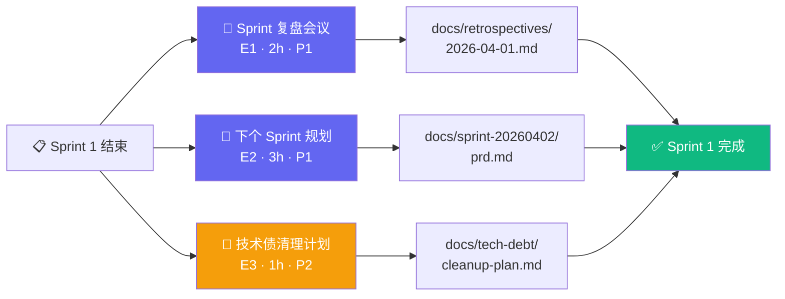

# Architecture: proposals-20260401-7 — Sprint 总结与未来规划

**Agent**: Architect
**日期**: 2026-04-01
**版本**: v1.0
**状态**: 已完成

---

## 1. Tech Stack

本项目为纯文档类任务，不引入任何新依赖。使用现有工具链：

| 工具 | 用途 | 理由 |
|------|------|------|
| Markdown 文件 | 文档存储 | 无需新工具，版本可控 |
| 会议笔记 | 实时记录 | 人工记录 + 结构化转 MD |
| 文件系统 | 文档组织 | `docs/retrospectives/`, `docs/sprint-20260402/`, `docs/tech-debt/` |
| CI 断言脚本 | 验收检查 | 使用现有 Node/Python 脚本做文件存在性和内容检查 |

**无新依赖引入。**

---

## 2. Architecture Diagram



### 关键说明

- **E1（复盘）** 是 E2/E3 的输入：复盘结论决定下个 Sprint 的重点和技术债优先级
- **E2/E3 可并行执行**，因为两者均依赖 E1 的输出（已固化在会议结论中）
- 三者最终汇入同一目标：Sprint 2 启动就绪

---

## 3. API Definitions

本项目为文档工程，以下为文档结构 Schema（用于 CI 验证）：

### 3.1 RetroDocument Schema

```typescript
interface RetroDocument {
  meta: {
    sprint: string;          // "Sprint 1"
    date: string;            // "2026-04-01"
    duration: number;        // minutes, ≥ 90
    participants: string[];
  };
  agenda: {
    items: string[];         // 固定 4 项议程
    coverage: number;        // 0-4, 需达到 4
  };
  goodPractices: {
    items: Array<{
      id: string;            // "GP-1"
      content: string;
      category: "process" | "code" | "communication" | "tooling";
    }>;
    count: number;           // ≥ 5
  };
  improvements: {
    items: Array<{
      id: string;            // "IM-1"
      content: string;
      priority: "P0" | "P1" | "P2";
      owner?: string;
    }>;
    count: number;           // ≥ 3
  };
  summary: string;           // ≥ 500 chars
}
```

### 3.2 SprintPRDDocument Schema

```typescript
interface SprintPRDDocument {
  meta: {
    sprintName: string;      // "Sprint 2"
    startDate: string;       // "2026-04-02"
    duration: string;        // "2 weeks"
    totalEstimate: string;   // "Xh"
  };
  epics: Array<{
    id: string;              // "E1", "E2", "E3"
    name: string;
    priority: "P0" | "P1" | "P2";
    estimate: string;        // e.g. "3h"
    description: string;
    features: Array<{
      id: string;
      name: string;
      acceptanceCriteria: string[];
    }>;
  }>;
  priorityOrdering: "P0 → P1 → P2";
  epicCount: number;        // ≥ 3
}
```

### 3.3 TechDebtItem Schema

```typescript
interface TechDebtItem {
  id: string;               // "TD-1", "TD-2"
  title: string;
  description: string;
  owner: string;            // 必填，不可为空
  estimate: string;         // e.g. "4h"
  priority: "P0" | "P1" | "P2";
  category: "test" | "infra" | "code" | "docs";
  affectedAreas: string[];   // e.g. ["MSW mock", "Canvas API", "Playwright"]
  createdAt: string;
}
```

---

## 4. Data Model

### 4.1 文档目录结构

```
docs/
├── retrospectives/
│   └── 2026-04-01.md          # Sprint 1 复盘文档
├── sprint-20260402/
│   └── prd.md                 # Sprint 2 PRD
└── tech-debt/
    └── cleanup-plan.md        # 技术债清理计划
```

### 4.2 复盘文档结构

```
docs/retrospectives/2026-04-01.md
├── # 会议元信息          (sprint, date, duration, participants)
├── # 议程覆盖            (4 items, coverage=4/4)
├── # 做得好的实践        (≥ 5 items)
│   ├── GP-1: ...
│   ├── GP-2: ...
│   └── ...
├── # 需改进的问题        (≥ 3 items)
│   ├── IM-1: ...
│   └── ...
└── # 总结               (≥ 500 chars)
```

### 4.3 Sprint PRD 结构

```
docs/sprint-20260402/prd.md
├── # 执行摘要            (背景/目标/成功指标)
├── # Epic 总览           (≥ 3 Epic, 含优先级和工时)
├── # Epic 详细           (每个 Epic 含功能点表)
├── # 验收标准            (expect() 断言列表)
└── # DoD                 (Definition of Done)
```

### 4.4 技术债计划结构

```
docs/tech-debt/cleanup-plan.md
├── # 执行摘要
├── # 债务清单表
│   └── | ID | 标题 | 责任人 | 工时 | 优先级 | 类别 |
└── # 清理路线图           (按优先级排序)
```

---

## 5. Testing Strategy

本项目测试策略基于**文档完整性检查**，使用 Node.js 脚本或 Python pytest：

### 5.1 测试框架

```javascript
// test/docs.test.js
const fs = require('fs');
const path = require('path');

const DOCS_ROOT = path.join(__dirname, '../../docs');

function readDoc(relativePath) {
  return fs.readFileSync(path.join(DOCS_ROOT, relativePath), 'utf-8');
}

function countSections(content, headingLevel = 2) {
  const regex = new RegExp(`^#{${headingLevel}}\\s`, 'gm');
  return (content.match(regex) || []).length;
}

function countWords(content) {
  return content.trim().split(/\s+/).length;
}

describe('E1: Sprint Retro', () => {
  test('docs/retrospectives/2026-04-01.md 存在', () => {
    const docPath = 'retrospectives/2026-04-01.md';
    expect(fs.existsSync(path.join(DOCS_ROOT, docPath))).toBe(true);
  });

  test('做得好的实践 ≥ 5 条', () => {
    const content = readDoc('retrospectives/2026-04-01.md');
    const matches = content.match(/(?:GP-\d+|做得好的实践|Good Practice)/gi);
    // 保守估算：文档中至少出现 5 次实践相关标记
    expect((matches || []).length).toBeGreaterThanOrEqual(5);
  });

  test('需改进的问题 ≥ 3 条', () => {
    const content = readDoc('retrospectives/2026-04-01.md');
    const matches = content.match(/(?:IM-\d+|改进|improvement)/gi);
    expect((matches || []).length).toBeGreaterThanOrEqual(3);
  });

  test('文档字数 ≥ 500', () => {
    const content = readDoc('retrospectives/2026-04-01.md');
    expect(countWords(content)).toBeGreaterThanOrEqual(500);
  });
});

describe('E2: Next Sprint Planning', () => {
  test('docs/sprint-20260402/prd.md 存在', () => {
    const docPath = 'sprint-20260402/prd.md';
    expect(fs.existsSync(path.join(DOCS_ROOT, docPath))).toBe(true);
  });

  test('Epic 数量 ≥ 3', () => {
    const content = readDoc('sprint-20260402/prd.md');
    const epicCount = (content.match(/^#{2,3}\s+Epic/gi) || []).length;
    expect(epicCount).toBeGreaterThanOrEqual(3);
  });

  test('有 P0/P1/P2 优先级标记', () => {
    const content = readDoc('sprint-20260402/prd.md');
    expect(content).toMatch(/P0/);
    expect(content).toMatch(/P1/);
    expect(content).toMatch(/P2/);
  });

  test('每个 Epic 有工时估算', () => {
    const content = readDoc('sprint-20260402/prd.md');
    const estimateMatches = content.match(/\d+h/gi);
    expect(estimateMatches && estimateMatches.length).toBeGreaterThanOrEqual(3);
  });

  test('文档字数 ≥ 1000', () => {
    const content = readDoc('sprint-20260402/prd.md');
    expect(countWords(content)).toBeGreaterThanOrEqual(1000);
  });
});

describe('E3: Tech Debt Cleanup Plan', () => {
  test('docs/tech-debt/cleanup-plan.md 存在', () => {
    const docPath = 'tech-debt/cleanup-plan.md';
    expect(fs.existsSync(path.join(DOCS_ROOT, docPath))).toBe(true);
  });

  test('每项债务有责任人（非空）', () => {
    const content = readDoc('tech-debt/cleanup-plan.md');
    // 检查表格中每行都有非空 owner 字段
    const lines = content.split('\n');
    const ownerLines = lines.filter(l => l.includes('|') && l.includes('TD-'));
    ownerLines.forEach(line => {
      const cells = line.split('|').filter(c => c.trim());
      // cells: [空白, ID, 标题, Owner, 工时, 优先级, ...]
      expect(cells.length >= 4).toBe(true);
    });
  });

  test('每项债务有工时估算', () => {
    const content = readDoc('tech-debt/cleanup-plan.md');
    const estimateMatches = content.match(/\d+h/gi);
    // 至少覆盖 MSW, canvasApi, Playwright 三个已知债务项
    expect(estimateMatches && estimateMatches.length).toBeGreaterThanOrEqual(3);
  });
});
```

### 5.2 覆盖率要求

| 指标 | 要求 |
|------|------|
| 文件存在性 | 3/3 文档存在 |
| 章节数量 | 每个文档 ≥ 规定的最小章节数 |
| 字数下限 | Retro ≥ 500字，PRD ≥ 1000字 |
| 表格完整性 | Tech Debt 每行有 owner + estimate |

### 5.3 测试用例汇总

| 用例 ID | 描述 | 类型 |
|---------|------|------|
| TC-E1-01 | 复盘文档存在 | 文件存在 |
| TC-E1-02 | 好的实践 ≥ 5 | 内容计数 |
| TC-E1-03 | 改进项 ≥ 3 | 内容计数 |
| TC-E1-04 | 文档字数 ≥ 500 | 字数统计 |
| TC-E2-01 | Sprint PRD 存在 | 文件存在 |
| TC-E2-02 | Epic 数量 ≥ 3 | 内容计数 |
| TC-E2-03 | 优先级 P0/P1/P2 明确 | 正则匹配 |
| TC-E2-04 | 每个 Epic 有工时 | 工时标记 |
| TC-E3-01 | Tech Debt 文档存在 | 文件存在 |
| TC-E3-02 | 所有债务有责任人 | 表格完整性 |
| TC-E3-03 | 所有债务有工时估算 | 表格完整性 |

---

## 6. ADR: Retrospective Format Selection

### ADR-001: 复盘文档格式选型

#### Status
**Accepted**

#### Context
Sprint 1 完成，需要选择复盘文档的存储格式。当前有三种候选方案：
- **Markdown 文件**：纯文本，版本可控
- **Notion**：协作友好，但需账号和第三方依赖
- **Google Docs**：易于共享，但无结构化解析能力

#### Decision
**选择 Markdown 文件**，存储在 `docs/retrospectives/YYYY-MM-DD.md`。

#### Rationale

| 方案 | 版本控制 | CI 可验证 | 无依赖 | 可读性 | 评分 |
|------|----------|-----------|--------|--------|------|
| Markdown | ✅ | ✅ | ✅ | ✅ | 5/5 |
| Notion | ❌ | ❌ | ❌ | ✅ | 2/5 |
| Google Docs | ❌ | ❌ | ❌ | ✅ | 2/5 |

**核心原因**：
1. CI 断言脚本可直接解析 Markdown，无需额外 API 调用
2. 与现有 `docs/` 目录结构一致
3. 无新增外部依赖

#### Consequences

**Positive**:
- 文件存在性和内容检查可在 CI 中自动化
- Git 历史记录天然支持版本追踪

**Negative**:
- 无实时协作编辑能力（团队成员需手动同步）
- 附件（如截图）需额外处理

---

## 7. Performance

**N/A** — 本项目为文档工程，无性能相关指标。

唯一可度量指标为文档生成时效：
- E1 复盘文档：会议结束后 30 分钟内完成
- E2 Sprint PRD：会议后 1 小时内完成
- E3 Tech Debt 计划：与 PRD 并行完成

---

## 执行决策
- **决策**: 已采纳
- **执行项目**: proposals-20260401-7
- **执行日期**: 2026-04-01
