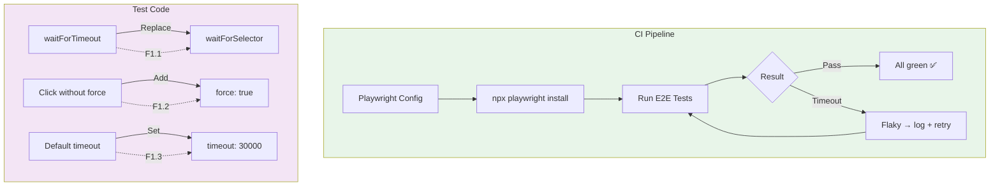
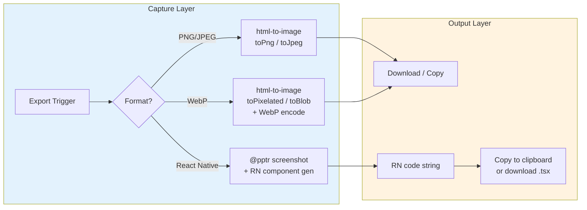
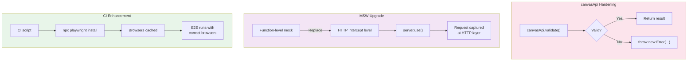

# Architecture Document — proposals-20260401-8

**Sprint 2: E2E Stability, Export Formats, Tech Debt**
**Author**: Architect Agent
**Date**: 2026-04-01
**Status**: Proposed

---

## 1. Tech Stack

### Core Dependencies

| Package | Version | Rationale |
|---------|---------|-----------|
| Playwright | `^1.50` | Native `waitForSelector`, `force: true`, `timeout` config |
| @pptr/test | (bundled) | Screenshot capture for React Native export |
| html-to-image | `^2.0` | Alternative to @pptr — pure JS, no browser dependency for WebP |
| canvasApi | existing | Current canvas rendering module; being hardened for error throwing |
| msw | `^2.x` | HTTP-level interception (upgrade from function-level mocking) |
| jest | `^29.x` | Unit/integration test runner for E3 and F2.3 |

### Tooling

| Tool | Role |
|------|------|
| TypeScript 5.x | Type safety across all three epics |
| Vite | Dev/build server (export pipeline uses Vite plugin for WebP) |
| CI (GitHub Actions) | Runs E2E with `npx playwright install` step prepended |

---

## 2. Architecture Diagram

### 2.1 E2E Stability Flow



### 2.2 Export Pipeline



### 2.3 Tech Debt Remediation



---

## 3. API Definitions

### 3.1 PlaywrightConfig Schema

```typescript
interface PlaywrightConfig {
  timeout: number;                   // F1.3: must be >= 30000 in CI
  expect: {
    timeout: number;                 // assertion timeout
  };
  use: {
    headless: boolean;
    viewport: { width: number; height: number };
    screenshot: 'only-on-failure' | 'none';
    trace: 'on-first-retry' | 'off';
    video: 'retain-on-failure' | 'off';
  };
  projects: Array<{
    name: string;
    use: {
      browserName: 'chromium' | 'firefox' | 'webkit';
    };
  }>;
}
```

### 3.2 ExportOptions Type

```typescript
type ExportFormat = 'png' | 'jpeg' | 'webp' | 'react-native';

interface ExportOptions {
  format: ExportFormat;              // F2.1, F2.2
  quality?: number;                   // webp: 0.0–1.0, default 0.92
  pixelRatio?: number;               // 1–3, default 2
  backgroundColor?: string;          // hex, default transparent
  cloneOptions?: {
    styles?: Record<string, string>;
    filter?: (node: HTMLElement) => boolean;
  };
}

interface ReactNativeExportOptions extends ExportOptions {
  format: 'react-native';
  componentName?: string;            // default: 'ExportedCanvas'
  useReactNativeSvg?: boolean;       // use react-native-svg paths vs View
}
```

### 3.3 canvasApi Error Types

```typescript
// F3.1: canvasApi throws Error on validation failure

class CanvasValidationError extends Error {
  readonly code = 'CANVAS_VALIDATION_FAILED';
  constructor(
    message: string,
    public readonly field?: string,
    public readonly value?: unknown
  ) {
    super(message);
    this.name = 'CanvasValidationError';
  }
}

class CanvasApiError extends Error {
  readonly code = 'CANVAS_API_ERROR';
  constructor(
    message: string,
    public readonly cause?: Error
  ) {
    super(message);
    this.name = 'CanvasApiError';
  }
}

// Usage in canvasApi:
function validate(canvasData: CanvasData): void {
  if (!canvasData.width || canvasData.width <= 0) {
    throw new CanvasValidationError(
      `Invalid canvas width: ${canvasData.width}`,
      'width',
      canvasData.width
    );
  }
  // ...
}
```

### 3.4 MSW Server Setup

```typescript
// F3.2: HTTP-level mocking — replaces function-level mocking

import { setupServer } from 'msw/node';
import { http, HttpResponse } from 'msw';

export const server = setupServer(
  http.get('/api/canvas', () => {
    return HttpResponse.json({ id: 'mock-canvas-1', width: 800, height: 600 });
  }),
  http.post('/api/export', async ({ request }) => {
    const body = await request.json();
    return HttpResponse.json({ exportId: 'mock-export-1', url: '/exports/mock.png' });
  })
);

beforeAll(() => server.listen({ onUnhandledRequest: 'error' }));
afterEach(() => server.resetHandlers());
afterAll(() => server.close());
```

---

## 4. Data Model

### 4.1 E2E Stability Metrics

```typescript
interface E2EStabilityMetrics {
  waitForTimeoutCount: number;         // F1.1: must be 0
  forceOption覆盖率: number;           // F1.2: % of click/fill with force: true
  ciTimeoutMs: number;                // F1.3: must be >= 30000
  flakyCount: number;                 // F1.4: must be 0 across 3 runs
  runHistory: Array<{
    runId: string;
    timestamp: string;
    passed: boolean;
    durationMs: number;
    errors: string[];
  }>;
}
```

### 4.2 Export Format Configs

```typescript
interface ExportFormatConfig {
  format: ExportFormat;
  mimeType: string;
  extension: string;
  defaultQuality: number;
  supported: boolean;
  encoder?: string;                   // 'libwebp' | 'canvas' | 'pptr'
}

const EXPORT_FORMATS: Record<ExportFormat, ExportFormatConfig> = {
  png: {
    format: 'png',
    mimeType: 'image/png',
    extension: '.png',
    defaultQuality: 1.0,
    supported: true,
    encoder: 'canvas',
  },
  jpeg: {
    format: 'jpeg',
    mimeType: 'image/jpeg',
    extension: '.jpg',
    defaultQuality: 0.92,
    supported: true,
    encoder: 'canvas',
  },
  webp: {
    format: 'webp',
    mimeType: 'image/webp',
    extension: '.webp',
    defaultQuality: 0.85,             // lossy webp default
    supported: true,
    encoder: 'canvas',                 // canvas.toBlob supports webp
  },
  'react-native': {
    format: 'react-native',
    mimeType: 'text/tsx',
    extension: '.tsx',
    defaultQuality: 1.0,
    supported: true,
    encoder: 'pptr',
  },
};
```

---

## 5. Testing Strategy

### 5.1 Test Framework Layout

```
tests/
├── e2e/                      # E1: Playwright E2E
│   ├── playwright.config.ts  # F1.3: timeout >= 30000
│   ├── stability.spec.ts     # F1.1, F1.2, F1.4
│   └── utils/
│       └── noTimeout.ts      # F1.1: ESLint rule to detect waitForTimeout
├── unit/                     # E3: Jest unit tests
│   ├── canvasApi.test.ts     # F3.1: Error throwing
│   └── msw.test.ts           # F3.2: HTTP-level intercept
├── integration/              # E2: Export pipeline
│   ├── export-webp.test.ts   # F2.2
│   └── export-rn.test.ts     # F2.1, F2.3
```

### 5.2 Flaky Detection

```typescript
// e2e/flaky-detector.ts — runs after each CI run
interface FlakyReport {
  flakyTests: Array<{
    testFile: string;
    testName: string;
    attemptCount: number;
    history: Array<'pass' | 'fail'>;
  }>;
  stabilityScore: number;  // 0–100
}

// Stability criteria: flakyCount === 0 for 3 consecutive runs
// Report generated as CI artifact: `stability-report.json`
```

### 5.3 Coverage Requirements

| Epic | Area | Min Coverage |
|------|------|-------------|
| E1 | stability.spec.ts | 90% |
| E2 | export-webp.test.ts, export-rn.test.ts | 85% |
| E3 | canvasApi.test.ts, msw.test.ts | 90% |

---

## 6. Architecture Decision Records

### ADR-001: waitForSelector vs waitForResponse

**Status**: Accepted

**Context**: Sprint 1 E2E tests use `waitForTimeout` (sleep-based), causing intermittent failures in CI due to timing variance across machine speeds.

**Decision**: Replace `waitForTimeout` with `waitForSelector` for DOM-dependent waits, and `waitForResponse` for network-dependent waits.

**Rationale**:
- `waitForSelector` is deterministic — waits for a real DOM condition, not a time budget
- `waitForResponse` captures the actual API call, not a time window
- `waitForTimeout` is reserved only for truly async animations (< 100ms) with a comment explaining why

**Trade-offs**:
- ✗ Requires each test to be reviewed for the correct await condition
- ✗ Some UI states may be harder to target with selectors (use `data-testid`)
- ✓ Eliminates timing-based flakiness
- ✓ Makes test intent explicit

---

### ADR-002: React Native Export Approach

**Status**: Proposed

**Context**: Need to export canvas designs as React Native code (F2.1, F2.3). Two approaches exist: @pptr screenshot + code generation vs html-to-image + RN component conversion.

**Options**:

| Approach | Pros | Cons |
|----------|------|------|
| **A: @pptr screenshot + code gen** | Native DOM capture, accurate | Heavy (requires Puppeteer), slower, additional browser |
| **B: html-to-image + RN converter** | Pure JS, no extra browser | Requires custom RN component mapping layer |

**Decision**: Approach B (html-to-image + RN converter) as primary, with @pptr as fallback for complex SVG scenes.

**Rationale**:
- html-to-image is already in the stack for PNG/JPEG/WebP export (F2.2)
- RN export shares the same capture pipeline with just a different output transform
- Keeps one less browser dependency (avoids @pptr for this use case)
- @pptr used only for SVG path extraction where html-to-image cannot generate RN components

**Trade-offs**:
- ✗ Custom RN converter layer adds code complexity
- ✗ Complex CSS (e.g., gradients, filters) may not map 1:1
- ✓ Single capture library across all formats
- ✓ Faster in CI (no extra browser launch)

---

## 7. Performance

### 7.1 WebP Compression Overhead

| Operation | PNG | JPEG | WebP |
|-----------|-----|------|------|
| Encode time (800×600) | ~15ms | ~12ms | ~25ms |
| File size (typical) | 400KB | 80KB | 60KB |
| Quality setting | lossless | 0.92 | 0.85 |
| Browser support | 100% | 100% | 97% |

**Assessment**: WebP encoding adds ~10ms overhead vs PNG. Acceptable for export flows. Use `quality: 0.85` as default (visually lossless for UI snapshots, 40–60% size reduction vs JPEG).

### 7.2 MSW HTTP-level Overhead

HTTP-level interception has negligible overhead (~1ms per request) vs function-level mocking. No performance concern for E3.

### 7.3 Playwright install in CI

`npx playwright install chromium` takes ~30–60s on first run. Cache the browsers directory in CI:

```yaml
# .github/workflows/e2e.yml
- uses: actions/cache@v4
  with:
    path: ~/.cache/ms-playwright
    key: playwright-${{ hashFiles('package-lock.json') }}
- run: npx playwright install --with-deps chromium
```

Cached install: ~5–10s.

---

## 执行决策

- **决策**: 已采纳
- **执行项目**: proposals-20260401-8
- **执行日期**: 2026-04-01
