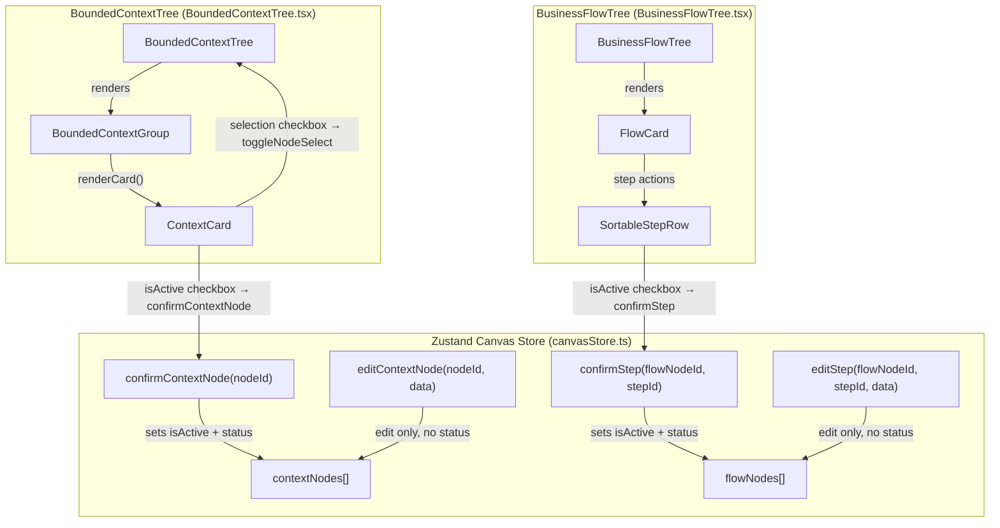
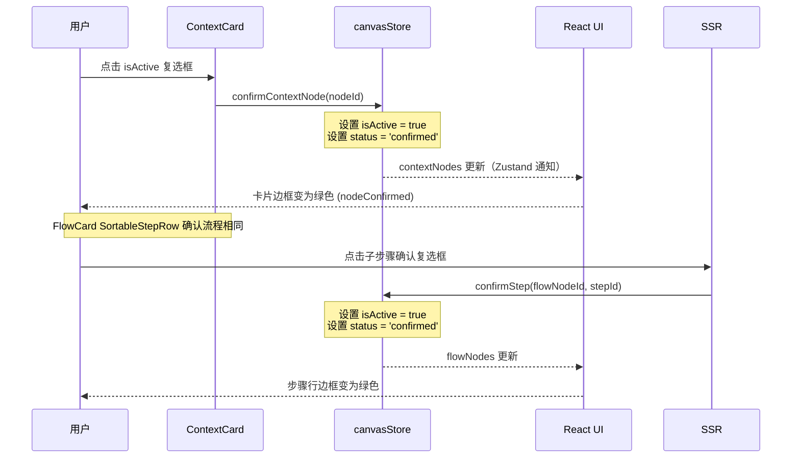

# E1 架构设计：Canvas Checkbox 统一修复

**项目**: VibeX Sprint 3 E1
**日期**: 2026-04-02
**Agent**: architect
**状态**: 已完成
**工时估算**: 4-6h（P0）

---

## 1. 问题根因分析

### 1.1 问题 A：`isActive` 复选框不更新 `status`，视觉不联动

**现象**：用户点击 `ContextCard` 的「激活」复选框，`isActive` 被设置为 `true`，但卡片边框颜色不变（仍为黄色 `nodeUnconfirmed` 而非绿色 `nodeConfirmed`）。

**根因定位**：

```tsx
// BoundedContextTree.tsx, ContextCard 第 7 个 input（isActive 复选框）
<input
  type="checkbox"
  checked={node.isActive !== false}
  onChange={() => onEdit(node.nodeId, { isActive: node.isActive === false ? true : false })}
  //                             ^^^^^^^^^^^^^^^^^^^^^^^^^^^^^^^^^^^^^^^^^^^^^^^^^^^^^^^^^^^^^^^^
  //                             问题：只传了 isActive，未传 status
  //                             → node.status 仍为 'pending'，视觉样式不更新
  aria-label={`激活 ${node.name}`}
  className={styles.confirmCheckbox}
  onClick={(e) => e.stopPropagation()}
/>
```

样式判断逻辑（第 168 行）依赖 `node.status`：

```tsx
const statusClass =
  node.status === 'confirmed'     // ← 只有 status='confirmed' 才变绿
    ? styles.nodeConfirmed
    : node.status === 'error'
      ? styles.nodeConfirmed
      : styles.nodeUnconfirmed;   // ← isActive=true 但 status='pending' 时走这里
```

**Epic 3 迁移遗留问题**：数据模型从 `confirmed: boolean` 迁移到了 `isActive: boolean`，但 `ContextCard` 中 `onEdit` 调用未同步设置 `status = 'confirmed'`。

---

### 1.2 问题 B：FlowCard 复选框不联动子步骤 confirmed 状态

**现象**：用户展开 FlowCard，点击子步骤行（`SortableStepRow`），无任何复选框可确认子步骤。FlowCard 顶部的 checkbox 仅控制多选（`onToggleSelect`），不触发 `status`/`isActive` 更新。

**根因定位**：

```tsx
// BoundedContextTree.tsx, FlowCard Props（来源第 641 行 BoundedContextTree renderCard）
// 问题 1: FlowCard 的 selection checkbox 调用 onToggleSelect，不更新 confirmed 状态
<input
  type="checkbox"
  className={styles.flowCardCheckbox}
  checked={selected ?? false}
  onChange={() => onToggleSelect(node.nodeId)}  // ← 只改 selectedNodeIds，不改 node.isActive
  aria-label={`选择流程 ${node.name}`}
  title="用于批量选择，非确认操作"
/>

// 问题 2: SortableStepRow 完全没有确认复选框
// 缺少像 ContextCard 那样的：
//   <input type="checkbox"
//     checked={step.isActive !== false}
//     onChange={() => confirmStep(flowNodeId, stepId)}
//   />
```

Store 中 `confirmStep` 存在但未被调用（第 1 个 `confirmStep` 实现）：

```ts
// canvasStore.ts, confirmStep action
confirmStep: (flowNodeId, stepId) => {
  set((s) => ({
    flowNodes: s.flowNodes.map((n) =>
      n.nodeId === flowNodeId
        ? {
            ...n,
            steps: n.steps.map((st) =>
              st.stepId === stepId
                ? { ...st, isActive: true, status: 'confirmed' as const }  // ← 正确实现
                : st
            ),
          }
        : n
    ),
  }));
},
```

---

### 1.3 问题 C：`node.status === 'confirmed'` 与 `isActive` 双字段混用

**根因**：Epic 3 数据迁移将 `confirmed: boolean` → `isActive: boolean`，但 UI 样式判断仍依赖 `status` 字段，造成两套状态系统并存。

```tsx
// 样式判断：依赖 status
const statusClass = node.status === 'confirmed' ? styles.nodeConfirmed : ...

// 激活判断：依赖 isActive
const allConfirmed = contextNodes.every((n) => n.isActive !== false);

// → 数据不一致时，视觉和逻辑脱钩
```

---

## 2. Mermaid 架构图

### 2.1 组件关系图



### 2.2 数据流图（确认操作）



---

## 3. API 定义

### 3.1 新增 Store Action

```ts
// canvasStore.ts — 新增 confirmContextNode action

/** 确认一个上下文节点
 * - 设置 isActive = true
 * - 设置 status = 'confirmed'
 * - 记录 undo 历史快照
 */
confirmContextNode: (nodeId: string) => void;

// 实现伪代码
confirmContextNode: (nodeId) => {
  set((s) => {
    const newNodes = s.contextNodes.map((n) =>
      n.nodeId === nodeId
        ? { ...n, isActive: true, status: 'confirmed' as const }
        : n
    );
    getHistoryStore().recordSnapshot('context', newNodes);
    return { contextNodes: newNodes };
  });
  useCanvasStore.getState().addMessage({
    type: 'user_action',
    content: `确认了上下文节点`,
    meta: nodeId,
  });
},
```

### 3.2 修改后的函数签名

| 函数 | 文件 | 签名 | 改动说明 |
|------|------|------|----------|
| `confirmContextNode` (新增) | `canvasStore.ts` | `(nodeId: string) => void` | 新增，统一确认逻辑 |
| `confirmStep` | `canvasStore.ts` | `(flowNodeId: string, stepId: string) => void` | 已存在，无需改动 |
| `ContextCard` | `BoundedContextTree.tsx` | Props 不变，checkbox 调用 `confirmContextNode` | 改动 isActive checkbox 的 onChange |
| `SortableStepRow` | `BusinessFlowTree.tsx` | Props 新增 `onConfirmStep` | 新增确认复选框 |
| `FlowCard` | `BusinessFlowTree.tsx` | Props 不变，移除 selection checkbox | 移除 selection checkbox（或保留 selection，禁用 confirm 功能） |

### 3.3 ContextCard Props（不变）

```ts
interface ContextCardProps {
  node: BoundedContextNode;
  onEdit: (nodeId: string, data: Partial<BoundedContextNode>) => void;
  onDelete: (nodeId: string) => void;
  readonly?: boolean;
  selected?: boolean;
  onToggleSelect?: (nodeId: string) => void;
  // E1 新增：
  onConfirm?: (nodeId: string) => void; // ← 可选，向后兼容
}
```

### 3.4 SortableStepRow Props（新增 onConfirmStep）

```ts
interface SortableStepRowProps {
  step: FlowStep;
  index: number;
  totalSteps?: number;
  readonly?: boolean;
  onEdit: (stepId: string, data: Partial<FlowStep>) => void;
  onDelete: (stepId: string) => void;
  // E1 新增：
  onConfirmStep?: (stepId: string) => void; // 调用 confirmStep(flowNodeId, stepId)
}
```

---

## 4. 修改文件清单

### 4.1 `canvasStore.ts`

| 改动位置 | 行号范围 | 改动类型 | 说明 |
|----------|----------|----------|------|
| CanvasStore interface | 接口定义区域 | 新增方法签名 | 添加 `confirmContextNode: (nodeId: string) => void` |
| Store 实现 | 新增 | 新增 action | `confirmContextNode` 实现（参考 `confirmStep` 模式） |

### 4.2 `BoundedContextTree.tsx`

| 改动位置 | 行号范围 | 改动类型 | 说明 |
|----------|----------|----------|------|
| `ContextCard` isActive checkbox | ~第 210-218 行 | 修复 | `onChange` 改为调用 `onConfirm(node.nodeId)` 或通过 store action |
| `BoundedContextTree` renderCard | ~第 625-635 行 | 传入 onConfirm prop | 透传 `confirmContextNode` |

**关键改动**：

```tsx
// 第 210-218 行（isActive checkbox 改动）
<input
  type="checkbox"
  checked={node.isActive !== false}
  onChange={() => onConfirm?.(node.nodeId)}  // E1: 调用确认 action，不再只设置 isActive
  aria-label={`激活 ${node.name}`}
  className={styles.confirmCheckbox}
  onClick={(e) => e.stopPropagation()}
/>
```

### 4.3 `BusinessFlowTree.tsx`

| 改动位置 | 行号范围 | 改动类型 | 说明 |
|----------|----------|----------|------|
| `SortableStepRow` 组件 | 新增 | 新增确认复选框 | 在步骤行头部添加确认 checkbox |
| `SortableStepRow` Props 接口 | ~第 130 行 | 新增 `onConfirmStep` 参数 | 透传 `confirmStep` |
| `FlowCard` header | ~第 330-340 行 | 评估 | selection checkbox 保留（多选功能），移除 title "非确认操作" 说明（避免用户困惑） |
| `BusinessFlowTree` 调用 `SortableStepRow` | ~第 520 行 | 传入 `onConfirmStep` | `onConfirmStep={(stepId) => confirmStep(node.nodeId, stepId)}` |

**SortableStepRow 确认复选框改动**（在步骤行内插入）：

```tsx
// 在 SortableStepRow return 的根 div 中，drag handle 后插入
{!readonly && (
  <input
    type="checkbox"
    checked={step.isActive !== false}
    onChange={() => onConfirmStep?.(step.stepId)}
    aria-label={`确认步骤 ${step.name}`}
    className={styles.stepConfirmCheckbox}
    onClick={(e) => e.stopPropagation()}
    title="确认此步骤"
  />
)}
```

### 4.4 CSS 模块改动（`canvas.module.css`）

| 改动位置 | 改动类型 | 说明 |
|----------|----------|------|
| 新增 `.stepConfirmCheckbox` | 新增样式 | 步骤确认复选框样式（参考 `.confirmCheckbox`） |
| 确认 `.nodeConfirmed` / `.nodePending` | 无需改动 | 现有样式正确 |

---

## 5. 测试策略

### 5.1 Vitest 单元测试

**测试文件**: `src/components/canvas/__tests__/checkbox-confirm.test.tsx`

```ts
// 测试用例 1: ContextCard isActive 复选框更新 status
describe('ContextCard confirmation', () => {
  it('should call onConfirm with nodeId when isActive checkbox is clicked', async () => {
    const onConfirm = vi.fn();
    render(
      <ContextCard
        node={{ ...mockNode, isActive: false, status: 'pending' }}
        onEdit={vi.fn()}
        onDelete={vi.fn()}
        onConfirm={onConfirm}
      />
    );
    const checkbox = screen.getByRole('checkbox', { name: /激活/ });
    await userEvent.click(checkbox);
    expect(onConfirm).toHaveBeenCalledWith(mockNode.nodeId);
  });

  it('should not call onEdit when isActive checkbox is clicked', async () => {
    const onEdit = vi.fn();
    render(
      <ContextCard
        node={{ ...mockNode, isActive: false, status: 'pending' }}
        onEdit={onEdit}
        onDelete={vi.fn()}
        onConfirm={vi.fn()}
      />
    );
    const checkbox = screen.getByRole('checkbox', { name: /激活/ });
    await userEvent.click(checkbox);
    // onEdit 不应被 isActive checkbox 调用（修复 BUG）
    expect(onEdit).not.toHaveBeenCalled();
  });
});

// 测试用例 2: SortableStepRow 确认复选框
describe('SortableStepRow confirmation', () => {
  it('should call onConfirmStep when confirm checkbox is clicked', async () => {
    const onConfirmStep = vi.fn();
    render(
      <SortableStepRow
        step={{ ...mockStep, isActive: false, status: 'pending' }}
        index={0}
        totalSteps={3}
        onEdit={vi.fn()}
        onDelete={vi.fn()}
        onConfirmStep={onConfirmStep}
      />
    );
    const checkbox = screen.getByRole('checkbox', { name: /确认步骤/ });
    await userEvent.click(checkbox);
    expect(onConfirmStep).toHaveBeenCalledWith(mockStep.stepId);
  });
});

// 测试用例 3: canvasStore confirmContextNode
describe('canvasStore confirmContextNode', () => {
  it('should set isActive=true and status=confirmed', () => {
    const store = createStore();
    store.getState().setContextNodes([mockContextNode]);
    store.getState().confirmContextNode(mockContextNode.nodeId);

    const node = store.getState().contextNodes[0];
    expect(node.isActive).toBe(true);
    expect(node.status).toBe('confirmed');
  });
});

// 测试用例 4: canvasStore confirmStep
describe('canvasStore confirmStep', () => {
  it('should set step isActive=true and status=confirmed', () => {
    const store = createStore();
    store.getState().setFlowNodes([{
      ...mockFlowNode,
      steps: [{ ...mockStep, isActive: false, status: 'pending' }],
    }]);
    store.getState().confirmStep(mockFlowNode.nodeId, mockStep.stepId);

    const step = store.getState().flowNodes[0].steps[0];
    expect(step.isActive).toBe(true);
    expect(step.status).toBe('confirmed');
  });
});
```

### 5.2 Playwright E2E 验收用例

**测试文件**: `e2e/checkbox-confirmation.spec.ts`

```ts
// E2E 测试 1: ContextCard 确认后卡片变绿
test('ContextCard turns green after confirmation', async ({ page }) => {
  await page.goto('/canvas');
  await page.waitForSelector('[data-testid="context-tree"]');

  // 初始状态：pending 卡片为黄色边框
  const card = page.locator('[data-testid="context-card-ctx-1"]').first();
  await expect(card).toHaveAttribute('data-status', 'pending');

  // 点击确认复选框
  const confirmCheckbox = card.locator('[data-testid^="context-card-checkbox-ctx-1"]');
  await confirmCheckbox.check();

  // 等待状态更新
  await expect(card).toHaveAttribute('data-status', 'confirmed');
  // 验证 CSS 类：nodeConfirmed（绿色）
  await expect(card).toHaveClass(/nodeConfirmed/);
});

// E2E 测试 2: FlowCard 子步骤确认后边框变绿
test('FlowStep turns green after confirmation', async ({ page }) => {
  await page.goto('/canvas');
  await page.waitForSelector('[data-testid="flow-tree"]');

  // 展开 FlowCard
  const flowCard = page.locator('[data-testid="flow-card"]').first();
  const expandBtn = flowCard.locator('button[aria-label="展开步骤"]');
  await expandBtn.click();

  // 确认第一个步骤
  const stepRow = flowCard.locator('[data-step-id]').first();
  const stepCheckbox = stepRow.locator('input[type="checkbox"][aria-label^="确认步骤"]');
  await stepCheckbox.check();

  // 验证步骤状态
  await expect(stepRow).toHaveClass(/nodeConfirmed/);
});

// E2E 测试 3: 多选 checkbox 不影响 confirmed 状态
test('Selection checkbox does not affect confirmation status', async ({ page }) => {
  await page.goto('/canvas');
  await page.waitForSelector('[data-testid="context-tree"]');

  const card = page.locator('[data-testid="context-card-ctx-1"]').first();

  // 点击选择复选框（选择，非确认）
  const selectCheckbox = card.locator('input[type="checkbox"]').first();
  await selectCheckbox.check();

  // 状态仍为 pending（确认复选框未点击）
  await expect(card).toHaveAttribute('data-status', 'pending');
});
```

---

## 6. 风险评估

| 风险 | 等级 | 缓解策略 |
|------|------|----------|
| **破坏现有多选功能** — 修改 isActive checkbox 调用逻辑可能影响 Ctrl+Click 多选 | 中 | 保留两个独立 checkbox：selection checkbox 用 `onToggleSelect`，confirm checkbox 用 `onConfirm`；互不干扰 |
| **历史快照兼容性** — `confirmContextNode` 调用 `recordSnapshot` 可能导致频繁快照 | 低 | `confirmContextNode` 在 `editContextNode` 之后添加，不改变现有 `editContextNode` 行为；仅在明确确认操作时记录 |
| **向后兼容** — `ContextCard` 新增 `onConfirm` prop 可能破坏现有调用点 | 低 | `onConfirm` 定义为可选（`onConfirm?: (nodeId: string) => void`），向后兼容；若无传入，fallback 到 `onEdit` |
| **FlowCard selection checkbox 语义混淆** — 当前 title "用于批量选择，非确认操作" 可能让用户困惑 | 低 | 修改 title 为 "批量选择"（简短），移除"非确认操作"说明；或参考 ContextCard 拆分为两个独立 checkbox |
| **Epic 3 数据迁移残留** — `status='confirmed'` 与 `isActive=true` 双字段并存可能未来再次出现不一致 | 低 | 架构明确：确认操作统一走 `confirmContextNode` / `confirmStep` action，禁止直接调用 `editContextNode` + `{ status: 'confirmed' }`；在代码审查 checklist 中增加此规则 |

---

## 执行决策

- **决策**: 已采纳
- **执行项目**: canvas-checkbox-unified-fix（team-tasks 项目）
- **执行日期**: 2026-04-02（待派发）
