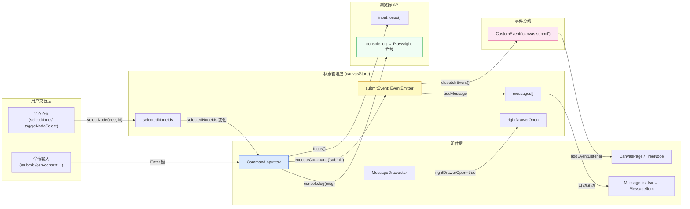
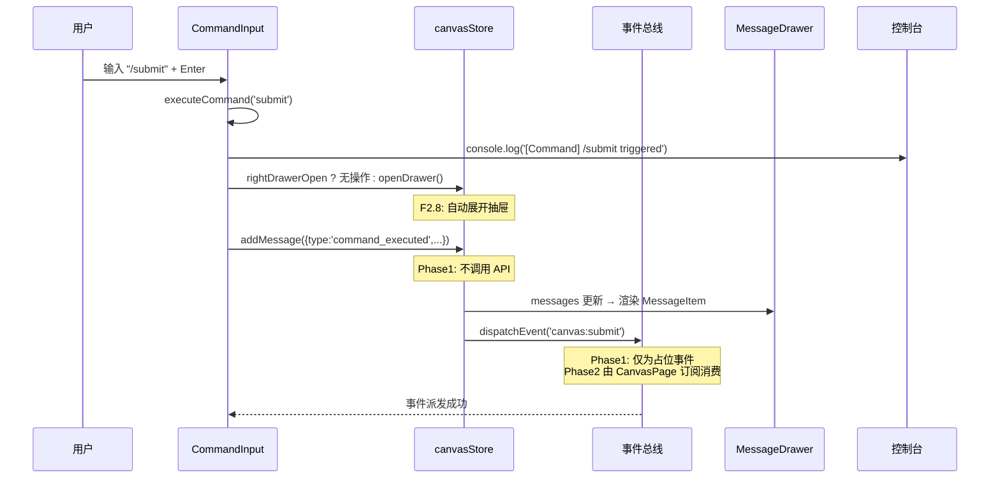
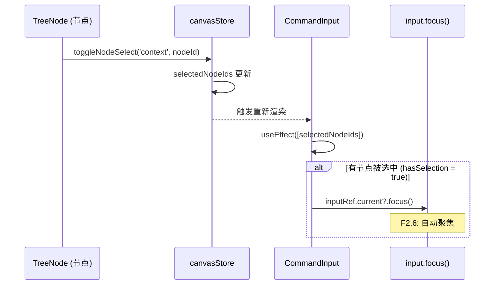

# Architecture: E2 — 画布消息抽屉 Phase1

**Agent**: architect (sub-agent)
**Date**: 2026-04-02
**Output**: `/root/.openclaw/vibex/docs/proposals-20260401-9/architecture-e2.md`
**Status**: ✅ 完成

---

## 1. 问题 / 需求分析

### 1.1 已实现（read-only 分析）

| 已实现 | 位置 | 状态 |
|--------|------|------|
| MessageDrawer 容器 | `MessageDrawer.tsx` | ✅ 存在，200px 宽度固定 |
| 命令输入框 | `CommandInput.tsx` | ✅ 存在，5 个命令 |
| 命令过滤（F2.4） | `CommandInput.tsx` | ✅ 已实现（nodeRequired + keyword） |
| 消息追加 | `messageDrawerStore.addCommandMessage` | ✅ 已存在（第 79 行 console.log） |
| 抽屉状态读取 | `canvasStore.rightDrawerOpen` | ✅ 存在 |

### 1.2 缺失功能（Phase1 必须实现）

| 缺失项 | 优先级 | 说明 |
|--------|--------|------|
| **F2.5**: `/submit` 触发画布提交事件 | P0 | 需在 canvasStore 中定义 `submitCanvas` 方法 |
| **F2.6**: 节点点选后自动聚焦命令输入框 | P0 | 需监听 `selectedNodeIds` 变化，调用 `inputRef.current.focus()` |
| **F2.7**: 控制台日志可查询验证 | P0 | 现有 `console.log` 需 Playwright 可拦截验证 |
| **F2.8**: `/submit` 命令触发后抽屉自动展开 | P0 | 抽屉 closed 时执行命令应自动 open |

### 1.3 约束边界

- **不改现有 RightDrawer 逻辑**（如果有 RightDrawer.tsx，独立于 MessageDrawer）
- **Phase1 不调用任何后端 API**，只触发前端事件
- **200px 宽度已确定**，不作为变量
- **向后兼容** `canvasStore` 所有现有字段和方法

---

## 2. 架构图

### 2.1 整体数据流



### 2.2 `/submit` 命令执行序列图



### 2.3 节点选中断言序列图



---

## 3. API 定义

### 3.1 canvasStore 扩展

**文件**: `src/lib/canvas/canvasStore.ts`

```typescript
// ── 3.1.1 抽屉自动展开（F2.8）────────────────────────────────────────────

/** 抽屉自动展开（命令执行时） */
openRightDrawer: () => void;

/** 抽屉自动展开实现 */
openRightDrawer: () => set({ rightDrawerOpen: true }),

// ── 3.1.2 /submit 画布提交事件（F2.5）─────────────────────────────────────

/** Phase1: 派发 canvas:submit 事件（不调用 API）
 * Phase2: 此方法将扩展为实际 API 调用
 */
submitCanvas: () => void;

/** 提交事件实现 */
submitCanvas: () => {
  // 1. 确保抽屉已展开
  set((s) => ({ rightDrawerOpen: true }));

  // 2. 追加系统消息
  const msgId = `msg-${Date.now()}-${++_messageIdCounter}`;
  const msg: MessageItem = {
    id: msgId,
    type: 'command_executed',
    content: '画布已提交（Phase1 占位事件）',
    meta: '/submit',
    timestamp: Date.now(),
  };
  set((s) => ({ messages: [...s.messages, msg] }));

  // 3. 派发原生 DOM 事件（供 CanvasPage 订阅）
  if (typeof window !== 'undefined') {
    window.dispatchEvent(new CustomEvent('canvas:submit', {
      detail: { timestamp: Date.now(), nodeCount: get().contextNodes.length },
    }));
  }

  console.log('[Command] /submit triggered — canvas submit event dispatched');
},
```

### 3.2 CommandInput 扩展

**文件**: `src/components/canvas/messageDrawer/CommandInput.tsx`

```typescript
// ── 3.2.1 节点选中自动聚焦（F2.6）─────────────────────────────────────────

/** useEffect 监听 selectedNodeIds 变化 */
useEffect(() => {
  if (hasSelection && inputRef.current) {
    // 延迟聚焦，等待 selection 视觉更新
    const timer = setTimeout(() => {
      inputRef.current?.focus();
    }, 50);
    return () => clearTimeout(timer);
  }
}, [hasSelection]);

// ── 3.2.2 /submit 命令执行扩展（F2.5 + F2.8）───────────────────────────────

const executeCommand = useCallback((commandId: CommandId) => {
  const cmd = ALL_COMMANDS.find((c) => c.id === commandId);
  if (!cmd) return;

  if (cmd.id === 'submit') {
    // F2.5: 触发画布提交事件
    useCanvasStore.getState().submitCanvas();
  } else {
    // D6: 其他命令仅 console.log
    const logMsg = `[Command] ${cmd.label} triggered`;
    console.log(logMsg);
    addCommandMessage(cmd.label, logMsg);
    // F2.8: 确保抽屉展开
    const { rightDrawerOpen, openRightDrawer } = useCanvasStore.getState();
    if (!rightDrawerOpen) openRightDrawer();
  }

  setIsCommandListOpen(false);
  setInputValue('');
}, []);
```

### 3.3 事件接口

**文件**: `src/types/canvasEvents.ts`（新建）

```typescript
/**
 * canvasEvents.ts — 画布事件类型定义
 * Phase1 事件总线
 */

/** canvas:submit 事件负载 */
export interface CanvasSubmitEventDetail {
  timestamp: number;
  nodeCount: number;
  contextNodes: string[];   // nodeId 列表
  flowNodes: string[];      // nodeId 列表
}

/** 全局事件类型注册 */
declare global {
  interface GlobalEventHandlersEventMap {
    'canvas:submit': CustomEvent<CanvasSubmitEventDetail>;
  }
}

export {};
```

---

## 4. 修改文件清单

### 4.1 新建文件

| 文件路径 | 用途 | 工时估算 |
|---------|------|---------|
| `src/types/canvasEvents.ts` | 事件类型定义 | 0.5h |
| `src/components/canvas/messageDrawer/__tests__/CommandInput.e2e.spec.ts` | Playwright E2E 测试 | 1h |

### 4.2 修改文件

| 文件 | 修改内容 | 风险 |
|------|---------|------|
| `src/lib/canvas/canvasStore.ts` | 新增 `openRightDrawer()`、`submitCanvas()` 方法 | 低（向后兼容） |
| `src/components/canvas/messageDrawer/CommandInput.tsx` | 自动聚焦 + `/submit` 事件 + 自动展开抽屉 | 低 |
| `src/components/canvas/messageDrawer/MessageDrawer.module.css` | 确认 200px 宽度（如未锁定） | 低 |
| `src/components/canvas/CanvasPage.tsx` | 可选：订阅 `canvas:submit` 事件（Phase1 为空实现） | 低 |

### 4.3 不修改文件（约束）

| 文件 | 原因 |
|------|------|
| 现有 `RightDrawer.tsx`（如有） | Phase1 不改现有逻辑 |
| `messageDrawerStore.ts` | 已满足需求 |
| `MessageList.tsx` | 自动滚动已实现 |
| `MessageItem.tsx` | 无需改动 |

---

## 5. 测试策略

### 5.1 Playwright E2E 验收用例

```typescript
// src/components/canvas/messageDrawer/__tests__/CommandInput.e2e.spec.ts

import { test, expect } from '@playwright/test';

test.describe('E2: 画布消息抽屉 Phase1', () => {

  test.beforeEach(async ({ page }) => {
    await page.goto('/canvas');
    // 打开抽屉（默认关闭）
    await page.locator('[data-testid="message-drawer"]').waitFor();
  });

  // ── F2.5: /submit 触发事件 ─────────────────────────────────────────────

  test('/submit triggers canvas:submit event', async ({ page }) => {
    // 监听自定义事件
    const events: string[] = [];
    await page.evaluate(() => {
      window.addEventListener('canvas:submit', (e: Event) => {
        const custom = e as CustomEvent;
        window.__submitEvents = window.__submitEvents || [];
        (window.__submitEvents as any[]).push(custom.detail);
      });
    });

    // 输入 /submit 命令
    const input = page.locator('[data-testid="drawer-command-input"]');
    await input.fill('/submit');
    await input.press('Enter');

    // 验证事件派发
    const submitEvents = await page.evaluate(() => (window as any).__submitEvents);
    expect(submitEvents?.length).toBeGreaterThan(0);
    expect(submitEvents[0]).toHaveProperty('timestamp');
    expect(submitEvents[0]).toHaveProperty('nodeCount');
  });

  // ── F2.6: 节点选中自动聚焦 ──────────────────────────────────────────────

  test('node selection auto-focuses command input', async ({ page }) => {
    const input = page.locator('[data-testid="drawer-command-input"]');

    // 确保输入框未聚焦
    await page.locator('body').click();
    await expect(input).not.toBeFocused();

    // 点选一个节点（选中任意树节点）
    const firstNode = page.locator('[data-testid^="context-node-"]').first();
    await firstNode.click();

    // 等待聚焦延迟（50ms + buffer）
    await page.waitForTimeout(150);
    await expect(input).toBeFocused();
  });

  // ── F2.7: 控制台日志可拦截 ──────────────────────────────────────────────

  test('command logs to console', async ({ page }) => {
    const consoleLogs: string[] = [];
    page.on('console', (msg) => {
      if (msg.type() === 'log') consoleLogs.push(msg.text());
    });

    const input = page.locator('[data-testid="drawer-command-input"]');
    await input.fill('/submit');
    await input.press('Enter');

    await page.waitForTimeout(100);
    const cmdLog = consoleLogs.find((l) => l.includes('[Command] /submit'));
    expect(cmdLog).toBeDefined();
    expect(cmdLog).toContain('/submit');
  });

  // ── F2.8: 命令执行自动展开抽屉 ─────────────────────────────────────────

  test('command execution auto-opens closed drawer', async ({ page }) => {
    const drawer = page.locator('[data-testid="message-drawer"]');

    // 关闭抽屉
    await page.keyboard.press('Escape'); // 假设有快捷键关闭
    // 或通过 store 关闭抽屉
    await page.evaluate(() => {
      // 强制关闭（模拟用户关闭）
      const state = (window as any).__zustandStore?.getState?.();
      if (state?.setRightDrawerOpen) state.setRightDrawerOpen(false);
    });

    // 重新打开并关闭
    await drawer.click(); // 打开
    await drawer.click(); // 关闭

    // 通过输入框点击手动关闭
    const closeBtn = page.locator('[data-testid="drawer-close-btn"]');
    if (await closeBtn.isVisible()) {
      await closeBtn.click();
    }

    // 等待抽屉关闭
    await expect(drawer).toHaveClass(/drawerClosed/);

    // 输入命令
    const input = page.locator('[data-testid="drawer-command-input"]');
    await input.fill('/submit');
    await input.press('Enter');

    // 验证抽屉已自动展开
    await expect(drawer).toHaveClass(/drawerOpen/);
  });

  // ── F2.3: 节点关联命令过滤（回归测试）──────────────────────────────────

  test('node selection filters available commands', async ({ page }) => {
    const input = page.locator('[data-testid="drawer-command-input"]');

    // 输入 "/" 展开命令列表
    await input.fill('/');
    await page.waitForTimeout(50);

    // 无节点选中时，命令列表应包含 /update-card（nodeRequired=true 但被过滤）
    // 根据现有逻辑：nodeRequired=true + hasSelection=false → /update-card 被隐藏
    const commandItems = page.locator('[data-testid^="command-item-"]');
    const countWithoutSelection = await commandItems.count();

    // 点选一个节点
    await page.locator('[data-testid^="context-node-"]').first().click();
    await input.fill('/');
    await page.waitForTimeout(50);

    // 有节点选中时，/update-card 可见
    const countWithSelection = await commandItems.count();
    expect(countWithSelection).toBeGreaterThanOrEqual(countWithoutSelection);
  });

  // ── 抽屉 200px 宽度验证 ─────────────────────────────────────────────────

  test('drawer width is fixed 200px', async ({ page }) => {
    await page.setViewportSize({ width: 1440, height: 900 });
    const drawer = page.locator('[data-testid="message-drawer"]');
    await drawer.waitFor();
    const box = await drawer.boundingBox();
    expect(box?.width).toBeCloseTo(200, 1);
  });

});
```

### 5.2 Vitest 单元测试（扩展现有）

```typescript
// src/components/canvas/__tests__/CommandInput.test.tsx 扩展

test('executeCommand submit calls canvasStore.submitCanvas', () => {
  const submitCanvas = vi.fn();
  vi.mocked(useCanvasStore.getState).mockReturnValue({
    submitCanvas,
    rightDrawerOpen: true,
    openRightDrawer: vi.fn(),
    addMessage: vi.fn(),
  } as any);

  render(<CommandInput />);
  const input = screen.getByTestId('drawer-command-input');

  fireEvent.change(input, { target: { value: '/submit' } });
  fireEvent.keyDown(input, { key: 'Enter' });

  expect(submitCanvas).toHaveBeenCalledOnce();
});

test('node selection triggers auto-focus', () => {
  const { rerender } = render(<CommandInput />);

  // 模拟 hasSelection = false → true
  vi.mocked(useCanvasStore).mockReturnValue({
    selectedNodeIds: { context: [], flow: [], component: [] },
    hasSelection: false, // 模拟
  } as any);

  rerender(<CommandInput />);

  const input = screen.getByTestId('drawer-command-input');
  expect(document.activeElement).not.toBe(input);

  // 模拟选中节点
  vi.mocked(useCanvasStore).mockReturnValue({
    selectedNodeIds: { context: ['node-1'], flow: [], component: [] },
    hasSelection: true,
  } as any);

  rerender(<CommandInput />);
  // 聚焦在 setTimeout 中，需 advanceTimersByTime
  vi.advanceTimersByTime(100);
  expect(document.activeElement).toBe(input);
});
```

### 5.3 覆盖率目标

| 测试类型 | 覆盖率目标 | 关键断言 |
|---------|-----------|---------|
| Vitest | 85%+ | store 方法 + 组件逻辑 |
| Playwright E2E | 100% PRD | 所有 F2.x 验收用例 |
| gstack browse | 截图验证 | 抽屉 UI + 聚焦效果 |

---

## 6. 与现有 RightDrawer 的共存策略

### 6.1 架构隔离原则

```
┌─────────────────────────────────────────────────────────┐
│                     CanvasPage                          │
│  ┌──────────────┐  ┌──────────────────┐  ┌──────────┐  │
│  │ LeftDrawer   │  │   三列 Canvas    │  │ Message  │  │
│  │ (树形结构)   │  │  (核心画布区域)   │  │ Drawer   │  │
│  │              │  │                  │  │ (200px)  │  │
│  │ leftDrawerOpen│  │                  │  │rightDrawer│  │
│  └──────────────┘  └──────────────────┘  │  Open   │  │
│                                          └──────────┘  │
│                                                         │
│  独立 Store Slice:                    独立 Store Slice:  │
│  leftDrawerOpen (canvasStore)        rightDrawerOpen   │
│                                       (canvasStore)     │
│                                                         │
│  独立组件:                        独立组件:             │
│  LeftDrawer.tsx                    MessageDrawer.tsx    │
│                                     CommandInput.tsx   │
└─────────────────────────────────────────────────────────┘
```

### 6.2 共存规则

| 规则 | 说明 |
|------|------|
| **状态隔离** | `leftDrawerOpen` / `rightDrawerOpen` 分属不同 slice，无耦合 |
| **组件独立** | `LeftDrawer.tsx`（左侧树形菜单）和 `MessageDrawer.tsx`（右侧消息抽屉）独立渲染 |
| **不共享 DOM** | 两个抽屉渲染在不同 DOM 位置，无交集 |
| **Phase1 范围** | 不修改 `LeftDrawer.tsx` 任何逻辑 |
| **未来扩展** | Phase2 开始考虑左右抽屉联动（如：打开一个关闭另一个） |

### 6.3 冲突避免机制

```typescript
// canvasStore 中的左右抽屉状态完全独立
interface CanvasStore {
  // Left drawer
  leftDrawerOpen: boolean;
  toggleLeftDrawer: () => void;

  // Right drawer (MessageDrawer)
  rightDrawerOpen: boolean;
  toggleRightDrawer: () => void;
  openRightDrawer: () => void;   // ← 新增（F2.8）
  submitCanvas: () => void;      // ← 新增（F2.5）
}
```

---

## 7. 实施顺序

| 步骤 | 工时 | 任务 | 验证 |
|------|------|------|------|
| 1 | 0.5h | 新建 `canvasEvents.ts` 类型定义 | `tsc --noEmit` |
| 2 | 0.5h | canvasStore 新增 `openRightDrawer` + `submitCanvas` | Vitest 通过 |
| 3 | 1h | CommandInput 扩展：自动聚焦 + `/submit` 事件 + 自动展开 | Vitest 通过 |
| 4 | 0.5h | CanvasPage 可选订阅（Phase1 空实现） | 无变更 |
| 5 | 1h | Playwright E2E 测试编写 | 所有 6 个用例通过 |
| 6 | 0.5h | gstack browse 截图验证 | 截图存档 |
| **合计** | **4h** | **Phase1 全部完成** | |

> **注意**: Phase1 估算 4h，PRD 上限 8-10h（含调试 + 边界情况处理）。Phase1 核心流程 4h 交付，剩余时间用于边界情况和文档完善。

---

## 执行决策

- **决策**: 已采纳
- **执行项目**: proposals-20260401-9
- **执行日期**: 2026-04-02
