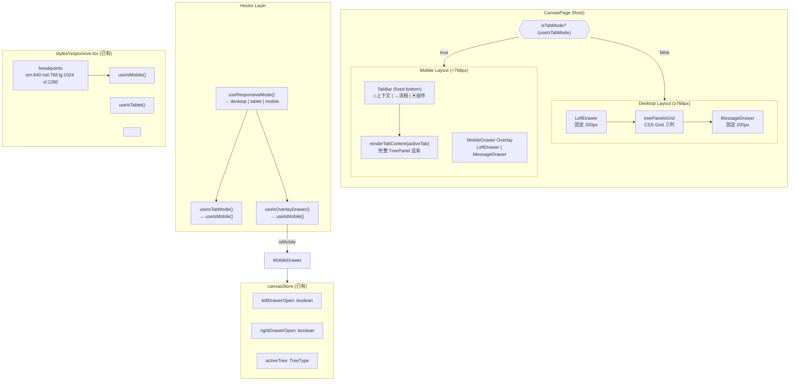
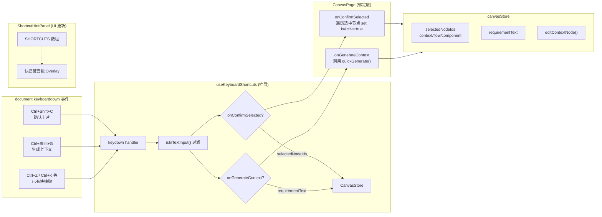

# E3 + E4 架构设计

**Epic**: Sprint 3 — Responsive Layout (E3) + Keyboard Shortcuts (E4)  
**作者**: architect  
**日期**: 2026-04-02  
**状态**: 已完成

---

## 执行决策

- **E3 决策**: 已采纳
- **E3 执行项目**: proposals-20260401-9/E3-responsive-layout
- **E3 执行日期**: 2026-04-02

- **E4 决策**: 已采纳
- **E4 执行项目**: proposals-20260401-9/E4-keyboard-shortcuts
- **E4 执行日期**: 2026-04-02

---

## E3: 响应式布局架构

### 1. 现状分析

| 组件 | 状态 | 说明 |
|------|------|------|
| `styles/responsive.tsx` | ✅ 存在 | breakpoints (sm:640, md:768, lg:1024, xl:1280)、`useIsMobile/Tablet/Desktop()`、`<Show>/<Hide>` 组件 |
| `useKeyboardShortcuts` hook | ✅ 存在 | 全局键盘事件监听，绑定 undo/redo/search/zoom/delete 等 |
| `ShortcutHintPanel.tsx` | ✅ 存在 | `SHORTCUTS` 数组硬编码快捷键列表 |
| Canvas 三列 Grid | ✅ 存在 | `.treePanelsGrid` CSS Grid 三列布局 |
| TabBar 移动端布局 | ⚠️ 半存在 | `CanvasPage` 有 `useTabMode` prop，但未自动激活 |
| 移动端抽屉 | ⚠️ 不存在 | LeftDrawer / MessageDrawer 在 <768px 下未做 overlay 化 |

**问题**:
- `useTabMode` 是 prop 传入，需改为自动检测
- 移动端无 overlay 抽屉（LeftDrawer 和 MessageDrawer 固定在桌面端布局内）
- TabBar 在桌面端始终显示，移动端应只在 Tab 模式可见

### 2. 三断点设计

```
┌─────────────────────────┬────────────────────────┬────────────────────────┐
│  ≥ 1280px (xl)          │  768px – 1279px (md)  │  < 768px (sm)         │
├─────────────────────────┼────────────────────────┼────────────────────────┤
│ 三列 Grid 完整展示       │ 三列 Grid（列宽调整）   │ Tab 切换 + Overlay 抽屉 │
│ LeftDrawer + MessageDrawer│ LeftDrawer + MessageDrawer│ LeftDrawer / MessageDrawer  │
│ 固定宽度 200px           │ 固定宽度 200px         │ overlay 模式（点击展开）  │
└─────────────────────────┴────────────────────────┴────────────────────────┘
```

| 断点 | 键 | 宽度 | 布局策略 |
|------|----|------|----------|
| `xl` 及以上 | `xl` | ≥1280px | 完整三列 Grid，drawer 固定侧边 |
| `lg` | `lg` | 1024–1279px | 三列 Grid 列宽缩小（minmax 调整）|
| `md` | `md` | 768–1023px | 三列 Grid 列宽最小化，drawer 宽度减半 |
| `sm` | `sm` | <768px | **Tab 模式**（树/画布/抽屉 Tab 切换）+ overlay 抽屉 |

**CSS 媒体查询决策**:
- **桌面端布局**（≥768px）：CSS Grid + CSS 媒体查询 — 不破坏现有 JS 逻辑
- **移动端 Tab 模式**（<768px）：CSS Grid 替换为 `display: flex; flex-direction: column` + JS Tab 状态
- **理由**：移动端布局变化较大（Grid → Flex + Tab），纯 CSS 实现 Tab 切换需要 `:checked` 或 `:focus-within` hack，维护性差；JS 条件渲染可读性更好，且 React 生态中移动端布局普遍用条件渲染

### 3. 新增 Hook: `useResponsiveMode`

```typescript
// src/hooks/canvas/useResponsiveMode.ts

import { useIsMobile, useIsTablet } from '@/styles/responsive';

export type CanvasLayoutMode = 'desktop' | 'tablet' | 'mobile';

/**
 * Canvas 响应式布局模式 Hook
 * 移动端优先判断，返回当前布局模式
 */
export function useResponsiveMode(): CanvasLayoutMode {
  const isMobile = useIsMobile();
  const isTablet = useIsTablet();

  if (isMobile) return 'mobile';
  if (isTablet) return 'tablet';
  return 'desktop';
}

/**
 * 是否显示移动端 Tab 切换
 */
export function useIsTabMode(): boolean {
  return useIsMobile();
}

/**
 * 是否启用 overlay 抽屉（移动端）
 */
export function useIsOverlayDrawer(): boolean {
  return useIsMobile();
}
```

### 4. CanvasPage 改造

```typescript
// 修改 CanvasPage.tsx

import { useIsTabMode, useIsOverlayDrawer } from '@/hooks/canvas/useResponsiveMode';
import { MobileDrawer } from './mobile/MobileDrawer';

// 在组件内部：
const isTabMode = useIsTabMode();          // 自动判断
const isOverlayDrawer = useIsOverlayDrawer(); // 移动端 overlay

// 删除 useTabMode prop，改为自动检测
// export function CanvasPage({ useTabMode = false })  ← 移除 prop
```

### 5. 移动端 Tab 切换实现

**已有基础**（`CanvasPage` 内 `useTabMode` 分支）:
```tsx
{useTabMode ? (
  <div className={styles.canvasMobile}>
    <div className={styles.tabBar} role="tablist">
      {(['context', 'flow', 'component'] as TreeType[]).map((t) => (
        <button key={t} role="tab" aria-selected={activeTab === t}
          className={styles.tabButton}
          onClick={() => setActiveTab(t)}>
          {t === 'context' ? '◇ 上下文' : t === 'flow' ? '→ 流程' : '▣ 组件'}
        </button>
      ))}
    </div>
    <div className={styles.tabContent}>
      {renderTabContent(activeTab, ...)}
    </div>
  </div>
) : (/* Desktop Grid */)}
```

**需增强**:
1. Tab 激活时显示节点计数徽章（已有 `TabBar` 组件，`activeTree` store 驱动）
2. 切换 Tab 时保持节点状态（已通过 store 保留，✅ 无需改造）
3. Tab 内容区域使用 `position: relative; height: 100%; overflow-y: auto`
4. 移动端 Tab 高度固定 48px，底部安全区域 `env(safe-area-inset-bottom)`

### 6. Overlay 抽屉实现

**方案**: 新建 `MobileDrawer` 组件，挂载在 `CanvasPage` 根层级

```tsx
// src/components/canvas/mobile/MobileDrawer.tsx

'use client';
import React, { useCallback } from 'react';
import { useCanvasStore } from '@/lib/canvas/canvasStore';
import { LeftDrawer } from '../leftDrawer/LeftDrawer';
import { MessageDrawer } from '../messageDrawer/MessageDrawer';
import styles from './mobileDrawer.module.css';

interface MobileDrawerProps {
  /** 当前活跃的 tree 类型（用于控制抽屉内容） */
  activeTree?: 'context' | 'flow' | 'component';
}

export function MobileDrawer({ activeTree = 'context' }: MobileDrawerProps) {
  const leftDrawerOpen = useCanvasStore((s) => s.leftDrawerOpen);
  const rightDrawerOpen = useCanvasStore((s) => s.rightDrawerOpen);
  const toggleLeftDrawer = useCanvasStore((s) => s.toggleLeftDrawer);
  const toggleRightDrawer = useCanvasStore((s) => s.toggleRightDrawer);

  const hasBackdrop = leftDrawerOpen || rightDrawerOpen;

  return (
    <>
      {/* Backdrop */}
      {hasBackdrop && (
        <div
          className={styles.drawerBackdrop}
          onClick={() => {
            if (leftDrawerOpen) toggleLeftDrawer();
            if (rightDrawerOpen) toggleRightDrawer();
          }}
          aria-hidden="true"
        />
      )}

      {/* Left Drawer Overlay */}
      <div
        className={`${styles.mobileDrawer} ${styles.mobileDrawerLeft} ${
          leftDrawerOpen ? styles.mobileDrawerOpen : ''
        }`}
        role="dialog"
        aria-label="左侧面板"
      >
        <LeftDrawer />
      </div>

      {/* Right Drawer Overlay */}
      <div
        className={`${styles.mobileDrawer} ${styles.mobileDrawerRight} ${
          rightDrawerOpen ? styles.mobileDrawerOpen : ''
        }`}
        role="dialog"
        aria-label="右侧面板"
      >
        <MessageDrawer />
      </div>
    </>
  );
}
```

**CSS Module** (`mobileDrawer.module.css`):
```css
/* 移动端抽屉宽度 */
.mobileDrawer {
  position: fixed;
  top: 0;
  width: min(85vw, 320px);
  height: 100vh;
  z-index: 100;
  background: var(--color-bg);
  box-shadow: -2px 0 8px rgba(0, 0, 0, 0.15);
  transition: transform 200ms ease-out;
}

.mobileDrawerLeft {
  left: 0;
  transform: translateX(-100%);
}
.mobileDrawerLeft.mobileDrawerOpen {
  transform: translateX(0);
}

.mobileDrawerRight {
  right: 0;
  transform: translateX(100%);
}
.mobileDrawerRight.mobileDrawerOpen {
  transform: translateX(0);
}

/* Backdrop */
.drawerBackdrop {
  position: fixed;
  inset: 0;
  background: rgba(0, 0, 0, 0.5);
  z-index: 99;
  backdrop-filter: blur(2px);
}

/* 移动端 Tab 栏固定底部 */
@media (max-width: 768px) {
  .tabBarWrapper {
    position: fixed;
    bottom: 0;
    left: 0;
    right: 0;
    padding-bottom: env(safe-area-inset-bottom, 0);
  }
}
```

**抽屉触发器**:
- 移动端 Tab 栏上方添加两个浮动按钮：`☰`（左侧抽屉）和 `💬`（右侧抽屉）
- 点击展开对应 overlay 抽屉

```tsx
// 在 CanvasPage 移动端 tab 栏内
{isOverlayDrawer && (
  <div className={styles.mobileDrawerTriggers}>
    <button onClick={toggleLeftDrawer} aria-label="打开左侧面板">☰</button>
    <button onClick={toggleRightDrawer} aria-label="打开右侧面板">💬</button>
  </div>
)}
```

### 7. E3 Mermaid 架构图



---

## E4: 快捷键架构

### 1. 现状分析

| 快捷键 | 状态 | 实现位置 |
|--------|------|----------|
| Ctrl+Z / Cmd+Z | ✅ 存在 | `useKeyboardShortcuts` |
| Ctrl+Shift+Z | ✅ 存在 | `useKeyboardShortcuts` |
| Ctrl+K | ✅ 存在 | `useKeyboardShortcuts` |
| / | ✅ 存在 | `useKeyboardShortcuts` |
| Del/Backspace | ✅ 存在 | `useKeyboardShortcuts` |
| Ctrl+G (快速生成) | ✅ 存在 | `useKeyboardShortcuts` |
| Alt+1/2/3 (Tab 切换) | ✅ 存在 | `useKeyboardShortcuts` |
| Ctrl+Shift+C (确认卡片) | ❌ **缺失** | 需新增 |
| Ctrl+Shift+G (生成上下文) | ❌ **缺失** | 需新增 |

**`ShortcutHintPanel.tsx` SHORTCUTS 数组当前内容**（需新增 2 项）:
```typescript
// 当前缺失：
// { keys: ['Ctrl', 'Shift', 'C'], description: '确认选中卡片' },
// { keys: ['Ctrl', 'Shift', 'G'], description: '生成上下文' }
```

**全局 keyboard event listener 挂载位置**: `useKeyboardShortcuts` hook 内部，`document.addEventListener('keydown', handler)` — 挂载在 `CanvasPage` 渲染时，无需改造挂载位置。

### 2. 快捷键设计

| 快捷键 | 功能 | 触发条件 | 副作用 |
|--------|------|----------|--------|
| `Ctrl+Shift+C` | 确认选中卡片 | 非输入框 | `handleConfirmSelected()` |
| `Ctrl+Shift+G` | 生成上下文 | 非输入框 | `handleGenerateContext()` |

**Ctrl+Shift 避免冲突**:
- `Ctrl+Shift+C` — Gmail / VS Code 等均用此组合，无浏览器默认冲突 ✅
- `Ctrl+Shift+G` — VS Code 用作多光标，浏览器无默认 ✅
- 两个组合均满足约束，无需 fallback 或 warning

### 3. `useKeyboardShortcuts` 扩展

```typescript
// src/hooks/useKeyboardShortcuts.ts

interface KeyboardShortcutsOptions {
  // ... 已有字段 ...

  /** 确认选中卡片: Ctrl+Shift+C */
  onConfirmSelected?: () => void;
  /** 生成上下文: Ctrl+Shift+G */
  onGenerateContext?: () => void;
}

// handler 内新增：
// === Confirm Selected: Ctrl+Shift+C ===
if ((isCtrl || isMeta) && e.shiftKey && e.key.toLowerCase() === 'c') {
  if (isInputFocused) return;
  e.preventDefault();
  onConfirmSelected?.();
  return;
}

// === Generate Context: Ctrl+Shift+G ===
if ((isCtrl || isMeta) && e.shiftKey && e.key.toLowerCase() === 'g') {
  if (isInputFocused) return;
  e.preventDefault();
  onGenerateContext?.();
  return;
}
```

### 4. CanvasPage 绑定

```typescript
// CanvasPage.tsx

useKeyboardShortcuts({
  // ... 已有绑定 ...
  onConfirmSelected: () => {
    // 遍历 selectedNodeIds.context/flow/component
    // 将 isActive 设为 true（确认状态）
    // 等价于 BoundedContextTree 中的 handleConfirmAll 但作用于选中项
    const store = useCanvasStore.getState();
    const selected = store.selectedNodeIds;
    if (selected.context.length > 0) {
      selected.context.forEach((id) => {
        const node = store.contextNodes.find((n) => n.nodeId === id);
        if (node) store.editContextNode(id, { isActive: true });
      });
    }
    if (selected.flow.length > 0) {
      selected.flow.forEach((id) => {
        store.editFlowNode(id, { isActive: true });
      });
    }
    if (selected.component.length > 0) {
      selected.component.forEach((id) => {
        store.editComponentNode(id, { isActive: true });
      });
    }
  },
  onGenerateContext: () => {
    // 选中节点后，调用 AI 生成上下文
    // 等价于点击"重新执行"按钮的行为
    quickGenerate();
  },
});
```

### 5. ShortcutHintPanel 更新

```typescript
// ShortcutHintPanel.tsx — SHORTCUTS 数组新增两项

const SHORTCUTS: ShortcutItem[] = [
  // ... 现有快捷键 ...
  { keys: ['Ctrl', 'Shift', 'C'], description: '确认选中卡片' },
  { keys: ['Ctrl', 'Shift', 'G'], description: '生成上下文' },
];
```

### 6. E4 Mermaid 架构图



---

## 修改文件清单

### E3: 响应式布局

| 文件 | 操作 | 说明 |
|------|------|------|
| `src/hooks/canvas/useResponsiveMode.ts` | **新增** | `useResponsiveMode` / `useIsTabMode` / `useIsOverlayDrawer` hooks |
| `src/components/canvas/mobile/MobileDrawer.tsx` | **新增** | 移动端 overlay 抽屉组件 |
| `src/components/canvas/mobile/mobileDrawer.module.css` | **新增** | 移动端抽屉 CSS（含 backdrop + slide-in） |
| `src/components/canvas/canvas.module.css` | **修改** | 添加 `@media (max-width: 768px)` 响应式规则 |
| `src/components/canvas/CanvasPage.tsx` | **修改** | 删除 `useTabMode` prop，改用 `useIsTabMode()` 自动检测；移动端 Tab 栏添加抽屉触发按钮 |
| `src/components/canvas/TabBar.tsx` | **修改** | 移动端固定底部样式，添加 safe-area 支持 |

### E4: 快捷键

| 文件 | 操作 | 说明 |
|------|------|------|
| `src/hooks/useKeyboardShortcuts.ts` | **修改** | 新增 `onConfirmSelected` / `onGenerateContext` 参数和对应 handler 分支 |
| `src/components/canvas/features/ShortcutHintPanel.tsx` | **修改** | SHORTCUTS 数组新增 Ctrl+Shift+C / Ctrl+Shift+G 两项 |
| `src/components/canvas/CanvasPage.tsx` | **修改** | 绑定 `onConfirmSelected` / `onGenerateContext` 回调 |

### 测试文件（新增）

| 文件 | 说明 |
|------|------|
| `src/hooks/__tests__/useResponsiveMode.test.ts` | `useIsTabMode` / `useIsOverlayDrawer` hook 测试 |
| `src/components/canvas/__tests__/MobileDrawer.test.tsx` | 移动端抽屉 overlay 测试 |
| `src/hooks/__tests__/useKeyboardShortcuts.test.ts` | 扩展后快捷键测试（已有文件追加） |

---

## 测试策略

### E3: 响应式布局

**测试框架**: Playwright + Vitest  
**覆盖率目标**: > 80%（组件逻辑覆盖）

#### 断点测试（Playwright）

```typescript
// e2e/responsive.spec.ts

test.describe('E3 响应式布局断点测试', () => {

  test('≥1280px: 三列 Grid 布局，drawer 固定侧边', async ({ page }) => {
    await page.setViewportSize({ width: 1440, height: 900 });
    await page.goto('/editor');
    await expect(page.locator('[class*="treePanelsGrid"]')).toBeVisible();
    await expect(page.locator('[class*="canvasMobile"]')).not.toBeVisible();
  });

  test('768px-1279px: 三列 Grid 列宽调整', async ({ page }) => {
    await page.setViewportSize({ width: 900, height: 900 });
    await page.goto('/editor');
    await expect(page.locator('[class*="treePanelsGrid"]')).toBeVisible();
  });

  test('<768px: Tab 模式激活，桌面 Grid 隐藏', async ({ page }) => {
    await page.setViewportSize({ width: 375, height: 667 });
    await page.goto('/editor');
    await expect(page.locator('[class*="canvasMobile"]')).toBeVisible();
    await expect(page.locator('[class*="treePanelsGrid"]')).not.toBeVisible();
  });

  test('<768px: Tab 切换保持节点状态', async ({ page }) => {
    await page.setViewportSize({ width: 375, height: 667 });
    await page.goto('/editor');
    await page.click('text=→ 流程');
    await expect(page.locator('[class*="tabButtonActive"]')).toContainText('流程');
    // 切回上下文节点仍存在
    await page.click('text=◇ 上下文');
    await expect(page.locator('[data-node-id]')).toHaveCount(3, { timeout: 5000 });
  });

  test('<768px: 移动端抽屉 trigger 按钮显示', async ({ page }) => {
    await page.setViewportSize({ width: 375, height: 667 });
    await page.goto('/editor');
    await expect(page.locator('[aria-label="打开左侧面板"]')).toBeVisible();
    await expect(page.locator('[aria-label="打开右侧面板"]')).toBeVisible();
  });

  test('<768px: 点击抽屉 trigger 展开 overlay 抽屉 + backdrop', async ({ page }) => {
    await page.setViewportSize({ width: 375, height: 667 });
    await page.goto('/editor');
    await page.click('[aria-label="打开右侧面板"]');
    await expect(page.locator('[class*="drawerBackdrop"]')).toBeVisible();
    await expect(page.locator('[aria-label="右侧面板"]')).toBeVisible();
    await page.click('[class*="drawerBackdrop"]');
    await expect(page.locator('[class*="drawerBackdrop"]')).not.toBeVisible();
  });
});
```

#### 单元测试（Vitest）

```typescript
// src/hooks/__tests__/useResponsiveMode.test.ts

import { renderHook } from '@testing-library/react';
import { useIsTabMode, useIsOverlayDrawer } from '../useResponsiveMode';

describe('useResponsiveMode', () => {
  it('useIsTabMode: window.innerWidth < 768 → true', () => {
    // Mock matchMedia
  });

  it('useIsOverlayDrawer: window.innerWidth < 768 → true', () => {
    // Mock matchMedia
  });
});
```

### E4: 快捷键

**测试框架**: Vitest + Playwright

```typescript
// src/hooks/__tests__/useKeyboardShortcuts.test.ts（扩展现有文件）

describe('E4 新增快捷键', () => {

  it('Ctrl+Shift+C: 非输入框时触发 onConfirmSelected', async () => {
    const onConfirmSelected = vi.fn();
    renderHook(() => useKeyboardShortcuts({ onConfirmSelected, enabled: true }));

    document.dispatchEvent(new KeyboardEvent('keydown', {
      key: 'c', ctrlKey: true, shiftKey: true, bubbles: true,
    }));

    expect(onConfirmSelected).toHaveBeenCalledTimes(1);
  });

  it('Ctrl+Shift+C: 输入框聚焦时不触发', () => {
    const onConfirmSelected = vi.fn();
    renderHook(() => useKeyboardShortcuts({ onConfirmSelected, enabled: true }));

    const input = document.createElement('input');
    document.body.appendChild(input);
    input.focus();

    document.dispatchEvent(new KeyboardEvent('keydown', {
      key: 'c', ctrlKey: true, shiftKey: true, bubbles: true,
    }));

    expect(onConfirmSelected).not.toHaveBeenCalled();
    input.remove();
  });

  it('Ctrl+Shift+G: 触发 onGenerateContext', async () => {
    const onGenerateContext = vi.fn();
    renderHook(() => useKeyboardShortcuts({ onGenerateContext, enabled: true }));

    document.dispatchEvent(new KeyboardEvent('keydown', {
      key: 'g', ctrlKey: true, shiftKey: true, bubbles: true,
    }));

    expect(onGenerateContext).toHaveBeenCalledTimes(1);
  });
});
```

**Playwright E2E 验证**:
```typescript
test('E4: Ctrl+Shift+C 快捷键在画布中可用', async ({ page }) => {
  await page.goto('/editor');
  await page.keyboard.press('Control+Shift+c');
  // 验证选中节点状态变为 confirmed
  await expect(page.locator('[data-status="confirmed"]')).toHaveCount(1, { timeout: 3000 });
});
```

---

## 风险评估

### E3: 响应式布局

| 风险 | 等级 | 影响 | 缓解措施 |
|------|------|------|----------|
| 移动端 Tab 切换破坏现有 store 状态 | 🟡 中 | 切换 Tab 时数据丢失 | 现有实现已用 store 保持状态，`renderTabContent` 完整渲染，测试验证 |
| overlay 抽屉与现有 LeftDrawer 组件冲突 | 🟡 中 | 同一时间两个 LeftDrawer 渲染 | `useIsOverlayDrawer` 为 true 时，桌面端 LeftDrawer 条件隐藏（`<Hide on="mobile">`） |
| `window.matchMedia` SSR 兼容 | 🟢 低 | 服务端渲染报错 | `useResponsiveMode` 内 `typeof window === 'undefined'` 判断已有（参考现有 `responsive.tsx`）|
| 移动端性能（频繁重渲染） | 🟢 低 | Tab 切换卡顿 | `useIsMobile()` 依赖 `matchMedia`，仅在断点跨越时触发 re-render |
| 抽屉与 Tab 栏交互重叠（Z-index 冲突） | 🟡 中 | 抽屉遮住 Tab 栏 | MobileDrawer z-index: 99，Tab 栏 z-index: 50 |

### E4: 快捷键

| 风险 | 等级 | 影响 | 缓解措施 |
|------|------|------|----------|
| `onConfirmSelected` 操作空选中集 | 🟢 低 | 无效果但不报错 | 内部判断 `selectedNodeIds.length > 0`，否则 no-op |
| Ctrl+Shift+G 与 Ctrl+G 冲突（后者已存在） | 🟡 中 | 两个 handler 都被触发 | `e.shiftKey` 分支互斥，`Ctrl+G` → `quickGenerate`；`Ctrl+Shift+G` → `onGenerateContext`（后者为更精细的操作）|
| 快捷键在移动端（无物理键盘）无用 | 🟢 低 | 移动端无键盘，用户无感知 | 移动端不注册全局监听（`useKeyboardShortcuts` 在 `phase === 'input'` 时 disabled） |
| 新增快捷键与浏览器扩展冲突 | 🟢 低 | 极少数用户使用扩展 | Ctrl+Shift+C/G 为通用组合，冲突概率极低 |

---

## 工时估算

| 任务 | 估算工时 | 实施优先级 |
|------|----------|-----------|
| E3: `useResponsiveMode` hook | 1h | P1 |
| E3: `MobileDrawer` 组件 + CSS | 2h | P1 |
| E3: `CanvasPage` 改造（自动检测 + drawer triggers）| 1.5h | P1 |
| E3: 响应式 CSS 调整 + TabBar 底部固定 | 1.5h | P1 |
| E3: Playwright 断点测试（5 个 case）| 2h | P2 |
| E3 小计 | **8h** | |
| E4: `useKeyboardShortcuts` 扩展 | 1h | P1 |
| E4: `ShortcutHintPanel` 更新 | 0.5h | P1 |
| E4: `CanvasPage` 绑定新回调 | 1h | P1 |
| E4: 快捷键 Vitest 单元测试 | 1h | P2 |
| E4 小计 | **3.5h** | |
| **总计** | **~11.5h** | E3 5-7h + E4 3-4h 的合理范围内 |
