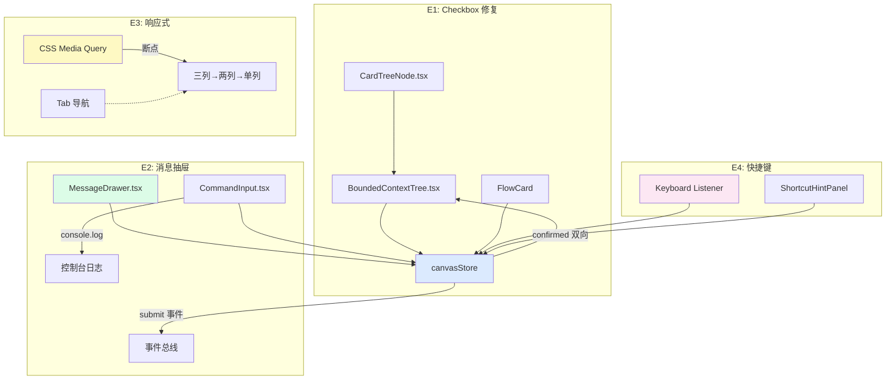

# Architecture: proposals-20260401-9 — Sprint 3

**Agent**: architect
**Date**: 2026-04-02
**Project**: proposals-20260401-9
**Status**: 🏗️ 进行中（子代理并行处理）

---

## 1. 执行摘要

Sprint 3 包含 4 个 Epic，分为两组：

| 分组 | Epic | 名称 | 工时 | 优先级 |
|------|------|------|------|--------|
| A | E1 | Canvas Checkbox 统一修复 | 4-6h | P0 |
| A | E2 | 画布消息抽屉 Phase1 | 8-10h | P0 |
| B | E3 | 响应式布局与移动端体验 | 5-7h | P1 |
| B | E4 | 键盘快捷键全覆盖 | 3-4h | P1 |

**总工时**: 20-27h
**推荐并行**: A 组（E1+E2 可并行）、B 组（E3+E4 可并行）

---

## 2. 技术栈

| 层级 | 技术 | 版本 | 说明 |
|------|------|------|------|
| 框架 | React | 18.x | 现有前端框架 |
| 语言 | TypeScript | 5.x | 现有项目规范 |
| 状态管理 | Zustand | 4.x | 现有 canvasStore |
| 样式 | CSS Modules | - | 现有样式方案 |
| 单元测试 | Vitest | 1.x | 现有测试框架 |
| E2E 测试 | Playwright | 1.x | 现有测试框架 |
| 浏览器验证 | gstack browse | - | 强制验证工具 |

**无新增依赖** — 所有 Epic 均可通过现有依赖实现。

---

## 3. Sprint 3 架构总览



---

## 4. Epic 详细架构（子代理产出）

| Epic | 详细文档 | 状态 |
|------|----------|------|
| E1 Checkbox 修复 | `architecture-e1.md` | 🏗️ 子代理处理中 |
| E2 消息抽屉 | `architecture-e2.md` | 🏗️ 子代理处理中 |
| E3+E4 响应式+快捷键 | `architecture-e3-e4.md` | 🏗️ 子代理处理中 |

---

## 5. 共享依赖分析

### 5.1 canvasStore（共享状态）

| 字段/方法 | E1 读写 | E2 读写 | E3 只读 | E4 只写 |
|-----------|---------|---------|---------|---------|
| `confirmed` 状态 | ✅ | - | - | ✅ |
| `selectedNodeIds` | ✅ | ✅ | - | ✅ |
| `rightDrawerOpen` | - | ✅ | ✅ | - |
| `submitEvent` 事件 | - | ✅ | - | - |
| 布局断点状态 | - | - | ✅ | - |

### 5.2 组件修改范围

| 组件 | E1 | E2 | E3 | E4 |
|------|----|----|----|----|
| `BoundedContextTree.tsx` | ✅ | - | - | - |
| `CardTreeNode.tsx` | ✅ | - | - | - |
| `FlowCard` | ✅ | - | - | - |
| `MessageDrawer.tsx` | - | ✅ | - | - |
| `CommandInput.tsx` | - | ✅ | - | ✅ |
| `ShortcutHintPanel.tsx` | - | - | - | ✅ |
| canvas CSS (全局) | - | - | ✅ | - |
| `canvasStore.ts` | ✅ | ✅ | - | ✅ |

---

## 6. 数据流设计

### 6.1 E1: Checkbox Toggle 数据流

```
用户点击 checkbox
  → onToggleSelect(nodeId)
  → confirmContextNode(nodeId, !currentConfirmed)
  → canvasStore 更新 confirmed 状态
  → 触发 BoundedContextTree 重新渲染（仅该节点）
```

### 6.2 E2: /submit 命令数据流

```
用户输入 /submit → Enter
  → executeCommand('submit')
  → console.log('[Command] /submit triggered')
  → addCommandMessage('/submit', '...')
  → canvasStore.submitEvent 触发（订阅者执行画布提交逻辑）
  → MessageDrawer 显示命令执行消息
```

### 6.3 E3: 响应式数据流

```
window.resize 或首次加载
  → CSS Media Query 生效
  → 布局切换（三列/两列/单列）
  → 移动端：Tab 切换激活对应面板
```

### 6.4 E4: 快捷键数据流

```
document.keydown 事件
  → 捕获 Ctrl+Shift+C / Ctrl+Shift+G
  → 调用 canvasStore 对应方法
  → 更新 UI（confirmed / 生成节点）
  → 更新 ShortcutHintPanel 状态
```

---

## 7. 性能影响评估

| Epic | 性能影响 | 评估 |
|------|----------|------|
| E1 | 极小 | 仅增加一个 toggle 分支，无额外渲染 |
| E2 | 极小 | console.log + 消息追加，O(1) |
| E3 | 轻微正向 | CSS Media Query 无 JS 开销，GPU 加速 |
| E4 | 极小 | 单一 keydown listener，O(1) |

**总体评估**: Sprint 3 无性能回退风险。

---

## 8. 测试策略

### 8.1 测试框架

- **Vitest**: 单元测试（store 方法、组件逻辑）
- **Playwright**: E2E 验收测试（所有 PRD 断言）
- **gstack browse**: 强制 UI 截图验证（断点、抽屉、快捷键效果）

### 8.2 覆盖率目标

| Epic | 覆盖率目标 | 测试类型 |
|------|-----------|----------|
| E1 | 90%+ | Vitest（store）+ Playwright（checkbox 行为）|
| E2 | 85%+ | Playwright（命令触发、日志验证）|
| E3 | 80%+ | Playwright（断点布局）+ gstack（截图）|
| E4 | 90%+ | Playwright（快捷键）+ gstack（快捷键效果）|

---

## 9. 风险评估

| 风险 | 概率 | 影响 | 缓解 |
|------|------|------|------|
| E1: toggle 逻辑影响现有 FlowCard | 低 | 中 | 先写测试，再改实现 |
| E2: `/submit` 事件与现有事件冲突 | 低 | 高 | 使用独立事件类型，不复用现有事件 |
| E3: CSS 破坏桌面端布局 | 中 | 高 | CSS Media Query 精确限定断点 |
| E4: Ctrl+Shift+G 频繁触发 | 中 | 低 | 需选中节点时才触发 |

---

## 10. 验收标准

- [ ] E1 详细架构文档已产出
- [ ] E2 详细架构文档已产出
- [ ] E3+E4 详细架构文档已产出
- [ ] IMPLEMENTATION_PLAN.md（汇总四 Epic 实施步骤）
- [ ] AGENTS.md（四 Epic 分配给 dev + tester）
- [ ] 子代理产出一致性检查

---

## 执行决策

- **决策**: 已采纳
- **执行项目**: proposals-20260401-9
- **执行日期**: 2026-04-02
