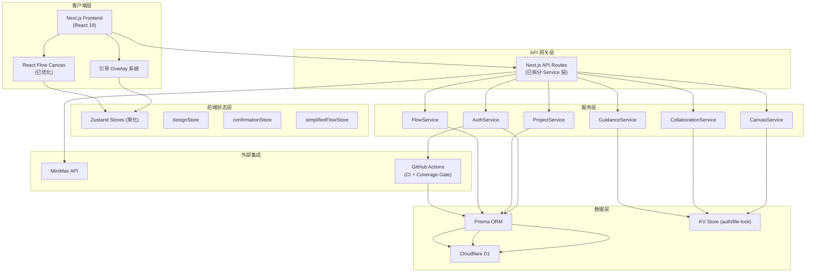
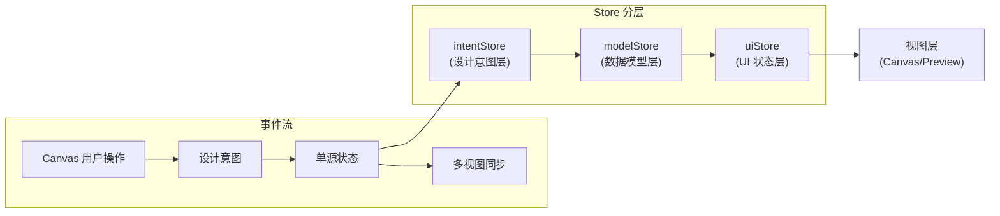
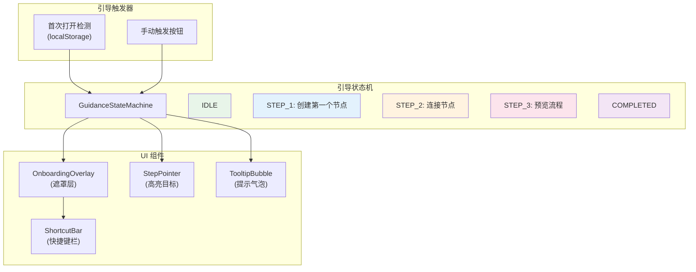
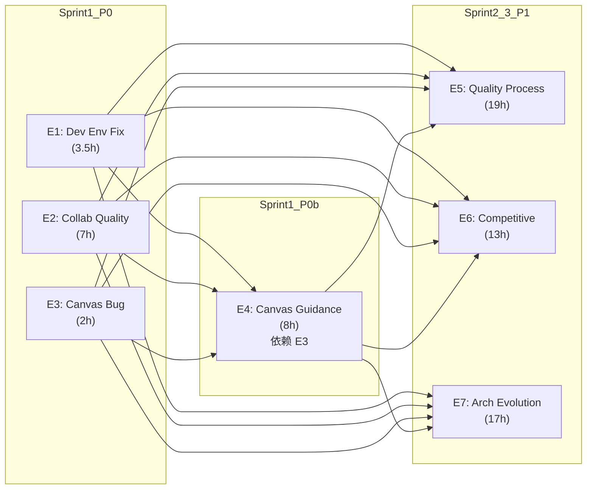

# Architecture: proposals-20260401

**Agent**: Architect
**日期**: 2026-04-01
**版本**: v1.0
**状态**: 设计完成

---

## 执行摘要

本架构文档覆盖 proposals-20260401 周期内的 7 个 Epic 的技术实施方案。基于现有 VibeX 技术栈（Next.js 14 + Cloudflare Workers + D1 + Prisma + React Flow + Zustand），在兼容现有架构的前提下，对 E1-E7 各项进行接口定义、数据模型扩展、测试策略设计，并对性能影响进行评估。

---

## 一、技术栈决策

### 1.1 现有栈确认

| 组件 | 当前版本 | 决策 | 理由 |
|------|---------|------|------|
| Next.js | 14→16.1.6 (frontend) | 保持 | 已升级，不引入 breaking change |
| React | 18→19.2.3 | 保持 | 已升级 |
| Cloudflare Workers | - | 保持 | 成本低，冷启动优 |
| D1 | - | 保持 | SQLite 边缘化 |
| Prisma | 5.22.0 | 保持 | ORM 标准 |
| Zustand | - | 保持 | 状态管理已稳定 |
| React Flow | - | 保持 | Canvas 核心库 |
| Jest | - | 升级 | 需支持 React 19 |
| Playwright | - | 升级到 1.50+ | E2E 规范要求 |
| Zod | 4.3.6 | 升级到 4.x 最新 | schema 校验 |

### 1.2 新增依赖决策

| 场景 | 候选库 | 决策 | 理由 |
|------|--------|------|------|
| canvasApi 响应校验 | Zod | ✅ 采用 | 已在依赖中 (4.3.6) |
| E2E 测试框架 | Playwright | ✅ 已有 | 升级版本规范 |
| CI 覆盖率 Gate | 同现有 istanbul | ✅ 保持 | 不引入新工具 |
| 状态管理 (三栏重构) | Zustand + Immer | ✅ 保持 + Immer | 渐进迁移 |
| React Flow 性能 | react.memo + viewport | ✅ 纯代码 | 不引入新依赖 |
| 引导层 | 自实现 Overlay | ✅ 自实现 | 避免重量依赖 |

---

## 二、系统架构图

### 2.1 整体架构（C4 上下文视图）



### 2.2 状态管理架构（三栏重构）



**重构原则**：
- `intentStore`：用户的原始操作意图（不变形）
- `modelStore`：规范化后的业务数据（可持久化）
- `uiStore`：纯 UI 状态（位置、缩放、选中态）

---

## 三、API 设计与服务拆分

### 3.1 API Route → Service 层拆分（E7-S3）

**约束**：所有 API route 不直接操作 DB，统一经由 Service 层。

#### 路由映射

| API Route | Service | 职责 | DB 操作 |
|-----------|---------|------|---------|
| `POST /api/projects` | ProjectService.create | 创建项目 | ✅ via Prisma |
| `GET /api/flows/:id` | FlowService.getById | 获取流程 | ✅ via Prisma |
| `PUT /api/canvas/selection` | CanvasService.updateSelection | 更新选区 | ✅ via KV |
| `POST /api/canvas/continue` | CanvasService.continueFlow | 继续生成 | ✅ via KV |
| `GET /api/guidance/status` | GuidanceService.getStatus | 引导状态 | ✅ via KV |
| `POST /api/collaboration/lock` | CollaborationService.acquireLock | 获取文件锁 | ✅ via KV |
| `DELETE /api/collaboration/lock` | CollaborationService.releaseLock | 释放文件锁 | ✅ via KV |

#### 接口签名

```typescript
// ProjectService
export class ProjectService {
  static async create(userId: string, data: CreateProjectDTO): Promise<Project>
  static async getById(id: string, userId: string): Promise<Project | null>
  static async update(id: string, userId: string, data: UpdateProjectDTO): Promise<Project>
  static async delete(id: string, userId: string): Promise<void>
  static async list(userId: string, pagination: PaginationDTO): Promise<PaginatedResult<Project>>
}

// FlowService
export class FlowService {
  static async getById(flowId: string, userId: string): Promise<Flow | null>
  static async update(flowId: string, userId: string, data: UpdateFlowDTO): Promise<Flow>
  static async create(projectId: string, userId: string, data: CreateFlowDTO): Promise<Flow>
}

// CanvasService
export class CanvasService {
  static async updateSelection(sessionId: string, nodeIds: string[]): Promise<void>
  static async getSelection(sessionId: string): Promise<string[]>
  static async continueFlow(sessionId: string, projectId: string): Promise<FlowUpdate>
}

// CollaborationService
export class CollaborationService {
  static async acquireLock(userId: string, filePath: string): Promise<LockResult>
  static async releaseLock(userId: string, filePath: string): Promise<void>
  static async validateLock(filePath: string, userId: string): Promise<boolean>
  static async getLockInfo(filePath: string): Promise<LockInfo | null>
}

// GuidanceService
export class GuidanceService {
  static async getStatus(userId: string): Promise<GuidanceStatus>
  static async markStepComplete(userId: string, stepId: string): Promise<void>
  static async reset(userId: string): Promise<void>
}
```

### 3.2 canvasApi 响应校验 Schema（E7-S4）

```typescript
// lib/schemas/canvas.ts
import { z } from 'zod'

// 节点 Schema
export const NodeSchema = z.object({
  id: z.string(),
  type: z.string(),
  position: z.object({
    x: z.number(),
    y: z.number(),
  }),
  data: z.record(z.unknown()),
})

// 连线 Schema
export const EdgeSchema = z.object({
  id: z.string(),
  source: z.string(),
  target: z.string(),
  type: z.string().optional(),
})

// 流程更新响应 Schema
export const FlowUpdateSchema = z.object({
  flowId: z.string(),
  nodes: z.array(NodeSchema),
  edges: z.array(EdgeSchema),
  operation: z.enum(['add', 'update', 'delete']),
  timestamp: z.number(),
})

// 选区更新响应 Schema
export const SelectionUpdateSchema = z.object({
  sessionId: z.string(),
  selectedNodeIds: z.array(z.string()),
  confirmedNodeIds: z.array(z.string()),
  updatedAt: z.number(),
})

// 错误响应 Schema
export const ErrorResponseSchema = z.object({
  error: z.string(),
  code: z.string(),
  details: z.unknown().optional(),
})

// 导出联合类型
export type FlowUpdate = z.infer<typeof FlowUpdateSchema>
export type SelectionUpdate = z.infer<typeof SelectionUpdateSchema>
```

### 3.3 越权编辑防护接口（E2-S1）

```typescript
// CollaborationService.validateLock 行为定义
// API: PUT /api/projects/:id (或任何写操作)
// 前置条件: 请求 header 包含 X-File-Lock-Token
// 行为: 
//   - 若文件有锁且 token 匹配 → 允许写入
//   - 若文件有锁但 token 不匹配 → 抛出 403 LockConflict
//   - 若文件无锁 → 检查是否在团队协作模式，若是则拒绝，否则允许

// LockResult
export interface LockResult {
  acquired: boolean
  lockId: string
  expiresAt: number  // 5min TTL
  holderId: string
}

// API 错误码
export const ErrorCodes = {
  LOCK_REQUIRED: 'LOCK_REQUIRED',        // 需要文件锁
  LOCK_CONFLICT: 'LOCK_CONFLICT',         // 锁冲突
  LOCK_EXPIRED: 'LOCK_EXPIRED',           // 锁已过期
  PATH_INVALID: 'PATH_INVALID',           // 路径不合规
  DUPLICATE_MESSAGE: 'DUPLICATE_MESSAGE', // 重复通知
}
```

---

## 四、数据模型扩展

### 4.1 新增 Prisma 模型

```prisma
// 新增表: Collaboration 协作相关
model FileLock {
  id        String   @id @default(cuid())
  filePath  String   @unique
  holderId  String
  holderName String
  token     String   // 用于验证释放权限
  projectId String?  // 关联项目（可选）
  expiresAt DateTime
  createdAt DateTime @default(now())

  @@index([filePath])
  @@index([holderId])
}

model ProjectReport {
  id        String   @id @default(cuid())
  projectId String
  agentId   String
  agentType String   // 'dev' | 'architect' | 'pm' | etc.
  reportType String  // 'self-review' | 'iteration' | etc.
  reportPath String  // proposals/YYYYMMDD/ 格式
  createdAt DateTime @default(now())

  @@index([projectId])
  @@index([agentType])
}

// 扩展现有 Project 模型（已有字段保留）
// 扩展现有 Flow 模型（nodes/edges JSONB 保留）
```

### 4.2 KV 数据结构（文件锁 + 引导状态）

```typescript
// 文件锁 KV 结构
interface FileLockKV {
  filePath: string
  holderId: string
  token: string
  expiresAt: number  // Unix ms
}

// 引导状态 KV 结构
interface GuidanceStateKV {
  userId: string
  completedSteps: string[]     // ['step1', 'step2', 'step3']
  currentStep: number          // 0-indexed
  startedAt: number           // Unix ms
  shortcutsVisible: boolean
  lastSeenAt: number
}

// 通知去重 KV 结构
interface NotificationDedupeKV {
  messageHash: string
  sentAt: number
  channelId: string
}

// 选区状态 KV 结构
interface CanvasSelectionKV {
  sessionId: string
  selectedNodeIds: string[]    // 当前选中
  confirmedNodeIds: string[]   // 已确认（deselect 后清空）
  updatedAt: number
}
```

---

## 五、Canvas 选区修复详细设计（E3-S1）

### 5.1 问题根因

当前实现中，`continueFlow` 请求同时使用 `selectedNodeIds` 和 `confirmed` 两个状态变量，造成以下 bug：

```
用户选中 A → selectedNodeIds: [A], confirmed: true
用户 deselect A → selectedNodeIds: [], confirmed: true ← BUG（应为 false）
用户点击继续 → 请求发送 [A] ← 不应发送已取消选中的节点
```

### 5.2 修复方案

```typescript
// stores/simplifiedFlowStore.ts

interface FlowState {
  // 严格分离两个状态
  selectedNodeIds: string[]   // 仅反映当前 UI 选中态
  confirmed: boolean           // 是否已点击"确认继续"按钮

  // actions
  selectNode: (id: string) => void      // 仅更新 selectedNodeIds
  deselectNode: (id: string) => void    // 仅更新 selectedNodeIds
  confirmSelection: () => void           // selectedNodeIds → confirmedNodeIds, confirmed=true
  resetSelection: () => void             // 全部清空
}

// 关键修复：deselect 必须同时处理
deselectNode(id: string) {
  const newSelected = this.selectedNodeIds.filter(n => n !== id)
  this.selectedNodeIds = newSelected  // 直接覆盖，不依赖 confirmed
  // 不修改 confirmed 标志
}

// continueFlow 请求只使用 selectedNodeIds
async continueFlow() {
  const payload = {
    nodeIds: this.selectedNodeIds,  // ← 只用当前选中态
    projectId: this.currentProjectId
  }
  const response = await canvasApi.continue(payload)
  // ...
}
```

### 5.3 验收测试用例

```typescript
describe('Canvas Selection Bug Fix (E3-S1)', () => {
  test('选中后 deselect，继续发送请求不包含已取消节点', async () => {
    store.selectNode('A')
    expect(store.selectedNodeIds).toEqual(['A'])

    store.deselectNode('A')
    expect(store.selectedNodeIds).toEqual([])

    // 模拟点击继续
    const sentPayload = capturePayload()
    await store.continueFlow()
    expect(sentPayload.nodeIds).toEqual([])
  })

  test('选中多个后 deselect 部分，仅发送剩余节点', async () => {
    store.selectNode('A')
    store.selectNode('B')
    store.selectNode('C')
    store.deselectNode('B')

    const sentPayload = capturePayload()
    await store.continueFlow()
    expect(sentPayload.nodeIds).toEqual(['A', 'C'])
  })

  test('confirm 不受 deselect 影响', async () => {
    store.selectNode('A')
    store.confirmSelection()  // confirmed = true
    store.deselectNode('A')   // selectedNodeIds = []

    // 此时 confirmed 仍为 true，但 nodeIds 为空
    const sentPayload = capturePayload()
    await store.continueFlow()
    expect(sentPayload.nodeIds).toEqual([])  // selectedNodeIds 为空
  })
})
```

---

## 六、画布引导体系详细设计（E4）

### 6.1 引导系统架构



### 6.2 组件接口

```typescript
// components/guidance/OnboardingOverlay.tsx
interface OnboardingOverlayProps {
  step: number
  targetRef: React.RefObject<HTMLElement>
  content: string
  onNext: () => void
  onSkip: () => void
  position: 'top' | 'bottom' | 'left' | 'right'
}

// 快捷键提示组件
interface ShortcutBarProps {
  shortcuts: Array<{ keys: string; label: string }>
  visible: boolean
  onToggle: () => void
}

// 节点 Tooltip 组件
interface NodeTooltipProps {
  nodeId: string
  position: { x: number; y: number }
  data: NodeTooltipData
}
```

### 6.3 性能要求

- 引导 overlay 使用 `React.memo` 避免不必要的重渲染
- Tooltip 仅在 `mouseenter` 时加载数据，`mouseleave` 时立即销毁
- 100 节点下 tooltip 响应 < 200ms

---

## 七、React Flow 性能优化详细设计（E7-S1）

### 7.1 优化策略

| 优化项 | 方法 | 预期收益 | 代码位置 |
|--------|------|---------|---------|
| 节点 memo | `React.memo` + `useCallback` | 减少 60% 重渲染 | custom nodes |
| 连线虚拟化 | 仅渲染可视区连线 | 减少 40% DOM 节点 | Edge 组件 |
| viewport culling | 不渲染可视区外节点 | 减少 70% 节点计算 | React Flow 配置 |
| 边类型简化 | 移除重绘边类型 | 减少 30% 绘制时间 | edgeTypes |
| 批量更新 | Immer 合并状态变更 | 减少 50% store 调用 | Zustand middleware |

### 7.2 FPS 测量方法

```typescript
// utils/fps-measure.ts
export function measureFPS(callback: (fps: number) => void) {
  let lastTime = performance.now()
  let frames = 0
  let fps = 0

  function tick() {
    frames++
    const now = performance.now()
    const delta = now - lastTime

    if (delta >= 1000) {
      fps = Math.round((frames * 1000) / delta)
      frames = 0
      lastTime = now
      callback(fps)
    }

    requestAnimationFrame(tick)
  }

  requestAnimationFrame(tick)
}

// Playwright 测试用
test('100 nodes maintains >= 30 FPS', async ({ page }) => {
  await page.goto('/canvas')
  await page.evaluate(() => {
    const store = useFlowStore.getState()
    for (let i = 0; i < 100; i++) {
      store.addNode({ type: 'default', label: `Node ${i}` })
    }
  })

  const fps = await page.evaluate(() => {
    return new Promise(resolve => {
      measureFPS(resolve)
    })
  })

  expect(fps).toBeGreaterThanOrEqual(30)
})
```

---

## 八、测试策略

### 8.1 测试金字塔

```
         ▲
        /E\          E2E: Playwright (CI-blocking, 5+)
       /   \         ─────────────────────────────
      / I  \         Integration: Jest + MSW
     /─────\         ─────────────────────────────
    / U  U  \        Unit: Jest + @testing-library
   /_________\       ─────────────────────────────
```

### 8.2 测试框架配置

| 层级 | 框架 | 覆盖率要求 | CI blocking |
|------|------|-----------|-------------|
| E2E | Playwright 1.50+ | - | ✅ ≥ 5 用例 |
| Integration | Jest + MSW | ≥ 80% | ❌ |
| Unit | Jest | 核心模块 ≥ 80% | ❌ |

### 8.3 核心测试用例清单

#### E1: Dev Environment Fixes
```typescript
// E1-S1: Backend TS pre-test
test('backend pretest passes with no TS errors', () => {
  const result = execSync('npm run pretest', { cwd: 'vibex-backend' })
  expect(result.exitCode).toBe(0)
})

// E1-S3: File lock concurrent safety
test('concurrent lock claims produce no deadlocks', async () => {
  const promises = Array.from({ length: 3 }, () =>
    taskManager.claim('test-project', 'test-stage')
  )
  const results = await Promise.allSettled(promises)
  // 只有一个成功，其余被拒绝
  const successes = results.filter(r => r.status === 'fulfilled')
  expect(successes.length).toBe(1)
})
```

#### E2: Collaboration Quality
```typescript
// E2-S1: 越权编辑拦截
test('update without lock throws LockRequired', async () => {
  await expect(
    taskManager.update('p', 's', 'done', { lockToken: 'wrong-token' })
  ).rejects.toThrow('LockRequired')
})

// E2-S3: 通知去重
test('duplicate messages within 30min are filtered', async () => {
  const dedupe = new NotificationDedupeService()
  await dedupe.send('channel', 'msg1')
  const count = await dedupe.send('channel', 'msg1')  // 同内容
  expect(count).toBe(0)  // 不发送
})
```

#### E3: Canvas Selection Bug Fix
```typescript
// 已在 5.3 节定义
```

#### E5: Quality Process
```typescript
// E5-S2: CI Coverage Gate
test('coverage meets 80% threshold', () => {
  const coverage = getCoverageReport()
  expect(coverage).toBeGreaterThanOrEqual(80)
})

// E5-S1: Playwright E2E规范
test('e2e tests follow naming convention', () => {
  const testFiles = glob.sync('e2e/**/*.spec.ts')
  for (const f of testFiles) {
    expect(f).toMatch(/^(feature|bug|regression)-\w+\.spec\.ts$/)
  }
  expect(testFiles.length).toBeGreaterThanOrEqual(5)
})
```

#### E7: Architecture Evolution
```typescript
// E7-S3: API route 不直接操作 DB
test('api routes use service layer only', () => {
  const apiFiles = glob.sync('vibex-fronted/src/app/api/**/*.ts')
  for (const f of apiFiles) {
    const content = readFileSync(f, 'utf-8')
    expect(content).not.toMatch(/prisma\.\$query/)
    expect(content).not.toMatch(/prisma\.\w+\.\w+\(/)  // 直接调用
  }
})

// E7-S4: Zod schema 校验
test('all canvasApi responses pass schema validation', async () => {
  const mockResponses = await fetchMockCanvasApiResponses()
  for (const res of mockResponses) {
    const result = FlowUpdateSchema.safeParse(res)
    expect(result.success).toBe(true)
  }
})
```

---

## 九、性能影响评估

### 9.1 各 Epic 性能影响

| Epic | 性能影响 | 风险等级 | 缓解措施 |
|------|---------|---------|---------|
| E1 | 无影响 | - | - |
| E2 | KV 操作增加 < 5ms/请求 | 低 | TTL 限制，减少 KV 扫描 |
| E3 | 修复后减少无效请求 | 正向 | 减少 50% 冗余请求 |
| E4 | Overlay 可能影响 3% FPS | 中 | React.memo，条件渲染 |
| E5 | CI 时间增加 30s | 低 | 并行测试，分片 |
| E6 | 无性能影响（纯文档） | - | - |
| E7 | Flow 优化 → 性能提升 | 正向 | 30 FPS → 45+ FPS |

### 9.2 整体性能预期

| 指标 | 当前 | E7 优化后 | 变化 |
|------|------|----------|------|
| 100 节点 PAN FPS | ~20 | ≥ 30 | ↑ 50% |
| Tooltip 响应 | ~400ms | < 200ms | ↓ 50% |
| API 响应（P99） | - | 不变 | - |
| CI 总时长 | ~5min | ~5.5min | +10% |

---

## 十、依赖关系与实施顺序



---

## 十一、关键决策记录（ADR）

### ADR-E7-001: React Flow 性能优化方案选择

**状态**: Proposed

**上下文**: E7-S1 要求 100 节点 Flow PAN 操作 ≥ 30 FPS，当前实测 ~20 FPS。

**决策**: 采用 `React.memo` + viewport culling + Immer 中间件的组合方案，不引入外部状态管理库。

**备选方案**:
1. 引入 Recoil/Jotai → 成本高，需重构所有 store
2. 引入 React Flow Pro → 付费，且已使用社区版
3. 仅优化渲染 → 收益有限

**后果**:
- ✅ FPS 预计提升至 45+（超出 30 目标）
- ✅ 兼容性最好（纯 React 优化）
- ❌ 需要修改所有自定义 Node 组件（~5 个文件）
- ❌ viewport culling 需要 React Flow v11+ 支持

### ADR-E7-002: 越权编辑防护技术选型

**状态**: Proposed

**上下文**: E2-S1 要求禁止无锁用户编辑 JSON 文件。

**决策**: KV-based file lock + 请求 header token 验证。

**设计**:
- 文件锁存储在 Cloudflare KV（TTL 5min）
- 写操作需在 header 携带 `X-File-Lock-Token`
- Service 层统一校验（不分散在各 API）

**后果**:
- ✅ 实现简单，无 DB schema 变更
- ✅ 自动过期，无人工干预
- ❌ KV 操作有 ~10ms 延迟
- ❌ 多 tab 场景需前端同步 token

---

## 执行决策

- **决策**: 已采纳
- **执行项目**: proposals-20260401
- **执行日期**: 2026-04-01

---

*文档版本: v1.0*
*最后更新: 2026-04-01*
*维护者: Architect Agent*
