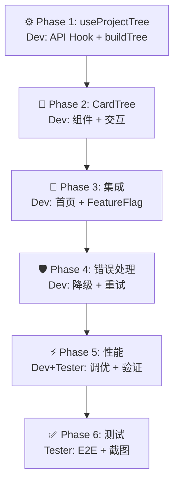

# AGENTS.md — Agent 职责与任务流转定义

**项目**: vibex-homepage-api-alignment
**Architect**: architect
**日期**: 2026-03-23
**状态**: ✅ 完成

---

## 1. Agent 职责矩阵

| Agent | 职责 | Phase | 产出物 |
|-------|------|--------|--------|
| **dev** | Hook + 组件 + 集成 | Phase 1-5 | useProjectTree + CardTree + FeatureFlag |
| **tester** | 测试 + 性能 + 截图 | Phase 6 | 测试报告 + 性能报告 |
| **reviewer** | 代码审查 | 贯穿 | 审查报告 |
| **architect** | 架构设计 | 本任务 | 本文档 |

---

## 2. 任务流转图

---

## 3. 验收标准（expect 断言格式）

| ID | Given | When | Then |
|----|-------|------|------|
| AC-1 | API running | `useProjectTree()` | `expect(data).toBeTruthy()` |
| AC-2 | CardTree | render | `expect(screen.queryByTestId('card-tree')).toBeTruthy()` |
| AC-3 | Child card | collapsed | `expect(child.isNotVisible())` |
| AC-4 | API error | 500 response | `expect(screen.queryByText(/加载失败/i)).toBeVisible()` |
| AC-5 | Feature Flag off | render | `expect(screen.queryByTestId('grid-layout')).toBeTruthy()` |
| AC-6 | 50 cards | render | `expect(renderTime).toBeLessThan(1000)` |
| AC-7 | tsc | type check | `expect(exitCode).toBe(0)` |

---

**AGENTS.md 完成**: 2026-03-23 17:20 (Asia/Shanghai)
