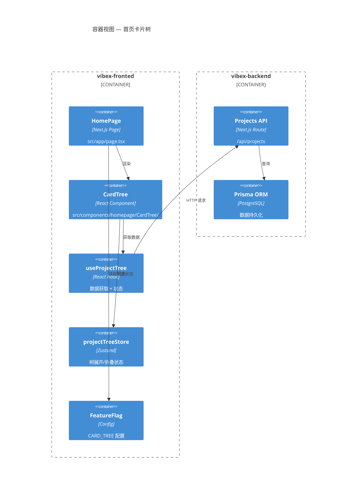
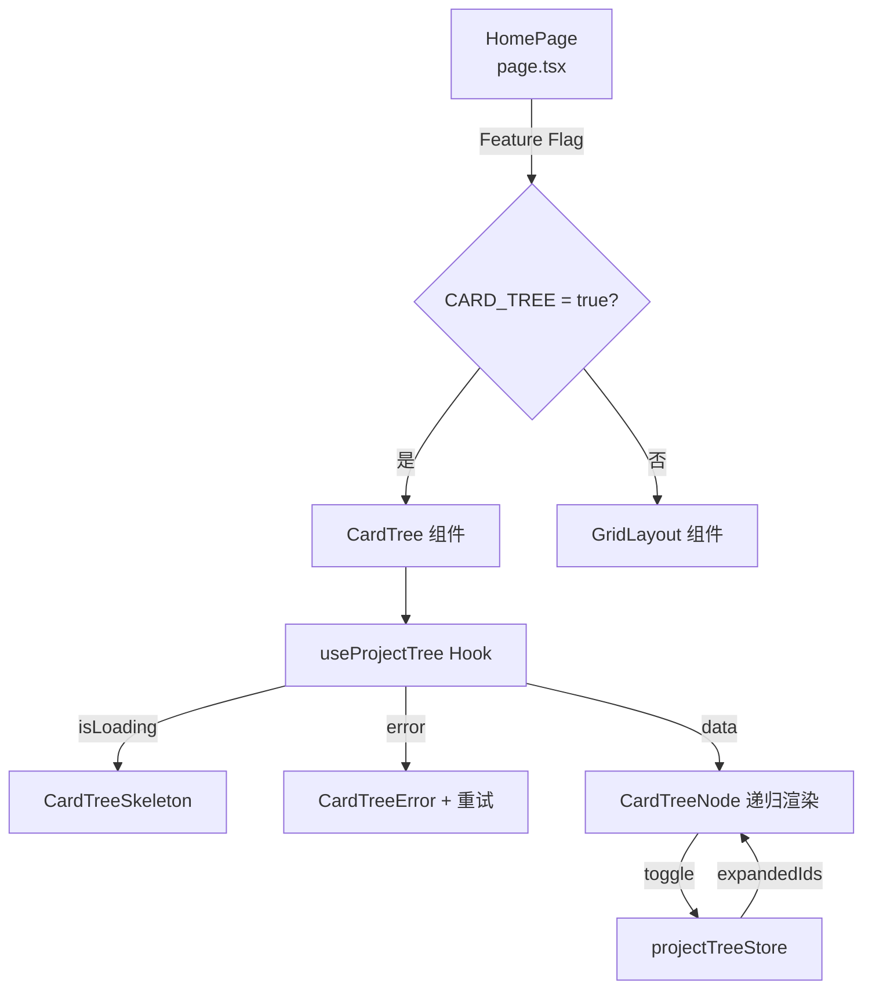

# Architecture: vibex-homepage-api-alignment — 首页卡片树设计 + API 对接

**项目**: vibex-homepage-api-alignment
**阶段**: design-architecture
**Architect**: architect
**日期**: 2026-03-23
**状态**: ✅ 完成

---

## 1. Tech Stack

| 层级 | 技术 | 版本 | 选型理由 |
|------|------|------|---------|
| **API 层** | Next.js API Routes + Prisma | 现有 | 已有 `/api/projects` 后端 |
| **前端** | Next.js (App Router) | 14.x | 现有技术栈 |
| **数据获取** | React Query (TanStack Query) | 5.x | 缓存/加载/错误状态最佳实践 |
| **状态管理** | Zustand | 4.x | 现有技术栈 |
| **Feature Flag** | 配置文件或 env | — | 无额外依赖 |
| **类型系统** | TypeScript strict | 5.x | 现有 |

### 技术决策

**Q: 为什么不复用现有的 store（如 homePageStore）？**
> 现有 store 可能管理复杂状态。Card Tree 数据结构简单（树形），新建 `projectTreeStore` 职责单一，避免 store 膨胀。

**Q: 为什么用 React Query 而非 SWR 或原生 fetch？**
> React Query 在加载/错误/缓存/分页场景更成熟，与项目技术栈一致。

**Q: API 未就绪时如何降级？**
> `useProjectTree` 内部维护 mock 数据列表，API 失败时自动切换。

---

## 2. Architecture Diagram



---

## 3. Module Design

### 3.1 文件结构

```
src/components/homepage/
├── CardTree/
│   ├── CardTree.tsx              # 主容器
│   ├── CardTreeNode.tsx          # 单个节点
│   ├── CardTreeSkeleton.tsx      # 骨架屏
│   ├── CardTreeError.tsx        # 错误视图
│   └── CardTree.module.css
├── GridLayout/                   # 旧布局（Feature Flag off 时保留）
│   └── GridLayout.tsx

src/hooks/
├── useProjectTree.ts             # API 数据获取
└── useCardTreeState.ts           # 折叠/展开状态

src/stores/
└── projectTreeStore.ts           # Zustand — 树状态

src/services/api/
├── projectApi.ts                 # API 封装
└── projectApi.mock.ts            # Mock 数据

src/types/
└── project.ts                    # 项目类型定义
```

### 3.2 核心接口

```typescript
// types/project.ts
interface ProjectTreeNode {
  id: string;
  name: string;
  description?: string;
  icon?: string;
  children?: ProjectTreeNode[];
  isExpanded?: boolean;
  createdAt: string;
  updatedAt: string;
}

// hooks/useProjectTree.ts
interface UseProjectTreeResult {
  data: ProjectTreeNode[];
  isLoading: boolean;
  error: Error | null;
  refetch: () => void;
}

// stores/projectTreeStore.ts
interface ProjectTreeState {
  expandedIds: Set<string>;
  selectedId: string | null;
  toggleExpanded: (id: string) => void;
  selectNode: (id: string | null) => void;
  collapseAll: () => void;
}
```

---

## 4. Data Flow



---

## 5. API 集成

### 5.1 现有 API 复用

`GET /api/projects` 已存在，返回 `Project[]` 树形结构需在前端转换。

```typescript
// 将扁平 Project[] 转为 ProjectTreeNode[]
function buildTree(projects: Project[]): ProjectTreeNode[] {
  const map = new Map(projects.map(p => [p.id, { ...p, children: [] }]));
  const roots: ProjectTreeNode[] = [];
  for (const p of projects) {
    const node = map.get(p.id)!;
    if (p.parentId) {
      map.get(p.parentId)?.children?.push(node);
    } else {
      roots.push(node);
    }
  }
  return roots;
}
```

### 5.2 Mock 数据（API 降级）

```typescript
const MOCK_DATA: ProjectTreeNode[] = [
  {
    id: '1',
    name: 'DDD 建模项目',
    description: '领域驱动设计实践',
    children: [
      { id: '1-1', name: '电商上下文', children: [] },
      { id: '1-2', name: '支付上下文', children: [] },
    ],
  },
];
```

---

## 6. Performance Considerations

| 关注点 | 策略 |
|-------|------|
| **50 卡片 < 1s** | `React.memo` 包裹 CardTreeNode，避免不必要重渲染 |
| **懒加载非首屏** | `IntersectionObserver` 懒加载可视区外卡片 |
| **折叠动画 60fps** | CSS `max-height` + `transition`，避免 JS 动画 |
| **首屏加载 < 2s** | React Query 缓存，第二次访问即用缓存 |

---

## 7. Trade-offs

| 决策点 | 本方案 | 备选 | 理由 |
|-------|-------|------|------|
| 数据获取 | React Query | SWR | 缓存策略更完善 |
| 树状态管理 | Zustand | Context API | Zustand 已有，避免 prop drilling |
| 折叠动画 | CSS | JS 动画 | CSS 性能更好，代码更少 |
| Feature Flag | 配置文件 | LaunchDarkly | 轻量化场景无需第三方服务 |

---

**架构文档完成**: 2026-03-23 17:18 (Asia/Shanghai)
