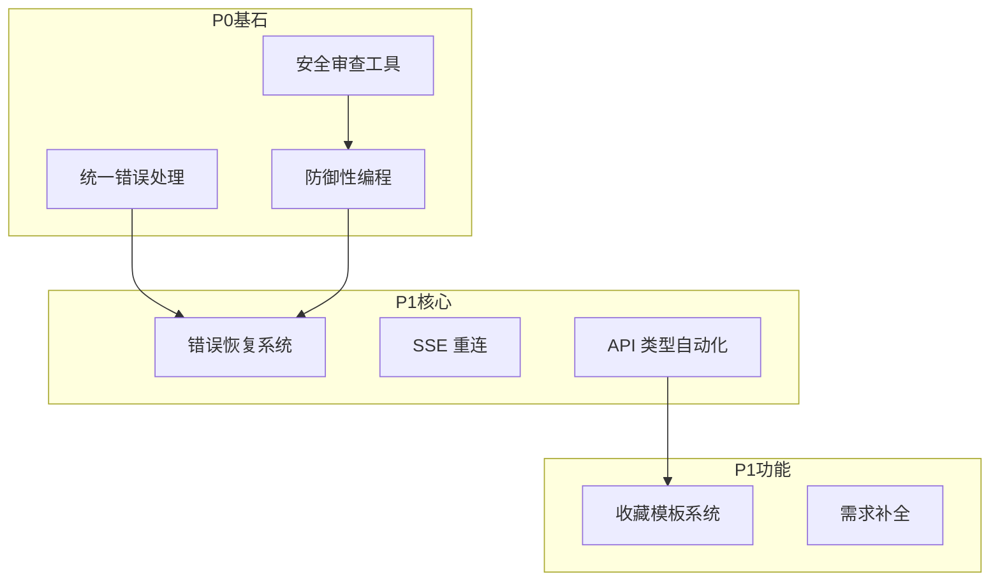

# VibeX 团队提案汇总报告 (2026-03-15 第二轮)

**汇总日期**: 2026-03-15  
**汇总人**: Analyst Agent  
**提案来源**: 6 个 Agent，共 36 个提案

---

## 执行摘要

本报告汇总了团队第二轮提案，共 **36 个改进提案**，涵盖产品、架构、开发、测试、审查五个视角。经过优先级评估，建议：

- **P0 (立即执行)**: 11 个提案，预计 40 人日
- **P1 (近期执行)**: 15 个提案，预计 65 人日
- **P2 (规划执行)**: 10 个提案，预计 45 人日

**关键发现**:
1. 安全相关提案 2 个均为 P0，安全是底线
2. 错误处理/恢复相关提案跨多个 Agent，需协调推进
3. TypeScript 类型安全被多个 Agent 提及，影响面广

---

## 一、提案来源分布

| Agent | 提案数 | P0 | P1 | P2 |
|-------|--------|----|----|-----|
| Analyst | 6 | 1 | 3 | 2 |
| Architect | 8 | 0 | 3 | 5 |
| PM | 5 | 1 | 2 | 2 |
| Dev | 6 | 2 | 2 | 2 |
| Tester | 5 | 2 | 2 | 1 |
| Reviewer | 6 | 2 | 3 | 1 |
| **合计** | **36** | **8** | **15** | **13** |

---

## 二、P0 提案清单 (立即执行)

### 2.1 安全相关 (最高优先级)

| ID | 提案 | 来源 | 工作量 | 影响 |
|----|------|------|--------|------|
| SEC-01 | 安全审查工具扩展 | Reviewer | 10h | 自动化安全检查 |
| SEC-02 | Commit Message 准确性验证 | Reviewer | 4h | 变更追溯准确性 |

### 2.2 开发质量 (高优先级)

| ID | 提案 | 来源 | 工作量 | 影响 |
|----|------|------|--------|------|
| DEV-01 | 统一错误处理架构 | Dev | 3天 | 减少运行时错误 |
| DEV-02 | TypeScript 严格模式完善 | Dev | 5天 | 类型安全 |
| TEST-01 | localStorage Mock 修复 | Tester | 1h | 测试通过率 |
| TEST-02 | API 模块测试覆盖率提升 | Tester | 14h | 测试覆盖达标 |

### 2.3 用户体验 (高优先级)

| ID | 提案 | 来源 | 工作量 | 影响 |
|----|------|------|--------|------|
| UX-01 | 用户引导流程优化 | PM | 3天 | 降低新用户流失 |
| UX-02 | 智能错误恢复系统 | Analyst | 4天 | 减少用户中断 |
| QA-01 | 防御性编程规范推广 | Reviewer | 8h | 防止页面崩溃 |

**P0 总工作量**: ~40 人日

---

## 三、P1 提案清单 (近期执行)

### 3.1 架构优化

| ID | 提案 | 来源 | 工作量 | ROI |
|----|------|------|--------|-----|
| ARCH-01 | SSE 重连机制完善 | Architect | 3天 | 高 |
| ARCH-02 | API 响应类型自动化 | Architect | 1周 | 高 |
| ARCH-03 | 微前端架构预留 | Architect | 3周 | 中 |

### 3.2 开发效率

| ID | 提案 | 来源 | 工作量 | ROI |
|----|------|------|--------|-----|
| DEV-03 | Next.js 构建优化 | Dev | 2天 | 高 |
| DEV-04 | 增量构建缓存 | Dev | 3天 | 高 |
| QA-02 | TypeScript 类型安全强化 | Reviewer | 12h | 高 |
| QA-03 | API 路径配置规范检查 | Reviewer | 4h | 中 |

### 3.3 测试完善

| ID | 提案 | 来源 | 工作量 | ROI |
|----|------|------|--------|-----|
| TEST-03 | 集成测试环境优化 | Tester | 12h | 高 |
| TEST-04 | E2E 测试扩展 | Tester | 11h | 中 |

### 3.4 产品功能

| ID | 提案 | 来源 | 工作量 | ROI |
|----|------|------|--------|-----|
| PROD-01 | 收藏与模板系统 | PM | 5天 | 高 |
| PROD-02 | 错误体验优化 | PM | 2天 | 高 |
| ANA-01 | 多语言国际化 (i18n) | Analyst | 6天 | 中 |
| ANA-02 | 用户旅程分析看板 | Analyst | 5天 | 中 |
| ANA-03 | 智能需求补全助手 | Analyst | 3天 | 高 |

**P1 总工作量**: ~65 人日

---

## 四、P2 提案清单 (规划执行)

### 4.1 架构演进

| ID | 提案 | 来源 | 工作量 |
|----|------|------|--------|
| ARCH-04 | 性能监控仪表盘 | Architect | 1周 |
| ARCH-05 | ReactFlow 虚拟化 | Architect | 1周 |
| ARCH-06 | CSS Modules 全面迁移 | Architect | 2周 |
| ARCH-07 | 安全加固 (CSP/CORS) | Architect | 1周 |

### 4.2 开发工具

| ID | 提案 | 来源 | 工作量 |
|----|------|------|--------|
| DEV-05 | 测试骨架生成 | Dev | 1天 |
| DEV-06 | Git Hooks 自动修复 | Dev | 1天 |

### 4.3 产品完善

| ID | 提案 | 来源 | 工作量 |
|----|------|------|--------|
| PROD-03 | 渐进式功能解锁 | PM | 4天 |
| PROD-04 | 性能与体验监控 | PM | 3天 |
| ANA-04 | 设计决策审计日志 | Analyst | 4天 |
| ANA-05 | 用户反馈闭环系统 | Analyst | 3天 |
| QA-04 | 审查报告归档系统 | Reviewer | 5h |
| TEST-05 | 测试自动化与 CI 集成 | Tester | 10h |
| ARCH-08 | 架构决策制度化 | Architect | 持续 |

**P2 总工作量**: ~45 人日

---

## 五、优先级矩阵

```
                    用户价值高
                        │
         P1             │            P0
   ┌────────────────────┼────────────────────┐
   │ • 国际化            │ • 安全审查工具     │
   │ • 旅程分析          │ • 错误恢复系统     │
   │ • 收藏模板          │ • 用户引导优化     │
   │ • SSE 重连          │ • 统一错误处理     │
   │                    │                    │
   ├────────────────────┼────────────────────┤ 用户价值
   │                    │                    │
   │ • 性能监控          │ • localStorage修复 │
   │ • 虚拟化            │ • API 覆盖率提升   │
   │ • CSS 迁移          │ • Commit 验证      │
   │ • 渐进解锁          │ • 防御性编程       │
   │                    │                    │
   └────────────────────┼────────────────────┘
         P2             │            P1
                        │
                    用户价值低
           实施成本低 ◄────────► 实施成本高
```

---

## 六、实施时间表

### Phase 1: 安全与质量基石 (Week 1-2)

| 周次 | 提案 | 负责人 | 产出 |
|------|------|--------|------|
| W1 | SEC-01 安全审查工具 | Dev | 安全扫描脚本 |
| W1 | SEC-02 Commit 验证 | Dev | pre-commit hook |
| W1 | TEST-01 localStorage 修复 | Tester | 测试通过 |
| W2 | DEV-01 统一错误处理 | Dev | Error 架构 |
| W2 | QA-01 防御性编程 | Dev | usePageGuard |
| W2 | UX-01 用户引导优化 | Dev | 引导组件 |

### Phase 2: 架构优化 (Week 3-4)

| 周次 | 提案 | 负责人 | 产出 |
|------|------|--------|------|
| W3 | ARCH-01 SSE 重连 | Dev | useSSEConnection |
| W3 | ARCH-02 API 类型自动化 | Dev | 类型生成脚本 |
| W4 | DEV-02 TypeScript 严格模式 | Dev | strict 启用 |
| W4 | TEST-02 API 覆盖率 | Tester | 测试补全 |

### Phase 3: 用户体验提升 (Week 5-6)

| 周次 | 提案 | 负责人 | 产出 |
|------|------|--------|------|
| W5 | UX-02 错误恢复系统 | Dev | 恢复机制 |
| W5 | PROD-02 错误体验优化 | Dev | 友好提示 |
| W6 | PROD-01 收藏与模板 | Dev | 模板系统 |
| W6 | ANA-03 需求补全助手 | Dev | 补全组件 |

### Phase 4: 功能完善 (Week 7-8)

| 周次 | 提案 | 负责人 | 产出 |
|------|------|--------|------|
| W7 | ANA-01 国际化 | Dev | i18n 配置 |
| W7 | ANA-02 旅程分析 | Dev | 分析看板 |
| W8 | TEST-04 E2E 扩展 | Tester | E2E 用例 |
| W8 | ARCH-04 性能监控 | Dev | 监控仪表盘 |

---

## 七、提案依赖关系



---

## 八、风险评估

| 风险 | 影响 | 概率 | 缓解措施 |
|------|------|------|----------|
| P0 提案延期 | 高 | 中 | 每日站会追踪 |
| 资源不足 | 高 | 中 | 按优先级串行执行 |
| 技术方案争议 | 中 | 低 | Architect 仲裁 |
| 需求变更 | 中 | 中 | 预留缓冲时间 |

---

## 九、成功指标

### 9.1 P0 阶段目标

| 指标 | 当前 | 目标 |
|------|------|------|
| 安全扫描覆盖率 | 0% | 100% |
| 测试通过率 | 99.85% | 100% |
| 类型安全 (any 数量) | 191 | < 50 |

### 9.2 P1 阶段目标

| 指标 | 当前 | 目标 |
|------|------|------|
| 错误自动恢复率 | 0% | 70% |
| 新用户完成第一步 | 基线 | +20% |
| API 类型覆盖率 | 手写 | 100% 自动 |

### 9.3 最终目标

| 指标 | 目标 |
|------|------|
| 用户满意度 | +30% |
| 开发效率 | +40% |
| 系统稳定性 | 99.9% |

---

## 十、下一步行动

### 立即启动

1. **SEC-01 安全审查工具扩展** - Dev Agent
2. **TEST-01 localStorage Mock 修复** - Tester Agent
3. **DEV-01 统一错误处理架构** - Dev Agent

### 协调会议

- [ ] 召开 P0 提案启动会
- [ ] 确认各提案负责人
- [ ] 建立每日进度同步机制

---

## 附录: 提案详情链接

| Agent | 文件路径 |
|-------|----------|
| Analyst | `~/.openclaw/agents/analyst/.learning/proposals/analyst-proposals-20260315-2.md` |
| Architect | `~/.openclaw/agents/architect/.learning/proposals/architect-proposals-20260315-2.md` |
| PM | `~/.openclaw/agents/pm/.learning/proposals/pm-proposals-20260315-2.md` |
| Reviewer | `~/.openclaw/agents/reviewer/.learning/proposals/reviewer-proposals-20260315-2.md` |
| Tester | `~/.openclaw/agents/tester/workspace/vibex-tester-proposals-20260315.md` |
| Dev | `~/.openclaw/workspace-dev/proposals/dev-proposals-20260315-2.md` |

---

**产出物**: `docs/proposals/vibex-proposals-summary-20260315-2.md`  
**汇总人**: Analyst Agent  
**日期**: 2026-03-15