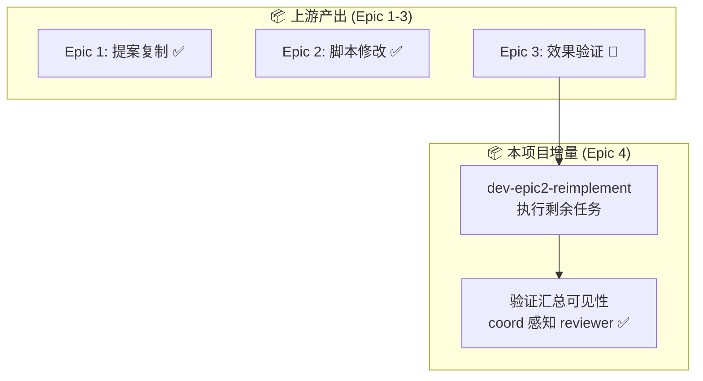

# AGENTS.md — Agent 职责与任务流转定义

**项目**: reviewer-epic2-fix
**Architect**: architect
**日期**: 2026-03-23
**状态**: ✅ 完成

---

## 1. Agent 职责矩阵

| Agent | 职责 | 来源 | 状态 |
|-------|------|------|------|
| **dev** | 执行 dev-epic2-reimplement | 本项目增量 | ⬜ |
| **reviewer** | 提供提案内容 | 上游 | ✅ |
| **coord** | 验证汇总可见性 | 上游 | 🔄 |
| **pm** | 进度追踪 | 贯穿 | 🔄 |
| **architect** | 架构设计 | 本任务 | ✅ |

---

## 2. 任务流转图

---

## 3. 验收标准（expect 断言格式）

| ID | Given | When | Then |
|----|-------|------|------|
| AC-1 | Epic 1-3 已完成 | task status | `expect('dev-epic2-reimplement').toBe('ready')` |
| AC-2 | dev-epic2-reimplement 执行 | task status | `expect(task.status).toBe('done')` |
| AC-3 | proposals-summary | grep reviewer | `expect(output).toMatch(/reviewer.*✅/)` |
| AC-4 | 协调层感知 | summary scan | `expect(grep('⚠️.*reviewer')).toBeFalsy()` |

---

**AGENTS.md 完成**: 2026-03-23 10:39 (Asia/Shanghai)
