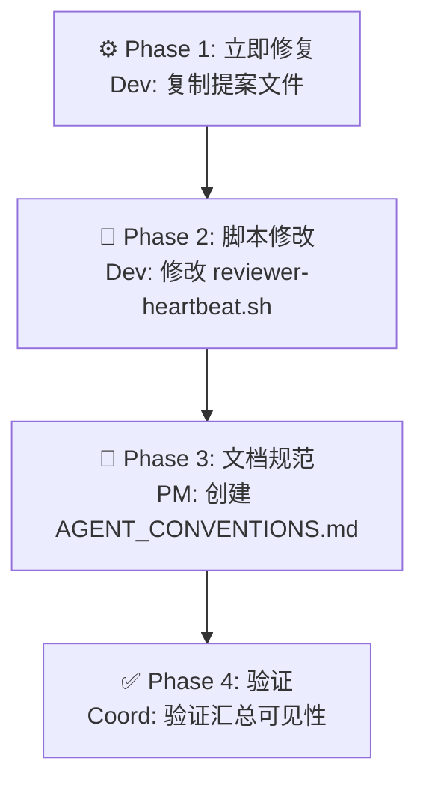

# AGENTS.md — Agent 职责与任务流转定义

**项目**: reviewer-epic2-proposalcollection-fix
**Architect**: architect
**日期**: 2026-03-23
**状态**: ✅ 完成

---

## 1. Agent 职责矩阵

| Agent | 职责 | 任务 |
|-------|------|------|
| **dev** | 执行文件复制 + 脚本修改 | Phase 1, 2 |
| **pm** | 创建 AGENT_CONVENTIONS.md | Phase 3 |
| **coord** | 验证汇总脚本可见性 | Phase 4 |
| **reviewer** | — (被动修复对象) | — |
| **analyst** | — | — |
| **architect** | 架构设计 | 本任务 |

---

## 2. 任务流转图



---

## 3. 验收标准（expect 断言格式）

| ID | Given | When | Then |
|----|-------|------|------|
| AC-1 | 原始文件存在 | cp 命令执行 | `expect(fs.existsSync(targetPath)).toBe(true)` |
| AC-2 | reviewer-heartbeat.sh | `bash -n` | `expect(exitCode).toBe(0)` |
| AC-3 | 脚本执行 | 检查输出路径 | `expect(fs.existsSync('/root/.openclaw/vibex/docs/proposals/' + today + '/reviewer.md')).toBe(true)` |
| AC-4 | AGENT_CONVENTIONS.md | 内容检查 | `expect(content).toMatch(/proposals.*YYYYMMDD.*reviewer.*md/)` |
| AC-5 | proposals-summary | grep reviewer | `expect(output).not.toMatch(/⚠️.*reviewer/)` |

---

## 4. 路径契约规范

### 4.1 统一提案路径

```
/root/.openclaw/vibex/docs/proposals/{YYYYMMDD}/{agent-name}.md
```

| Agent | 文件名 |
|-------|--------|
| dev | `dev-proposals.md` |
| analyst | `analyst-proposals.md` |
| architect | `architect-proposals.md` |
| pm | `pm-proposals.md` |
| tester | `tester-proposal.md` |
| reviewer | `reviewer.md` |

### 4.2 reviewer-heartbeat.sh 修改模板

```bash
#!/bin/bash
# reviewer 心跳脚本
set -e
export AGENT="reviewer"

# === 路径契约（所有 agent 必须遵循）===
# 提案必须保存到 vibex 共享目录，格式: vibex/docs/proposals/YYYYMMDD/{agent}.md
PROPOSAL_OUT="/root/.openclaw/vibex/docs/proposals/$(date +%Y%m%d)/reviewer.md"
mkdir -p "$(dirname "$PROPOSAL_OUT")"

# ... 后续脚本逻辑 ...
```

---

**AGENTS.md 完成**: 2026-03-23 09:35 (Asia/Shanghai)
