# Architecture: reviewer-epic2-proposalcollection-fix — Reviewer 提案路径修复

**项目**: reviewer-epic2-proposalcollection-fix
**阶段**: design-architecture
**Architect**: architect
**日期**: 2026-03-23
**状态**: ✅ 完成

---

## 1. Tech Stack

| 层级 | 技术 | 说明 |
|------|------|------|
| **文件系统** | Unix 文件系统 + bash | 现有基础设施 |
| **脚本语言** | Bash | 现有 heartbeat 脚本 |
| **权限模型** | POSIX 文件权限 | agent 对共享目录的写权限 |
| **CI/验证** | bash -n | 语法检查 |

### 技术决策

**Q: 为什么用 bash 脚本而非 Python/Node.js？**
> 现有 heartbeat 脚本均为 bash，改用 bash 保持一致性，减少环境依赖。

**Q: 为什么不迁移 reviewer 提案到统一存储？**
> 本次目标是修复路径不匹配，而非架构重构。统一存储作为后续改进项。

---

## 2. Architecture Diagram

```mermaid
flowchart TD
    subgraph Current["❌ 当前状态 (有问题的路径)"]
        R1["Reviewer Agent\nworkspace-reviewer"]
        R2["/workspace-reviewer/proposals/20260323/reviewer-self-check.md"]
        R3["/vibex/docs/proposals/20260323/reviewer.md ❌ 不存在"]
    end

    subgraph Fixed["✅ 修复后状态"]
        F1["Reviewer Agent\nworkspace-reviewer"]
        F2["/workspace-reviewer/proposals/20260323/reviewer-self-check.md"]
        F3["/vibex/docs/proposals/20260323/reviewer.md ✅ 已同步"]
        F4["proposals-summary-20260323.md\n✅ 可见 reviewer"]
    end

    subgraph ScriptFix["🔧 脚本修复"]
        S1["reviewer-heartbeat.sh\n修改 PROPOSAL_OUT 变量"]
        S2["bash -n 语法验证"]
        S3["AGENT_CONVENTIONS.md\n路径规范文档化"]
    end

    R1 --> R2
    R2 -.->|"⚠️ 路径不匹配"| R3
    F1 --> F2
    F2 -->|"cp"| F3
    F3 --> F4
    S1 --> S2
    S1 --> S3
```



---

## 3. File Paths

### 3.1 当前文件位置

| 文件 | 当前路径 | 正确路径 |
|------|---------|---------|
| Reviewer 提案 | `/root/.openclaw/workspace-reviewer/proposals/20260323/reviewer-self-check.md` | → `/root/.openclaw/vibex/docs/proposals/20260323/reviewer.md` |
| 提案汇总 | — | `/root/.openclaw/vibex/docs/proposals/summary/proposals-summary-20260323.md` |

### 3.2 提案路径规范（修复后）

```
/root/.openclaw/vibex/docs/proposals/
├── {YYYYMMDD}/
│   ├── analyst-proposals.md
│   ├── dev-proposals.md
│   ├── architect-proposals.md
│   ├── pm-proposals.md
│   ├── tester-proposal.md
│   └── reviewer.md          # ← 统一命名（无 -self-check 后缀）
├── summary/
│   └── proposals-summary-{YYYYMMDD}.md
└── AGENT_CONVENTIONS.md    # ← 路径规范文档
```

### 3.3 reviewer-heartbeat.sh 修改点

```bash
# === 修改前 (错误) ===
PROPOSAL_DIR="${WORKSPACE}/proposals/$(date +%Y%m%d)"
PROPOSAL_FILE="${PROPOSAL_DIR}/reviewer-self-check.md"

# === 修改后 (正确) ===
PROPOSAL_OUT="/root/.openclaw/vibex/docs/proposals/$(date +%Y%m%d)/reviewer.md"
mkdir -p "$(dirname "$PROPOSAL_OUT")"
```

---

## 4. Implementation Changes

### 4.1 reviewer-heartbeat.sh 修改清单

| 修改项 | 位置 | 内容 |
|-------|------|------|
| 新增常量 | 脚本顶部 | `PROPOSAL_OUT="/root/.openclaw/vibex/docs/proposals/$(date +%Y%m%d)/reviewer.md"` |
| 目录创建 | 写入前 | `mkdir -p "$(dirname "$PROPOSAL_OUT")"` |
| 文件写入 | 写入时 | 使用 `PROPOSAL_OUT` 而非本地路径 |
| 注释说明 | 脚本顶部 | `# Proposals must be saved to vibex/docs/proposals/YYYYMMDD/{agent}.md` |

### 4.2 权限要求

| 路径 | 当前权限 | 要求 |
|------|---------|------|
| `/root/.openclaw/vibex/docs/proposals/` | 755 | reviewer agent 需有写权限 |
| `/root/.openclaw/workspace-reviewer/` | 700 | 保留本地副本 |

---

## 5. Performance & Risk

| 指标 | 评估 |
|------|------|
| **性能影响** | 无（仅文件复制 + 脚本修改）|
| **风险等级** | 低（bash 脚本修改，原子性操作）|
| **回滚方案** | revert heartbeat 脚本即可 |

---

**架构文档完成**: 2026-03-23 09:32 (Asia/Shanghai)
