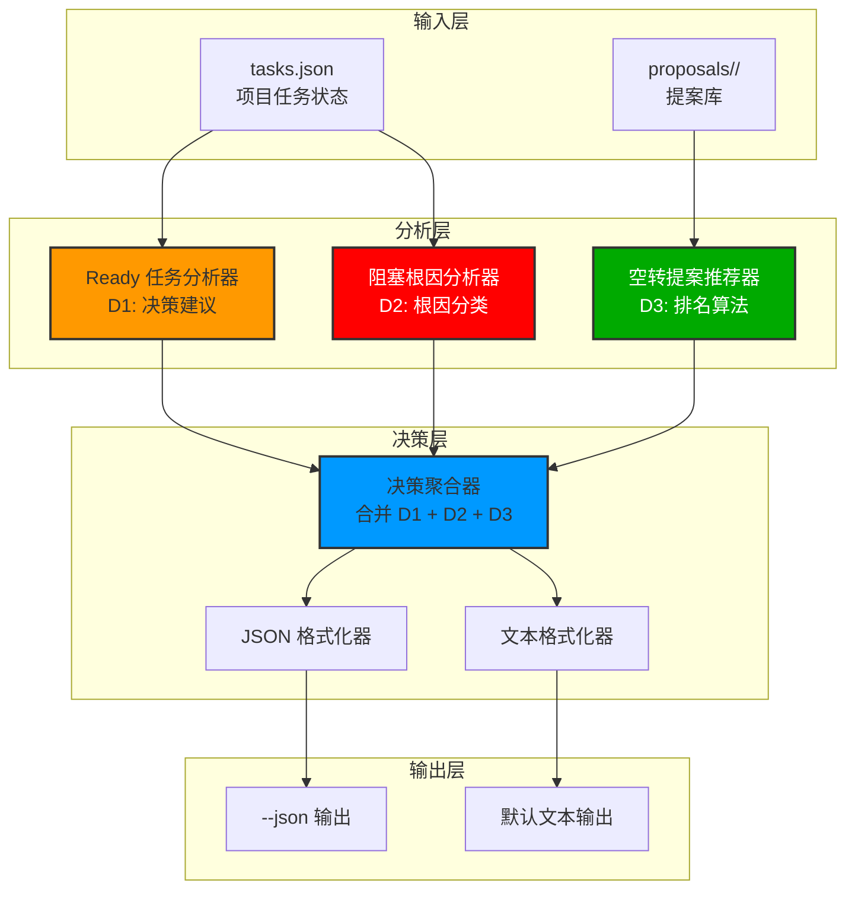
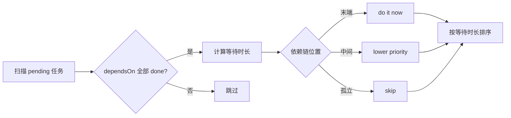
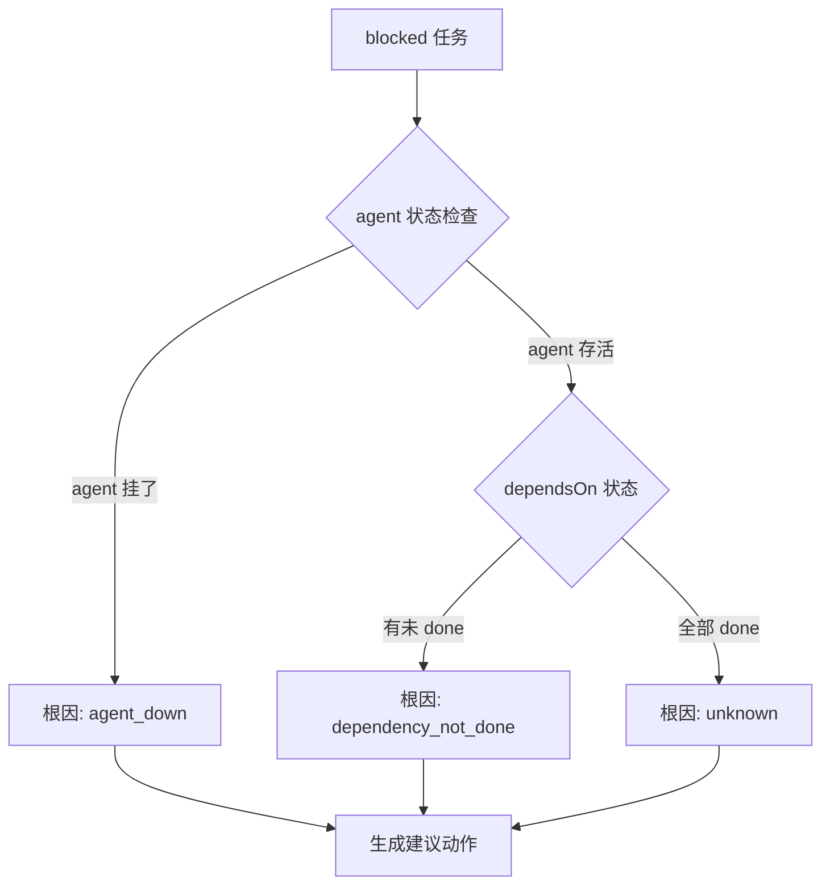

# Architecture: task_manager.py current-report（决策导向版）

> **项目**: task-manager-current-report
> **阶段**: design-architecture（重新设计）
> **版本**: 2.0.0
> **日期**: 2026-03-30
> **Architect**: Architect Agent
> **状态**: ⚠️ 废弃旧版 v1，基于 PRD v2 重新设计
> **工作目录**: /root/.openclaw/vibex

---

## 执行决策
- **决策**: 已采纳
- **执行项目**: task-manager-current-report
- **执行日期**: 2026-03-30
- **变更原因**: PRD v2 全面重构，核心原则改为"决策导向"，删除对 Coord 决策无用的系统资源统计

---

## 1. 概述

### 1.1 背景
PRD v2 发现旧版架构基于旧版 PRD 设计，核心价值与决策需求脱节：
- ❌ 旧版：围绕"虚假完成检测"和"服务器信息"设计
- ✅ 新版：围绕"Ready 决策建议 + 阻塞根因 + 空转提案推荐"设计

### 1.2 核心原则
**报告是给 Coord Agent 自己用的，目标是够我直接做决策，不是给人类看的数据看板。**

### 1.3 三大决策要素

| 决策要素 | 描述 | 优先级 |
|----------|------|--------|
| **D1: Ready 任务决策建议** | 该催谁 + 为什么现在做 + 阻塞了多久 | 最高 |
| **D2: 阻塞根因分析** | agent 挂了 vs 依赖未完成 | 最高 |
| **D3: 空转提案推荐** | 连续 N 次空转后，下一个该拉哪个项目 | 中 |

---

## 2. Tech Stack

| 层级 | 技术选型 | 理由 |
|------|----------|------|
| **CLI 框架** | argparse（现有） | 与 task_manager.py 风格一致 |
| **数据存储** | tasks.json（现有） | 无需新数据库 |
| **提案库** | proposals/YYYYMMDD/*.md（现有） | 复用现有目录结构 |
| **时间计算** | datetime（标准库） | 无额外依赖 |
| **JSON 序列化** | json（标准库） | 无额外依赖 |
| **测试框架** | pytest | 现有项目已用 |

---

## 3. 架构图

### 3.1 系统架构



### 3.2 D1 Ready 任务决策流程



### 3.3 D2 阻塞根因分类流程



### 3.4 D3 提案排名流程

```mermaid
flowchart TB
    A[扫描 proposals/] --> B[过滤未完成提案]
    B --> C[计算综合分数]
    C --> D[分数 = 0.5×agent评分 + 0.3×目标用户 + 0.2×(1-成本)]
    D --> E[Top3 排序]
    E --> F[返回排名列表]
```

---

## 4. API 定义

### 4.1 Ready 任务决策建议（D1）

```python
# src/task_manager/current_report/d1_ready_analyzer.py

from dataclasses import dataclass
from datetime import datetime
from typing import List, Optional

@dataclass
class ReadyTask:
    """Ready 任务数据结构"""
    project: str
    task_id: str
    agent: str
    depends_on: List[str]
    waiting_minutes: int
    decision: str  # "do it now" | "skip" | "lower priority"
    reason: str
    blocked_by: Optional[str] = None

@dataclass
class DependencyChain:
    """依赖链分析"""
    task_id: str
    downstream_tasks: List[str]  # 依赖此任务的任务
    is_terminal: bool  # 是否是末端（无下游任务）

def analyze_ready_tasks(tasks_json: dict) -> List[ReadyTask]:
    """
    分析 Ready 任务并生成决策建议
    
    算法:
    1. 扫描所有 pending 任务
    2. 检查 dependsOn 是否全部 done
    3. 计算等待时长 = now - max(dependsOn.doneAt)
    4. 判断依赖链位置:
       - 末端（无下游依赖）→ do it now
       - 中间（有下游等待）→ lower priority
       - 孤立（依赖方未 done）→ skip
    5. 按等待时长降序排列
    """
    ready_tasks = []
    now = datetime.now()
    
    for project_name, project in tasks_json.get("projects", {}).items():
        for task in project.get("tasks", []):
            if task["status"] != "pending":
                continue
            
            # 检查依赖是否全部 done
            depends_on = task.get("dependsOn", [])
            if not all(is_task_done(tasks_json, dep) for dep in depends_on):
                continue  # 跳过，不满足 ready 条件
            
            # 计算等待时长
            done_at_times = [get_task_done_at(tasks_json, dep) for dep in depends_on]
            max_done_at = max(done_at_times) if done_at_times else now
            waiting_minutes = int((now - max_done_at).total_seconds() / 60)
            
            # 判断依赖链位置
            is_terminal = len(get_downstream_tasks(tasks_json, task["id"])) == 0
            if is_terminal:
                decision = "do it now"
                reason = "下游任务在等待此任务"
            else:
                decision = "lower priority"
                reason = "有下游任务在等待其他任务"
            
            ready_tasks.append(ReadyTask(
                project=project_name,
                task_id=task["id"],
                agent=task.get("agent", "unknown"),
                depends_on=depends_on,
                waiting_minutes=waiting_minutes,
                decision=decision,
                reason=reason
            ))
    
    # 按等待时长降序排列
    return sorted(ready_tasks, key=lambda t: t.waiting_minutes, reverse=True)
```

### 4.2 阻塞根因分析（D2）

```python
# src/task_manager/current_report/d2_blocked_analyzer.py

from dataclasses import dataclass
from datetime import datetime
from typing import List, Optional

@dataclass
class BlockedTask:
    """阻塞任务数据结构"""
    project: str
    task_id: str
    agent: str
    root_cause: str  # "agent_down" | "dependency_not_done" | "unknown"
    root_cause_detail: str
    blocked_minutes: int
    suggested_action: str  # "降级 pending" | "人工介入" | "等待"
    agent_last_active: Optional[datetime] = None

def analyze_blocked_tasks(tasks_json: dict) -> List[BlockedTask]:
    """
    分析阻塞任务并定位根因
    
    根因分类规则:
    1. agent_down: agent 最后活跃时间 > 30 分钟
    2. dependency_not_done: dependsOn 有未 done 任务
    3. unknown: 其他情况
    
    建议动作映射:
    - agent_down → 人工介入 / 降级 pending
    - dependency_not_done → 等待依赖完成
    - unknown → 等待
    """
    blocked_tasks = []
    now = datetime.now()
    AGENT_DOWN_THRESHOLD_MINUTES = 30
    
    for project_name, project in tasks_json.get("projects", {}).items():
        for task in project.get("tasks", []):
            if task["status"] != "blocked":
                continue
            
            agent = task.get("agent", "unknown")
            last_active = get_agent_last_active(tasks_json, agent)
            
            # 判断根因
            if last_active:
                inactive_minutes = (now - last_active).total_seconds() / 60
                if inactive_minutes > AGENT_DOWN_THRESHOLD_MINUTES:
                    root_cause = "agent_down"
                    root_cause_detail = f"{agent} 已 {inactive_minutes:.0f} 分钟无活跃"
                    suggested_action = "人工介入"
                else:
                    root_cause = "agent_down_but_active"
                    root_cause_detail = f"{agent} 最后活跃于 {last_active}"
                    suggested_action = "等待"
            else:
                root_cause = "unknown"
                root_cause_detail = "无法确定 agent 状态"
                suggested_action = "人工介入"
            
            # 检查依赖是否未完成
            depends_on = task.get("dependsOn", [])
            unfinished_deps = [dep for dep in depends_on if not is_task_done(tasks_json, dep)]
            if unfinished_deps:
                root_cause = "dependency_not_done"
                root_cause_detail = f"依赖未完成: {', '.join(unfinished_deps)}"
                suggested_action = "等待依赖完成"
            
            blocked_tasks.append(BlockedTask(
                project=project_name,
                task_id=task["id"],
                agent=agent,
                root_cause=root_cause,
                root_cause_detail=root_cause_detail,
                blocked_minutes=calculate_blocked_minutes(task),
                suggested_action=suggested_action,
                agent_last_active=last_active
            ))
    
    return blocked_tasks

def get_agent_last_active(tasks_json: dict, agent: str) -> Optional[datetime]:
    """获取 agent 最后活跃时间"""
    # 遍历所有任务的 startedAt
    latest = None
    for project in tasks_json.get("projects", {}).values():
        for task in project.get("tasks", []):
            if task.get("agent") == agent and "startedAt" in task:
                started = datetime.fromisoformat(task["startedAt"])
                if latest is None or started > latest:
                    latest = started
    return latest
```

### 4.3 空转提案推荐（D3）

```python
# src/task_manager/current_report/d3_proposal_recommender.py

from dataclasses import dataclass
from datetime import datetime
from typing import List
import json
import os
import glob

@dataclass
class Proposal:
    """提案数据结构"""
    name: str
    proposer: str
    priority: int  # 1-5, 1 最高
    target_users: int
    estimated_cost: float  # 人天
    score: float
    file_path: str

def scan_proposals(proposals_dir: str = "proposals") -> List[Proposal]:
    """扫描提案库，返回未完成提案"""
    proposals = []
    date_pattern = f"{proposals_dir}/*/"
    
    for dir_path in glob.glob(date_pattern):
        for md_file in glob.glob(f"{dir_path}/*.md"):
            if is_proposal_complete(md_file):
                continue  # 跳过已完成的提案
            
            proposal = parse_proposal(md_file)
            if proposal:
                proposals.append(proposal)
    
    return proposals

def rank_proposals(proposals: List[Proposal], top_n: int = 3) -> List[Proposal]:
    """
    提案排名算法
    
    综合分数 = 0.5×agent评分 + 0.3×目标用户数归一化 + 0.2×(1-成本归一化)
    
    Agent 评分映射（简化版，实际应从 agent 自我评估获取）:
    - dev: 8
    - analyst: 7
    - architect: 8
    - pm: 7
    - tester: 7
    - reviewer: 6
    """
    AGENT_SCORES = {
        "dev": 8, "analyst": 7, "architect": 8,
        "pm": 7, "tester": 7, "reviewer": 6, "coord": 6
    }
    
    max_users = max((p.target_users for p in proposals), default=1)
    max_cost = max((p.estimated_cost for p in proposals), default=1)
    
    for p in proposals:
        agent_score = AGENT_SCORES.get(p.proposer, 5)
        users_norm = p.target_users / max_users
        cost_norm = 1 - (p.estimated_cost / max_cost)
        p.score = 0.5 * agent_score + 0.3 * users_norm + 0.2 * cost_norm
    
    return sorted(proposals, key=lambda p: p.score, reverse=True)[:top_n]

def is_proposal_complete(file_path: str) -> bool:
    """检查提案是否已完成"""
    # 简化：检查文件名是否包含 completed
    return "completed" in file_path.lower()

def parse_proposal(file_path: str) -> Optional[Proposal]:
    """解析提案文件"""
    try:
        with open(file_path, 'r') as f:
            content = f.read()
        
        # 简化解析：实际应解析 frontmatter 或标题
        name = os.path.basename(file_path).replace('.md', '')
        proposer = extract_proposer(content) or "unknown"
        priority = extract_priority(content) or 3
        target_users = extract_target_users(content) or 1
        cost = extract_cost(content) or 2.0
        
        return Proposal(
            name=name,
            proposer=proposer,
            priority=priority,
            target_users=target_users,
            estimated_cost=cost,
            score=0.0,
            file_path=file_path
        )
    except Exception:
        return None
```

### 4.4 报告生成器

```python
# src/task_manager/current_report/report_generator.py

from dataclasses import dataclass
from datetime import datetime
from typing import List, Optional
import json

@dataclass
class DecisionReport:
    """决策报告完整数据结构"""
    generated_at: str
    ready_tasks: List[dict]  # D1 结果
    blocked_tasks: List[dict]  # D2 结果
    idle: {
        "active": int,
        "ready": int,
        "consecutive_idle": int,
        "top_proposals": List[dict]  # D3 结果
    }

def generate_report(
    tasks_json: dict,
    consecutive_idle: int,
    proposals_dir: str = "proposals"
) -> DecisionReport:
    """生成完整决策报告"""
    # D1: Ready 任务分析
    ready_tasks_raw = analyze_ready_tasks(tasks_json)
    ready_tasks = [
        {
            "project": t.project,
            "task_id": t.task_id,
            "agent": t.agent,
            "waiting_min": t.waiting_minutes,
            "decision": t.decision,
            "reason": t.reason,
            "blocked_by": t.blocked_by
        }
        for t in ready_tasks_raw
    ]
    
    # D2: Blocked 任务分析
    blocked_tasks_raw = analyze_blocked_tasks(tasks_json)
    blocked_tasks = [
        {
            "project": t.project,
            "task_id": t.task_id,
            "root_cause": t.root_cause,
            "root_cause_detail": t.root_cause_detail,
            "blocked_min": t.blocked_minutes,
            "suggested_action": t.suggested_action
        }
        for t in blocked_tasks_raw
    ]
    
    # D3: 空转提案推荐
    proposals = scan_proposals(proposals_dir)
    top_proposals = rank_proposals(proposals, top_n=3)
    idle_proposals = [
        {
            "name": p.name,
            "proposer": p.proposer,
            "rank": i + 1,
            "score": round(p.score, 2)
        }
        for i, p in enumerate(top_proposals)
    ]
    
    # 统计活跃项目数
    active_count = sum(
        1 for p in tasks_json.get("projects", {}).values()
        if p.get("status") == "active"
    )
    
    return DecisionReport(
        generated_at=datetime.now().isoformat(),
        ready_tasks=ready_tasks,
        blocked_tasks=blocked_tasks,
        idle={
            "active": active_count,
            "ready": len(ready_tasks),
            "consecutive_idle": consecutive_idle,
            "top_proposals": idle_proposals
        }
    )

def format_as_text(report: DecisionReport) -> str:
    """格式化为人类可读的文本报告"""
    lines = [
        "=== Coord Decision Report ===",
        f"Generated: {report.generated_at}",
        "",
        "--- Ready to Execute ---"
    ]
    
    if not report.ready_tasks:
        lines.append("📋 None")
    else:
        for task in report.ready_tasks:
            lines.append(
                f"📋 {task['project']}/{task['task_id']} [{task['agent']}]\n"
                f"   等待: {task['waiting_min']}min\n"
                f"   决策: ✅ {task['decision']} — {task['reason']}"
            )
    
    lines.extend(["", "--- Blocked Tasks ---"])
    if not report.blocked_tasks:
        lines.append("🔴 None")
    else:
        for task in report.blocked_tasks:
            lines.append(
                f"🔴 {task['project']}/{task['task_id']} blocked\n"
                f"   原因: {task['root_cause_detail']}\n"
                f"   建议: {task['suggested_action']}"
            )
    
    idle = report.idle
    lines.extend([
        "",
        "--- Idle Status ---",
        f"⏳ {idle['active']} active | 📋 {idle['ready']} ready | 连续空转: {idle['consecutive_idle']}/3"
    ])
    
    if idle['consecutive_idle'] >= 3 and idle['top_proposals']:
        lines.append("   → 提案库 Top 推荐:")
        for p in idle['top_proposals']:
            lines.append(f"   → Top{p['rank']}: {p['name']} [{p['proposer']}]")
        lines.append("   → 输入 y 确认拉起 Top1，n 跳过")
    
    return "\n".join(lines)

def format_as_json(report: DecisionReport) -> str:
    """格式化为 JSON"""
    return json.dumps(report, indent=2, ensure_ascii=False)
```

### 4.5 CLI 入口

```python
# task_manager.py 中的 current-report 子命令

def add_current_report_command(subparsers):
    parser = subparsers.add_parser(
        'current-report',
        help='生成 Coord 决策报告'
    )
    parser.add_argument(
        '--json',
        action='store_true',
        help='输出 JSON 格式'
    )
    parser.add_argument(
        '--proposals-dir',
        default='proposals',
        help='提案库目录'
    )
    return parser

def handle_current_report(args):
    """处理 current-report 命令"""
    import json
    from pathlib import Path
    
    # 加载 tasks.json
    tasks_file = Path(__file__).parent / "tasks.json"
    with open(tasks_file) as f:
        tasks_json = json.load(f)
    
    # 生成报告
    report = generate_report(tasks_json, consecutive_idle=3)
    
    # 输出
    if args.json:
        print(format_as_json(report))
    else:
        print(format_as_text(report))
```

---

## 5. 数据模型

### 5.1 核心实体

```python
# tasks.json 结构（现有）
{
  "projects": {
    "<project_name>": {
      "status": "active",
      "tasks": [
        {
          "id": "<task_id>",
          "agent": "<agent_name>",
          "status": "pending|done|blocked|in-progress",
          "dependsOn": ["<task_id>"],
          "startedAt": "ISO8601",
          "doneAt": "ISO8601",
          "output": "<file_path>"
        }
      ]
    }
  }
}

# proposals/<date>/<agent>.md 结构
---
proposer: architect
date: 2026-03-30
---
# 提案标题

## 价值主张
...

## 目标用户
N

## 实现成本
X 人天
```

### 5.2 新增数据结构

```python
# ReadyTask
{
  "project": str,
  "task_id": str,
  "agent": str,
  "waiting_min": int,
  "decision": "do it now|skip|lower priority",
  "reason": str
}

# BlockedTask
{
  "project": str,
  "task_id": str,
  "root_cause": "agent_down|dependency_not_done|unknown",
  "root_cause_detail": str,
  "blocked_min": int,
  "suggested_action": str
}

# Proposal
{
  "name": str,
  "proposer": str,
  "rank": int,
  "score": float
}
```

---

## 6. 测试策略

### 6.1 单元测试

```python
# tests/test_d1_ready_analyzer.py

def test_analyze_ready_tasks_all_dependencies_done():
    tasks_json = {
        "projects": {
            "test-project": {
                "status": "active",
                "tasks": [
                    {"id": "t1", "status": "done", "doneAt": "2026-03-30T10:00:00"},
                    {"id": "t2", "status": "pending", "dependsOn": ["t1"], "agent": "dev"}
                ]
            }
        }
    }
    
    result = analyze_ready_tasks(tasks_json)
    
    assert len(result) == 1
    assert result[0].task_id == "t2"
    assert result[0].decision == "do it now"

def test_analyze_ready_tasks_dependency_not_done():
    tasks_json = {
        "projects": {
            "test-project": {
                "status": "active",
                "tasks": [
                    {"id": "t1", "status": "pending"},  # 依赖未 done
                    {"id": "t2", "status": "pending", "dependsOn": ["t1"], "agent": "dev"}
                ]
            }
        }
    }
    
    result = analyze_ready_tasks(tasks_json)
    
    assert len(result) == 0  # t2 不应被标记为 ready

# tests/test_d2_blocked_analyzer.py

def test_analyze_blocked_task_agent_down():
    tasks_json = {
        "projects": {
            "test-project": {
                "status": "active",
                "tasks": [
                    {
                        "id": "t1",
                        "agent": "dev",
                        "status": "in-progress",
                        "startedAt": "2026-03-30T09:00:00"  # 1小时前
                    },
                    {
                        "id": "t2",
                        "status": "blocked",
                        "agent": "dev"
                    }
                ]
            }
        }
    }
    
    result = analyze_blocked_tasks(tasks_json)
    
    assert len(result) == 1
    assert result[0].root_cause == "agent_down"

# tests/test_d3_proposal_ranker.py

def test_rank_proposals():
    proposals = [
        Proposal("p1", "dev", 1, 10, 2.0, 0.0, ""),
        Proposal("p2", "architect", 1, 5, 1.0, 0.0, ""),
        Proposal("p3", "tester", 2, 3, 3.0, 0.0, "")
    ]
    
    ranked = rank_proposals(proposals)
    
    assert len(ranked) == 3
    assert ranked[0].name in ["p1", "p2"]  # 高分
```

### 6.2 集成测试

```bash
# 测试 CLI
python -m task_manager current-report
python -m task_manager current-report --json
python -m task_manager current-report --proposals-dir=./proposals

# 验证输出格式
python -m task_manager current-report | grep -E "(📋|🔴|⏳)"
python -m task_manager current-report --json | python -m json.tool
```

### 6.3 性能测试

```bash
# 执行时间 < 2s
time python -m task_manager current-report
```

---

## 7. 验收标准

| ID | 标准 | 测试方法 |
|----|------|----------|
| V1 | Ready 任务含"决策建议"字段 | 检查 JSON 输出 |
| V2 | Blocked 任务含"根因"字段 | 检查 JSON 输出 |
| V3 | 空转时显示提案库 Top3 | idle >= 3 时检查 |
| V4 | 执行时间 < 2 秒 | `time` 命令 |
| V5 | --json 输出 valid JSON | `python -m json.tool` |
| V6 | 单元测试覆盖核心逻辑 | `pytest --cov` |

---

## 8. 变更记录

| 日期 | 版本 | 变更内容 |
|------|------|----------|
| 2026-03-30 | v2.0 | 全面重构，基于 PRD v2，核心改为 D1+D2+D3 决策要素 |

---

*本文档由 Architect Agent 生成，替代旧版 architecture.md（已标记为 deprecated）*
