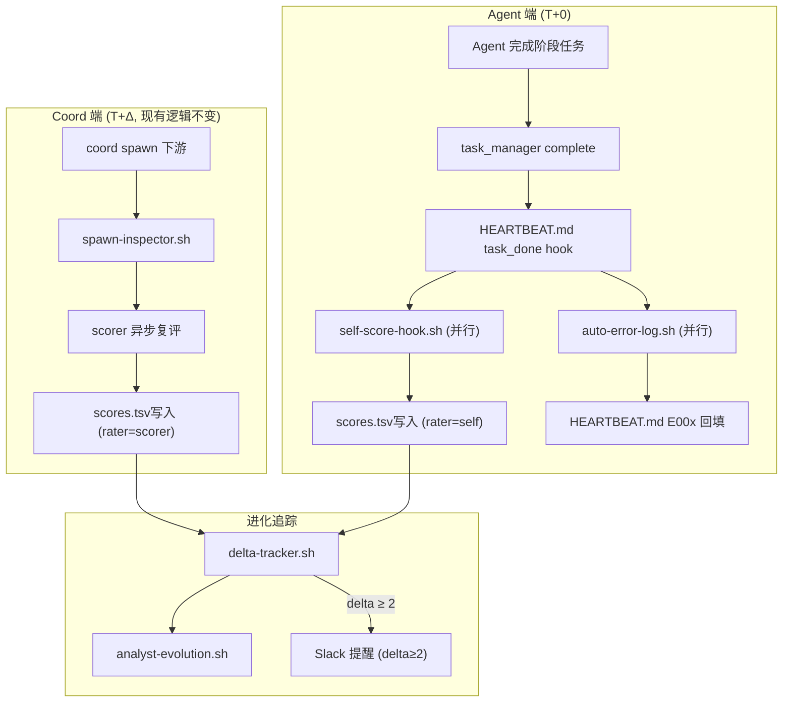

# Architecture: team-evolution-20260328 — Harness Engineering 自我进化机制

**Agent**: Architect
**Date**: 2026-03-28
**Task**: team-evolution-20260328/design-architecture
**Status**: ✅ 设计完成

---

## 1. 背景与设计目标

### 1.1 问题陈述

当前 Harness Engineering 存在两个高优先级流程缺陷：

1. **打分与 task_done 脱节**：评分由 `coord-spawn-inspector.sh` 在 spawn 下游时并行触发，agent 完成任务后不知道自己产出质量，评分反馈滞后 T+1
2. **错误案例无系统沉淀**：HEARTBEAT.md 经验区（E00x）依赖人工写入，缺乏自动回填机制

### 1.2 设计目标

| 目标 | 约束 |
|------|------|
| agent task_done 后立即 self-score，延迟 < 30s | 不修改 task_manager.py |
| 错误案例自动捕获并回填 HEARTBEAT.md E00x | 不破坏 HEARTBEAT.md 格式 |
| self vs scorer delta 形成进化追踪数据 | 复用现有 score.sh 接口 |
| 所有 6 个 agent 都进入评分循环 | 不增加 agent 认知负担 |

---

## 2. 架构概览



**关键设计决策**：
- 所有新组件为 bash 脚本，不引入新服务进程
- task_done hook 使用 `set -x` + `disown` 分离主流程
- HEARTBEAT.md 写入前自动 `.bak` 备份
- self-score 与 scorer 写同一个 scores.tsv（`rater` 列区分）

---

## 3. 技术栈

| 组件 | 技术选型 | 理由 |
|------|---------|------|
| 脚本语言 | Bash + Python3 | 现有基础设施（score.sh 为 bash） |
| 错误模式检测 | Python3 正则 | 比 bash grep 更精确处理多行日志 |
| delta 追踪 | Python3 (pandas-lite) | 处理 scores.tsv 多维度对比 |
| 备份 | 原地 `.bak` 文件 | 无需数据库 |
| 通知 | 复用 `openclaw message send` | 现有 Slack 集成 |

**版本约束**：
- Bash ≥ 4.0（ associative arrays for error pattern config）
- Python3 ≥ 3.8（walrus operator for compact code）
- 无新增 npm/node 依赖

---

## 4. 核心组件详细设计

### 4.1 `self-score-hook.sh`

**路径**: `/root/.openclaw/scripts/heartbeats/self-score-hook.sh`

**接口**:
```bash
bash self-score-hook.sh <phase_file> <agent_name> <run_tag>
# 输出: score.sh record 调用 + 日志
# 退出码: 0=成功, 1=评分失败(不阻塞), 2=参数错误
```

**核心逻辑**:
```
1. 解析 phase_file 中 agent 名称和任务类型
2. 根据 agent+task_type 确定评分维度权重（查 SCORING_RUBRICS.md）
3. 从 phase 文件提取关键信息（格式、完整度、约束等）
4. 9维自评分（0-10，0.5步进）
5. 调用 score.sh record (rater=self)
6. 错误处理: 评分失败 → echo "⚠️ self-score failed" → exit 1（不阻塞）
```

**Agent→维度权重映射**（复用 PRD 中定义）:
| agent | 核心维度 (1.5x) |
|-------|----------------|
| analyst | 完整度、可理解、可行性 |
| pm | 完整度、约束、可行性 |
| architect | 可行性、格式、可理解 |
| dev | 可行性、正确性、格式 |
| tester | 完整度、正确性、详细程度 |
| reviewer | 完整度、可理解、正确性 |

### 4.2 `auto-error-log.sh`

**路径**: `/root/.openclaw/scripts/heartbeats/auto-error-log.sh`

**接口**:
```bash
bash auto-error-log.sh <phase_file> <agent_name>
# 输出: HEARTBEAT.md E00x 追加
# 退出码: 0=成功, 1=无错误模式, 2=备份失败(致命), 3=写入失败(致命)
```

**错误模式定义**:
```python
ERROR_PATTERNS = {
    "E-rate-limit":    r"429|rate.limit|Rate.limit.exceeded",
    "E-timeout":       r"timeout|Timed.out|timeout.after",
    "E-claim-locked":  r"Cannot.claim|already.claimed|locked",
    "E-failure":       r"error|Error:|ERROR|Failed|❌|FAILED",
    "E-inconsistent":  r"inconsisten|不一致|mismatch|不匹配",
}
```

**核心逻辑**:
```
1. 读取 phase_file 全文
2. 对每个 ERROR_PATTERNS 执行正则匹配
3. 若匹配 → 构造 E00x 条目:
   - 错误描述 (matched pattern + context line)
   - 发生时间 (from phase file metadata)
   - 项目名 (from phase file path)
   - 教训 (brief summary)
4. 查重: grep HEARTBEAT.md 已有 E00x 条目描述
   - 若相似度>0.7 → 追加到已有条目（不新建）
   - 若相似度≤0.7 → 新建条目
5. 备份: cp HEARTBEAT.md HEARTBEAT.md.bak.$(date +%Y%m%d%H%M%S)
6. 原子写入: sed -i 追加到 E00x 区
7. 追加 "教训引用: E00x" 到 phase 文件末尾
```

### 4.3 `delta-tracker.sh`

**路径**: `/root/.openclaw/scripts/heartbeats/delta-tracker.sh`

**接口**:
```bash
bash delta-tracker.sh <run_tag> <agent_name>
# 输出: delta 记录写入 analyst-evolution.sh + 可选 Slack 提醒
# 退出码: 0=成功, 1=无对比数据
```

**核心逻辑**:
```
1. 读取 scores.tsv 中 agent 的最新 self 和 scorer 记录
2. 若只有 self 无 scorer → 记录 "awaiting scorer" → exit 0
3. 若 self + scorer 都存在 → 计算 delta = scorer - self
4. 写入 analyst-evolution.sh: delta-record 类型
5. 若 delta 绝对值 ≥ 2:
   - 读取 scorer 维度详情
   - 构造 Slack 提醒消息
   - 调用 openclaw message send → analyst
6. 日志: delta 写入 scores.tsv delta 列
```

---

## 5. 数据模型

### 5.1 scores.tsv 新增列

```diff
- date	run_tag	rated_agent	rater_agent	score	dimension	description	status
+ date	run_tag	rated_agent	rater_agent	score	dimension	description	status	delta
```

**delta 列格式**: `+N` / `-N` / `N`（无 scorer 时留空）

### 5.2 HEARTBEAT.md E00x 条目格式

```
| E0xx | YYYY-MM-DD HH:MM | <项目名> | <错误模式标签> | <错误描述> | <教训> |
```

### 5.3 analyst-evolution.sh 新增记录类型

```
类型: delta-record
格式: date | run_tag | agent | self_score | scorer_score | delta | threshold_exceeded
```

---

## 6. HEARTBEAT.md task_done Hook 集成

在每个 agent 的 HEARTBEAT.md 末尾追加:

```markdown
## task_done 自动执行 (T+0，并行，不阻塞)

```bash
# 并行执行两个 hook，不等待完成
{
    bash /root/.openclaw/scripts/heartbeats/self-score-hook.sh \
        "$(cat /tmp/last_phase_file)" \
        "$(hostname)" \
        "$(date +%m%d-%H%M)" \
    &

    bash /root/.openclaw/scripts/heartbeats/auto-error-log.sh \
        "$(cat /tmp/last_phase_file)" \
        "$(hostname)" \
    &
} 2>/dev/null; disown
```
```

**环境变量约定**:
- `LAST_PHASE_FILE`: 最后一次 phase 报告路径（heartbeat 脚本写入）
- `LAST_TASK_NAME`: 最后完成的任务名
- `LAST_PROJECT`: 项目名

---

## 7. 接口定义

### 7.1 score.sh 调用扩展

现有接口不变，新增 `rater` 列支持:

```bash
# self 评分
bash score.sh record <run_tag> <agent> self <score> "<9维简评>" "<phase_file>"

# scorer 评分（现有接口不变）
bash score.sh record <run_tag> <agent> scorer <score> "<9维简评>"
```

### 7.2 analyst-evolution.sh 新增类型

```bash
# delta 追踪
bash analyst-evolution.sh delta-record <run_tag> <agent> <self_score> <scorer_score>
```

---

## 8. 实施计划

### Phase 1: Self-Score 基础 (Epic 1) — ~1.5h

| 步骤 | 动作 | 产出 |
|------|------|------|
| 1.1 | 创建 `self-score-hook.sh` | `/root/.openclaw/scripts/heartbeats/self-score-hook.sh` |
| 1.2 | 创建 Phase 报告解析模块 | Python3 提取格式/完整度/约束 |
| 1.3 | 在 HEARTBEAT.md 中选择 1 个 agent 测试 | `workspace-architect` 端到端 |
| 1.4 | 验证 scores.tsv 有 rater=self 记录 | `grep "rater=self" scores.tsv` |
| 1.5 | 推广到全部 6 个 agent | 各 agent HEARTBEAT.md 更新 |

### Phase 2: Error-Log 自动化 (Epic 2) — ~1h

| 步骤 | 动作 | 产出 |
|------|------|------|
| 2.1 | 创建 `auto-error-log.sh` | `/root/.openclaw/scripts/heartbeats/auto-error-log.sh` |
| 2.2 | 制造测试错误，验证 E00x 回填 | HEARTBEAT.md E012+ 条目 |
| 2.3 | 验证备份文件生成 | `HEARTBEAT.md.bak.*` |
| 2.4 | 验证 phase 文件追加 "教训引用" | phase 文件末尾 |

### Phase 3: Delta 追踪 (Epic 3) — ~0.5h

| 步骤 | 动作 | 产出 |
|------|------|------|
| 3.1 | 创建 `delta-tracker.sh` | `/root/.openclaw/scripts/heartbeats/delta-tracker.sh` |
| 3.2 | 扩展 `analyst-evolution.sh` 支持 delta-record | 新记录类型 |
| 3.3 | 端到端: self + scorer → delta 写入 | `analyst-evolution.sh report` 验证 |

### Phase 4: 全量覆盖 + 验证 (Epic 4) — ~1h

| 步骤 | 动作 | 产出 |
|------|------|------|
| 4.1 | 所有 6 个 agent HEARTBEAT.md 配置完整 | task_done hook 就位 |
| 4.2 | 连续运行 3 个任务，收集数据 | scores.tsv 有 self+scorer 对 |
| 4.3 | 验证 delta ≥ 2 触发 Slack 提醒 | Slack 消息验证 |

---

## 9. 测试策略

### 9.1 单元测试

**覆盖框架**: `pytest`（Python 组件）+ `bats`（bash 组件）

**核心用例**:

```python
# test_self_score_hook.py
def test_extracts_agent_type_from_phase_file():
    """从 phase 文件正确识别 agent 和任务类型"""
    pass

def test_maps_correct_weight_matrix():
    """不同 agent 使用正确的核心维度权重"""
    assert get_core_weights("architect") == ["可行性", "格式", "可理解"]

def test_score_recorded_in_tsv():
    """self-score 结果正确写入 scores.tsv"""
    # 先清空测试数据，调用 hook，检查 rater=self
    pass

def test_failure_does_not_block():
    """评分异常不修改 task 状态"""
    # mock score.sh 失败，验证仍返回 0
    pass

# test_auto_error_log.py
def test_detects_rate_limit_pattern():
    """429/timeout/Cannot.claim 等模式被正确识别"""
    pass

def test_deduplication_prevents_duplicate_entries():
    """相似错误不重复创建 E00x 条目"""
    pass

def test_backup_created_before_write():
    """写入前 .bak 文件已存在"""
    pass

# test_delta_tracker.py
def test_computes_correct_delta():
    """self=8, scorer=6 → delta=-2"""
    pass

def test_no_scorer_yet_returns_awaiting():
    """只有 self 无 scorer 时不报错"""
    pass
```

### 9.2 集成测试

```bash
# E2E: 完整 self-score + error-log + delta 流程
cd /tmp
mkdir test-e2e && cd test-e2e
cp /root/.openclaw/scripts/heartbeats/self-score-hook.sh .
cp /root/.openclaw/scripts/heartbeats/auto-error-log.sh .
echo "ERROR: 429 rate limit exceeded" > test-phase.md
bash self-score-hook.sh test-phase.md test-agent test-run
grep "rater=self" $EVOLUTION_DIR/scores.tsv  # 必须有记录
grep "E-rate-limit" $HEARTBEAT_PATH  # 必须有 E 条目
```

### 9.3 覆盖率目标

| 组件 | 覆盖率目标 |
|------|-----------|
| self-score-hook.sh | > 80% |
| auto-error-log.sh | > 85% |
| delta-tracker.sh | > 80% |

---

## 10. 风险与缓解

| 风险 | 可能性 | 影响 | 缓解 |
|------|--------|------|------|
| self-score 过度宽容 bias | 高 | 中 | delta ≥ 2 触发人工 review |
| HEARTBEAT.md 写入格式破坏 | 中 | 中 | 写前 .bak 备份 |
| scores.tsv 多进程写冲突 | 低 | 低 | bash `>>` 原子 append |
| error-log 误判正常执行为错误 | 中 | 低 | 只检测已知模式（不过度宽松） |
| self + scorer 并发写同一行 | 低 | 低 | scorer 延迟 T+Δ，有充足时间差 |

---

## 11. 开放问题 & 决策记录

| # | 问题 | 决策 | ADR |
|---|------|------|-----|
| Q1 | self-score 权限边界 | self 可写 scores.tsv（团队共享），按 rater 列区分 | ADR-001 |
| Q2 | error-log 是否需要审核 | 直接写入 P0，审核作为 P2 优化 | ADR-002 |
| Q3 | delta 阈值 | 2 分（经验值，可通过数据调优） | ADR-003 |
| Q4 | 不修改 task_manager.py | 通过 HEARTBEAT.md task_done hook 注入 | ADR-004 |
