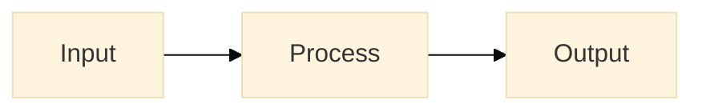
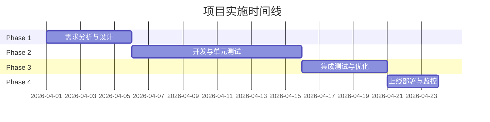

# 分析报告模板 V2.0

**版本**: 2.1
**创建日期**: 2026-03-18
**最后更新**: 2026-03-19
**状态**: 正式发布

---

> 💡 **使用说明**: 本模板为 VibeX 项目分析报告标准格式，包含 9 个核心章节 + 附录。请按顺序填写，确保每章节内容完整。

---

## 使用指南

### 📋 快速开始

1. **复制模板**: 将 `analysis-template-v2.md` 复制到目标目录
   ```bash
   cp docs/templates/analysis-template-v2.md docs/<project-name>/analysis.md
   ```
2. **填写基本信息**: 更新文档顶部的元信息（版本、日期）
3. **按章节编写**: 从第1章到第9章依次填写
4. **补充附录**: 根据需要添加参考资料和术语表

### 📑 章节速查

| 章节 | 用途 | 预计耗时 |
|------|------|----------|
| 1. 执行摘要 | 30秒了解全貌 | 10min |
| 2. 问题定义 | 明确要解决什么 | 20min |
| 3. 竞品分析 | 了解市场现状 | 30min |
| 4. 数据流分析 | 理解系统架构 | 30min |
| 5. 解决方案 | 提出可行方案 | 40min |
| 6. 技术方案 | 详细技术设计 | 60min |
| 7. 验收标准 | 定义 Done | 20min |
| 8. 风险矩阵 | 预判风险 | 15min |
| 9. 实施计划 | 排期与资源 | 20min |
| 附录 | 补充信息 | 10min |

### ✏️ 填写规范

#### 执行摘要 (第1章)
- **一句话结论**: 用1句话概括核心发现和主要建议
- **关键指标**: 使用表格，包含当前值、目标值、趋势
- **核心建议**: 按 P0/P1/P2 优先级排序

#### 问题定义 (第2章)
- **背景**: 描述项目上下文，2-3段
- **核心问题**: 使用编号表格，标明优先级
- **用户场景**: 描述典型用户故事

#### 竞品分析 (第3章)
- **竞品表格**: 对比功能、易用性、价格
- **差异化机会**: 找准切入角度
- **SWOT 分析**: 可选，但推荐使用

#### 数据流分析 (第4章)
- **Mermaid 图表**: 在架构复杂时使用流程图
- **数据表**: 列出核心数据实体

#### 解决方案 (第5章)
- **方案对比**: 至少2个方案对比
- **推荐方案**: 明确说明理由

#### 技术方案 (第6章)
- **架构图**: 使用 Mermaid diagrams
- **API 设计**: 如有接口变更
- **数据结构**: 核心数据模型

#### 验收标准 (第7章)
- **量化指标**: 可测量的指标
- **测试方法**: 如何验证
- **上线条件**: 必须满足的条件

#### 风险矩阵 (第8章)
- **概率 × 影响**: 矩阵表格
- **缓解措施**: 每个风险的应对策略

#### 实施计划 (第9章)
- **甘特图**: 使用 Mermaid `gantt` 语法
- **里程碑**: 关键节点
- **资源需求**: 人力、设备、工具

### 🎨 Mermaid 图表规范



#### 支持的图表类型
| 类型 | 关键词 | 用途 |
|------|--------|------|
| 流程图 | `flowchart` | 业务流程 |
| 时序图 | `sequenceDiagram` | API 调用 |
| 甘特图 | `gantt` | 项目时间线 |
| 类图 | `classDiagram` | 数据模型 |
| 状态图 | `stateDiagram` | 状态机 |

### ⚠️ 常见错误

| 错误 | 正确做法 |
|------|----------|
| 执行摘要写太多 | 保持1页以内 |
| 缺少量化指标 | 每个验收标准必须有数字 |
| 风险矩阵空白 | 至少列出3个主要风险 |
| 甘特图用截图 | 使用 Mermaid 原生语法 |

### 📝 版本记录

| 版本 | 日期 | 修改内容 | 作者 |
|------|------|----------|------|
| 2.1 | 2026-03-19 | 新增 Mermaid 甘特图示例 + 详细使用指南 | Dev |
| 2.0 | 2026-03-18 | 初始版本 V2.0，包含竞品分析、数据流、风险矩阵、时间线章节 | Analyst |

---

## 1. 执行摘要

### 1.1 一句话结论

[在此用一句话概括本次分析的结论和核心建议]

### 1.2 关键指标

| 指标 | 当前值 | 目标值 | 趋势 |
|------|--------|--------|------|
| [指标1] | [值] | [值] | ↑/↓/→ |
| [指标2] | [值] | [值] | ↑/↓/→ |

### 1.3 核心建议

| 优先级 | 建议 | 工作量 |
|--------|------|--------|
| P0 | [建议1] | [时间] |
| P1 | [建议2] | [时间] |
| P2 | [建议3] | [时间] |

---

## 2. 问题定义

### 2.1 背景

[描述项目/需求的背景上下文]

### 2.2 核心问题

| # | 问题描述 | 影响范围 | 优先级 |
|---|----------|----------|--------|
| 1 | [问题1] | [影响] | P0/P1/P2 |
| 2 | [问题2] | [影响] | P0/P1/P2 |

### 2.3 用户场景

**场景 [N]**: [场景名称]

- **当前**: [当前实现/流程]
- **期望**: [期望的实现/流程]

---

## 3. 竞品分析

### 3.1 竞品对比表

| 功能/特性 | 本项目 | 竞品A | 竞品B | 竞品C |
|-----------|--------|-------|-------|-------|
| [功能1] | ✅/❌ | ✅/❌ | ✅/❌ | ✅/❌ |
| [功能2] | ✅/❌ | ✅/❌ | ✅/❌ | ✅/❌ |
| [性能] | [值] | [值] | [值] | [值] |
| [价格] | [值] | [值] | [值] | [值] |

### 3.2 差异化优势

| 维度 | 我们的优势 | 我们的劣势 | 应对策略 |
|------|------------|------------|----------|
| [维度1] | [优势] | [劣势] | [策略] |

### 3.3 竞品功能详细分析

#### 竞品A
- **优势**: [列出主要优势]
- **劣势**: [列出主要劣势]
- **启示**: [我们可以借鉴的点]

---

## 4. 数据流分析

### 4.1 系统数据流图

```
┌──────────┐    ┌──────────┐    ┌──────────┐    ┌──────────┐
│  输入源  │───▶│  处理1  │───▶│  处理2  │───▶│  输出目标│
└──────────┘    └──────────┘    └──────────┘    └──────────┘
```

### 4.2 数据处理逻辑

| 阶段 | 输入 | 处理逻辑 | 输出 | 异常处理 |
|------|------|----------|------|----------|
| Stage1 | [输入] | [逻辑] | [输出] | [处理] |
| Stage2 | [输入] | [逻辑] | [输出] | [处理] |

### 4.3 代码分析检查清单

- [ ] 数据来源清晰可追溯
- [ ] 数据格式有明确 Schema
- [ ] 关键数据有缓存策略
- [ ] 数据一致性有保障机制

---

## 5. 解决方案

### 5.1 方案对比

| 方案 | 优点 | 缺点 | 工作量 | 风险 | 推荐 |
|------|------|------|--------|------|------|
| 方案A | [优点] | [缺点] | [时间] | [风险] | ✅ |
| 方案B | [优点] | [缺点] | [时间] | [风险] | ❌ |
| 方案C | [优点] | [缺点] | [时间] | [风险] | ❌ |

### 5.2 推荐方案详情

#### 5.2.1 方案描述

[详细描述推荐方案的实现方式]

#### 5.2.2 技术架构

```
[架构图或架构描述]
```

#### 5.2.3 核心模块

| 模块 | 职责 | 关键接口 |
|------|------|----------|
| [模块1] | [职责] | [接口] |
| [模块2] | [职责] | [接口] |

---

## 6. 技术方案

### 6.1 技术选型

| 技术 | 版本 | 选择理由 |
|------|------|----------|
| [技术1] | [版本] | [理由] |
| [技术2] | [版本] | [理由] |

### 6.2 详细设计

#### 接口设计

**API: [接口名称]**

| 方法 | 路径 | 请求参数 | 响应格式 |
|------|------|----------|----------|
| GET | /api/xxx | {param} | {response} |

#### 数据模型

```
Model: [模型名]
{
  field1: Type,  // 说明
  field2: Type,  // 说明
}
```

### 6.3 性能考虑

- **响应时间目标**: [时间]
- **吞吐量目标**: [QPS/TPS]
- **资源使用**: [CPU/内存]

---

## 7. 验收标准

### 7.1 功能验收

| ID | 功能点 | 验收条件 | 测试方法 |
|----|--------|----------|----------|
| AC-001 | [功能1] | [条件] | [测试方式] |
| AC-002 | [功能2] | [条件] | [测试方式] |

### 7.2 非功能验收

| 指标 | 目标值 | 测试方法 |
|------|--------|----------|
| 性能 | [指标] | [方法] |
| 安全 | [指标] | [方法] |
| 可用性 | [指标] | [方法] |

### 7.3 验收检查清单

- [ ] [ ] AC-001 验收通过
- [ ] [ ] AC-002 验收通过
- [ ] [ ] 性能测试通过
- [ ] [ ] 安全扫描通过

---

## 8. 风险矩阵

### 8.1 风险评估矩阵

| 风险项 | 发生概率 | 影响程度 | 风险等级 | 缓解措施 |
|--------|----------|----------|----------|----------|
| [风险1] | 高/中/低 | 高/中/低 | 🔴 | [措施] |
| [风险2] | 高/中/低 | 高/中/低 | 🟡 | [措施] |
| [风险3] | 高/中/低 | 高/中/低 | 🟢 | - |

### 8.2 风险等级定义

- 🔴 **高风险**: 需要立即行动，高层关注
- 🟡 **中风险**: 需要制定缓解计划
- 🟢 **低风险**: 常规监控即可

### 8.3 风险责任人

| 风险 | 责任人 | 升级路径 |
|------|--------|----------|
| [风险] | [RACI] | [升级路径] |

---

## 9. 实施计划

### 9.1 时间线 (Mermaid 甘特图)



### 9.2 时间线 (表格格式)

| 阶段 | 任务 | 开始 | 结束 | 负责人 | 产出 |
|------|------|------|------|--------|------|
| Phase 1 | [任务1] | Day 1 | Day 5 | @xxx | [产出] |
| Phase 2 | [任务2] | Day 6 | Day 15 | @xxx | [产出] |
| Phase 3 | [任务3] | Day 16 | Day 20 | @xxx | [产出] |
| Phase 4 | [任务4] | Day 21 | Day 23 | @xxx | [产出] |

### 9.2 里程碑

| 里程碑 | 目标日期 | 验收条件 | 状态 |
|--------|----------|----------|------|
| M1: [名称] | [日期] | [条件] | ⬜/🟢 |
| M2: [名称] | [日期] | [条件] | ⬜/🟢 |

### 9.3 资源需求

| 资源 | 数量 | 用途 | 备注 |
|------|------|------|------|
| 前端开发 | N人 | [用途] | [备注] |
| 后端开发 | N人 | [用途] | [备注] |
| 测试 | N人 | [用途] | [备注] |

---

## 附录

### A. 参考资料

- [文档1链接]
- [文档2链接]

### B. 相关文件

| 文件 | 路径 |
|------|------|
| [文件1] | [路径] |
| [文件2] | [路径] |

### C. 术语表

| 术语 | 定义 |
|------|------|
| [术语] | [定义] |

---

**模板维护**: 请在更新模板后同步更新版本号和日期

| 版本 | 日期 | 修改内容 | 作者 |
|------|------|----------|------|
| 2.1 | 2026-03-19 | 新增 Mermaid 甘特图示例 + 详细使用指南 | Dev |
| 2.0 | 2026-03-18 | 初始版本 V2.0，包含竞品分析、数据流、风险矩阵、时间线章节 | Analyst |
