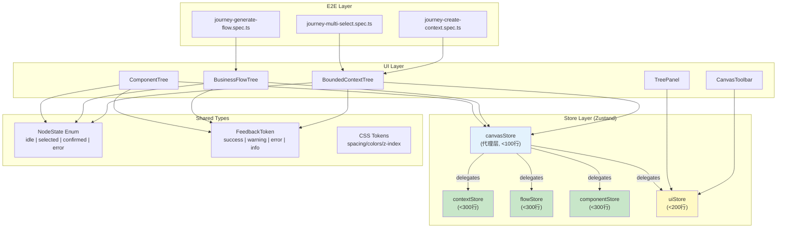
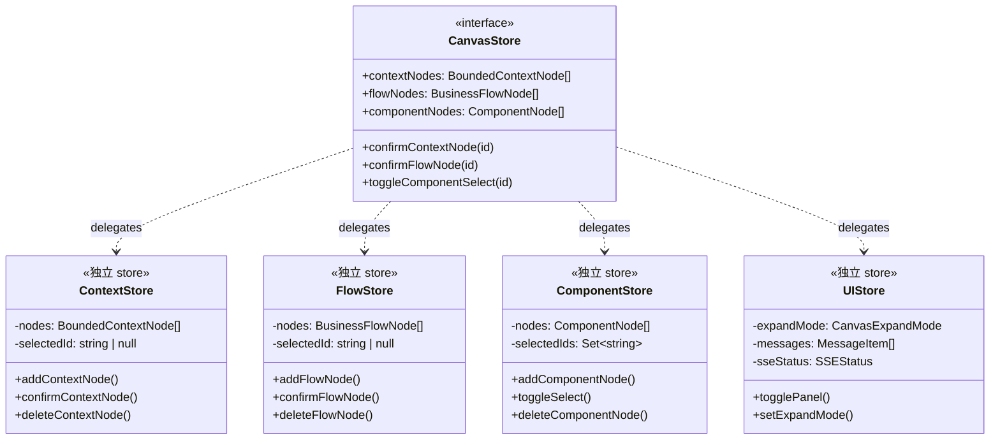

# Architecture: VibeX 系统性风险治理

**项目**: vibex-analyst-proposals-20260402_061709
**版本**: v1.0
**日期**: 2026-04-02
**架构师**: architect
**状态**: ✅ 设计完成

---

## 执行摘要

本项目通过 7 个 Epic 系统性治理 VibeX 的三类核心风险：
1. **三树状态模型分裂** → 统一 NodeState 枚举 + store 拆分
2. **canvasStore 膨胀** → 按领域拆分 4 个独立 store
3. **交互反馈碎片化** → FeedbackToken + toast 规范

**技术选型**: Next.js 16.2.0 + React 19.2.3 + Zustand + Playwright + Jest
**总工时**: 39-54h（6 Sprint）

---

## 1. Tech Stack

| 技术 | 选择 | 理由 |
|------|------|------|
| **框架** | Next.js 16.2.0 + React 19.2.3 | 已有，无升级必要 |
| **状态管理** | Zustand（保持，分片化） | 已有，拆分而非替换 |
| **样式** | CSS Modules + CSS Variables | 已有，补充 token 系统 |
| **测试** | Jest + React Testing Library + Playwright | 已有，补充 journey E2E |
| **覆盖要求** | 单元测试 > 70%，E2E > 95% | PRD 验收标准 |
| **新增依赖** | `react-virtual`（E2 虚拟化） | 轻量，仅 E2 使用 |

**无破坏性重构**，所有变更向后兼容。

---

## 2. Architecture Diagram

### 2.1 整体架构



### 2.2 Store 拆分架构



---

## 3. Component Architecture

### 3.1 NodeState 枚举（E1）

**新文件**: `src/components/canvas/types/NodeState.ts`

```typescript
/**
 * 统一节点状态机
 * 替换分散在三个组件中的隐式状态逻辑
 */
export enum NodeState {
  /** 节点存在但未选中 */
  Idle = 'idle',
  /** 节点被选中（多选） */
  Selected = 'selected',
  /** 节点已确认（DDD 建模完成） */
  Confirmed = 'confirmed',
  /** 节点异常 */
  Error = 'error',
}

/** 节点确认状态（兼容性别名） */
export const NodeStatus = {
  Pending: 'pending',
  Confirmed: 'confirmed',
  Error: 'error',
} as const;

export type NodeStatusType = typeof NodeStatus[keyof typeof NodeStatus];

/**
 * 三树统一节点接口
 * 所有树节点实现此接口
 */
export interface BaseNode {
  nodeId: string;
  nodeName: string;
  status: NodeStatusType;
  /** 选中态：用于 checkbox 展示 */
  selected?: boolean;
}

/** Context 节点 */
export interface ContextNode extends BaseNode {
  type: 'core' | 'supporting' | 'generic';
}

/** Flow 节点 */
export interface FlowNode extends BaseNode {
  type: 'flow';
  steps?: FlowStep[];
}

/** Component 节点 */
export interface ComponentNode extends BaseNode {
  type: 'page' | 'list' | 'form' | 'detail' | 'popup';
}
```

### 3.2 canvasStore 拆分架构（E2）

**目标文件结构**:
```
src/lib/canvas/
├── canvasStore.ts              # 代理层（<100行）—— 保持 API 兼容
├── contextStore.ts            # 限界上下文状态（<300行）
├── flowStore.ts               # 流程状态（<300行）
├── componentStore.ts          # 组件状态（<300行）
├── uiStore.ts                 # UI 状态（<200行）
├── types/
│   ├── NodeState.ts           # 统一状态枚举
│   └── index.ts              # 统一导出
└── api/
    └── canvasApi.ts           # 现有 API
```

**代理层设计（canvasStore.ts）**:
```typescript
// canvasStore.ts — 代理层（最终形态，<100行）
// 兼容现有 API，所有调用转发到独立 store

import { create } from 'zustand';
import { useContextStore } from './contextStore';
import { useFlowStore } from './flowStore';
import { useComponentStore } from './componentStore';
import { useUIStore } from './uiStore';

// Re-export all types from sub-stores
export type { ContextNode, FlowNode, ComponentNode } from './types';
export { NodeState, NodeStatus } from './types/NodeState';

// Thin proxy — delegates to sub-stores
export const useCanvasStore = () => ({
  // Context tree
  contextNodes: useContextStore(s => s.contextNodes),
  confirmContextNode: useContextStore(s => s.confirmContextNode),
  // Flow tree
  flowNodes: useFlowStore(s => s.flowNodes),
  confirmFlowNode: useFlowStore(s => s.confirmFlowNode),
  // Component tree
  componentNodes: useComponentStore(s => s.componentNodes),
  toggleComponentSelect: useComponentStore(s => s.toggleSelect),
  // UI
  expandMode: useUIStore(s => s.expandMode),
  setExpandMode: useUIStore(s => s.setExpandMode),
});
```

**contextStore.ts 示例结构**:
```typescript
// contextStore.ts（<300行）
import { create } from 'zustand';
import { devtools, persist } from 'zustand/middleware';

interface ContextState {
  contextNodes: ContextNode[];
  selectedNodeId: string | null;
  // Actions
  addContextNode: (draft: BoundedContextDraft) => ContextNode;
  confirmContextNode: (nodeId: string) => void;
  deleteContextNode: (nodeId: string) => void;
  resetAll: () => void;
}

export const useContextStore = create<ContextState>()(
  devtools(
    persist(
      (set, get) => ({
        contextNodes: [],
        selectedNodeId: null,

        addContextNode: (draft) => {
          const node: ContextNode = {
            nodeId: generateId(),
            nodeName: draft.name,
            type: draft.type,
            status: 'pending',
            selected: false,
          };
          set(state => ({ contextNodes: [...state.contextNodes, node] }));
          return node;
        },

        confirmContextNode: (nodeId) => {
          set(state => ({
            contextNodes: state.contextNodes.map(n =>
              n.nodeId === nodeId
                ? { ...n, status: 'confirmed' as const }
                : n
            ),
          }));
        },

        deleteContextNode: (nodeId) => {
          set(state => ({
            contextNodes: state.contextNodes.filter(n => n.nodeId !== nodeId),
            selectedNodeId: state.selectedNodeId === nodeId ? null : state.selectedNodeId,
          }));
        },

        resetAll: () => {
          set({ contextNodes: [], selectedNodeId: null });
        },
      }),
      { name: 'vibex-context-store' }
    )
  )
);
```

**迁移策略（渐进式）**:
```
Phase 1: 创建 contextStore，运行 E2E（create-context）
Phase 2: 创建 flowStore，运行 E2E（generate-flow）
Phase 3: 创建 componentStore，运行 E2E（multi-select）
Phase 4: 清理 canvasStore 为代理层
```

### 3.3 FeedbackToken 系统（E4）

**新文件**: `src/components/canvas/types/FeedbackToken.ts`

```typescript
/**
 * 统一反馈 Token
 * 替换零散的 toast/confirm 逻辑
 */
export enum FeedbackToken {
  Success = 'success',
  Warning = 'warning',
  Error = 'error',
  Info = 'info',
}

export interface FeedbackConfig {
  token: FeedbackToken;
  message: string;
  /** 可选：撤销回调，5秒内有效 */
  undoAction?: () => void;
  duration?: number; // ms，默认 5000
}

/**
 * 删除操作专用反馈
 * 强制包含 undoAction
 */
export interface DeleteFeedback extends FeedbackConfig {
  token: FeedbackToken.Warning | FeedbackToken.Error;
  undoAction: () => void; // 必须提供撤销
}

// 全局 Feedback API
export interface FeedbackAPI {
  show: (config: FeedbackConfig) => void;
  dismiss: (id: string) => void;
}
```

**使用示例**:
```typescript
// 替换 window.confirm
import { useFeedback } from '@/hooks/useFeedback';

const feedback = useFeedback();

// 删除节点
const handleDelete = (nodeId: string) => {
  feedback.show({
    token: FeedbackToken.Warning,
    message: `确认删除节点?`,
    undoAction: () => restoreNode(nodeId),
    duration: 5000,
  });
};
```

---

## 4. Canvas 布局架构（E3）

### 4.1 z-index 协议

```typescript
// src/styles/canvas-z-index.css
:root {
  /* Canvas 层级协议 */
  --z-canvas-base: 0;
  --z-panel: 10;
  --z-toolbar: 20;
  --z-drawer: 50;
  --z-modal: 100;
  --z-toast: 200;
  --z-tooltip: 300;
}
```

### 4.2 面板动画规范

```css
/* 三栏面板动画统一 */
.panel {
  transition: width 300ms ease-in-out, opacity 300ms ease-in-out;
}

/* 工具栏 sticky */
.toolbar {
  position: sticky;
  top: 0;
  z-index: var(--z-toolbar);
}
```

### 4.3 scrollTop 初始化

```typescript
// src/components/canvas/CanvasPage.tsx
useEffect(() => {
  // E3-S1: 页面加载时 scrollTop = 0
  const scrollContainer = containerRef.current;
  if (scrollContainer) {
    scrollContainer.scrollTop = 0;
  }
  return () => {
    // 清理：离开页面时重置
    if (scrollContainer) {
      scrollContainer.scrollTop = 0;
    }
  };
}, [activeTab]);
```

---

## 5. Data Models

### 5.1 节点类型（统一）

```typescript
// src/components/canvas/types/NodeState.ts

export enum NodeState {
  Idle = 'idle',
  Selected = 'selected',
  Confirmed = 'confirmed',
  Error = 'error',
}

export const NodeStatus = {
  Pending: 'pending',
  Confirmed: 'confirmed',
  Error: 'error',
} as const;

export type NodeStatusType = typeof NodeStatus[keyof typeof NodeStatus];

export interface BaseNode {
  nodeId: string;
  nodeName: string;
  status: NodeStatusType;
  selected?: boolean;
}

export interface ContextNode extends BaseNode {
  type: 'core' | 'supporting' | 'generic';
}

export interface FlowNode extends BaseNode {
  type: 'flow';
  steps?: FlowStep[];
}

export interface ComponentNode extends BaseNode {
  type: 'page' | 'list' | 'form' | 'detail' | 'popup';
}
```

### 5.2 UI 状态

```typescript
// src/lib/canvas/uiStore.ts
export interface UIState {
  expandMode: 'normal' | 'expand-both' | 'maximize';
  contextPanelCollapsed: boolean;
  flowPanelCollapsed: boolean;
  componentPanelCollapsed: boolean;
  messages: MessageItem[];
  sseStatus: SSEStatus;
}
```

---

## 6. Testing Strategy

### 6.1 单元测试策略

| 文件 | 覆盖率目标 | 测试框架 |
|------|-----------|----------|
| `contextStore.ts` | ≥ 70% | Jest + Testing Library |
| `flowStore.ts` | ≥ 70% | Jest + Testing Library |
| `componentStore.ts` | ≥ 70% | Jest + Testing Library |
| `uiStore.ts` | ≥ 60% | Jest |
| 三树组件 | 组件测试覆盖关键路径 | Jest + Testing Library |

### 6.2 E2E Journey 测试

```typescript
// e2e/journey-create-context.spec.ts
describe('Journey: Create Context', () => {
  it('should create and confirm a bounded context', async ({ page }) => {
    await page.goto('/canvas');
    // 1. Click add context button
    // 2. Fill in context name
    // 3. Confirm node
    // 4. Verify green checkmark appears
    // 5. Verify only 1 checkbox in card
  });
});
```

### 6.3 Playwright 测试覆盖矩阵

| 测试文件 | 覆盖场景 | 通过率目标 |
|----------|----------|-----------|
| `journey-create-context.spec.ts` | 创建→填写→确认 | ≥ 95% |
| `journey-generate-flow.spec.ts` | 选择→生成→确认 | ≥ 95% |
| `journey-multi-select.spec.ts` | 多选→批量确认 | ≥ 95% |

### 6.4 回归策略

- **每次 store 拆分** → 立即运行对应树的 E2E
- **E2 完成后** → 运行 full E2E suite
- **视觉回归** → gstack browse 截图对比

---

## 7. Performance Impact

| 维度 | 影响 | 说明 |
|------|------|------|
| **Bundle Size** | 无变化 | 拆分 store 不增加体积，react-virtual < 5KB gzipped |
| **Runtime Performance** | 正向 | 小 store 更易优化，memo 更精准 |
| **Memory** | 轻微正向 | Zustand 独立 store 按需加载 |
| **Build Time** | 无变化 | 增量编译 |
| **Test Time** | 缩短 | 小 store 独立测试，启动更快 |

**结论**: 无性能风险，store 拆分有助于长期性能优化。

---

## 8. Risk & Mitigation

| 风险 | 概率 | 影响 | 缓解 |
|------|------|------|------|
| canvasStore 拆分引入回归 | 中 | 高 | 每次拆分后立即跑对应树 E2E |
| FeedbackToken 推行受阻 | 中 | 中 | 先在 Canvas 范围落地 |
| E2E 测试不稳定 | 高 | 中 | D-002 Jest 稳定后开始 |
| z-index 改动影响其他组件 | 低 | 高 | 先建 CSS token 再改值 |

---

## 9. 架构决策记录

### ADR-001: Zustand Store 按领域拆分

**状态**: Accepted

**上下文**: canvasStore 1433 行，所有状态混合，难以测试和独立演进。

**决策**: 按 context / flow / component / ui 拆分为 4 个独立 store，canvasStore 降为代理层。

**后果**:
- ✅ 每个 store < 300 行，可独立测试
- ⚠️ 需要迁移现有状态字段（3 个 migration 已处理旧版本）
- ⚠️ 所有 consumer 需要逐步更新引用

### ADR-002: NodeState 枚举统一三树语义

**状态**: Accepted

**上下文**: 三树使用不同状态字段（isActive + status vs isActive only）。

**决策**: 定义 NodeState + NodeStatus 统一枚举，所有树节点实现 BaseNode 接口。

**后果**:
- ✅ 三树状态语义一致
- ⚠️ 需要更新 ComponentTree（当前只使用 isActive，无 status）

### ADR-003: FeedbackToken 替换 window.confirm

**状态**: Accepted

**上下文**: window.confirm() 是同步阻塞 API，用户体验差且无法撤销。

**决策**: 定义 FeedbackToken 枚举，所有操作确认改用 toast + undoAction。

**后果**:
- ✅ 用户体验提升，支持撤销
- ⚠️ 需要全局 toast 基础设施（可能需要新增组件）

### ADR-004: CSS z-index token 化

**状态**: Accepted

**上下文**: 抽屉层级混乱，modal 和 drawer 冲突。

**决策**: CSS Variables 定义五级层级协议，组件引用 token 而非硬编码数字。

**后果**:
- ✅ 层级冲突消除
- ✅ 主题切换更容易

---

## 10. 变更文件清单

| 文件 | 操作 | 说明 |
|------|------|------|
| `src/components/canvas/types/NodeState.ts` | 新增 | 统一状态枚举 |
| `src/lib/canvas/contextStore.ts` | 新增 | 限界上下文 store |
| `src/lib/canvas/flowStore.ts` | 新增 | 流程 store |
| `src/lib/canvas/componentStore.ts` | 新增 | 组件 store |
| `src/lib/canvas/uiStore.ts` | 新增 | UI store |
| `src/lib/canvas/canvasStore.ts` | 修改 | 降为代理层 |
| `src/styles/canvas-z-index.css` | 新增 | z-index token |
| `src/hooks/useFeedback.ts` | 新增 | 统一反馈 API |
| `e2e/journey-create-context.spec.ts` | 新增 | E2E 测试 |
| `e2e/journey-generate-flow.spec.ts` | 新增 | E2E 测试 |
| `e2e/journey-multi-select.spec.ts` | 新增 | E2E 测试 |

---

## 执行决策

- **决策**: 已采纳
- **执行项目**: vibex-analyst-proposals-20260402_061709
- **执行日期**: 2026-04-02
