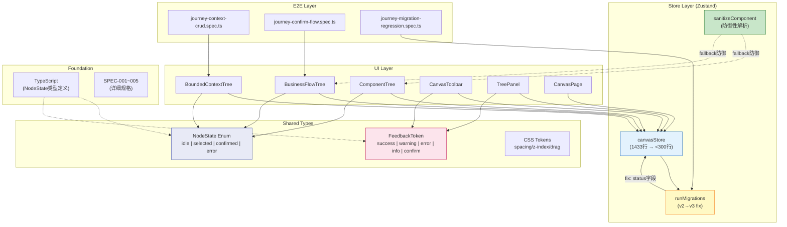
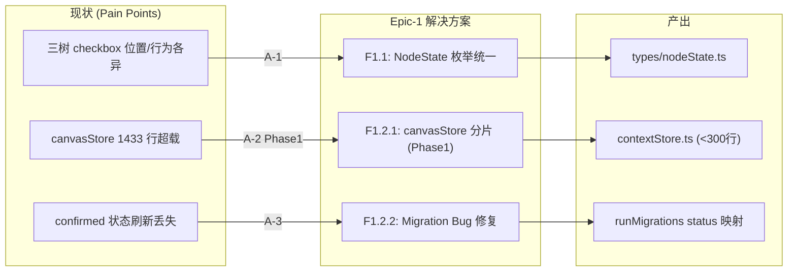
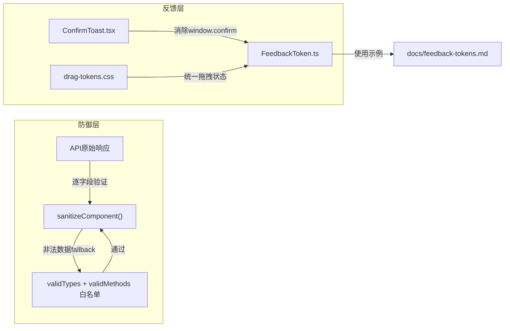
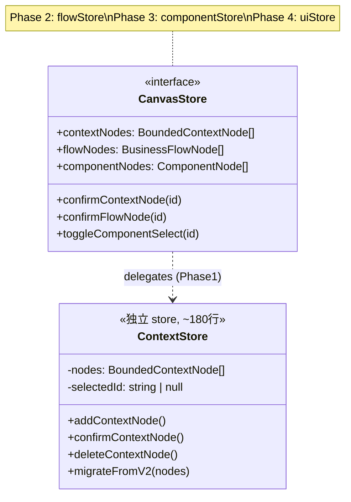
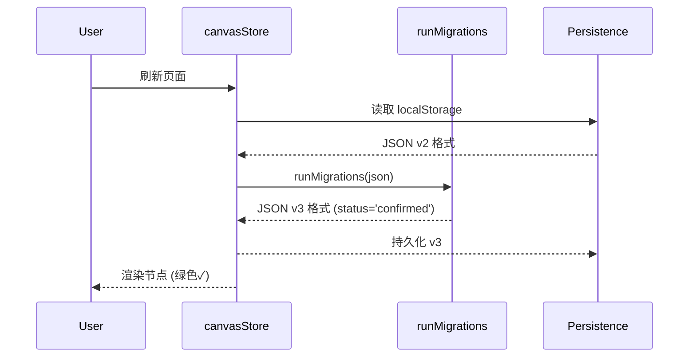

# Architecture: VibeX 技术改进提案实施

**项目**: vibex-analyst-proposals-20260402_201318
**版本**: v1.0
**日期**: 2026-04-02
**架构师**: architect
**状态**: ✅ 设计完成

---

## 执行摘要

本项目通过 **3 个 Epic / 7 个 Feature** 系统性治理 VibeX 的三类核心风险：

| 风险类别 | 根因 | 解决方案 |
|---------|------|---------|
| **技术债务** | canvasStore 1433 行、Migration Bug、TS 预存错误 | store 拆分 + Migration 修复 |
| **交互不一致** | 三树 checkbox 各异、window.confirm() 弹窗 | NodeState 枚举统一 + toast |
| **质量门禁失效** | E2E 几乎无覆盖、Migration 状态丢失 | 防御性解析 + 完整测试 |

**技术选型**: Next.js 16.2.0 + React 19.2.3 + Zustand + Playwright + Jest
**总工时**: 22.5–37.5h（4 Sprint + Sprint 0）

---

## 1. Tech Stack

| 技术 | 选择 | 理由 |
|------|------|------|
| **框架** | Next.js 16.2.0 + React 19.2.3 | 已有，无升级必要 |
| **状态管理** | Zustand（保持，分片化） | 已有，拆分而非替换 |
| **样式** | CSS Modules + CSS Variables | 已有，补充 token 系统 |
| **测试** | Jest + React Testing Library + Playwright | 已有，补充 journey E2E |
| **覆盖要求** | 单元测试 > 80%，E2E 核心路径 > 95% | PRD 非功能需求 |
| **新增依赖** | 无新增重大依赖 | 最小化风险 |

**无破坏性重构**，所有变更向后兼容。

---

## 2. Architecture Diagram

### 2.1 整体架构



### 2.2 Epic-1: 状态管理与架构重构



### 2.3 Epic-2: 数据完整性与交互标准化



### 2.4 Store 拆分架构（Phase 1）



---

## 3. 各 Epic 详细方案

### Epic-1: 状态管理与架构重构

#### Feature-1.1: 三树状态模型统一

**核心变更**:

1. **新文件**: `src/components/canvas/types/nodeState.ts`

```typescript
export enum NodeState {
  IDLE = 'idle',
  SELECTED = 'selected',
  CONFIRMED = 'confirmed',
  ERROR = 'error',
}

export const NodeStatus = {
  Pending: 'pending',
  Confirmed: 'confirmed',
  Error: 'error',
} as const;

export type NodeStatusType = typeof NodeStatus[keyof typeof NodeStatus];

export interface BaseNode {
  nodeId: string;
  nodeName: string;
  status: NodeStatusType;
  selected?: boolean;
}
```

2. **Checkbox 统一**: 移至 type badge 左侧，三树一致
3. **移除黄色边框**: 删除 `nodeUnconfirmed` CSS class

**Story 归属**:
- Story-1.1.1: 定义统一 NodeState 枚举
- Story-1.1.2: 统一 checkbox 位置
- Story-1.1.3: 移除 nodeUnconfirmed 黄色边框

#### Feature-1.2: canvasStore 拆分 + Migration 修复

**Phase 1 拆分架构**:

```
src/lib/canvas/
├── canvasStore.ts              # 代理层（<300行）
├── contextStore.ts             # 新增：限界上下文状态（~180行）
├── migration.ts               # 新增：v2→v3 修复 status 字段
└── types/
    └── nodeState.ts           # 统一状态枚举
```

**Migration Bug 修复**（Story-1.2.2）:

```typescript
// migration.ts — 核心修复
const migrateNodesV2toV3 = (nodes: any[]) =>
  nodes.map((n: any) => {
    const confirmed = n.confirmed;
    const { confirmed: _c, status: _oldStatus, ...rest } = n;
    return {
      ...rest,
      isActive: confirmed ?? true,
      status: confirmed ? 'confirmed' : (rest.status ?? 'pending'),
    };
  });
```

**行为矩阵**:

| 输入 confirmed | 输出 isActive | 输出 status |
|---------------|---------------|-------------|
| `true` | `true` | `'confirmed'` |
| `false` | `false` | 原 status 或 `'pending'` |
| `null/undefined` | `true` | `'pending'` |

---

### Epic-2: 数据完整性与交互标准化

#### Feature-2.1: API 防御性解析

**白名单定义**:

```typescript
// src/constants/validators.ts
export const VALID_COMPONENT_TYPES = ['page', 'layout', 'component', 'template', 'widget'] as const;
export const VALID_HTTP_METHODS = ['GET', 'POST', 'PUT', 'PATCH', 'DELETE', 'HEAD', 'OPTIONS'] as const;
```

**防御函数**:

```typescript
// src/utils/sanitizeComponent.ts
export function sanitizeComponent(raw: RawComponent): SanitizedComponent {
  return {
    type: VALID_COMPONENT_TYPES.includes(raw.type as any) ? raw.type : 'page',
    name: raw.name ?? 'Unnamed Component',
    api: {
      method: VALID_HTTP_METHODS.includes(raw.api?.method as any) ? raw.api.method : 'GET',
      url: raw.api?.url ?? '',
    },
  };
}
```

#### Feature-2.2: 交互反馈标准化

**ConfirmToast 组件**:

```tsx
// src/components/ui/ConfirmToast.tsx
interface ConfirmToastProps {
  title: string;
  message: string;
  variant: 'danger' | 'warning' | 'info';
  onConfirm: () => void;
  onCancel?: () => void;
  confirmText?: string;
  cancelText?: string;
}
```

**Feedback Token 分类**:

| Token | 场景 | 颜色 |
|-------|------|------|
| `feedback.success` | 操作成功 | 绿色 |
| `feedback.error` | 操作失败 | 红色 |
| `feedback.warning` | 警告提示 | 黄色 |
| `feedback.loading` | 加载中 | 蓝色 |
| `feedback.confirm` | 确认对话框 | 灰色 |

---

### Epic-3: 规范落地与设计系统

#### Feature-3.1: PRD 模板规范化

**统一 ID 格式**: `Epic-N/Feature-N.Story-N`，如 `F1.1.1`

#### Feature-3.2: 设计系统一致性审计

- emoji → SVG 替换审计（关键路径）
- Spacing Token 规范化（space-xs/sm/md/lg/xl）
- DESIGN.md 整理更新

---

## 4. Data Models

### 4.1 统一节点接口

```typescript
// src/components/canvas/types/nodeState.ts

export enum NodeState {
  IDLE = 'idle',
  SELECTED = 'selected',
  CONFIRMED = 'confirmed',
  ERROR = 'error',
}

export const NODE_STATE_TRANSITIONS: Record<NodeState, NodeState[]> = {
  [NodeState.IDLE]: [NodeState.SELECTED, NodeState.ERROR],
  [NodeState.SELECTED]: [NodeState.IDLE, NodeState.CONFIRMED, NodeState.ERROR],
  [NodeState.CONFIRMED]: [NodeState.SELECTED, NodeState.ERROR],
  [NodeState.ERROR]: [NodeState.IDLE, NodeState.SELECTED],
};

export interface BaseNode {
  nodeId: string;
  nodeName: string;
  status: NodeStatusType;
  selected?: boolean;
}
```

### 4.2 Migration 数据流



---

## 5. Performance Impact

| 维度 | 影响 | 说明 |
|------|------|------|
| **Bundle Size** | 无变化 | 无新增依赖 |
| **Runtime Performance** | 正向 | store 拆分后更易优化，memo 更精准 |
| **Memory** | 轻微正向 | Zustand 独立 store 按需加载 |
| **Build Time** | 无变化 | 增量编译 |
| **Test Time** | 缩短 | 小 store 独立测试，启动更快 |
| **Migration 延迟** | < 10ms | 纯内存 JSON 转换 |

**结论**: 无性能风险，所有变更均改善性能或保持中立。

---

## 6. Testing Strategy

### 6.1 单元测试

| 文件 | 覆盖率目标 | 测试框架 |
|------|-----------|----------|
| `contextStore.ts` | ≥ 80% | Jest |
| `migration.ts` | ≥ 90% | Jest（所有行为矩阵路径） |
| `sanitizeComponent.ts` | ≥ 90% | Jest |
| 三树组件 | 关键路径覆盖 | Jest + Testing Library |

### 6.2 E2E Journey 测试

| 测试文件 | 覆盖场景 | 通过率目标 |
|----------|----------|-----------|
| `journey-context-crud.spec.ts` | 创建→确认→删除 | ≥ 95% |
| `journey-confirm-flow.spec.ts` | 选中→确认→状态保持 | ≥ 95% |
| `journey-migration-regression.spec.ts` | 刷新→状态不丢失 | ≥ 95% |

### 6.3 回归策略

- **Migration 修复**: 每次修改 migration 后运行 full E2E suite
- **store 拆分**: 每次拆分后运行对应树的 E2E
- **视觉回归**: gstack browse 截图对比关键路径

---

## 7. 架构决策记录（ADR）

### ADR-001: NodeState 枚举统一三树语义

**状态**: Accepted

**上下文**: 三树使用不同状态字段（isActive + status vs isActive only），checkbox 位置不一致。

**决策**: 定义 NodeState + NodeStatus 统一枚举，所有树节点实现 BaseNode 接口，checkbox 统一在 type badge 左侧。

**后果**:
- ✅ 三树状态语义完全一致
- ⚠️ ComponentTree 当前只使用 isActive，需升级到 BaseNode
- ⚠️ 移除 `nodeUnconfirmed` 黄色边框

### ADR-002: canvasStore 按领域拆分（Phase 1）

**状态**: Accepted

**上下文**: canvasStore 1433 行，所有状态混合，难以测试和独立演进。

**决策**: Phase 1 仅抽取 contextStore（~180行），canvasStore 降为代理层。

**后果**:
- ✅ contextStore < 300 行，可独立测试
- ⚠️ 需要迁移策略：新建 → 重导出 → 验证 250+ 调用点
- ⚠️ Phase 2-4 后续 Sprint 执行

### ADR-003: Migration Bug — status 字段缺失

**状态**: Accepted

**上下文**: Migration 2→3 中 confirmed→isActive 映射未设置 status，导致刷新页面后 confirmed 状态丢失。

**决策**: 在 migration 中显式设置 `status: confirmed ? 'confirmed' : (rest.status ?? 'pending')`。

**后果**:
- ✅ 历史数据（confirmed=true）迁移后 status='confirmed'
- ⚠️ 需备份现有 JSON 后测试迁移脚本
- ⚠️ 新建节点不触发 migration，status 默认 'pending'

### ADR-004: FeedbackToken 替换 window.confirm

**状态**: Accepted

**上下文**: window.confirm() 是同步阻塞 API，用户体验差且无法撤销。

**决策**: 定义 FeedbackToken 枚举，所有操作确认改用 ConfirmToast + 可选 undoAction。

**后果**:
- ✅ 用户体验提升，支持撤销
- ⚠️ 需要 ConfirmToast 组件基础设施
- ⚠️ 全局搜索 `window.confirm` 结果归零

### ADR-005: API 防御性解析白名单

**状态**: Accepted

**上下文**: generateComponents API 返回非法 type/method 时无 fallback。

**决策**: 字段级白名单验证 + 有默认值 fallback，非法数据不进入状态。

**后果**:
- ✅ 前端状态永远有效
- ⚠️ 需维护白名单与后端同步

---

## 8. 变更文件清单

| 文件 | 操作 | Epic |
|------|------|------|
| `src/components/canvas/types/nodeState.ts` | 新增 | E1 |
| `src/lib/canvas/contextStore.ts` | 新增 | E1 |
| `src/lib/canvas/migration.ts` | 新增 | E1 |
| `src/lib/canvas/canvasStore.ts` | 修改 | E1 |
| `src/components/canvas/BoundedContextTree.tsx` | 修改 | E1 |
| `src/components/canvas/FlowTree.tsx` | 修改 | E1 |
| `src/components/canvas/ComponentTree.tsx` | 修改 | E1 |
| `src/components/canvas/BoundedContextTree.css` | 修改 | E1 |
| `src/components/canvas/FlowTree.css` | 修改 | E1 |
| `src/components/canvas/ComponentTree.css` | 修改 | E1 |
| `src/constants/validators.ts` | 新增 | E2 |
| `src/utils/sanitizeComponent.ts` | 新增 | E2 |
| `src/components/ui/ConfirmToast.tsx` | 新增 | E2 |
| `src/hooks/useConfirmToast.ts` | 新增 | E2 |
| `src/styles/feedback-tokens.css` | 新增 | E2 |
| `src/styles/drag-tokens.css` | 新增 | E2 |
| `docs/feedback-tokens.md` | 新增 | E2 |
| `docs/PRDs/TEMPLATE.md` | 新增/修改 | E3 |
| `docs/DESIGN.md` | 修改 | E3 |
| `e2e/journey-context-crud.spec.ts` | 新增 | E1 |
| `e2e/journey-confirm-flow.spec.ts` | 新增 | E1 |
| `e2e/journey-migration-regression.spec.ts` | 新增 | E1 |
| `e2e/journey-api-sanitize.spec.ts` | 新增 | E2 |
| `e2e/journey-feedback-toast.spec.ts` | 新增 | E2 |
| `__tests__/migration.test.ts` | 新增 | E1 |
| `__tests__/sanitizeComponent.test.ts` | 新增 | E2 |
| `__tests__/nodeState.test.ts` | 新增 | E1 |

---

## 执行决策

- **决策**: 已采纳
- **执行项目**: vibex-analyst-proposals-20260402_201318
- **执行日期**: 2026-04-02
