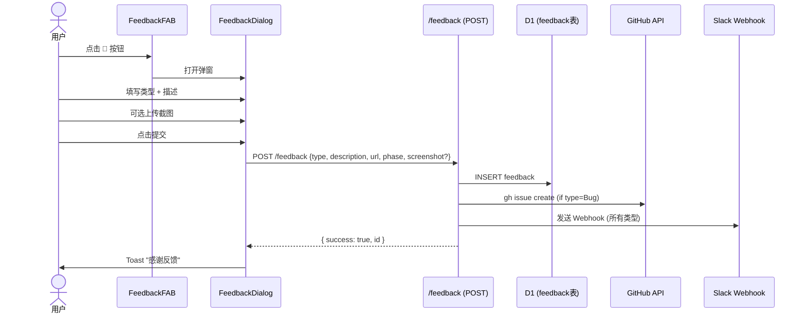
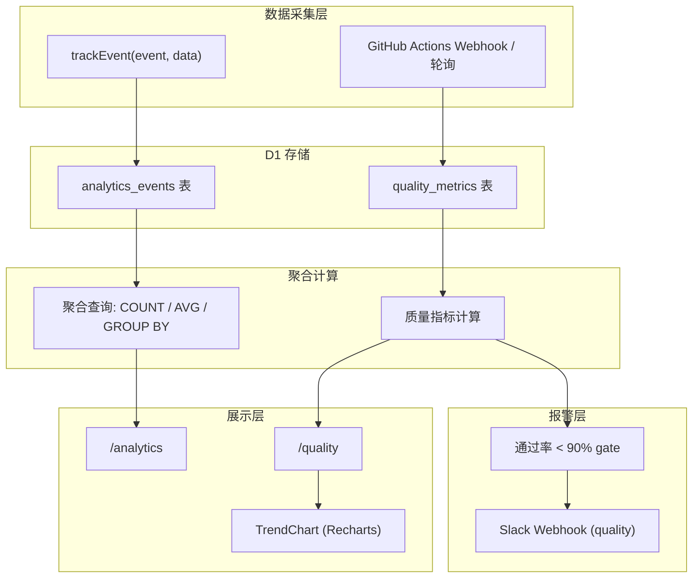

# VibeX 产品体验增强 — 系统架构文档

**项目**: vibex-analyst-proposals-20260403_024652
**版本**: v1.0
**日期**: 2026-04-03
**角色**: Architect

---

## 执行决策

- **决策**: 已采纳
- **执行项目**: vibex-analyst-proposals-20260403_024652
- **执行日期**: 2026-04-03

---

## 1. Tech Stack

### 1.1 新增依赖

| 技术 | 版本 | 用途 | 选型理由 |
|------|------|------|---------|
| **GitHub Actions API** | — | CI 质量数据拉取 | 已有 gh CLI，无新增依赖 |
| **uuid** | 9.0.x | 分享链接 token 生成 | 轻量、无需额外服务 |
| **Zod** | 4.3.6 | Feedback/Analytics API 输入验证 | 与现有栈一致 |
| **Recharts** | 2.x | 趋势图可视化 | 轻量、React 原生、SSR 兼容 |
| **@slack/webhook** | 7.x | PM 频道通知 | 官方 SDK、边缘函数兼容 |

### 1.2 技术决策

| 决策点 | 选项A | 选项B | 选择 | 理由 |
|--------|--------|--------|------|------|
| 埋点方案 | Segment/Posthog | 轻量自建 | **轻量自建** | 避免 PII 合规风险，仅聚合指标 |
| 分享链接存储 | D1 | KV | **D1** | 已有 D1，链接量小 |
| CI 数据拉取 | GitHub Webhook | 轮询 | **轮询** | Webhook 需要公网回调，轮询更简单 |
| 快照存储 | D1 JSON | R2 | **D1 JSON** | 快照结构简单，D1 足够 |
| 报警去重 | Redis | D1 标记 | **D1 标记** | 避免引入 Redis，D1 write/week 量低 |

---

## 2. 系统架构图

### 2.1 整体架构

```mermaid
flowchart TB
    subgraph Frontend["前端 (vibex-fronted / Next.js 16)"]
        direction TB
        CanvasPage["CanvasPage"]
        ProjectBar["ProjectBar"]
        ProjectSettings["ProjectSettings"]
        AnalyticsPage["/analytics 页面"]
        QualityPage["/quality 页面"]

        subgraph CanvasEnhancement["Epic 1: Phase 感知"]
            PhaseIndicator["PhaseIndicator 组件"]
            GuideCard["GuideCard 组件"]
            ExampleLoader["ExampleLoader 工具"]
        end

        subgraph CollaborationUI["Epic 2: 协作分享"]
            ShareButton["ShareButton"]
            CollaboratorPanel["CollaboratorPanel"]
            SnapshotPanel["SnapshotPanel"]
            DiffViewer["DiffViewer"]
        end

        subgraph FeedbackUI["Epic 3: Feedback 收集"]
            FeedbackFAB["FeedbackFAB"]
            FeedbackDialog["FeedbackDialog"]
            ScreenshotCapture["ScreenshotCapture"]
        end

        subgraph AnalyticsUI["Epic 4: 分析指标"]
            TrackSDK["TrackSDK (轻量)"]
            AnalyticsDashboard["AnalyticsDashboard"]
        end

        subgraph QualityUI["Epic 5: 质量仪表盘"]
            TrendChart["TrendChart (Recharts)"]
            QualityAlert["质量报警Banner"]
        end
    end

    subgraph Backend["后端 (vibex-backend / Cloudflare Workers)"]
        direction TB

        subgraph NewRoutes["新增 API 路由"]
            ShareRoutes["/share/[token]"]
            FeedbackRoutes["/feedback"]
            AnalyticsRoutes["/analytics/track"]
            SnapshotRoutes["/snapshots"]
            CollaboratorRoutes["/collaborators"]
            QualityRoutes["/quality/cidata"]
        end

        subgraph ExistingRoutes["现有路由"]
            ProjectRoutes["/projects (已有)"]
            AuthRoutes["/auth (已有)"]
        end

        subgraph ExternalIntegrations["外部集成"]
            GitHubAPI["GitHub Actions API"]
            SlackWebhook["Slack Webhook API"]
        end

        subgraph DataLayer["数据层"]
            D1["Cloudflare D1"]
            ShareTokens["share_tokens 表"]
            FeedbackTable["feedback 表"]
            AnalyticsTable["analytics_events 表"]
            QualityTable["quality_metrics 表"]
            Collaborators["collaborators 表"]
            Snapshots["snapshots 表"]
        end
    end

    CanvasPage --> PhaseIndicator
    CanvasPage --> GuideCard
    CanvasPage --> FeedbackFAB
    CanvasPage --> ShareButton

    PhaseIndicator --> ProjectBar
    GuideCard --> ExampleLoader
    ExampleLoader --> ProjectRoutes

    ShareButton --> ShareRoutes
    ShareRoutes --> ShareTokens
    ShareRoutes --> D1

    FeedbackFAB --> FeedbackDialog
    FeedbackDialog --> FeedbackRoutes
    FeedbackRoutes --> FeedbackTable
    FeedbackRoutes --> GitHubAPI
    FeedbackRoutes --> SlackWebhook

    CollaboratorPanel --> CollaboratorRoutes
    CollaboratorRoutes --> Collaborators
    CollaboratorRoutes --> AuthRoutes

    SnapshotPanel --> SnapshotRoutes
    SnapshotRoutes --> Snapshots

    TrackSDK --> AnalyticsRoutes
    AnalyticsRoutes --> AnalyticsTable
    AnalyticsRoutes --> D1

    AnalyticsDashboard --> AnalyticsRoutes
    AnalyticsDashboard --> AnalyticsTable

    QualityRoutes --> GitHubAPI
    QualityRoutes --> QualityTable
    QualityRoutes --> SlackWebhook

    TrendChart --> QualityRoutes
    QualityPage --> TrendChart
```



### 2.2 Epic 1: Phase 感知层架构

```mermaid
flowchart LR
    subgraph Store["canvasStore (Zustand)"]
        direction TB
        phase["phase: 'input'|'context'|'flow'|'component'|'prototype'"]
        activeTree["activeTree: TreeType"]
        isFirstVisit["isFirstVisit: boolean (localStorage)"]
    end

    subgraph Components["UI 组件"]
        PhaseIndicator["PhaseIndicator"]
        GuideCard["GuideCard"]
        PhaseTooltip["PhaseTooltip"]
    end

    subgraph Config["配置数据"]
        GuideMessages["GUIDE_MESSAGES: Record<Phase, string>"]
        ExampleData["EXAMPLE_PROJECT_DATA"]
    end

    phase --> PhaseIndicator
    activeTree --> PhaseIndicator
    isFirstVisit --> GuideCard
    phase --> GuideMessages
    GuideCard --> ExampleData

    GuideCard -.->|localStorage.setItem('seenGuide', true)| isFirstVisit
```

### 2.3 Epic 3: Feedback 收集架构



### 2.4 Epic 4 + 5: Analytics / Quality 架构



---

## 3. Data Model

### 3.1 新增表结构

```sql
-- 分享链接表
CREATE TABLE share_tokens (
    id TEXT PRIMARY KEY,           -- UUID v4
    project_id TEXT NOT NULL,
    permission TEXT NOT NULL DEFAULT 'read',  -- read | edit
    created_at INTEGER NOT NULL,
    expires_at INTEGER,            -- NULL = 永不过期
    FOREIGN KEY (project_id) REFERENCES projects(id)
);

-- 协作者表
CREATE TABLE collaborators (
    id TEXT PRIMARY KEY,
    project_id TEXT NOT NULL,
    user_id TEXT NOT NULL,
    role TEXT NOT NULL,           -- owner | editor | viewer
    invited_at INTEGER NOT NULL,
    accepted_at INTEGER,
    invite_token TEXT,
    FOREIGN KEY (project_id) REFERENCES projects(id)
);

-- 设计快照表
CREATE TABLE snapshots (
    id TEXT PRIMARY KEY,
    project_id TEXT NOT NULL,
    name TEXT NOT NULL,           -- 用户命名，如 "v1.0 初始设计"
    data TEXT NOT NULL,           -- JSON: 完整三树数据
    created_at INTEGER NOT NULL,
    created_by TEXT NOT NULL,
    FOREIGN KEY (project_id) REFERENCES projects(id)
);

-- Feedback 表
CREATE TABLE feedback (
    id TEXT PRIMARY KEY,
    project_id TEXT,
    user_id TEXT,
    type TEXT NOT NULL,           -- bug | feature | ux | other
    description TEXT NOT NULL,
    current_url TEXT NOT NULL,
    current_phase TEXT,
    screenshot_url TEXT,
    github_issue_id TEXT,
    status TEXT NOT NULL DEFAULT 'open',  -- open | acknowledged | resolved
    created_at INTEGER NOT NULL,
    processed_at INTEGER
);

-- Analytics 事件表
CREATE TABLE analytics_events (
    id TEXT PRIMARY KEY,
    event_name TEXT NOT NULL,     -- canvas_phase_entered | node_created | flow_completed | export_triggered
    project_id TEXT,              -- 匿名化项目 ID
    phase TEXT,
    node_type TEXT,
    metadata TEXT,                -- JSON: 额外字段
    created_at INTEGER NOT NULL
);

-- 质量指标表
CREATE TABLE quality_metrics (
    id TEXT PRIMARY KEY,
    run_id TEXT NOT NULL,        -- GitHub Actions run ID
    run_number INTEGER NOT NULL,
    branch TEXT NOT NULL,
    e2e_passed INTEGER NOT NULL,
    e2e_failed INTEGER NOT NULL,
    e2e_total INTEGER NOT NULL,
    ts_errors INTEGER NOT NULL,
    coverage_percent REAL,
    run_at INTEGER NOT NULL,
    created_at INTEGER NOT NULL DEFAULT (unixepoch())
);

-- 报警去重标记表
CREATE TABLE quality_alerts (
    id TEXT PRIMARY KEY,
    metric_id TEXT NOT NULL,
    alert_type TEXT NOT NULL,     -- e2e_low_coverage
    alerted_at INTEGER NOT NULL
);
```

### 3.2 索引策略

```sql
-- Feedback 常用查询
CREATE INDEX idx_feedback_status ON feedback(status);
CREATE INDEX idx_feedback_type ON feedback(type);
CREATE INDEX idx_feedback_created ON feedback(created_at DESC);

-- Analytics 聚合查询
CREATE INDEX idx_analytics_event ON analytics_events(event_name, created_at);
CREATE INDEX idx_analytics_project ON analytics_events(project_id, created_at);

-- Quality 趋势查询
CREATE INDEX idx_quality_run ON quality_metrics(branch, run_at DESC);

-- 分享链接查询
CREATE INDEX idx_share_token ON share_tokens(id, project_id);
```

---

## 4. API Definitions

### 4.1 新增端点

#### 分享链接

```
POST /api/share
Request:  { projectId: string, permission: 'read'|'edit' }
Response: { token: string, url: string }
```

```
GET /api/share/{token}
Response: { projectData: ProjectData } | 403
```

#### Feedback

```
POST /api/feedback
Request: {
  type: 'bug'|'feature'|'ux'|'other',
  description: string (1-500 chars),
  currentUrl: string,
  currentPhase?: string,
  screenshot?: File | null
}
Response: { success: true, id: string }
```

```
GET /api/feedback
Query: { status?: string, type?: string, limit?: number }
Response: { items: Feedback[], total: number }
```

```
PATCH /api/feedback/{id}
Request: { status: 'acknowledged'|'resolved' }
Response: { success: true }
```

#### Analytics

```
POST /api/analytics/track
Request: {
  eventName: 'canvas_phase_entered'|'node_created'|'flow_completed'|'export_triggered',
  projectId: string,    // 匿名化 ID
  phase?: string,
  nodeType?: string,
  metadata?: Record<string, unknown>
}
Response: { success: true }
```

```
POST /api/analytics/track/batch
Request: { events: TrackEvent[] }
Response: { success: true, count: number }
```

```
GET /api/analytics/summary
Query: { days?: number (default 7) }
Response: {
  projectCompletionRate: number,
  avgNodesPerProject: number,
  phaseDistribution: Record<string, number>,
  exportTriggerRate: number
}
```

#### Snapshots

```
POST /api/snapshots
Request: { projectId: string, name: string }
Response: { id: string, createdAt: number }
```

```
GET /api/snapshots
Query: { projectId: string }
Response: { items: Snapshot[], total: number }
```

```
GET /api/snapshots/{id}
Response: { snapshot: Snapshot }
```

```
GET /api/snapshots/diff
Query: { id1: string, id2: string }
Response: {
  added: Node[],
  removed: Node[],
  modified: Node[]
}
```

#### Collaborators

```
POST /api/collaborators/invite
Request: { projectId: string, email: string, role: 'editor'|'viewer' }
Response: { inviteToken: string, inviteUrl: string }
```

```
POST /api/collaborators/accept
Request: { token: string }
Response: { success: true, projectId: string }
```

```
GET /api/collaborators
Query: { projectId: string }
Response: { items: Collaborator[], total: number }
```

```
DELETE /api/collaborators/{id}
Response: { success: true }
```

#### Quality

```
GET /api/quality/trend
Query: { branch?: string, limit?: number (default 10) }
Response: {
  items: QualityMetric[],
  e2ePassRate: number[],
  tsErrorTrend: number[]
}
```

```
POST /api/quality/sync  (由 CI webhook 触发)
Request: { runId: string, runNumber: number, ... }
Response: { success: true, alertTriggered: boolean }
```

---

## 5. 性能影响评估

| Epic | 影响点 | 性能影响 | 缓解方案 |
|------|--------|---------|---------|
| E1 | PhaseIndicator 渲染 | 无影响（纯 UI） | — |
| E1 | GuideCard localStorage 读 | <1ms | — |
| E2 | Snapshot 保存（JSON 序列化） | 写入 ~50KB JSON，约 5ms | 异步写入，不阻塞 UI |
| E2 | Diff 比较 | O(n) 节点比较，约 2-10ms | 前端计算，不查询 |
| E3 | 截图压缩 | ~200KB PNG 压缩，约 100ms | Web Workers 后台处理 |
| E4 | Analytics trackEvent | <10ms (异步 fetch) | 批量上报，debounce 5s |
| E4 | Analytics 聚合查询 | D1 COUNT/GROUP BY，约 50-100ms | 添加索引，限制时间范围 |
| E5 | GitHub API 轮询 | 每小时 1 次，API 限制内 | 缓存结果，1h TTL |
| E5 | 趋势图渲染 | Recharts < 50ms (10 条数据) | 分页加载历史数据 |

**总体性能影响**: 极小。所有新增 API 均为异步，新增 UI 组件均为轻量 React 组件，无主线程阻塞。

---

## 6. 安全考虑

| 方面 | 风险 | 缓解 |
|------|------|------|
| 分享链接 | 链接被搜索引擎索引 | UUID v4 不可预测；可设置过期时间 |
| Feedback XSS | 用户描述字段 XSS | Zod 输入验证 + DOMPurify 输出转义 |
| GitHub Issue 注入 | Feedback 内容注入 gh CLI | 参数化传递，避免 shell 拼接 |
| Analytics 隐私 | 收集过多用户数据 | 仅聚合指标，无 user_id，无 IP 记录 |
| Collaborator 权限 | 权限提升攻击 | 所有写操作验 user_id + role 权限 |
| Screenshot 上传 | 文件大小 DoS | 限制 5MB，后端验证 Content-Length |
| Slack Webhook | webhook URL 泄露 | 存入 Cloudflare Secrets，不在代码中 |
