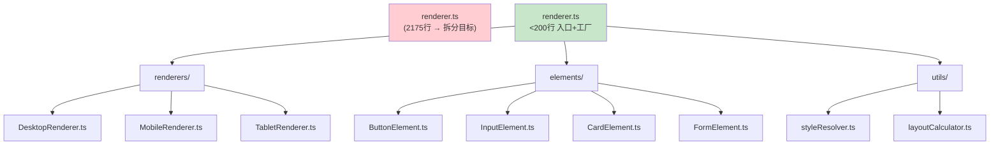
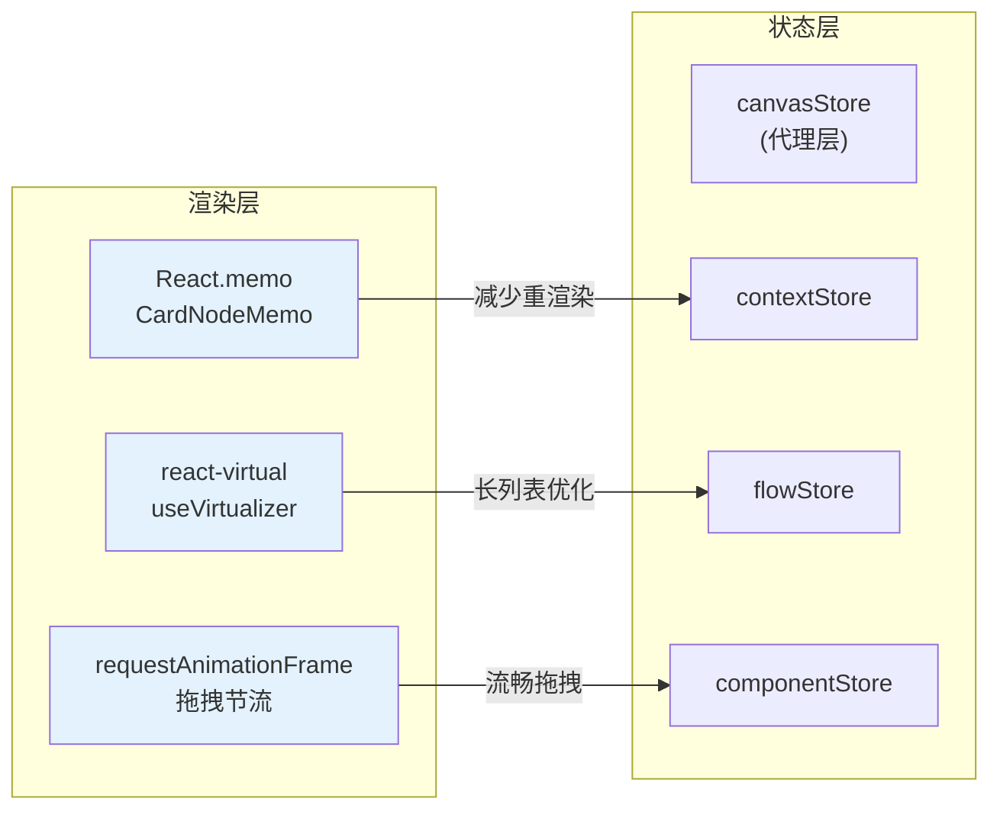
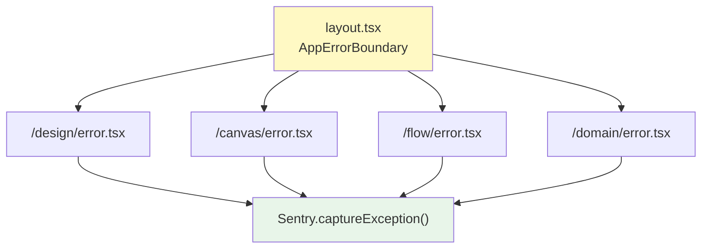

# Architecture: VibeX 架构改进（技术债务清理）

**项目**: vibex-architect-proposals-20260402_061709
**版本**: v1.0
**日期**: 2026-04-02
**架构师**: architect
**状态**: ✅ 设计完成

---

## 执行摘要

本项目通过渐进式改良（方案 B）系统清理技术债务，聚焦 5 大领域：
1. **巨型文件拆分** — renderer.ts 2175行 → 多文件架构
2. **Canvas 性能优化** — memo + 虚拟化 + rAF 拖拽
3. **错误边界增强** — per-route error.tsx + Sentry
4. **类型安全提升** — `as any` 清除 + strict mode
5. **组件目录治理** — 70目录 → 5分类

**技术选型**: Next.js 16.2.0 + React 19.2.3 + Zustand + react-virtual
**总工时**: 约 13.5 天（渐进式，分阶段可交付）

---

## 1. Tech Stack

| 技术 | 选择 | 理由 |
|------|------|------|
| **框架** | Next.js 16.2.0 + React 19.2.3 | 已有，无变更 |
| **状态管理** | Zustand（渐进拆分） | 已有，按领域拆分而非替换 |
| **性能优化** | React.memo + react-virtual + rAF | react-virtual < 5KB，成熟轻量 |
| **错误监控** | Sentry（已有 SDK） | 已有，仅需集成 |
| **样式** | CSS Modules + CSS Variables | 已有，建立 token 系统 |
| **测试** | Jest + Playwright | 已有 |

**新增依赖**: `react-virtual`（性能优化），无破坏性变更。

---

## 2. Architecture Diagram

### 2.1 renderer.ts 拆分架构



### 2.2 Canvas 性能优化架构



### 2.3 错误边界架构



---

## 3. Component Architecture

### 3.1 renderer.ts 拆分方案

**目标文件结构**:
```
src/lib/prototypes/
├── renderer.ts              # 入口 + 工厂函数（<200行）
├── renderers/
│   ├── index.ts             # 导出
│   ├── DesktopRenderer.ts   # 桌面端渲染器（<300行）
│   ├── MobileRenderer.ts    # 移动端渲染器（<300行）
│   └── TabletRenderer.ts    # 平板端渲染器（<300行）
├── elements/
│   ├── index.ts
│   ├── ButtonElement.ts
│   ├── InputElement.ts
│   ├── CardElement.ts
│   ├── FormElement.ts
│   ├── ListElement.ts
│   └── ...
└── utils/
    ├── styleResolver.ts
    └── layoutCalculator.ts
```

**入口文件 renderer.ts（最终形态）**:
```typescript
// renderer.ts — 入口 + 工厂（<200行）
import { DesktopRenderer } from './renderers/DesktopRenderer';
import { MobileRenderer } from './renderers/MobileRenderer';
import { TabletRenderer } from './renderers/TabletRenderer';

type DeviceType = 'desktop' | 'mobile' | 'tablet';

export function createRenderer(deviceType: DeviceType, schema: UISchema) {
  switch (deviceType) {
    case 'mobile':
      return new MobileRenderer(schema);
    case 'tablet':
      return new TabletRenderer(schema);
    default:
      return new DesktopRenderer(schema);
  }
}

export function renderPage(deviceType: DeviceType, schema: UISchema) {
  const renderer = createRenderer(deviceType, schema);
  return renderer.render();
}
```

### 3.2 Canvas 性能优化

**React.memo 策略**:
```typescript
// 为所有卡片组件添加 memo + 精确比较
const ContextNodeCard = React.memo(function ContextNodeCard({
  node,
  onSelect,
}: ContextNodeCardProps) {
  return <div className={styles.nodeCard}>{/* ... */}</div>;
}, (prev, next) =>
  prev.node.nodeId === next.node.nodeId &&
  prev.node.status === next.node.status &&
  prev.node.isActive === next.node.isActive
);
```

**虚拟化策略（react-virtual）**:
```typescript
// 长列表（50+节点）使用虚拟化
const virtualizer = useVirtualizer({
  count: nodes.length,
  getScrollElement: () => scrollRef.current,
  estimateSize: () => 80,
  overscan: 5, // 预渲染 5 个额外项
});
```

**rAF 拖拽节流**:
```typescript
const handleMouseMove = useCallback((e: MouseEvent) => {
  rafId.current = requestAnimationFrame(() => {
    setDragPosition({ x: e.clientX, y: e.clientY });
  });
}, []);
```

### 3.3 错误边界

**全局边界（layout.tsx）**:
```typescript
// app/layout.tsx
class AppErrorBoundary extends Component<{}, { hasError: boolean }> {
  componentDidCatch(error: Error, info: ErrorInfo) {
    Sentry.captureException(error, { extra: { componentStack: info.componentStack } });
    this.setState({ hasError: true });
  }

  render() {
    if (this.state.hasError) {
      return <ErrorFallback onReset={() => this.setState({ hasError: false })} />;
    }
    return this.props.children;
  }
}
```

**路由级边界（app/canvas/error.tsx）**:
```typescript
// app/canvas/error.tsx
'use client';
export default function CanvasError({ error, reset }: { error: Error; reset: () => void }) {
  return (
    <div className="canvas-error">
      <h2>Canvas 渲染出错</h2>
      <p>组件加载失败，请尝试刷新页面。</p>
      <button onClick={reset}>重试</button>
    </div>
  );
}
```

### 3.4 组件目录治理

**目标结构（5 大分类）**:
```
src/components/
├── common/              # 通用组件（Button, Input, Modal, Dropdown）
├── canvas/              # Canvas 核心组件（trees, toolbar, viewport）
│   ├── trees/
│   │   ├── BoundedContextTree/
│   │   ├── ComponentTree/
│   │   └── BusinessFlowTree/
│   ├── CanvasToolbar.tsx
│   └── CanvasViewport.tsx
├── page/                # 页面级组件
│   ├── DomainPage/
│   ├── DesignPage/
│   └── FlowPage/
├── feature/             # 功能组件（auth, chat, ai）
│   ├── auth/
│   ├── chat/
│   └── ai-question/
└── layout/              # 布局组件
    ├── Header.tsx
    ├── Sidebar.tsx
    └── Footer.tsx
```

### 3.5 CSS Token 架构

```css
/* src/styles/canvas-tokens.css */

/* z-index 层级协议 */
:root {
  --z-canvas-base: 0;
  --z-panel: 10;
  --z-toolbar: 20;
  --z-drawer: 50;
  --z-modal: 100;
  --z-toast: 200;
  --z-tooltip: 300;
}

/* spacing token */
:root {
  --space-xs: 4px;
  --space-sm: 8px;
  --space-md: 16px;
  --space-lg: 24px;
  --space-xl: 32px;
}

/* color token */
:root {
  --color-confirmed: var(--color-success);
  --color-pending: var(--color-warning);
  --color-selected: var(--color-primary);
}
```

---

## 4. Data Models

无数据模型变更，纯架构重构项目。

---

## 5. Testing Strategy

### 5.1 单元测试

| 文件 | 覆盖率目标 | 策略 |
|------|-----------|------|
| renderer.ts（入口） | > 90% | 工厂函数 + 分支覆盖 |
| Desktop/Mobile/Tablet Renderer | > 80% | 快照测试 |
| Canvas 组件 | > 70% | 交互测试 |
| CSS token | > 60% | 变量存在性测试 |

### 5.2 性能基准

```typescript
// Canvas 性能基准测试
describe('Canvas Performance', () => {
  it('should render 100 nodes at 60fps', async () => {
    const start = performance.now();
    render(<Canvas nodes={generateNodes(100)} />);
    const duration = performance.now() - start;
    expect(duration).toBeLessThan(16); // 60fps = 16ms/frame
  });

  it('should drag at 60fps', async () => {
    // 使用 Chrome DevTools Performance API
    const metrics = await measureDragPerformance();
    expect(metrics.fps).toBeGreaterThanOrEqual(55);
  });
});
```

### 5.3 E2E 回归策略

- 每个拆分阶段后运行 `journey-create-context.spec.ts`
- 视觉回归使用 gstack browse 截图对比
- 错误边界通过 Playwright 错误注入测试验证

---

## 6. Performance Impact

| 维度 | 影响 | 说明 |
|------|------|------|
| **Bundle Size** | 无显著变化 | 拆分不影响体积，react-virtual < 5KB |
| **Runtime Performance** | **正向** | memo + 虚拟化 + rAF 预期提升 30-50% |
| **Memory** | 轻微正向 | memo 减少不必要重渲染 |
| **Build Time** | 轻微负向 | 更多文件，tsc 时间略增（< 5%） |

**结论**: 性能优化有显著正向影响，拆分风险低。

---

## 7. Risk & Mitigation

| 风险 | 概率 | 影响 | 缓解 |
|------|------|------|------|
| renderer.ts 拆分引入回归 | 高 | 高 | 每个子文件拆分后跑 E2E；先拆出入口工厂 |
| Zustand store 重构状态丢失 | 中 | 高 | 先写集成测试；保留 v1 store 备份路径 |
| 路径更新遗漏导致 import 错误 | 高 | 中 | ESLint no-restricted-imports；全局搜索验证 |
| 组件目录重组导致 Git 历史丢失 | 中 | 低 | 使用 `git mv` 保留历史；分 commit 提交 |

---

## 8. 架构决策记录

### ADR-001: renderer.ts 按设备 + 元素拆分

**状态**: Accepted

**上下文**: renderer.ts 2175 行，单文件无法测试和维护。

**决策**: 按 `renderers/`（设备维度）+ `elements/`（元素类型）拆分，入口保持 < 200 行。

**后果**:
- ✅ 每个文件可独立测试
- ⚠️ 需要更新所有引用 renderer.ts 的 import 路径

### ADR-002: Canvas 组件 React.memo 策略

**状态**: Accepted

**上下文**: 三树组件频繁重渲染，影响 50+ 节点场景的流畅度。

**决策**: 为所有卡片组件添加 `React.memo` + 精确比较函数。

**后果**:
- ✅ 减少不必要的重渲染
- ⚠️ 需要维护比较函数的正确性

### ADR-003: react-virtual 仅用于长列表

**状态**: Accepted

**上下文**: 长列表（50+ 节点）场景卡顿。

**决策**: 仅对节点数 > 50 的场景启用虚拟化，短列表保持原样。

**后果**:
- ✅ 保持交互兼容性
- ⚠️ 虚拟化场景需测试拖拽交互

### ADR-004: 组件目录 5 分类重组

**状态**: Accepted

**上下文**: 70 个组件目录混乱，难以发现和复用。

**决策**: 重组为 common / canvas / page / feature / layout 五类。

**后果**:
- ✅ 目录结构清晰
- ⚠️ 大量 import 路径需要更新

---

## 9. 变更文件清单

| 文件 | 操作 | 说明 |
|------|------|------|
| `src/lib/prototypes/renderer.ts` | 重构 | 保留入口工厂，< 200 行 |
| `src/lib/prototypes/renderers/*.ts` | 新增 | 设备维度拆分 |
| `src/lib/prototypes/elements/*.ts` | 新增 | 元素类型拆分 |
| `src/components/canvas/*Card.tsx` | 修改 | 添加 React.memo |
| `src/app/*/error.tsx` | 新增 | 路由级错误边界 |
| `src/app/layout.tsx` | 修改 | AppErrorBoundary + Sentry |
| `src/styles/canvas-tokens.css` | 新增 | z-index + spacing + color token |
| `src/components/` | 重构 | 目录重组为 5 分类 |
| `.eslintrc.js` | 修改 | 启用 no-explicit-any: error |

---

## 执行决策

- **决策**: 已采纳
- **执行项目**: vibex-architect-proposals-20260402_061709
- **执行日期**: 2026-04-02
