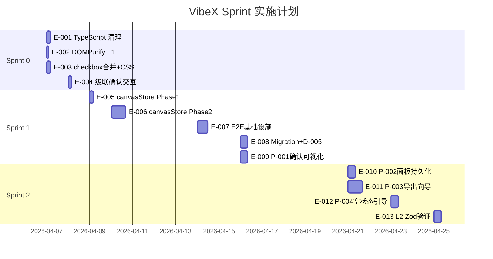

# VibeX 实施计划

**项目**: vibex-architect-proposals-20260402_201318  
**版本**: 1.0  
**日期**: 2026-04-02  
**角色**: Architect  

---

## 执行决策

- **决策**: 已采纳
- **执行项目**: vibex-architect-proposals-20260402_201318
- **执行日期**: 2026-04-02

---

## 1. Sprint 总览

| Sprint | 名称 | 周期 | 主题 | 关键路径 | 预计工时 |
|--------|------|------|------|---------|---------|
| **Sprint 0** | CI 解除 + 安全修复 | Week 1 | 解除 CI 阻断 + 安全加固 | D-003 前置 | ~14h |
| **Sprint 1** | canvasStore 拆分 + E2E | Week 2-3 | 架构重构 + 测试基础设施 | D-003 | ~48h |
| **Sprint 2** | PM 功能 + 持久化 | Week 4-5 | 功能开发 + 状态持久化 | P-002, P-003 | ~40h |
| **Sprint 3+** | 移动端 + 未来扩展 | Week 6+ | 降级 + 探索 | — | 待定 |

---

## 2. Sprint 0 — CI 解除 + 安全修复

**目标**: 解除 CI 阻断，提升代码质量，消除安全漏洞  
**预计工时**: ~14h  
**启动条件**: PRD 评审通过  
**前置依赖**: 无

### Epic 1: TypeScript 错误清理

**Epic ID**: E-001  
**负责人**: Dev Agent  
**预计工时**: 4h  
**PR**: D-001

| Step | 操作 | 验收标准 |
|------|------|---------|
| 1.1 | 运行 `tsc --noEmit`，收集所有 TS 错误 | 错误列表完整 |
| 1.2 | 分类错误：类型定义/导入路径/类型推断 | 每类有负责人 |
| 1.3 | 逐个修复，优先阻断 CI 的错误 | `npm run build` 通过 |
| 1.4 | 运行 `npm run lint` + `npm run build` | CI 绿 |

**DoD**: `npm run build` 和 `npm run lint` 均通过，CI 绿色

---

### Epic 2: DOMPurify 安全加固 (L1)

**Epic ID**: E-002  
**负责人**: Dev Agent  
**预计工时**: 2h  
**PR**: D-002

| Step | 操作 | 验收标准 |
|------|------|---------|
| 2.1 | 在 `package.json` 添加 `overrides.dompurify: "3.1.6"` | package.json 更新 |
| 2.2 | 运行 `npm install` | 依赖树更新 |
| 2.3 | 验证 `npm list dompurify` 显示 3.1.6 | 版本正确 |
| 2.4 | 运行 `npm audit` | 无 DOMPurify 相关漏洞 |
| 2.5 | 运行 `npm run build` | 构建正常 |

**DoD**: `npm audit` 无 DOMPurify 漏洞，构建通过

---

### Epic 3: checkbox 合并 + CSS 清理

**Epic ID**: E-003  
**负责人**: Dev Agent  
**预计工时**: 4h  
**PR**: D-E1

| Step | 操作 | 验收标准 |
|------|------|---------|
| 3.1 | 搜索确认无 `.nodeTypeBadge` / `.confirmedBadge` / `.selectionCheckbox` 引用 | grep 无结果 |
| 3.2 | 删除废弃 CSS 样式文件或样式定义 | CSS 清理完成 |
| 3.3 | 确认节点确认状态由 border 颜色表示 | 视觉验证 |
| 3.4 | 新增 checkbox 组件合并到统一入口 | 单组件替换多实例 |
| 3.5 | 运行 `npm run build` + E2E 冒烟测试 | 无回归 |

**DoD**: 废弃样式清零，checkbox 合并为一个组件

---

### Epic 4: 级联确认交互

**Epic ID**: E-004  
**负责人**: Dev Agent  
**预计工时**: 4h  
**PR**: D-E2

| Step | 操作 | 验收标准 |
|------|------|---------|
| 4.1 | 实现父节点勾选 → 自动勾选所有子节点 | 交互正常 |
| 4.2 | 实现父节点 indeterminate 状态（部分子节点选中） | 状态正确 |
| 4.3 | 实现子节点全选 → 父节点自动勾选 | 状态同步 |
| 4.4 | CSS 命名规范落地（`{component}-{element}-{state}`） | 样式规范 |
| 4.5 | 手动测试覆盖父子节点场景 | 无 bug |

**DoD**: 父子节点级联状态正确，CSS 命名规范落地

---

## 3. Sprint 1 — canvasStore 拆分 + E2E

**目标**: 架构重构，建立测试基础设施  
**预计工时**: ~48h  
**启动条件**: Sprint 0 完成  
**关键路径**: D-003 (canvasStore 拆分)

### Epic 5: canvasStore 拆分 Phase 1 — contextStore

**Epic ID**: E-005  
**负责人**: Dev Agent  
**预计工时**: 4h（验证可行性）  
**PR**: D-003 (Part 1)

| Step | 操作 | 验收标准 |
|------|------|---------|
| 5.1 | 创建 `stores/contextStore.ts`，定义接口 | 接口文档化 |
| 5.2 | 从 canvasStore 迁移 contextNodes 相关逻辑 | 代码迁移完成 |
| 5.3 | 迁移 consumer（Canvas 页面等）到 useContextStore | 消费者更新 |
| 5.4 | canvasStore re-export contextStore（向后兼容） | 旧代码不报错 |
| 5.4 | 运行 `tsc --noEmit` + `npm run build` | 无 TS 错误 |
| 5.5 | 验证 contextStore 独立运行（无循环依赖） | madge 验证通过 |

**DoD**: contextStore 独立 < 180行，Sprint 0 功能不回归

---

### Epic 6: canvasStore 拆分 Phase 2 — 其余4个store

**Epic ID**: E-006  
**负责人**: Dev Agent  
**预计工时**: 16h  
**PR**: D-003 (Part 2-5)

| Step | 操作 | 验收标准 |
|------|------|---------|
| 6.1 | 拆分 flowStore（~350行），依赖 contextStore | flowStore < 350行 |
| 6.2 | 拆分 componentStore（~180行），依赖 flowStore | componentStore < 180行 |
| 6.3 | 拆分 uiStore（~280行），独立 store + localStorage | uiStore < 280行 |
| 6.4 | 拆分 sessionStore（~150行），SSE/messages | sessionStore < 150行 |
| 6.5 | canvasStore 降为入口文件（仅 re-export，< 150行） | canvasStore < 150行 |
| 6.6 | 迁移所有 consumer 到具体 store | 无 canvasStore 直接引用 |
| 6.7 | `tsc --noEmit` + `npm run build` + E2E 冒烟 | 全通过 |

**DoD**: 5 个 store 独立存在，canvasStore < 150行，所有消费者迁移完成

---

### Epic 7: E2E 测试基础设施

**Epic ID**: E-007  
**负责人**: Dev Agent + Tester Agent  
**预计工时**: 12h  
**PR**: D-006

| Step | 操作 | 验收标准 |
|------|------|---------|
| 7.1 | 配置 `playwright.config.ts` | baseURL/timeout/reporter 正确 |
| 7.2 | 创建 `tests/e2e/journey-create-context.spec.ts` | 创建→勾选→导出 |
| 7.3 | 创建 `tests/e2e/journey-generate-flow.spec.ts` | 创建→多选→生成 |
| 7.4 | 创建 `tests/e2e/journey-multi-select.spec.ts` | Ctrl+Click→级联→批量 |
| 7.5 | 配置 GitHub Actions `.github/workflows/e2e.yml` | CI 触发正常 |
| 7.6 | 运行 `npm run test:e2e`，3 个旅程全通过 | ≥ 60% 覆盖率 |
| 7.7 | 验证 pre-deploy gate 生效 | E2E 失败时 CI 阻断 |

**DoD**: 3 个核心旅程 E2E 测试通过，CI pre-deploy gate 生效

---

### Epic 8: Migration 修复 + 防御性解析

**Epic ID**: E-008  
**负责人**: Dev Agent  
**预计工时**: 8h  
**PR**: D-004, D-005

| Step | 操作 | 验收标准 |
|------|------|---------|
| 8.1 | 修复 migration 脚本兼容性问题（D-004） | 迁移后数据完整 |
| 8.2 | 创建 `utils/sanitize.ts`，实现 Zod safeParse（D-005） | schema 完整 |
| 8.3 | 在 E5 文件中用 safeParse 替换直接解析 | 无不安全解析 |
| 8.4 | 实现 fallback 策略（解析失败返回安全默认值） | fallback 覆盖 |
| 8.5 | 单元测试覆盖 safeParse + fallback | 覆盖率 > 80% |

**DoD**: migration 修复完成，safeParse 覆盖所有外部输入

---

### Epic 9: 确认状态可视化 (P-001)

**Epic ID**: E-009  
**负责人**: Dev Agent  
**预计工时**: 8h  
**PR**: P-001

| Step | 操作 | 验收标准 |
|------|------|---------|
| 9.1 | 设计确认状态视觉规范（border 颜色映射） | 规范文档化 |
| 9.2 | 实现 BoundedContextCard 确认状态 border | 状态正确 |
| 9.3 | 实现 FlowNode 确认状态 border | 状态正确 |
| 9.4 | 手动测试覆盖所有状态切换 | 无 bug |

**DoD**: 确认状态可视化与 CSS 架构规范一致

---

## 4. Sprint 2 — PM 功能 + 状态持久化

**目标**: 功能开发，完善持久化策略  
**预计工时**: ~40h  
**启动条件**: Sprint 1 完成  
**关键路径**: P-002, P-003

### Epic 10: 面板状态持久化 L2

**Epic ID**: E-010  
**负责人**: Dev Agent  
**预计工时**: 8h  
**PR**: P-002

| Step | 操作 | 验收标准 |
|------|------|---------|
| 10.1 | 定义 localStorage 键名规范 `vibex-panel-state` | 规范文档化 |
| 10.2 | 在 uiStore 中配置 Zustand persist（partialize） | 精确持久化 |
| 10.3 | 实现面板展开/折叠状态保存 | 刷新后恢复 |
| 10.4 | 实现游客模式 sessionStorage 降级 | 游客不跨会话 |
| 10.5 | localStorage 读取失败降级（默认展开） | 降级合理 |
| 10.6 | Playwright 测试覆盖面板状态持久化 | 测试通过 |

**DoD**: 面板状态刷新后正确恢复，游客使用 sessionStorage

---

### Epic 11: 导出向导

**Epic ID**: E-011  
**负责人**: Dev Agent  
**预计工时**: 16h  
**PR**: P-003

| Step | 操作 | 验收标准 |
|------|------|---------|
| 11.1 | 设计导出向导 UI（多步骤） | 设计稿评审 |
| 11.2 | 实现导出格式选择（Markdown/JSON/PNG） | 格式正确 |
| 11.3 | 实现导出预览 | 预览准确 |
| 11.4 | 实现导出 API 调用 | API 稳定 |
| 11.5 | 实现导出进度状态 | 状态反馈 |
| 11.6 | E2E 旅程覆盖导出场景 | 测试通过 |

**DoD**: 导出向导完整流程，E2E 覆盖，API 稳定

---

### Epic 12: 空状态引导

**Epic ID**: E-012  
**负责人**: Dev Agent  
**预计工时**: 8h  
**PR**: P-004

| Step | 操作 | 验收标准 |
|------|------|---------|
| 12.1 | 设计空状态 UI（引导文案 + 插图） | 设计稿评审 |
| 12.2 | 实现 Context 空状态引导 | 引导正确 |
| 12.3 | 实现 Flow 空状态引导 | 引导正确 |
| 12.4 | 实现空状态引导点击跳转 | 跳转正确 |
| 12.5 | 手动测试覆盖空状态场景 | 无 bug |

**DoD**: 空状态引导文案清晰，交互流畅

---

### Epic 13: DOMPurify L2 — Zod 输入验证完善

**Epic ID**: E-013  
**负责人**: Dev Agent  
**预计工时**: 8h  
**PR**: D-002 (Part 2)

| Step | 操作 | 验收标准 |
|------|------|---------|
| 13.1 | 为所有外部输入定义 Zod schema | schema 完整 |
| 13.2 | 在所有解析点用 safeParse 替换直接解析 | 全部覆盖 |
| 13.3 | 验证 fallback 策略正确性 | fallback 测试 |
| 13.4 | CSP header 规划文档 | 文档完成 |

**DoD**: 所有外部输入有 Zod schema，解析失败有 fallback

---

## 5. Sprint 排期总表

---

## 6. 验收清单总表

### Sprint 0 验收清单

| ID | 验收项 | 验证方法 | 负责人 |
|----|--------|---------|--------|
| S0-A1 | `npm run build` 通过 | CI 验证 | Dev |
| S0-A2 | `npm run lint` 通过 | CI 验证 | Dev |
| S0-A3 | `npm audit` 无 DOMPurify 漏洞 | `npm audit` 输出 | Dev |
| S0-A4 | 废弃样式清零（grep 确认） | grep 输出 | Dev |
| S0-A5 | checkbox 合并为单一组件 | 代码审查 | Dev |
| S0-A6 | 父子节点级联状态正确 | 手动测试 | Dev |
| S0-A7 | CSS 命名符合 `{component}-{element}-{state}` | 代码审查 | Dev |

### Sprint 1 验收清单

| ID | 验收项 | 验证方法 | 负责人 |
|----|--------|---------|--------|
| S1-A1 | contextStore 独立 < 180行 | wc -l | Dev |
| S1-A2 | flowStore < 350行 | wc -l | Dev |
| S1-A3 | componentStore < 180行 | wc -l | Dev |
| S1-A4 | uiStore < 280行 | wc -l | Dev |
| S1-A5 | sessionStore < 150行 | wc -l | Dev |
| S1-A6 | canvasStore < 150行 | wc -l | Dev |
| S1-A7 | 无循环依赖 | `madge --circular` | Dev |
| S1-A8 | 3 个 E2E 旅程测试通过 | CI 验证 | Tester |
| S1-A9 | E2E CI pre-deploy gate 生效 | CI 阻断测试 | Tester |
| S1-A10 | E2E 覆盖率 ≥ 60% | Playwright 报告 | Tester |
| S1-A11 | migration 修复完成 | 迁移测试 | Dev |
| S1-A12 | safeParse 覆盖所有外部输入 | 代码审查 | Dev |
| S1-A13 | 确认状态 border 可视化 | 视觉验证 | Dev |

### Sprint 2 验收清单

| ID | 验收项 | 验证方法 | 负责人 |
|----|--------|---------|--------|
| S2-A1 | 面板状态刷新后恢复 | Playwright 测试 | Tester |
| S2-A2 | 游客使用 sessionStorage | Playwright 测试 | Tester |
| S2-A3 | localStorage 失败降级 | 手动测试 | Dev |
| S2-A4 | 导出向导全流程 | E2E 测试 | Tester |
| S2-A5 | 导出 API 稳定 | API 测试 | Dev |
| S2-A6 | 空状态引导文案清晰 | 人工审查 | PM |
| S2-A7 | Zod schema 完整 | 代码审查 | Dev |
| S2-A8 | fallback 策略覆盖 | 单元测试 | Dev |

---

## 7. 资源估算

| 角色 | Sprint 0 | Sprint 1 | Sprint 2 | 合计 |
|------|---------|---------|---------|------|
| Dev Agent | 14h | 36h | 32h | 82h |
| Tester Agent | — | 12h | 8h | 20h |
| **总计** | **14h** | **48h** | **40h** | **102h** |

---

## 8. DoD (Definition of Done)

所有 Epic 的 DoD 必须满足：

1. **代码完成**: 所有 Step 完成，代码提交并通过 PR 审查
2. **测试通过**: 单元测试 + E2E（相关旅程）
3. **CI 绿色**: `npm run build` + `npm run lint` + `npm run test`
4. **无回归**: 现有功能不受影响
5. **文档更新**: 变更内容反映在相关文档中

---

## 9. 暂缓项目

| 项目 | 原因 | 替代方案 |
|------|------|---------|
| P-005 移动端降级 | 复杂度高，风险高 | 降低为只读预览，不实现 Canvas 操作 |
| P-006 PRD 导出 | 需 API 稳定后实施 | Sprint 3 评估 |
| ADR-004 L3 CSP | 需测试环境验证 | Sprint 3 规划 |
