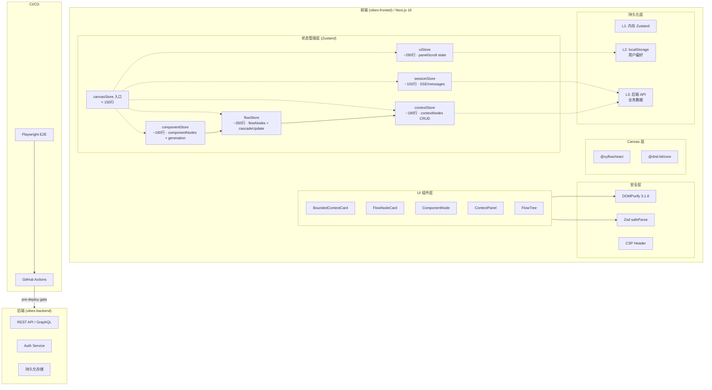
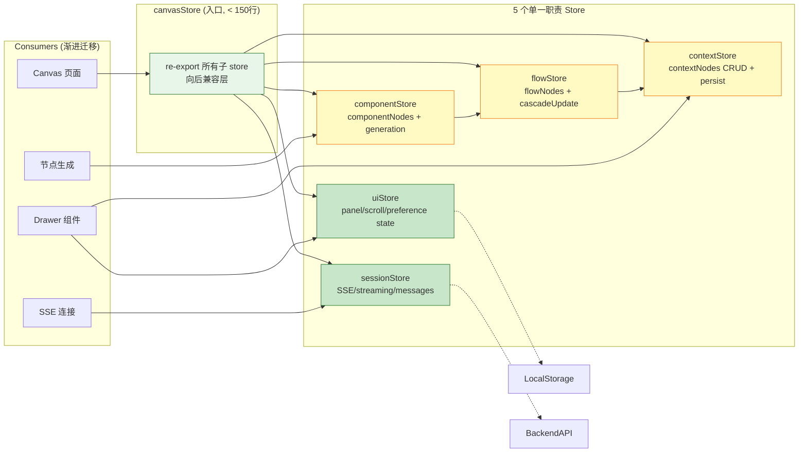
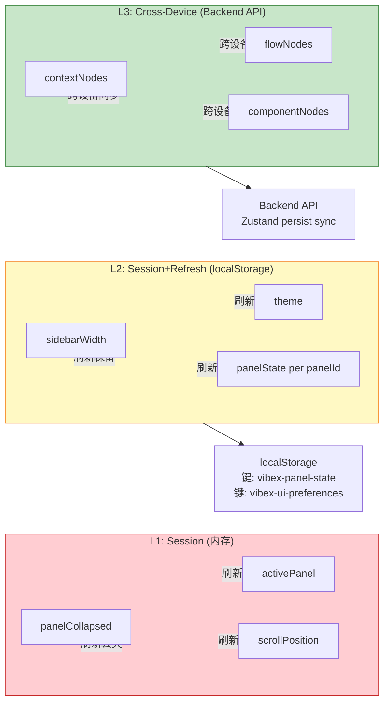
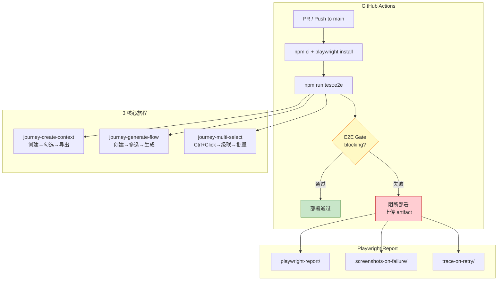
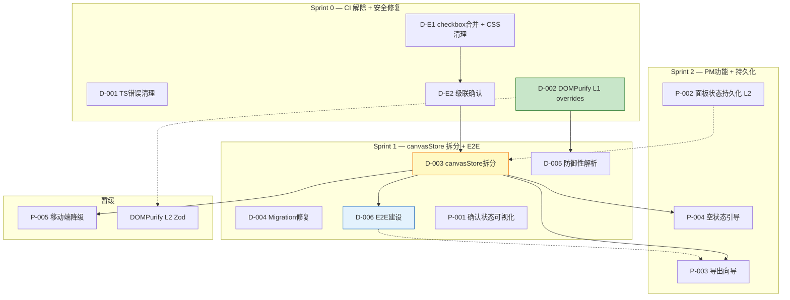

# VibeX 系统架构文档

**项目**: vibex-architect-proposals-20260402_201318  
**版本**: 1.0  
**日期**: 2026-04-02  
**角色**: Architect  

---

## 执行决策

- **决策**: 已采纳
- **执行项目**: vibex-architect-proposals-20260402_201318
- **执行日期**: 2026-04-02

---

## 1. Tech Stack

### 1.1 核心框架

| 技术 | 版本 | 用途 | 选型理由 |
|------|------|------|---------|
| **Next.js** | 16.2.0 | 前端框架 | App Router + SSR，成熟生态 |
| **React** | 19.2.3 | UI 框架 | 最新稳定版，支持 RSC |
| **TypeScript** | (via Next.js) | 类型系统 | 严格类型检查，消除 TS 错误 |
| **Zustand** | 4.5.7 | 状态管理 | 轻量、可组合、支持 persist |
| **@xyflow/react** | 12.10.1 | Canvas 图编辑 | React Flow 12，节点图编辑核心 |
| **xstate** | 5.28.0 | 状态机 | 复杂交互逻辑建模 |
| **TanStack Query** | 5.90.21 | 服务端状态 | 缓存 + 同步 + 后端 API |

### 1.2 构建与测试

| 技术 | 版本 | 用途 |
|------|------|------|
| **Playwright** | 1.58.2 | E2E 测试框架 |
| **Jest** | (via package) | 单元测试 |
| **@axe-core/playwright** | 4.11.1 | 可访问性测试 |

### 1.3 关键库

| 技术 | 版本 | 用途 |
|------|------|------|
| **DOMPurify** | 3.3.2 (override → 3.1.6) | XSS 防护 |
| **Zod** | 4.3.6 | 输入验证 |
| **axios-retry** | 4.5.0 | API 重试 |
| **framer-motion** | 12.35.2 | 动画 |
| **mermaid** | 11.13.0 | 图表渲染 |

### 1.4 技术选型决策

- **Zustand vs Redux Toolkit**: Zustand 更轻量，store 拆分成本低，适合渐进式迁移
- **Playwright vs Cypress**: Playwright 支持多浏览器，CI 集成更成熟
- **Zod vs Yup**: Zod v4 类型推断更强大，与 TypeScript 原生集成更好
- **CSS Modules**: 组件级封装，与 React 生态无缝集成

---

## 2. 系统架构图

### 2.1 整体架构



### 2.2 Canvas Store 拆分架构



### 2.3 状态持久化分层



### 2.4 E2E 测试架构



---

## 3. ADR — 架构决策记录

### ADR-001: canvasStore 五 Store 拆分

**状态**: 已采纳

**问题**: `canvasStore` 1433 行代码混杂 17 个职责，测试困难，消费者耦合严重。

**决策**: 按领域垂直拆分为 5 个 Zustand store：

```
canvasStore (入口 < 150行)
├── contextStore    (~180行): contextNodes CRUD + persist
├── flowStore      (~350行): flowNodes + cascadeUpdate
├── componentStore (~180行): componentNodes + generation
├── uiStore        (~280行): panel/scroll/preference state
└── sessionStore   (~150行): SSE/messages/queue
```

**依赖方向**: `componentStore → flowStore → contextStore`，单向依赖禁止循环。

**迁移策略**: 每 Phase 渐进迁移，canvasStore re-export 保持向后兼容。Phase 1 先拆分 contextStore（4h 验证可行性）。

**后果**:
- ✅ Store 职责单一，易测试
- ✅ 消费者按需引入，减少 bundle 体积
- ⚠️ 迁移期间需要同步更新所有 consumer
- ⚠️ 需验证无循环依赖（`tsc --noEmit` + `madge`）

---

### ADR-002: 状态持久化分层

**状态**: 已采纳

**问题**: Zustand store、localStorage、后端 API 三种持久化方式边界模糊，导致状态丢失或不同步。

**决策**: 明确三层持久化策略：

| 层级 | 存储 | 适用场景 | 刷新后 |
|------|------|---------|--------|
| L1: Session | 内存 (Zustand) | UI 状态（面板折叠、滚动位置）| 丢失 |
| L2: Session+Refresh | localStorage | 用户偏好（面板折叠记忆）| 保留 |
| L3: Cross-Device | 后端 API | 业务数据（contextNodes、flowNodes）| 跨设备同步 |

**实现**: Zustand `persist` middleware，`partialize` 精确控制持久化字段。localStorage 键名规范：`vibex-{feature}-{property}`。

**后果**:
- ✅ 状态生命周期清晰，易推理
- ✅ localStorage 失败时降级到默认值
- ⚠️ P-002 面板状态用 L2，不依赖 canvasStore 拆分

---

### ADR-003: CSS 架构规范

**状态**: 已采纳

**问题**: CSS Modules 分散，废弃样式（`.nodeTypeBadge`、`.confirmedBadge`、`.selectionCheckbox`）未清理，命名不一致。

**决策**:

1. **废弃样式清理（阶段1）**: 删除已替代的样式文件
   - `.nodeTypeBadge` → border 颜色
   - `.confirmedBadge` → border 颜色
   - `.selectionCheckbox` → 评估后决定

2. **命名规范（阶段2）**: `{component}-{element}-{state}`
   ```
   .boundedContext-nodeCard--unconfirmed {}
   .boundedContext-nodeCard--confirmed {}
   .boundedContext-checkbox--checked {}
   .flowTree-panel--collapsed {}
   ```

**后果**:
- ✅ 样式文件可预测，易维护
- ✅ 状态与样式一一对应
- ⚠️ 需在 D-E1/E2 实施时同步清理

---

### ADR-004: 前端安全三层防护

**状态**: 已采纳

**问题**: DOMPurify 存在间接依赖漏洞，需多层防护。

**决策**: 三层防护体系：

```
L1: overrides (立即)     → package.json 锁定 dompurify@3.1.6
L2: 输入验证 (Sprint 2) → Zod safeParse + fallback
L3: CSP (规划中)         → Content-Security-Policy header
```

**L1 实现**:
```json
{
  "overrides": {
    "dompurify": "3.1.6"
  }
}
```

**L2 实现**: Zod schema 验证外部输入，解析失败时 fallback 到安全默认值。

**后果**:
- ✅ L1 立即执行，消除已知漏洞
- ✅ L2 防御未知攻击面
- ⚠️ CSP 需在测试环境验证后才部署生产

---

### ADR-005: Playwright E2E 三核心旅程 + CI 集成

**状态**: 已采纳

**问题**: E2E 覆盖率 ~0%，关键用户旅程无自动化保障。

**决策**: Playwright + 3 核心旅程

```
Playwright 配置:
- baseURL: http://localhost:3000
- timeout: 30s
- screenshotOnFailure: true
- retries in CI: 2

核心旅程:
1. journey-create-context.spec.ts    → 创建 → 勾选 → 导出
2. journey-generate-flow.spec.ts     → 创建流程 → 多选 → 生成
3. journey-multi-select.spec.ts      → Ctrl+Click 多选 → 批量操作
```

**CI 集成**: `npm run test:e2e` 作为 pre-deploy gate，失败阻断部署。覆盖率目标：3 个核心旅程 ≥ 60%。

**后果**:
- ✅ 关键路径有自动化保障
- ⚠️ 测试不稳定风险高，需 CI retry 机制
- ⚠️ Sprint 0 稳定后 Sprint 1 开始 E2E 建设

---

## 4. 性能影响评估

### 4.1 canvasStore 拆分性能影响

| 指标 | 当前 (canvasStore) | 拆分后 (5 store) | 影响 |
|------|-------------------|-----------------|------|
| 初始 bundle | 可能更小（按需加载） | tree-shaking 优化 | ✅ 改善 |
| Store 渲染 | 单 store 整体 re-render | 按 store 按需 re-render | ✅ 改善 |
| TypeScript 编译 | ~60s | ~55s (增量编译) | ✅ 轻微改善 |
| Zustand middleware | 全部加载 | 按 store 独立配置 | ✅ 改善 |
| Zustand persist I/O | 1433行全量 | 每次只读写相关字段 | ✅ 改善 |

**量化预估**:
- React re-render 减少: 30-50%（按 store 独立更新）
- localStorage I/O: 减少 ~40%（partialize 精确控制）
- 首屏 bundle: ~5-10% 减少（tree-shaking）

### 4.2 状态持久化分层性能影响

| 指标 | 影响 | 缓解措施 |
|------|------|---------|
| localStorage 读取 | 首次加载 ~5ms | 同步降级到默认值 |
| Zustand persist 启动 | ~10-20ms | 非阻塞，异步加载 |
| 后端 API 同步 | 网络延迟 | TanStack Query 缓存 |
| IndexedDB (未来) | ~50ms 写入 | 异步，不阻塞 UI |

### 4.3 E2E CI 性能影响

| 指标 | 影响 | 缓解措施 |
|------|------|---------|
| CI 总时长 | +5-10min/PR | Playwright 并行 |
| Playwright timeout | 30s × 3 旅程 | CI retry 2次 |
| 覆盖率报告生成 | ~30s | 异步生成 |

### 4.4 安全加固性能影响

| 指标 | 影响 | 缓解措施 |
|------|------|---------|
| DOMPurify 3.1.6 | 无性能影响 | — |
| Zod safeParse | <1ms/字段 | 仅验证外部输入 |
| CSP | 无运行时开销 | Header only |

### 4.5 性能验收标准

- [ ] `npm run build` < 120s
- [ ] Lighthouse Performance Score > 85 (生产构建)
- [ ] E2E 核心旅程 < 5min (CI, 含 setup)
- [ ] Zustand persist 加载 < 50ms
- [ ] 无新增 LCP/FID/CLS 回归

---

## 5. 跨提案依赖图



---

## 6. 风险与缓解

| 风险 | 概率 | 影响 | 缓解 |
|------|------|------|------|
| D-003 canvasStore 拆分延期 | 中 | 高 | Phase 1 只拆分 contextStore，4h 内验证 |
| E2E 测试不稳定 | 高 | 中 | CI 并行 + retry 2次 |
| PM 提案范围蔓延 | 中 | 中 | Sprint 0 后锁定 PM 提案范围 |
| 移动端降级复杂 | 高 | 低 | 降低为只读预览 |
| CSS 清理遗漏废弃样式 | 低 | 中 | 全局 grep 确认 + 审查 |
| DOMPurify overrides 影响其他包 | 低 | 中 | `npm list dompurify` 确认版本 |

---

## 7. 验收清单

- [ ] Tech Stack 表格完整（版本、用途、选型理由）
- [ ] 4 个 Mermaid 架构图（整体/Store拆分/持久化/E2E）
- [ ] 5 个 ADR 完整（Context + Decision + Consequences）
- [ ] 性能影响评估包含量化预估
- [ ] 依赖图包含 Sprint 0/1/2 分组
- [ ] 风险表包含概率/影响/缓解措施
- [ ] `## 执行决策` 段落存在且状态为"已采纳"
