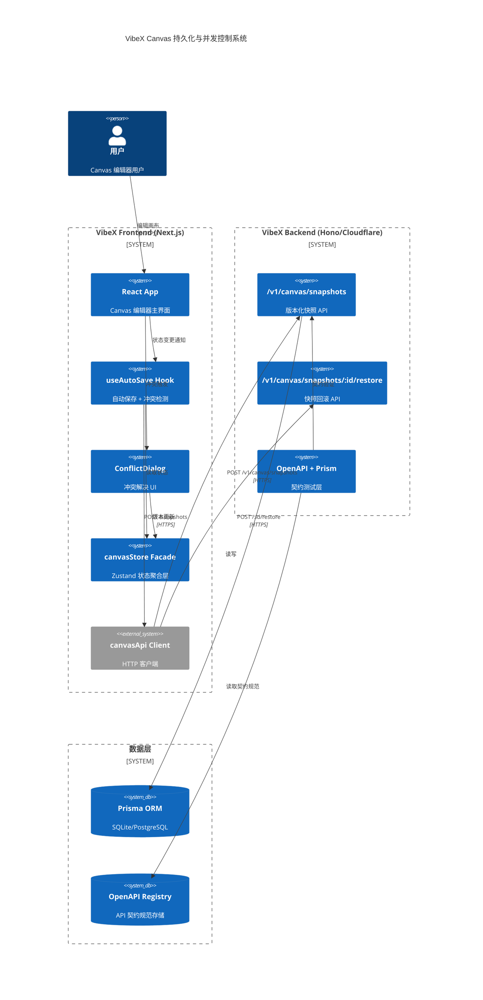
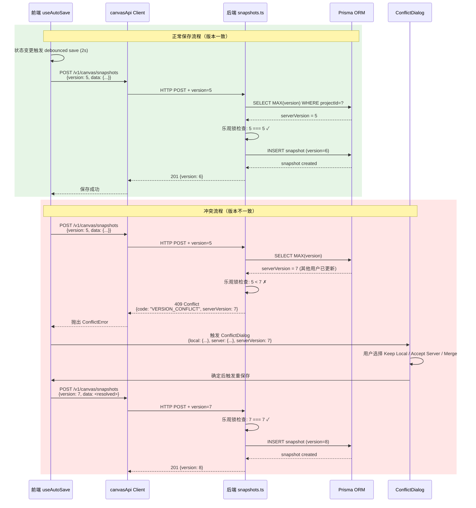
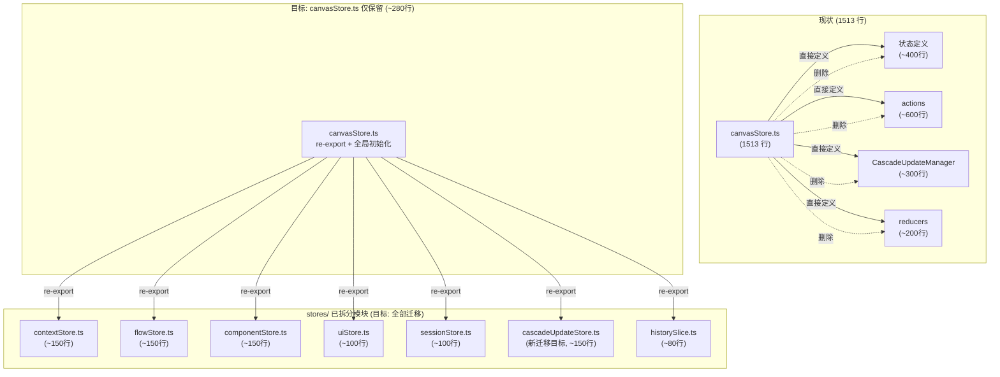
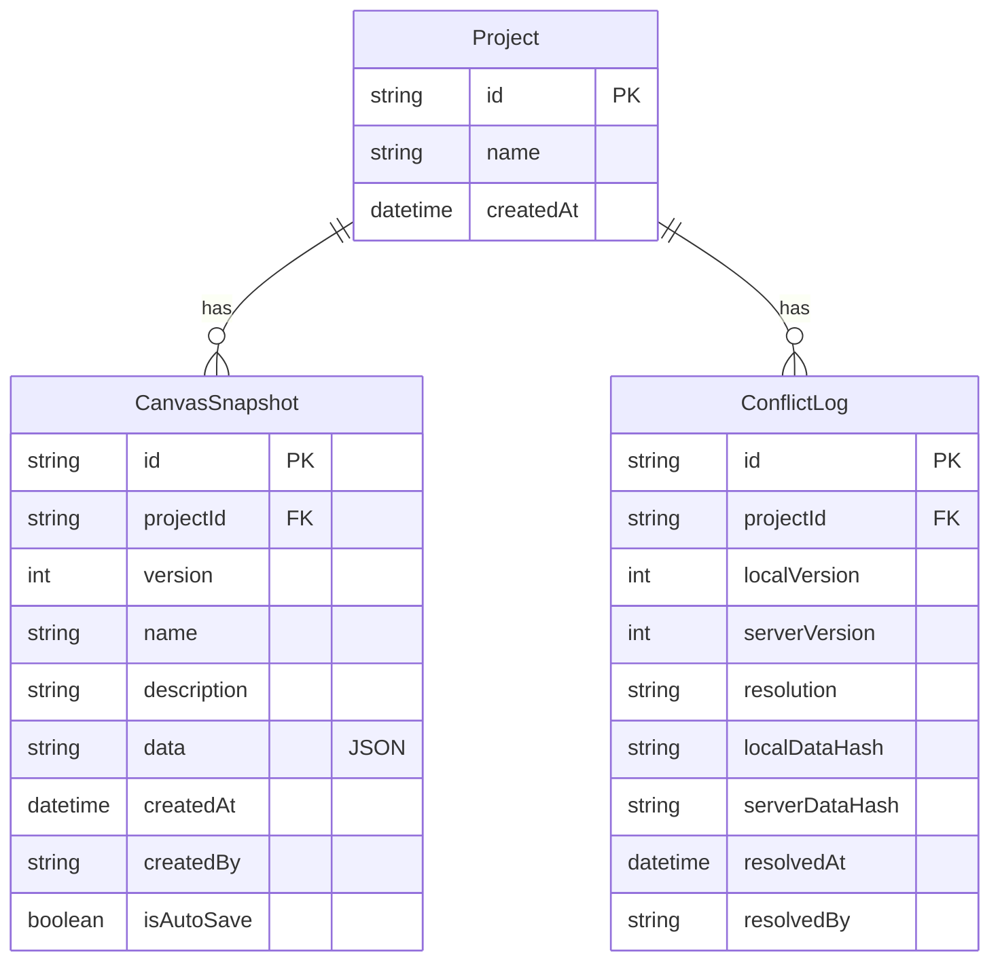
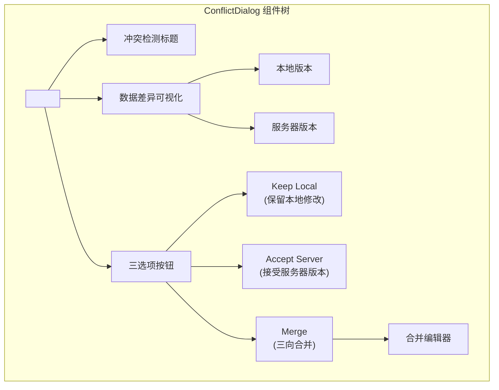

# VibeX Architect 架构文档 — Sprint 4+ 技术债务治理

**项目**: vibex-architect-proposals-20260403_024652
**版本**: v1.0
**日期**: 2026-04-03
**角色**: Architect

---

## 执行决策

| 提案 | 决策 | team-tasks 项目 | 执行日期 |
|------|------|-----------------|---------|
| E1: E4 Sync Protocol | **已采纳** | vibex-sync-protocol | Sprint 4 |
| E2: canvasStore Facade 清理 | **已采纳** | vibex-facade-cleanup | Sprint 4 |
| E3: TypeScript Strict 模式 | **已采纳** | vibex-ts-strict | Sprint 5-6 |
| E4: API 契约测试 | **已采纳** | vibex-contract-testing | Sprint 7+ |
| E5: 测试策略统一 | **已采纳** | vibex-testing-strategy | Sprint 6 |

---

## 一、技术栈决策（Tech Stack Decisions）

### 1.1 框架与工具选型

| 类别 | 现状 | 决策 | 理由 |
|------|------|------|------|
| **前端状态** | Zustand (已用) | 保持 Zustand | 现有 stores/ 架构合理，扩展而非替换 |
| **后端框架** | Hono (已用) | 保持 Hono | Cloudflare Workers 兼容，轻量高效 |
| **ORM** | Prisma (已用) | 保持 Prisma | 已有的 `CanvasSnapshot` 模型 |
| **API 验证** | Zod (已用) | 保持 Zod | schema-first，类型安全 |
| **契约测试** | 无 | 引入 **OpenAPI + Prism** | `openapi-typescript` 已在 devDeps，学习成本低 |
| **E2E 测试** | Playwright (已用) | 保持 Playwright | 成熟稳定，配置已就绪 |
| **单元测试** | Jest (已用) | 保持 Jest | 现有测试基础设施不变 |
| **TypeScript** | 部分 strict | 启用完整 strict 模式 | tsconfig.json 已配 `strict: true`，需修复现有 any |

### 1.2 TypeScript Strict 模式现状评估

```
vibex-fronted/tsconfig.json 当前配置:
  ✅ strict: true          (已启用)
  ✅ noImplicitAny: true    (已启用)
  ✅ noImplicitThis: true   (已启用)
  ✅ strictNullChecks: true (已启用)
  ❌ strictPropertyInitialization: false (默认)
  ❌ noUnusedLocals: false (默认)
  ❌ noUnusedParameters: false (默认)
```

**E3 行动项**: 扫描 `tsc --noEmit` 输出，确认当前错误数 → 分类 → 逐文件修复 → 逐步启用 `strictPropertyInitialization`。

---

## 二、系统架构图（Architecture Diagram）

### 2.1 整体架构（C4 Level 1 — Context）



### 2.2 E4 同步协议数据流（C4 Level 2 — Container）



### 2.3 canvasStore Facade 清理目标架构



---

## 三、API 定义（API Definitions）

### 3.1 Canvas Snapshots API

#### POST /v1/canvas/snapshots — 创建快照（含乐观锁）

**Request Headers**
```
Content-Type: application/json
Authorization: Bearer <jwt>
```

**Request Body**
```typescript
interface CreateSnapshotRequest {
  projectId: string                    // 必填，项目 ID
  label?: string                       // 快照标签，默认 "Snapshot"
  trigger?: 'manual' | 'auto' | 'ai_complete'  // 触发来源
  contextNodes: BoundedContextNode[]   // 上下文节点数组
  flowNodes: BusinessFlowNode[]         // 流程节点数组
  componentNodes: ComponentNode[]       // 组件节点数组
  // E4 新增：乐观锁版本号
  version?: number                     // 当前本地版本号（客户端已知）
  conflictPolicy?: 'reject' | 'auto_merge'  // 冲突策略，默认 'reject'
}
```

**Success Response (201 Created)**
```typescript
interface CreateSnapshotResponse {
  success: true
  snapshot: {
    snapshotId: string                 // 快照唯一 ID
    projectId: string
    label: string
    trigger: 'manual' | 'auto' | 'ai_complete'
    createdAt: string                  // ISO 8601
    contextCount: number
    flowCount: number
    componentCount: number
    contextNodes: BoundedContextNode[]
    flowNodes: BusinessFlowNode[]
    componentNodes: ComponentNode[]
  }
  version: number                     // 服务器分配的新版本号
}
```

**Conflict Response (409 Conflict)** ← E4 新增
```typescript
interface ConflictResponse {
  success: false
  error: {
    code: 'VERSION_CONFLICT'          // 固定错误码
    message: string
    serverVersion: number             // 服务器当前版本号
    localVersion: number              // 客户端提交的版本号
  }
  conflictData: {
    serverSnapshot: {
      snapshotId: string
      version: number
      createdAt: string
      contextNodes: BoundedContextNode[]
      flowNodes: BusinessFlowNode[]
      componentNodes: ComponentNode[]
    }
    localData: {
      contextNodes: BoundedContextNode[]
      flowNodes: BusinessFlowNode[]
      componentNodes: ComponentNode[]
    }
  }
  suggestedActions: ('keep_local' | 'accept_server' | 'merge')[]
}
```

**Error Codes**
| HTTP Status | code | 说明 |
|-------------|------|------|
| 400 | `INVALID_REQUEST` | 请求体格式错误（Zod 验证失败）|
| 401 | `UNAUTHORIZED` | JWT 缺失或无效 |
| 404 | `PROJECT_NOT_FOUND` | projectId 不存在 |
| 409 | `VERSION_CONFLICT` | 乐观锁版本冲突（E4 新增）|
| 500 | `INTERNAL_ERROR` | 服务器内部错误 |

---

#### GET /v1/canvas/snapshots — 列出快照

**Query Parameters**
```
?projectId=xxx
&limit=50
&offset=0
```

**Response (200 OK)**
```typescript
interface ListSnapshotsResponse {
  snapshots: Array<{
    id: string
    projectId: string
    version: number
    name: string | null
    description: string | null
    createdAt: string
    createdBy: string | null
    isAutoSave: boolean
    data: {
      contexts: BoundedContextNode[]
      flows: BusinessFlowNode[]
      components: ComponentNode[]
    }
  }>
  total: number
  limit: number
  offset: number
}
```

---

#### POST /v1/canvas/snapshots/:id/restore — 快照回滚

**Request Body**
```typescript
interface RestoreSnapshotRequest {
  projectId: string
  version?: number  // 可选：指定回滚到的版本号
}
```

**Response (201 Created)**
```typescript
interface RestoreSnapshotResponse {
  success: true
  contextNodes: BoundedContextNode[]
  flowNodes: BusinessFlowNode[]
  componentNodes: ComponentNode[]
  restoredVersion: number
  backupVersion: number  // 回滚前自动创建的备份版本
}
```

---

### 3.2 内部前端 API（canvasApi Client）

```typescript
// vibex-fronted/src/lib/canvas/api/canvasApi.ts

/**
 * E4 Sync Protocol — 冲突类型定义
 */
export class VersionConflictError extends Error {
  constructor(
    public readonly serverVersion: number,
    public readonly localVersion: number,
    public readonly serverSnapshot: CanvasSnapshot,
    public readonly localData: CanvasStateData,
    public readonly suggestedActions: ConflictAction[]
  ) {
    super(`Version conflict: local=${localVersion}, server=${serverVersion}`)
    this.name = 'VersionConflictError'
  }
}

export type ConflictAction = 'keep_local' | 'accept_server' | 'merge'

interface CanvasSnapshot {
  snapshotId: string
  version: number
  createdAt: string
  contextNodes: BoundedContextNode[]
  flowNodes: BusinessFlowNode[]
  componentNodes: ComponentNode[]
}

interface CanvasStateData {
  contextNodes: BoundedContextNode[]
  flowNodes: BusinessFlowNode[]
  componentNodes: ComponentNode[]
}

interface CreateSnapshotOptions {
  projectId: string
  label?: string
  trigger?: 'manual' | 'auto' | 'ai_complete'
  // E4: 乐观锁版本号
  version?: number
  // E4: 冲突策略
  conflictPolicy?: 'reject' | 'auto_merge'
  // 状态数据
  contextNodes: BoundedContextNode[]
  flowNodes: BusinessFlowNode[]
  componentNodes: ComponentNode[]
}

interface CreateSnapshotResult {
  snapshotId: string
  version: number
  createdAt: string
}

class CanvasApiClient {
  /**
   * 创建快照（E4 版本支持）
   * 成功 → 返回快照结果
   * 版本冲突 → 抛出 VersionConflictError
   * 其他错误 → 抛出 Error
   */
  async createSnapshot(options: CreateSnapshotOptions): Promise<CreateSnapshotResult> {
    const response = await fetch('/api/v1/canvas/snapshots', {
      method: 'POST',
      headers: { 'Content-Type': 'application/json' },
      body: JSON.stringify({
        projectId: options.projectId,
        label: options.label ?? 'Snapshot',
        trigger: options.trigger ?? 'manual',
        version: options.version,         // E4: 携带版本号
        conflictPolicy: options.conflictPolicy ?? 'reject',
        contextNodes: options.contextNodes,
        flowNodes: options.flowNodes,
        componentNodes: options.componentNodes,
      }),
    })

    if (response.status === 409) {
      const body = await response.json()
      throw new VersionConflictError(
        body.error.serverVersion,
        body.error.localVersion,
        body.conflictData.serverSnapshot,
        body.conflictData.localData,
        body.conflictData.suggestedActions
      )
    }

    if (!response.ok) {
      const body = await response.json().catch(() => ({}))
      throw new Error(body.error?.message ?? `Save failed: ${response.status}`)
    }

    const data = await response.json()
    return { snapshotId: data.snapshot.snapshotId, version: data.version, createdAt: data.snapshot.createdAt }
  }

  async listSnapshots(projectId: string, limit = 50, offset = 0): Promise<SnapshotList> { /* ... */ }
  async getSnapshot(snapshotId: string): Promise<CanvasSnapshot> { /* ... */ }
  async restoreSnapshot(snapshotId: string, projectId: string): Promise<CanvasStateData> { /* ... */ }
}
```

---

## 四、数据模型（Data Model）

### 4.1 Prisma Schema（CanvasSnapshot）

```prisma
// vibex-backend/prisma/schema.prisma

model CanvasSnapshot {
  id          String   @id @default(cuid())
  projectId   String   @index()
  version     Int      @default(autoincrement())
  name        String?
  description String?
  data        String   // JSON 字符串，包含 contexts/flows/components
  createdAt   DateTime @default(now())
  createdBy   String?
  isAutoSave  Boolean  @default(false)

  // 复合唯一约束：每个项目的版本号必须唯一且递增
  @@unique([projectId, version])
  // 索引优化列表查询
  @@index([projectId, version(sort: Desc)])
}

// 新增冲突日志表（E4 同步协议）
model ConflictLog {
  id              String   @id @default(cuid())
  projectId       String   @index()
  localVersion    Int
  serverVersion   Int
  resolution      String   // 'kept_local' | 'accepted_server' | 'merged'
  localDataHash   String? // SHA-256 of local data for audit
  serverDataHash  String? // SHA-256 of server data for audit
  resolvedAt      DateTime @default(now())
  resolvedBy      String?  // user ID or 'system'
  createdAt       DateTime @default(now())
}
```

### 4.2 前端类型（Zustand Stores）

```typescript
// vibex-fronted/src/lib/canvas/types/NodeState.ts

// E4 新增：带版本的画布快照
interface VersionedCanvasState {
  version: number
  contextNodes: BoundedContextNode[]
  flowNodes: BusinessFlowNode[]
  componentNodes: ComponentNode[]
  lastModifiedAt: string
}

// E4 新增：冲突解决状态
interface ConflictState {
  isOpen: boolean
  localData: VersionedCanvasState
  serverData: VersionedCanvasState
  serverVersion: number
  localVersion: number
}

// E4: 冲突解决方案
type ConflictResolution = 'keep_local' | 'accept_server' | 'merge'

// E4: ConflictDialog Props
interface ConflictDialogProps {
  isOpen: boolean
  localData: VersionedCanvasState
  serverData: VersionedCanvasState
  serverVersion: number
  localVersion: number
  onResolve: (resolution: ConflictResolution) => void
  onDismiss: () => void
}
```

### 4.3 实体关系图



---

## 五、组件架构（Component Architecture）

### 5.1 ConflictDialog 组件设计



### 5.2 ConflictDialog 核心代码接口

```typescript
// vibex-fronted/src/components/canvas/ConflictDialog.tsx

interface ConflictDialogProps {
  /** 对话框是否打开 */
  isOpen: boolean
  /** 本地版本数据（含版本号）*/
  localData: VersionedCanvasState
  /** 服务器版本数据（含版本号）*/
  serverData: VersionedCanvasState
  /** 冲突解决回调 */
  onResolve: (resolution: ConflictResolution, mergedData?: CanvasStateData) => void
  /** 用户关闭对话框（需强制选择一个）*/
  onDismiss: () => void
  /** 合并模式下的外部编辑器状态 */
  mergeEditorState?: MergeEditorState
}

/**
 * ConflictDialog 行为契约：
 *
 * 1. 渲染时显示版本差异（本地 vs 服务器）
 * 2. 三选项：Keep Local / Accept Server / Merge
 * 3. Merge 选项打开内联合并编辑器
 * 4. 每个选项点击后：
 *    - Keep Local: 重保存，version = serverVersion + 1
 *    - Accept Server: 丢弃本地数据，加载服务器数据
 *    - Merge: 合并后重保存，version = serverVersion + 1
 * 5. 禁止在未选择前关闭（onDismiss 必须可选）
 */
```

---

## 六、测试策略（Testing Strategy）

### 6.1 测试金字塔

```
        ▲ E2E (Playwright)          — 用户故事，端到端验证
       ╱ ╲  契约测试 (OpenAPI+Prism) — API 格式，PR blocking
      ╱   ╲
     ╱─────\  集成测试 (Jest + MSW) — API mock，组件集成
    ╱       ╲
   ╱─────────\ 单元测试 (Jest)       — 纯函数，hooks，Zustand stores
  ╱           ╲
 ╱─────────────\ 类型检查 (tsc strict) — 编译期保证，无运行时 any
```

### 6.2 核心测试用例

#### E1-S1: useAutoSave 版本号携带测试

```typescript
// vibex-fronted/src/hooks/canvas/__tests__/useAutoSave.test.ts

describe('E1-S1: 版本号携带', () => {
  it('保存时请求体包含 version 字段', async () => {
    const fetchSpy = vi.spyOn(global, 'fetch')
    renderHook(() => useAutoSave({ projectId: 'test-project' }))
    // 触发状态变更，等待 debounce
    act(() => { /* 触发保存 */ })
    await waitFor(() => expect(fetchSpy).toHaveBeenCalled())
    
    const savedBody = JSON.parse(fetchSpy.mock.calls[0][1].body)
    expect(savedBody).toHaveProperty('version')
    expect(typeof savedBody.version).toBe('number')
  })

  it('收到 409 时抛出 VersionConflictError', async () => {
    fetchSpy.mockResolvedValueOnce(
      new Response(JSON.stringify({
        error: { code: 'VERSION_CONFLICT', serverVersion: 7, localVersion: 5 },
        conflictData: { serverSnapshot: {}, localData: {} },
        conflictData: { suggestedActions: ['keep_local', 'accept_server', 'merge'] }
      }), { status: 409 })
    )
    // ... 验证抛出错误
    await expect(doSave('test-project')).rejects.toThrow(VersionConflictError)
  })
})
```

#### E1-S2: ConflictDialog 渲染测试

```typescript
// vibex-fronted/src/components/canvas/__tests__/ConflictDialog.test.tsx

describe('E1-S2: ConflictDialog', () => {
  it('渲染冲突标题和版本信息', () => {
    render(<ConflictDialog
      isOpen={true}
      localData={{ version: 5, contextNodes: [], flowNodes: [], componentNodes: [] }}
      serverData={{ version: 7, contextNodes: [], flowNodes: [], componentNodes: [] }}
      serverVersion={7}
      localVersion={5}
      onResolve={vi.fn()}
      onDismiss={vi.fn()}
    />)
    expect(screen.getByText(/冲突检测/i)).toBeVisible()
    expect(screen.getByText(/本地 v5/i)).toBeVisible()
    expect(screen.getByText(/服务器 v7/i)).toBeVisible()
  })

  it('渲染三个操作选项按钮', () => {
    render(<ConflictDialog ... />)
    expect(screen.getByRole('button', { name: 'Keep Local' })).toBeVisible()
    expect(screen.getByRole('button', { name: 'Accept Server' })).toBeVisible()
    expect(screen.getByRole('button', { name: 'Merge' })).toBeVisible()
  })

  it('点击 Keep Local 调用 onResolve("keep_local")', async () => {
    const onResolve = vi.fn()
    render(<ConflictDialog ... onResolve={onResolve} />)
    await userEvent.click(screen.getByRole('button', { name: 'Keep Local' }))
    expect(onResolve).toHaveBeenCalledWith('keep_local', undefined)
  })
})
```

#### E1-S3: Playwright E2E 冲突场景

```typescript
// vibex-fronted/e2e/conflict-sync.spec.ts

import { test, expect } from '@playwright/test'

test.describe('E1-S3: 冲突同步协议 E2E', () => {
  test('场景 1: 无冲突时正常保存', async ({ page }) => {
    await page.goto('/canvas/test-project')
    await page.locator('[data-testid="canvas"]').fill('测试内容')
    // 等待自动保存（2s debounce）
    await page.waitForResponse(
      r => r.url().includes('/v1/canvas/snapshots') && r.status() === 201,
      { timeout: 5000 }
    )
    await expect(page.getByTestId('save-indicator')).toHaveText('已保存')
  })

  test('场景 2: 版本冲突触发 ConflictDialog', async ({ page }) => {
    // 模拟第二个用户修改了同一个项目
    await page.route('**/v1/canvas/snapshots', route => {
      if (route.request().method() === 'POST') {
        route.fulfill({ status: 409, contentType: 'application/json', body: JSON.stringify({
          error: { code: 'VERSION_CONFLICT', serverVersion: 7, localVersion: 5 },
          conflictData: { serverSnapshot: {}, localData: {} },
          suggestedActions: ['keep_local', 'accept_server', 'merge']
        })})
      }
    })
    await page.goto('/canvas/test-project')
    await page.locator('[data-testid="canvas"]').fill('测试内容')
    await page.waitForTimeout(3000) // 等待 debounce
    await expect(page.getByRole('dialog')).toBeVisible()
    await expect(page.getByText(/冲突检测/i)).toBeVisible()
  })

  test('场景 3: Keep Local 选项重保存成功', async ({ page }) => {
    // 先触发冲突
    await page.route('**/v1/canvas/snapshots', route => {
      if (route.request().method() === 'POST') {
        const body = JSON.parse(route.request().postData() || '{}')
        if (body.version === 5) {
          route.fulfill({ status: 409, contentType: 'application/json', body: JSON.stringify({
            error: { code: 'VERSION_CONFLICT', serverVersion: 7, localVersion: 5 },
            conflictData: { serverSnapshot: {}, localData: {} },
            suggestedActions: ['keep_local', 'accept_server', 'merge']
          })})
        } else {
          route.fulfill({ status: 201, contentType: 'application/json', body: JSON.stringify({ success: true, version: 8 })})
        }
      }
    })
    await page.goto('/canvas/test-project')
    await page.waitForTimeout(3000)
    await page.getByRole('dialog').getByRole('button', { name: 'Keep Local' }).click()
    await page.waitForResponse(r => r.status() === 201)
    await expect(page.getByTestId('save-indicator')).toHaveText('已保存')
  })
})
```

#### E2-S3: canvasStore Facade 迁移验证

```typescript
// 每个迁移 commit 后的回归测试
describe('E2-S3: Facade 迁移回归测试', () => {
  it('canvasStore.ts 行数 <= 300', () => {
    const fs = require('fs')
    const path = require('path')
    const lines = fs.readFileSync(
      path.join(__dirname, '../../src/lib/canvas/canvasStore.ts'),
      'utf8'
    ).split('\n').length
    expect(lines).toBeLessThanOrEqual(300)
  })

  it('所有 stores/ 模块可独立导入', () => {
    expect(() => require('@/lib/canvas/stores/contextStore')).not.toThrow()
    expect(() => require('@/lib/canvas/stores/flowStore')).not.toThrow()
    expect(() => require('@/lib/canvas/stores/componentStore')).not.toThrow()
    expect(() => require('@/lib/canvas/stores/cascadeUpdateStore')).not.toThrow()
  })

  it('所有现有单元测试仍通过', async () => {
    const result = await execAsync('npm test -- --testPathPattern="canvasStore" --passWithNoTests')
    expect(result.exitCode).toBe(0)
  })
})
```

### 6.3 覆盖率要求

| 层级 | 工具 | 覆盖率目标 | 阻塞条件 |
|------|------|-----------|---------|
| 单元 (hooks/stores) | Jest + @testing-library | ≥ 80% 分支覆盖 | 新 PR < 80% 警告，不 blocking |
| 集成 (API mock) | Jest + MSW | ≥ 60% 分支覆盖 | 无 |
| E2E (冲突场景) | Playwright | 4 个核心场景 100% | CI 非 0 退出码 |
| 契约测试 | OpenAPI + Prism | 3 个端点全覆盖 | PR blocking |

---

## 七、canvasStore Facade 清理详细分析

### 7.1 现状分析（1513 行分布）

| 模块 | 估算行数 | 当前状态 | 迁移目标 |
|------|---------|---------|---------|
| 导入语句 | ~50 | 已拆分 stores/ | 保留 re-export |
| 类型定义 | ~80 | 已拆分 types/ | 保留 re-export |
| 状态定义（直接定义）| ~400 | 需迁移 | 迁移到 cascadeUpdateStore.ts |
| actions（直接定义）| ~600 | 需迁移 | 按 domain 拆分到 stores/ |
| CascadeUpdateManager | ~300 | 在 cascade/ 目录 | 迁移到 stores/cascadeUpdateStore.ts |
| reducers | ~200 | 需迁移 | 迁移到 historySlice.ts |
| 初始化逻辑 | ~50 | 保留 | 保留在 Facade |
| 其他杂项 | ~100 | 逐条审查 | 按需迁移或删除 |
| **合计** | **~1513** | | **≤ 280 行** |

### 7.2 迁移顺序

```
Phase 1: 识别 + CascadeUpdateManager
  ├── E2-S1: 逐行分析 1513 行 → 分类归属
  └── E2-S2: 迁移 CascadeUpdateManager → stores/cascadeUpdateStore.ts

Phase 2: 分批迁移剩余逻辑
  ├── Batch A: 迁移 context/flow/component 相关 actions
  ├── Batch B: 迁移 history/reducer 相关逻辑
  └── Batch C: 迁移剩余杂项

Phase 3: Facade 最终形态
  └── canvasStore.ts 保留: re-exports + 全局初始化 + 注释
```

---

## 八、非功能需求映射（Non-Functional Requirements）

| 需求 | 架构响应 | 验证方式 |
|------|---------|---------|
| **冲突检测延迟 ≤ 100ms** | 乐观锁检查在 Prisma 层，不跨服务 | Playwright E2E 计时 |
| **npm test ≤ 60s** | Jest 分片（`--maxWorkers=2`）+ 无 beacon/rAF 单元测试 | CI 计时监控 |
| **100% 可恢复** | ConflictLog 表记录每次冲突解决 | 审计查询 |
| **stores/ 模块 ≤ 200 行** | 每个模块独立不超过 200 行 | ESLint 行数规则 |
| **tsc 错误数 ≤ 50** | 分阶段修复，按优先级排序 | `tsc --noEmit` 计数 |
| **CI 契约测试 blocking** | GitHub Actions 独立 step，无条件执行 | CI 退出码验证 |
| **跨浏览器兼容** | ConflictDialog 使用标准 Dialog 元素 + CSS | Playwright 多浏览器 |

---

## 九、关键架构决策记录（ADR）

### ADR-001: E4 同步协议选择乐观锁而非 OT/CRDT

**状态**: Accepted

**上下文**: VibeX 是单用户主编辑画布，多用户并发编辑是边缘场景（协作预览），而非核心用例。

**决策**: 采用 HTTP 乐观锁（`localVersion < serverVersion → 409`），而非 OT（Operational Transform）或 CRDT。

**理由**:
- ✅ 实现简单：仅需在现有 snapshot API 增加版本号检查
- ✅ 与现有 Prisma `CanvasSnapshot.version` 字段无缝集成
- ✅ 用户体验可控：显式 ConflictDialog 让用户决定而非系统自动合并
- ❌ 代价：用户必须手动确认冲突解决

**不使用 OT/CRDT 的理由**:
- 实现复杂度高（OT 需要变换函数，CRDT 需要 merge 语义）
- VibeX 数据模型（树结构）merge 语义不明确
- 多用户并发编辑是边缘场景，ROI 不足

### ADR-002: 契约测试框架选择 OpenAPI + Prism

**状态**: Accepted

**上下文**: VibeX 后端已有 Hono + Zod，前端已有 `openapi-typescript` 在 devDeps。

**决策**: 使用 OpenAPI + Prism（而非 Pact），作为 API 契约测试框架。

**理由**:
- ✅ `openapi-typescript` 已在 devDeps，零额外依赖
- ✅ 前端可从 OpenAPI spec 生成类型，与 Zod 验证互补
- ✅ Prism 支持 mock server 模式，Consumer 测试无需真实后端
- ✅ 与 Hono 的 Zod 路由验证天然契合（可从 Zod schemas 自动生成 spec）
- ❌ Pact 的 Broker 需要额外服务，学习曲线更高

---

*本文档由 Architect Agent