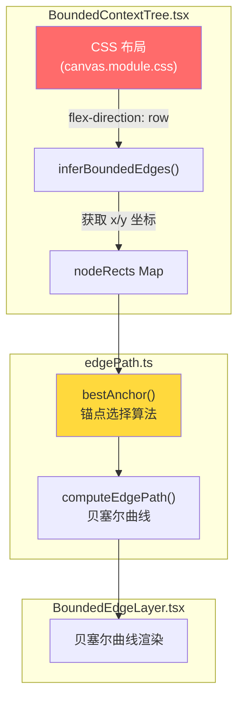
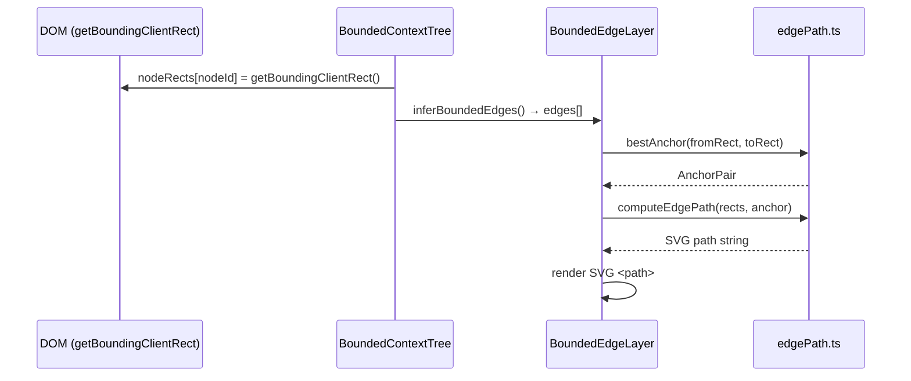

# ADR-XXX: VibeX BC 树连线渲染异常 — 架构设计

**状态**: Accepted
**日期**: 2026-03-30
**角色**: Architect
**项目**: vibex-bc-canvas-edge-render

---

## Context

限界上下文树（BC Tree）中所有卡片之间的连线全部汇聚在一条垂直线上，无法体现节点间的实际关系。

**双重根因**：
1. **CSS 布局层**：`boundedContextTree` 使用 `flex-direction: column`，所有卡片 x 坐标相同
2. **算法层**：`bestAnchor()` 判断 `dx=0`，`dy>0`，始终选择 `bottom→top` 锚点

---

## Decision

### Tech Stack

| 技术 | 用途 | 变更 |
|------|------|------|
| CSS Flexbox | 卡片布局 | `column` → `row` (wrap) |
| CSS Grid | 备用布局方案 | 可选替代 Flex |
| TypeScript | 类型安全 | 新增边界测试类型 |
| Vitest | 单元测试 | `edgePath.test.ts` 新建 |
| Playwright | E2E 验证 | gstack screenshot 验证 |

### 架构图



### 渲染层级

```
BoundedContextTree (flex row wrap)
  ├── BoundedGroupOverlay      (z-index 10, 虚线框)
  ├── BoundedEdgeLayer        (z-index 20, 连线)
  │   └── SVG path (贝塞尔曲线)
  └── CanvasNodeLayer         (z-index 30, 节点)
```

---

## 技术方案

### Epic 1 — 锚点算法加固

**目标**：让 `bestAnchor()` 在各种 dx/dy 组合下都能选择最优锚点。

```typescript
// edgePath.ts — bestAnchor() 改进

// 现有逻辑: dx=0 时始终 bottom→top
// 改进: 增加更多锚点方向判断

function bestAnchor(from: NodeRect, to: NodeRect): AnchorPair {
  const dx = to.x - from.x;
  const dy = to.y - from.y;
  const absDx = Math.abs(dx);
  const absDy = Math.abs(dy);

  // 水平场景 (dx 显著): 选择水平锚点
  if (absDx >= absDy * 0.5) {  // 阈值调低，避免垂直场景误判
    if (dx > 0) {
      return { fromAnchor: 'right', toAnchor: 'left' };
    } else {
      return { fromAnchor: 'left', toAnchor: 'right' };
    }
  }

  // 垂直场景 (dx 接近 0)
  if (absDx < absDy * 0.5) {
    return dy >= 0
      ? { fromAnchor: 'bottom', toAnchor: 'top' }
      : { fromAnchor: 'top', toAnchor: 'bottom' };
  }
}
```

### Epic 2 — CSS 布局改造

**目标**：将卡片从垂直堆叠改为水平流动布局。

```css
/* canvas.module.css */

/* 旧 */
.boundedContextTree {
  display: flex;
  flex-direction: column;  /* ← 问题根源 */
  gap: 0.75rem;
}

/* 新 */
.boundedContextTree {
  display: flex;
  flex-direction: row;
  flex-wrap: wrap;
  gap: 1.5rem;
  align-items: flex-start;
}
```

**备选 CSS Grid 方案**：

```css
.boundedContextTree {
  display: grid;
  grid-template-columns: repeat(auto-fill, minmax(280px, 1fr));
  gap: 1.5rem;
}
```

### Epic 3 — 连线渲染优化（P1）

**目标**：动态控制点偏移，减少连线交叉。

```typescript
function computeEdgePath(
  fromRect: NodeRect,
  toRect: NodeRect,
  anchor: AnchorPair
): string {
  const { fromAnchor, toAnchor } = anchor;
  const from = getAnchorPoint(fromRect, fromAnchor);
  const to = getAnchorPoint(toRect, toAnchor);

  // 水平连线: 控制点水平偏移
  const isHorizontal = ['right', 'left'].includes(fromAnchor);
  const offset = isHorizontal
    ? Math.min(60, Math.abs(to.x - from.x) * 0.4)  // 水平场景
    : Math.min(80, Math.abs(to.y - from.y) * 0.4); // 垂直场景

  const cp1 = offsetAnchor(from, fromAnchor, offset);
  const cp2 = offsetAnchor(to, toAnchor, offset);

  return `M ${from.x} ${from.y} C ${cp1.x} ${cp1.y} ${cp2.x} ${cp2.y} ${to.x} ${to.y}`;
}
```

---

## API 定义

### 核心函数签名

```typescript
// edgePath.ts
interface NodeRect {
  x: number;
  y: number;
  width: number;
  height: number;
}

interface AnchorPair {
  fromAnchor: 'top' | 'bottom' | 'left' | 'right';
  toAnchor: 'top' | 'bottom' | 'left' | 'right';
}

function bestAnchor(from: NodeRect, to: NodeRect): AnchorPair;
function computeEdgePath(from: NodeRect, to: NodeRect, anchor: AnchorPair): string;
function getAnchorPoint(rect: NodeRect, anchor: Anchor): Point;
function offsetAnchor(point: Point, anchor: Anchor, offset: number): Point;
```

### BoundedContextTree 组件 Props

```typescript
// BoundedContextTree.tsx — 无接口变更
interface BoundedContextTreeProps {
  boundedContexts: BoundedContext[];
  flowNodes: BusinessFlowNode[];
  onUpdate: (updated: BoundedContext[]) => void;
  // selected / confirmed / onToggleSelect 等保留
}
```

---

## 数据流



---

## 性能评估

| 指标 | 影响 | 说明 |
|------|------|------|
| 布局性能 | 轻微改善 | Flex row wrap 渲染略优于深嵌套 column |
| 重排开销 | 极小 | 仅改变 CSS 属性，无 DOM 结构变更 |
| 连线计算 | 无变化 | bestAnchor 计算复杂度 O(1) |
| 包体积 | 无影响 | 仅修改已有 CSS 和 TS 文件 |

---

## 测试策略

### 测试框架

- **Vitest**: 单元测试 (`edgePath.test.ts` 新建)
- **Playwright**: E2E (`gstack screenshot` 验证)

### 核心测试用例

```typescript
// edgePath.test.ts

describe('bestAnchor', () => {
  const card = (x: number, y: number) => ({ x, y, width: 280, height: 120 });

  test('水平相邻: dx > dy, right→left', () => {
    const result = bestAnchor(card(0, 0), card(400, 0));
    expect(result.fromAnchor).toBe('right');
    expect(result.toAnchor).toBe('left');
  });

  test('右下方: dx > 0, dy > 0, right→bottom-left', () => {
    const result = bestAnchor(card(0, 0), card(400, 200));
    expect(result.fromAnchor).toBe('right');
  });

  test('垂直堆叠(旧问题): dx=0, dy>0, bottom→top', () => {
    const result = bestAnchor(card(0, 0), card(0, 200));
    expect(result.fromAnchor).toBe('bottom');
    expect(result.toAnchor).toBe('top');
  });

  test('左方: dx < 0, left→right', () => {
    const result = bestAnchor(card(400, 0), card(0, 0));
    expect(result.fromAnchor).toBe('left');
    expect(result.toAnchor).toBe('right');
  });
});
```

### 覆盖率要求

- `edgePath.ts`: > 90%
- `BoundedContextTree.tsx`: > 70%

---

## 风险评估

| 风险 | 等级 | 缓解措施 |
|------|------|----------|
| 水平布局下 nodeRects 获取时机 | 中 | 需在 useEffect 中延迟读取 DOM rect |
| 已有功能回归（点击/编辑/删除） | 中 | gstack 全量 E2E 测试覆盖 |
| bestAnchor 阈值调整影响其他布局 | 低 | 单元测试保护 |
| Flex wrap 导致连线交叉 | 低 | Epic3 优化控制点偏移 |

---

## 与 vibex-bounded-edge-rendering 的关系

> ⚠️ **注意**: `vibex-bounded-edge-rendering` 与本项目**同根因**（Analyst 已确认）。建议 Coord 合并为单一开发任务，避免重复实现。本架构文档覆盖两个项目的修复范围。

---

## 执行决策

- **决策**: 已采纳
- **执行项目**: vibex-bc-canvas-edge-render
- **执行日期**: 2026-03-30
