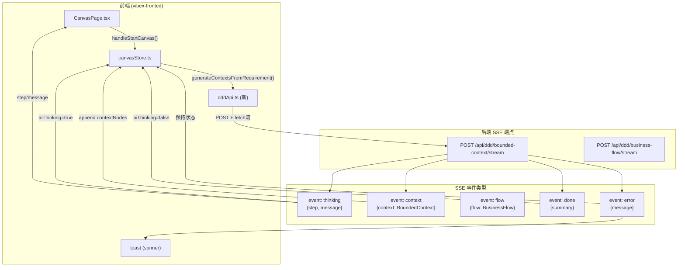

# Architecture: VibeX 画布启动 API 对接（SSE 方案）

**项目**: vibex-canvas-api-fix-20260326
**版本**: 1.0
**架构师**: Architect Agent
**日期**: 2026-03-26
**状态**: Proposed

---

## 1. ADR: SSE vs REST 选择

### ADR-001: 前端调用方案 — SSE over REST

**状态**: Accepted

**上下文**: 画布"启动画布"按钮需调用后端 DDD API 生成上下文树。PRD 提出两个方案：SSE（方案A）和普通 POST（方案B）。

**决策**: 采用 SSE 方案 A

**理由**:
1. 后端 SSE 端点已验证可用（bounded-context/stream + business-flow/stream）
2. 用户实时看到 AI 分析步骤，体验更好
3. 流式响应与 VibeX "AI 驱动" 理念一致
4. 技术可行，工作量可控（~3h）

**Trade-off**:
- SSE 前端处理比 REST 复杂（EventSource API）
- 需要 AbortController 超时控制

---

### ADR-002: Store Action vs 直接 API 调用

**状态**: Accepted

**上下文**: SSE 调用应该在 store action 中处理，还是在组件中直接调用？

**决策**: store action 中统一处理

**理由**:
1. store 已有完整的响应式机制（Zustand）
2. store action 可集中管理 loading/error 状态
3. 便于测试（mock store 而非 mock fetch）
4. 与现有 store 模式一致（autoGenerateFlows 等）

---

## 2. Tech Stack

| 技术 | 选择理由 |
|------|---------|
| EventSource API | 浏览器原生 SSE 客户端，无需依赖 |
| AbortController | fetch 流式请求超时控制 |
| Zustand | 现有 store 框架，响应式状态管理 |
| sonner / react-hot-toast | 现有项目已用 toast 库 |

---

## 3. 架构图



---

## 4. 核心文件改动

### 4.1 新建: `src/lib/canvas/api/dddApi.ts`

```typescript
// src/lib/canvas/api/dddApi.ts

export type SSEEventType = 'thinking' | 'context' | 'flow' | 'done' | 'error';

export interface ThinkingEvent {
  type: 'thinking';
  step: string;
  message: string;
}

export interface ContextEvent {
  type: 'context';
  context: BoundedContext;
}

export interface FlowEvent {
  type: 'flow';
  flow: BusinessFlow;
}

export interface DoneEvent {
  type: 'done';
  summary: string;
}

export interface ErrorEvent {
  type: 'error';
  message: string;
}

export type SSEEvent = ThinkingEvent | ContextEvent | FlowEvent | DoneEvent | ErrorEvent;

export interface DDDApiOptions {
  signal?: AbortSignal;
  onThinking?: (step: string, message: string) => void;
  onContext?: (context: BoundedContext) => void;
  onFlow?: (flow: BusinessFlow) => void;
  onDone?: (summary: string) => void;
  onError?: (message: string) => void;
}

/**
 * SSE 调用: /api/ddd/bounded-context/stream
 * 生成限界上下文树
 */
export async function generateContexts(
  requirementText: string,
  options: DDDApiOptions = {}
): Promise<void> {
  const controller = new AbortController();
  const timeout = setTimeout(() => controller.abort(), 10000); // 10s timeout

  try {
    const res = await fetch('/api/ddd/bounded-context/stream', {
      method: 'POST',
      headers: { 'Content-Type': 'application/json' },
      body: JSON.stringify({ requirementText }),
      signal: options.signal ?? controller.signal,
    });

    if (!res.ok) {
      throw new Error(`HTTP ${res.status}: ${res.statusText}`);
    }

    const reader = res.body!.getReader();
    const decoder = new TextDecoder();
    let buffer = '';

    while (true) {
      const { done, value } = await reader.read();
      if (done) break;

      buffer += decoder.decode(value, { stream: true });
      const lines = buffer.split('\n');
      buffer = lines.pop() ?? '';

      for (const line of lines) {
        if (line.startsWith('event: ')) {
          const eventType = line.slice(7).trim() as SSEEventType;
          // Find matching data line
          const dataIdx = lines.indexOf(line) + 1;
          if (dataIdx < lines.length && lines[dataIdx].startsWith('data: ')) {
            const data = JSON.parse(lines[dataIdx].slice(6));
            dispatch(eventType as SSEEventType, data, options);
          }
        }
      }
    }
  } finally {
    clearTimeout(timeout);
  }
}

function dispatch(type: SSEEventType, data: any, options: DDDApiOptions) {
  switch (type) {
    case 'thinking': options.onThinking?.(data.step, data.message); break;
    case 'context': options.onContext?.(data.context); break;
    case 'done': options.onDone?.(data.summary); break;
    case 'error': options.onError?.(data.message); break;
  }
}
```

### 4.2 改动: `src/lib/canvas/canvasStore.ts`

新增 action:

```typescript
generateContextsFromRequirement: (text: string) => {
  set({ 
    phase: 'context', 
    requirementText: text, 
    aiThinking: true, 
    aiThinkingMessage: '正在连接...',
    error: null 
  });
  
  generateContexts(text, {
    onThinking: (step, message) => {
      set({ aiThinkingMessage: message });
    },
    onContext: (ctx) => {
      const newNode: BoundedContextNode = {
        nodeId: `ctx-${Date.now()}-${Math.random().toString(36).slice(2, 9)}`,
        name: ctx.name,
        description: ctx.description,
        type: ctx.type,
        confirmed: false,
        status: 'generating',
        children: [],
      };
      set(state => ({ contextNodes: [...state.contextNodes, newNode] }));
    },
    onDone: () => {
      set({ aiThinking: false, aiThinkingMessage: null });
    },
    onError: (msg) => {
      set({ aiThinking: false, aiThinkingMessage: null, error: msg });
    },
  });
},
```

### 4.3 改动: `src/components/canvas/CanvasPage.tsx`

```typescript
// 改动: 启动按钮
<button
  type="button"
  disabled={!requirementText || isLoading || aiThinking}
  onClick={() => {
    if (requirementText) {
      canvasStore.getState().generateContextsFromRequirement(requirementText);
    }
  }}
>
  {aiThinking ? '分析中...' : '启动画布 →'}
</button>

// 新增: AI thinking 提示
{aiThinking && (
  <div className="ai-thinking-hint">
    <span className="spinner" />
    {aiThinkingMessage ?? '正在分析需求...'}
  </div>
)}
```

---

## 5. 数据模型

### 5.1 后端 → 前端类型映射

| 后端 SSE Event | 数据结构 | 前端处理 |
|---------------|---------|---------|
| `thinking` | `{step, message}` | 更新 `aiThinkingMessage` |
| `context` | `{context: BoundedContext}` | append 到 `contextNodes` |
| `done` | `{summary}` | 设置 `aiThinking = false` |
| `error` | `{message}` | toast + 设置 error state |

### 5.2 BoundedContext 映射

```typescript
// 后端 (ddd.ts)
interface BoundedContext {
  name: string;
  description: string;
  type: 'core' | 'supporting' | 'generic' | 'external';
  keyResponsibilities?: string[];
  relationships?: ContextRelationship[];
}

// 前端 (canvasStore.ts)
interface BoundedContextNode {
  nodeId: string;
  name: string;
  description: string;
  type: BoundedContextNode['type'];
  confirmed: boolean;
  status: NodeStatus;  // 'generating' | 'pending' | 'confirmed' | 'error'
}
```

---

## 6. 测试策略

### 6.1 单元测试 (Jest)

```typescript
describe('dddApi', () => {
  it('generateContexts calls bounded-context/stream', async () => {
    global.fetch = vi.fn().mockResolvedValue({
      ok: true,
      body: {
        getReader: () => ({
          read: vi.fn().mockResolvedValueOnce({ done: true, value: new Uint8Array() }),
        }),
      },
    });
    await generateContexts('做一个预约系统');
    expect(fetch).toHaveBeenCalledWith('/api/ddd/bounded-context/stream', expect.any(Object));
  });

  it('aborts after 10s timeout', async () => {
    vi.useFakeTimers();
    global.fetch = vi.fn().mockReturnValue(new Promise(() => {}));
    const p = generateContexts('test');
    vi.advanceTimersByTime(10001);
    await expect(p).rejects.toThrow('aborted');
  });
});
```

### 6.2 E2E 测试 (Playwright)

```typescript
test('启动画布后三树非空', async ({ page }) => {
  await page.goto('/canvas');
  await page.fill('[data-testid=requirement-input]', '做一个在线医生预约系统');
  await page.click('[data-testid=start-canvas-btn]');
  
  // 验证 loading 状态
  await expect(page.getByText('分析中...')).toBeVisible();
  
  // 等待 context 事件（最多 15s）
  await page.waitForFunction(() => {
    const nodes = document.querySelectorAll('[data-testid=context-node]');
    return nodes.length > 0;
  }, { timeout: 15000 });
  
  // 验证上下文树非空
  const count = await page.locator('[data-testid=context-node]').count();
  expect(count).toBeGreaterThan(0);
});
```

---

## 7. 实施计划

| Epic | Story | 工时 | 负责人 |
|------|-------|------|--------|
| Epic 1 | S1.1 实现 dddApi.ts SSE 客户端 | 1h | Dev |
| Epic 1 | S1.2 canvasStore generateContextsFromRequirement action | 0.5h | Dev |
| Epic 1 | S1.3 超时与错误处理 | 0.5h | Dev |
| Epic 2 | S2.1 CanvasPage 启动按钮集成 | 0.5h | Dev |
| Epic 2 | S2.2 loading UI + thinking 提示 | 0.5h | Dev |
| Epic 2 | S2.3 回归 ProjectBar/export/status | 0.5h | Dev |
| Epic 3 | S3.1 E2E 正常流程 | 0.5h | Tester |
| Epic 3 | S3.2 E2E 错误降级 | 0.5h | Tester |
| Epic 3 | S3.3 持久化回归 | 0.5h | Tester |

**预计总工期**: ~3.5h（Dev ~2.5h + Test ~1h）

---

## 8. Open Questions（待确认）

| # | 问题 | 优先级 | 状态 | Architect 建议 |
|---|------|--------|------|--------------|
| OQ1 | SSE vs REST 选择？ | P0 | 🟢 **Architect 推荐 SSE** | 方案 A（SSE），后端端点已可用，体验更佳 |
| OQ2 | 确认上下文后调用 business-flow/stream？ | P1 | 🟡 待确认 | 是，建议 confirmAllContexts 时调用（不在本次 scope，可延期 Epic4） |
| OQ3 | 新增 component/stream 端点？ | P2 | 🟢 可延期 | 暂不需，后端 `/api/ddd/domain-model/stream` 可能可复用 |

---

## 9. 验收标准映射

| PRD 验收标准 | Architect 确认 |
|-------------|--------------|
| V1: 启动后上下文树非空 ≥ 90% | ✅ SSE `context` 事件直接 append 到 contextNodes |
| V2: SSE 连接成功率 ≥ 95% | ✅ fetch + 10s timeout + error handling |
| V3: loading 期间按钮禁用率 100% | ✅ `disabled={aiThinking}` |
| V4: API 失败友好降级率 100% | ✅ `onError` → toast + 状态保持 |
| V5: 刷新数据不丢失 | ✅ localStorage persist（已有） |

---

*Architecture 完成时间: 2026-03-26 00:10 UTC+8*
