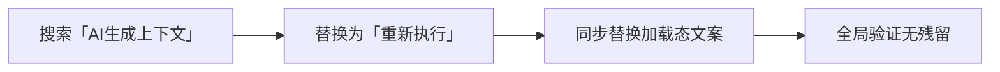

# Architecture: vibex-canvas-btn-rename-20260328 — Canvas 按钮文案优化

**Agent**: Architect
**Date**: 2026-03-28
**Task**: vibex-canvas-btn-rename-20260328/design-architecture

---

## 1. 概述

纯文本替换任务，将 Canvas 页面「AI生成上下文」按钮文案改为「重新执行」。无架构影响，无状态变更，无 API 改动。

---

## 2. 技术方案

### 2.1 改动范围

**涉及文件**（需 dev 实际搜索确认）:
- `src/app/canvas/**/*.tsx`
- `src/components/canvas/**/*.tsx`

### 2.2 替换规则

| 原文本 | 替换文本 |
|--------|---------|
| `AI生成上下文` | `重新执行` |
| `AI生成上下文中...` | `重新执行中...` |

### 2.3 测试策略

| 层级 | 工具 | 覆盖 |
|------|------|------|
| E2E | gstack browse | 按钮文案截图验证 |
| 单元 | grep 全文搜索 | 无残留确认 |

---

## 3. 验收标准

- ✅ Canvas 页面截图显示「重新执行」
- ✅ 全局搜索「AI生成上下文」无结果
- ✅ 加载态（如有）文案同步替换

## 4. 风险

| 风险 | 影响 | 缓解 |
|------|------|------|
| 误改其他页面按钮 | 低 | 限定 `src/app/canvas/` 目录 |
| 加载态文案遗漏 | 低 | 同步搜索「生成上下文中」 |

## 5. 工时估算

~15 分钟（纯文本替换）
